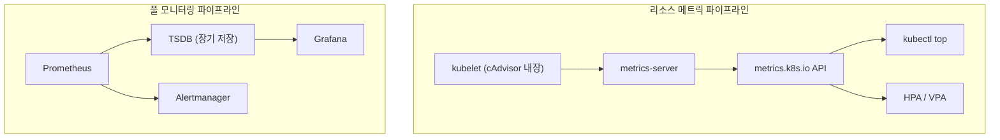
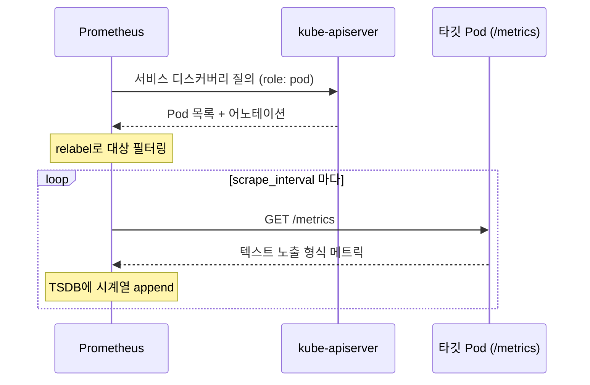
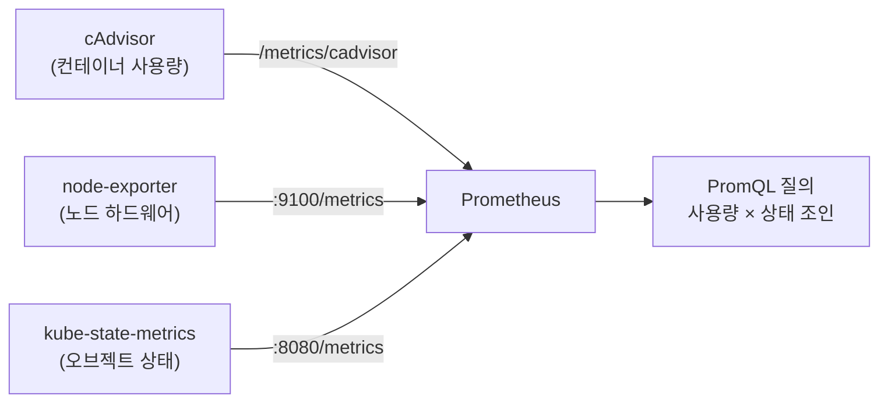
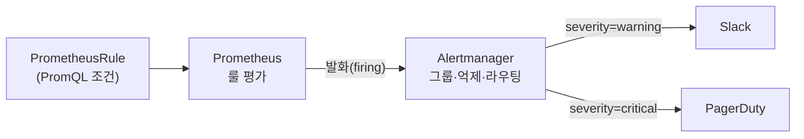

# 메트릭과 모니터링

::: info 학습 목표
- 쿠버네티스의 두 메트릭 파이프라인(리소스 메트릭 파이프라인과 풀 모니터링 파이프라인)을 구분하고 metrics-server의 역할을 이해한다.
- Prometheus의 풀 기반 아키텍처와 서비스 디스커버리·스크레이프 동작을 익힌다.
- kube-state-metrics·cAdvisor·node-exporter가 각각 어떤 메트릭을 만들어내는지 역할 분담을 안다.
- Grafana 대시보드와 Alertmanager 기반 알림 파이프라인을 구성하는 방법을 다룬다.
:::

## 1. 두 개의 메트릭 파이프라인

쿠버네티스에서 메트릭은 목적이 다른 두 파이프라인으로 나뉜다. 이 구분을 놓치면 "왜 `kubectl top`은 되는데 HPA가 커스텀 메트릭을 못 읽지?" 같은 혼란이 생긴다.

<strong>리소스 메트릭 파이프라인(Resource Metrics Pipeline).</strong> CPU·메모리 같은 핵심 리소스 사용량을 제한된 집합으로, 짧은 주기로 제공한다. `kubectl top`, Horizontal Pod Autoscaler, Vertical Pod Autoscaler가 소비하는 경로다. 핵심 컴포넌트가 <strong>metrics-server</strong>이며, 데이터를 영속 저장하지 않고 메모리에만 단기 보관한다. 자세한 구조는 [Resource Metrics Pipeline 문서](https://kubernetes.io/docs/tasks/debug/debug-cluster/resource-metrics-pipeline/)에 정리돼 있다.

<strong>풀 모니터링 파이프라인(Full Metrics Pipeline).</strong> 훨씬 풍부한 메트릭을 수집·저장·질의·알림까지 처리한다. 쿠버네티스 자체에 내장돼 있지 않고, 보통 Prometheus 생태계로 구성한다. 장기 보관, 그래프, 알림이 여기서 나온다.



두 파이프라인은 데이터 소스를 공유하기도 한다(둘 다 kubelet에서 긁어올 수 있다). 하지만 metrics-server는 오토스케일링용 경량 경로, Prometheus는 관측성·알림용 본격 경로라고 역할을 나눠 이해하는 것이 정확하다.

## 2. metrics-server와 리소스 메트릭 API

<strong>metrics-server</strong>는 각 노드의 kubelet이 노출하는 Summary API(`/metrics/resource`)에서 Pod·노드의 CPU·메모리 사용량을 긁어와 집계하고, 이를 [Metrics API](https://github.com/kubernetes-sigs/metrics-server)(`metrics.k8s.io`)로 노출한다. 이 API는 [API Aggregation Layer](https://kubernetes.io/docs/concepts/extend-kubernetes/api-extension/apiserver-aggregation/)를 통해 메인 apiserver에 합쳐진다.

```bash
kubectl apply -f https://github.com/kubernetes-sigs/metrics-server/releases/latest/download/components.yaml

# 설치 확인
kubectl get apiservices | grep metrics
kubectl top nodes
kubectl top pods -A --sort-by=cpu
```

설치 직후 흔히 겪는 문제는 kubelet 인증서 검증 실패다. 테스트 클러스터에서는 다음 플래그를 붙이지만, 운영 환경에서는 제대로 된 인증서를 배포해야 한다.

```yaml
spec:
  containers:
  - name: metrics-server
    args:
    - --kubelet-insecure-tls          # 테스트용. 운영에서는 지양
    - --kubelet-preferred-address-types=InternalIP
    - --metric-resolution=15s
```

::: warning metrics-server는 모니터링 시스템이 아니다
metrics-server는 데이터를 약 15초 윈도로만 메모리에 들고 있다. 과거 추이, 그래프, 알림이 필요하면 Prometheus 같은 풀 파이프라인을 따로 둬야 한다. metrics-server에 장기 저장을 기대하면 안 된다.
:::

## 3. Prometheus 아키텍처와 스크레이프

<strong>Prometheus</strong>는 풀(pull) 기반 모니터링 시스템이다. 대상이 메트릭을 푸시하는 것이 아니라, Prometheus 서버가 각 타깃의 HTTP 엔드포인트(`/metrics`)를 주기적으로 긁어온다(scrape). 긁어온 시계열은 로컬 TSDB에 저장되고, PromQL로 질의한다.

핵심은 <strong>서비스 디스커버리</strong>다. 쿠버네티스에서 Pod는 끊임없이 생기고 사라지므로, 타깃을 고정 목록으로 둘 수 없다. Prometheus는 `kubernetes_sd_configs`로 apiserver에 Pod·Service·Endpoint·Node를 질의해 스크레이프 대상을 자동 갱신한다.

```yaml
scrape_configs:
- job_name: 'kubernetes-pods'
  kubernetes_sd_configs:
  - role: pod
  relabel_configs:
  # prometheus.io/scrape: "true" 어노테이션이 붙은 Pod만 대상으로
  - source_labels: [__meta_kubernetes_pod_annotation_prometheus_io_scrape]
    action: keep
    regex: true
  # 어노테이션으로 지정한 포트/경로 사용
  - source_labels: [__meta_kubernetes_pod_annotation_prometheus_io_path]
    target_label: __metrics_path__
    regex: (.+)
  - source_labels: [__address__, __meta_kubernetes_pod_annotation_prometheus_io_port]
    target_label: __address__
    regex: ([^:]+)(?::\d+)?;(\d+)
    replacement: $1:$2
```



운영에서는 보통 [Prometheus Operator](https://prometheus-operator.dev/)와 kube-prometheus-stack을 쓴다. 그러면 스크레이프 설정을 `ServiceMonitor`·`PodMonitor` 커스텀 리소스로 선언적으로 관리할 수 있어, 위 같은 relabel 설정을 직접 손대지 않아도 된다.

```yaml
apiVersion: monitoring.coreos.com/v1
kind: ServiceMonitor
metadata:
  name: my-app
  labels:
    release: kube-prometheus-stack
spec:
  selector:
    matchLabels:
      app: my-app
  endpoints:
  - port: metrics
    interval: 30s
```

## 4. kube-state-metrics·cAdvisor·node-exporter의 역할 분담

메트릭 소스는 측정 대상에 따라 명확히 나뉜다. 셋의 차이를 헷갈리면 "Pod 개수는 어디서 보지?", "디스크 사용량은?" 같은 질문에서 막힌다.

| 컴포넌트 | 측정 대상 | 대표 메트릭 |
|----------|-----------|-------------|
| cAdvisor (kubelet 내장) | 컨테이너 리소스 사용량 | `container_cpu_usage_seconds_total`, `container_memory_working_set_bytes` |
| node-exporter | 노드(호스트) 하드웨어·OS | `node_cpu_seconds_total`, `node_filesystem_avail_bytes`, `node_load1` |
| kube-state-metrics | 쿠버네티스 오브젝트의 상태 | `kube_pod_status_phase`, `kube_deployment_status_replicas`, `kube_node_status_condition` |

<strong>cAdvisor</strong>는 kubelet에 내장돼 각 컨테이너의 실제 자원 소비를 측정한다. "이 컨테이너가 CPU를 얼마나 쓰나"의 답이다.

<strong>node-exporter</strong>는 DaemonSet으로 모든 노드에 배포돼 호스트 레벨 지표(디스크, 네트워크, 파일시스템, 로드)를 노출한다. 컨테이너가 아니라 노드 자체의 건강 상태를 본다.

<strong>kube-state-metrics</strong>는 결이 다르다. 자원 사용량이 아니라 <strong>오브젝트의 선언 상태</strong>를 메트릭으로 변환한다. apiserver를 watch해서 "Deployment의 desired replicas는 3인데 ready는 2다", "이 Pod는 Pending phase다" 같은 정보를 노출한다. 사용량(cAdvisor)과 상태(kube-state-metrics)는 전혀 다른 축이라는 점이 핵심이다.



세 소스를 조인하면 강력해진다. 예를 들어 kube-state-metrics의 `kube_pod_labels`와 cAdvisor의 `container_memory_working_set_bytes`를 PromQL로 묶으면, 특정 라벨을 가진 워크로드의 메모리 사용량을 집계할 수 있다.

## 5. Grafana 대시보드와 Alertmanager 알림

수집·저장된 메트릭은 시각화와 알림으로 이어져야 가치가 된다.

<strong>Grafana</strong>는 Prometheus를 데이터 소스로 연결해 PromQL 질의 결과를 대시보드로 그린다. kube-prometheus-stack을 설치하면 클러스터·노드·워크로드 대시보드가 기본 제공된다. 패널의 질의는 결국 PromQL이다.

```promql
# 네임스페이스별 Pod 메모리 사용량 합계
sum(container_memory_working_set_bytes{namespace="prod", image!=""}) by (pod)

# Deployment가 원하는 만큼 떠 있지 않은 경우
kube_deployment_status_replicas_available
  / kube_deployment_spec_replicas < 1
```

<strong>알림</strong>은 Prometheus의 룰 평가와 Alertmanager 라우팅이 분담한다. Prometheus가 알림 규칙(PromQL 조건)을 주기적으로 평가해 발화하면, Alertmanager가 그룹핑·중복 제거·라우팅·억제(silence)를 거쳐 Slack·이메일·PagerDuty로 전달한다.

```yaml
apiVersion: monitoring.coreos.com/v1
kind: PrometheusRule
metadata:
  name: pod-alerts
spec:
  groups:
  - name: pod.rules
    rules:
    - alert: PodCrashLooping
      expr: |
        rate(kube_pod_container_status_restarts_total[5m]) * 60 * 5 > 0
      for: 10m
      labels:
        severity: warning
      annotations:
        summary: "Pod {{ $labels.pod }}가 재시작 반복 중"
```

`for: 10m`은 조건이 10분간 지속돼야 발화한다는 뜻으로, 일시적 스파이크로 인한 오탐을 막는 장치다. 알림 설계의 핵심은 "실행 가능한 알림만 보낸다"는 원칙이다. 노이즈가 많은 알림은 결국 무시되므로, severity와 라우팅을 정교하게 나눠야 한다.



::: tip 핵심 정리
- 쿠버네티스 메트릭은 오토스케일링용 리소스 메트릭 파이프라인(metrics-server)과 관측성용 풀 파이프라인(Prometheus)으로 나뉜다.
- metrics-server는 CPU·메모리를 단기 보관해 `kubectl top`·HPA에 공급할 뿐, 장기 모니터링 도구가 아니다.
- Prometheus는 풀 기반으로 서비스 디스커버리를 통해 동적 타깃을 스크레이프하며, Operator의 ServiceMonitor로 선언적 관리가 가능하다.
- cAdvisor(컨테이너 사용량)·node-exporter(노드 하드웨어)·kube-state-metrics(오브젝트 상태)는 측정 축이 다르고 조인해서 쓸 때 강력하다.
- Grafana가 PromQL을 시각화하고, Prometheus 룰 평가 + Alertmanager 라우팅이 실행 가능한 알림을 전달한다.
:::

## 다음 챕터

메트릭은 "무엇이 얼마나"를 수치로 보여주지만, "왜 그렇게 됐는가"는 로그와 트레이스가 답한다. 다음 챕터 [로깅과 트레이싱](/study/kubernetes/41-logging-tracing)에서는 컨테이너 로그 구조와 클러스터 로깅 아키텍처(EFK/Loki), 로그 수집 에이전트, 그리고 OpenTelemetry 기반 분산 트레이싱을 다룬다.
