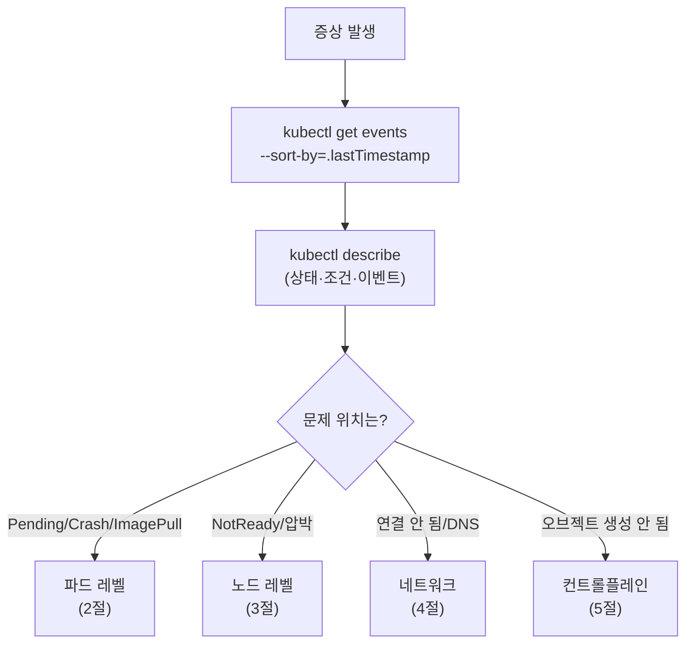
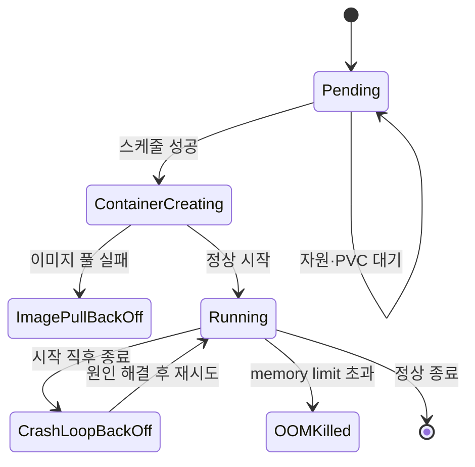
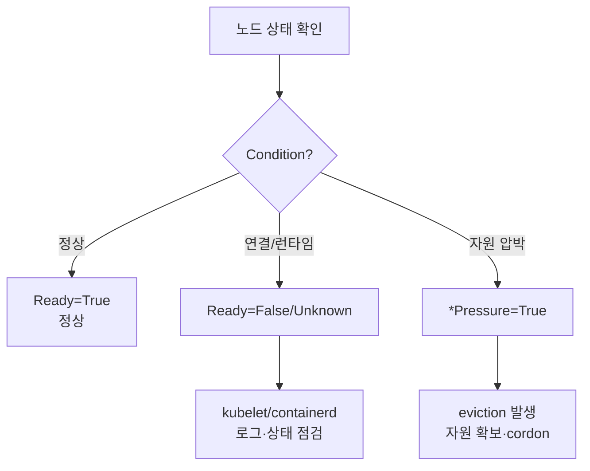
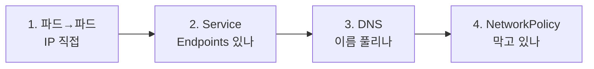
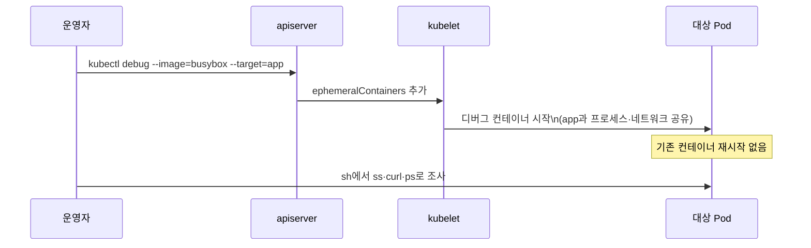

# 트러블슈팅

::: info 학습 목표
- 파드의 대표적 실패 상태(Pending·CrashLoopBackOff·ImagePullBackOff)를 원인별로 진단하는 법을 익힌다.
- 노드의 NotReady와 리소스 압박(메모리·디스크 PID) 상황을 진단한다.
- 서비스·DNS 중심으로 네트워크 문제를 단계적으로 디버깅한다.
- 이벤트·컴포넌트 로그로 컨트롤플레인을 진단하고, kubectl debug와 임시 컨테이너로 살아있는 워크로드를 파헤친다.
:::

## 1. 진단의 출발점 — 체계적 흐름

문제가 생기면 무작정 로그부터 보지 말고 정해진 순서로 좁혀야 한다. 쿠버네티스 디버깅은 보통 "이벤트 → 상태(describe) → 로그 → 안으로 진입(exec/debug)" 순으로 깊어진다. 공식 가이드는 [Troubleshooting 문서](https://kubernetes.io/docs/tasks/debug/)에 정리돼 있다.



가장 먼저 보는 두 명령은 거의 고정이다.

```bash
# 최근 이벤트를 시간순으로 (문제의 80%가 여기서 드러난다)
kubectl get events -A --sort-by=.lastTimestamp | tail -30

# 특정 오브젝트의 상태·조건·이벤트를 한눈에
kubectl describe pod <pod>
```

`describe`의 하단 Events 섹션은 스케줄링 실패, 이미지 풀 실패, 헬스체크 실패 같은 원인을 거의 직접적으로 알려준다. 진단은 여기서 시작한다.

## 2. 파드 문제 진단

파드 실패는 상태(status) 문자열로 1차 분류된다. 각 상태는 가리키는 원인 영역이 다르다.

| 상태 | 의미 | 흔한 원인 |
|------|------|-----------|
| Pending | 스케줄 안 됨 / 컨테이너 미생성 | 자원 부족, nodeSelector/taint 불일치, PVC 미바인드 |
| ImagePullBackOff | 이미지를 못 가져옴 | 잘못된 이미지 태그, 프라이빗 레지스트리 인증 누락 |
| CrashLoopBackOff | 시작 직후 반복 종료 | 앱 크래시, 잘못된 커맨드/설정, 의존성 미준비 |
| OOMKilled | 메모리 한도 초과로 커널이 종료 | memory limit 부족, 메모리 누수 |

<strong>Pending.</strong> 스케줄러가 둘 곳을 못 찾은 상태다. `describe`의 이벤트에서 `0/3 nodes are available: insufficient cpu` 같은 메시지를 확인한다.

```bash
kubectl describe pod <pod> | grep -A10 Events
# FailedScheduling 메시지의 사유(자원/affinity/taint/PVC)를 읽는다
kubectl get pvc       # Pending PVC가 Pod를 막고 있는지
```

<strong>ImagePullBackOff.</strong> 태그 오타나 레지스트리 인증 문제다.

```bash
kubectl describe pod <pod> | grep -A5 Events   # "manifest unknown" / "unauthorized"
# 프라이빗 레지스트리면 imagePullSecrets 확인
kubectl get pod <pod> -o jsonpath='{.spec.imagePullSecrets}'
```

<strong>CrashLoopBackOff.</strong> 컨테이너가 떴다가 곧바로 죽는 상태다. `--previous`로 죽은 컨테이너의 마지막 로그를 봐야 한다.

```bash
kubectl logs <pod> --previous          # 직전(크래시한) 컨테이너의 로그
kubectl get pod <pod> -o jsonpath='{.status.containerStatuses[0].lastState.terminated}'
# exitCode 137 = OOMKilled, 1 = 앱 에러, 126/127 = 커맨드 문제
```



종료 코드는 강력한 단서다. exit 137은 OOM 또는 SIGKILL, exit 1은 애플리케이션 에러, 126/127은 실행 권한·경로 문제를 가리킨다.

## 3. 노드 문제 진단

파드가 모두 멀쩡한데 한 노드에서만 문제가 몰린다면 노드 자체를 의심한다.

```bash
kubectl get nodes
kubectl describe node <node>      # Conditions와 Allocatable·이벤트
```

<strong>NotReady.</strong> 노드가 Ready를 잃는 가장 흔한 원인은 kubelet이 죽었거나, 노드 네트워크가 끊겼거나, 컨테이너 런타임이 멈춘 경우다. `describe node`의 Conditions를 본다.

```bash
# 노드에 SSH 후
systemctl status kubelet
journalctl -u kubelet -n 100 --no-pager
systemctl status containerd
```

<strong>리소스 압박.</strong> kubelet은 노드의 메모리·디스크·PID가 임계치를 넘으면 [노드 압박 eviction](https://kubernetes.io/docs/concepts/scheduling-eviction/node-pressure-eviction/)을 일으킨다. 이때 노드 Condition에 `MemoryPressure`, `DiskPressure`, `PIDPressure`가 True로 뜬다.

| Condition | 의미 | 결과 |
|-----------|------|------|
| MemoryPressure | 가용 메모리 부족 | 파드 eviction, 새 파드 스케줄 거부 |
| DiskPressure | 노드 디스크/이미지 공간 부족 | 이미지 GC, 파드 eviction |
| PIDPressure | 프로세스 ID 고갈 | 새 파드 스케줄 거부 |



압박 노드를 정비할 때는 `kubectl cordon <node>`로 새 스케줄을 막고, `kubectl drain <node> --ignore-daemonsets`로 파드를 옮긴 뒤 손본다.

## 4. 네트워크 디버깅 — 서비스와 DNS

"파드는 Running인데 접속이 안 된다"는 거의 항상 서비스 또는 DNS 문제다. 계층을 따라 안에서 밖으로 좁힌다.



<strong>Service와 Endpoints.</strong> Service가 트래픽을 못 보내는 가장 흔한 원인은 셀렉터 불일치로 Endpoints가 비어 있는 것이다.

```bash
kubectl get endpoints <svc>           # 비어 있으면 셀렉터/Pod 라벨 불일치
kubectl get svc <svc> -o yaml | grep -A3 selector
kubectl get pods --show-labels        # 셀렉터와 라벨 대조
```

<strong>DNS.</strong> 클러스터 내부 이름 해석은 CoreDNS가 담당한다. 디버그 파드를 띄워 직접 확인한다.

```bash
kubectl run dnsutils --image=registry.k8s.io/e2e-test-images/jessie-dnsutils:1.3 \
  --restart=Never -it --rm -- bash

# 파드 안에서
nslookup kubernetes.default
nslookup <svc>.<namespace>.svc.cluster.local

# CoreDNS 자체 점검
kubectl -n kube-system get pods -l k8s-app=kube-dns
kubectl -n kube-system logs -l k8s-app=kube-dns
```

DNS가 안 풀리면 CoreDNS 파드 상태, 그 파드들의 로그, 그리고 노드의 `/etc/resolv.conf` 설정을 순서대로 본다. 자세한 절차는 [Debug Services](https://kubernetes.io/docs/tasks/debug/debug-application/debug-service/)와 [Debug DNS Resolution](https://kubernetes.io/docs/tasks/administer-cluster/dns-debugging-resolution/)에 있다.

마지막으로 연결이 막힌다면 `NetworkPolicy`가 트래픽을 차단하는지 확인한다. 기본 deny 정책이 깔린 네임스페이스에서 허용 규칙이 빠지면 정상 파드끼리도 통신이 끊긴다.

## 5. 컨트롤플레인 진단과 kubectl debug

오브젝트를 만들었는데 아무 일도 안 일어난다면 컨트롤플레인(apiserver·controller-manager·scheduler·etcd)을 의심한다.

```bash
# 컴포넌트가 정적 파드로 떠 있는 경우(kubeadm)
kubectl -n kube-system get pods
kubectl -n kube-system logs kube-apiserver-<node>
kubectl -n kube-system logs kube-controller-manager-<node>
kubectl -n kube-system logs kube-scheduler-<node>

# 정적 파드 매니페스트 / 시스템 로그
ls /etc/kubernetes/manifests/
journalctl -u kubelet | grep -i error
```

증상별 책임 컴포넌트를 알면 빠르다. Deployment를 만들었는데 ReplicaSet/Pod가 안 생기면 controller-manager, Pod가 영원히 Pending이면 scheduler, 모든 명령이 응답 없으면 apiserver/etcd를 본다.

<strong>kubectl debug와 임시 컨테이너.</strong> 디버깅 도구가 없는 슬림 이미지(distroless 등)나 이미 죽어가는 컨테이너는 `exec`로 들어가기 어렵다. 이때 [임시 컨테이너(ephemeral container)](https://kubernetes.io/docs/tasks/debug/debug-application/debug-running-pod/)를 살아있는 Pod에 끼워 넣는다. 기존 컨테이너를 재시작하지 않고 같은 프로세스·네임스페이스를 공유하는 디버그 컨테이너를 추가한다.

```bash
# 살아있는 Pod에 디버그 컨테이너 주입 (도구가 든 이미지로)
kubectl debug -it <pod> --image=busybox --target=<container> -- sh

# 노드 자체를 디버그 (호스트 네임스페이스로 진입)
kubectl debug node/<node> -it --image=busybox

# 깨진 Pod를 커맨드만 바꿔 복제해 띄우기
kubectl debug <pod> -it --copy-to=debug-pod --container=app -- sh
```



`--target`으로 대상 컨테이너의 프로세스 네임스페이스를 공유하면, 디버그 컨테이너에서 대상 프로세스를 직접 들여다볼 수 있다. 임시 컨테이너는 추가만 되고 제거되지 않으므로(Pod 삭제 시 함께 사라짐), 디버깅이 끝나면 Pod를 정리한다.

::: tip 핵심 정리
- 진단은 "events → describe → logs → exec/debug" 순으로 좁히며, `kubectl get events --sort-by`와 `describe`의 Events 섹션이 출발점이다.
- 파드 실패는 상태로 분류한다 — Pending(스케줄), ImagePullBackOff(이미지/인증), CrashLoopBackOff(`--previous` 로그·종료 코드), OOMKilled(exit 137).
- 노드는 Ready 여부와 Memory/Disk/PIDPressure Condition으로 진단하고, 정비 시 cordon·drain을 쓴다.
- 네트워크는 파드→Service(Endpoints)→DNS(CoreDNS)→NetworkPolicy 순으로 계층을 따라 좁힌다.
- 컨트롤플레인은 증상별 책임 컴포넌트의 로그를 보고, kubectl debug·임시 컨테이너로 살아있는 워크로드와 슬림 이미지를 재시작 없이 파헤친다.
:::

## 다음 챕터

여기까지가 클러스터를 관측하고 고장을 진단하는 운영 기술이다. 이제 애플리케이션을 패키징하고 반복 배포하는 도구로 넘어간다. 다음 챕터 [Helm](/study/kubernetes/43-helm)에서는 차트 구조, 템플릿과 values, 릴리스 관리로 복잡한 매니페스트를 다루는 방법을 다룬다.
