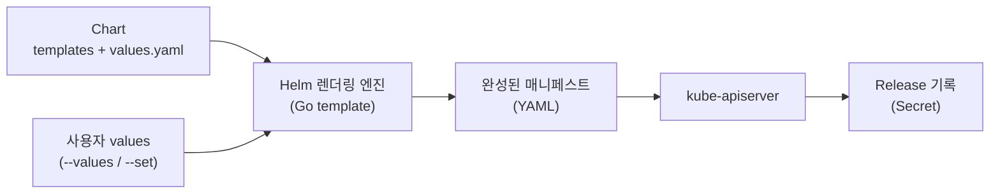
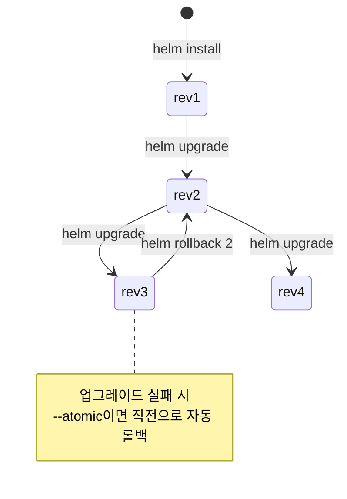

# Helm

::: info 학습 목표
- Helm이 해결하는 문제와 차트(Chart)·릴리스(Release)·리포지토리(Repository)의 개념을 이해한다.
- Chart.yaml·templates·values.yaml로 이뤄진 차트 디렉터리 구조와 각 파일의 역할을 익힌다.
- Go 템플릿 문법과 Helm 내장 함수·파이프라인으로 매니페스트를 동적으로 생성하는 법을 다룬다.
- install/upgrade/rollback으로 릴리스를 관리하고, 차트 의존성과 리포지토리를 운용하는 법을 안다.
:::

## 1. Helm이란 — 패키지 매니저로서의 역할

쿠버네티스 애플리케이션 하나를 배포하려면 Deployment, Service, ConfigMap, Ingress, ServiceAccount 등 여러 매니페스트가 필요하다. 이들을 환경(dev/stage/prod)마다 조금씩 다르게, 그리고 일관되게 배포·업그레이드·롤백하는 일은 `kubectl apply`만으로는 금세 번거로워진다.

<strong>Helm</strong>은 이 매니페스트 묶음을 <strong>차트(Chart)</strong>라는 패키지로 묶고, 값(values)을 주입해 매니페스트를 렌더링한 뒤, <strong>릴리스(Release)</strong>라는 단위로 클러스터에 설치·추적·롤백하게 해 주는 쿠버네티스 패키지 매니저다. apt나 npm이 OS·언어 생태계에서 하는 일을 쿠버네티스 위에서 한다고 보면 된다.

핵심 용어를 먼저 정리한다.

| 용어 | 의미 |
|------|------|
| Chart | 쿠버네티스 리소스를 만들기 위한 템플릿·메타데이터·기본값의 묶음(패키지) |
| Release | 차트를 특정 values로 클러스터에 설치한 인스턴스. 같은 차트로 여러 릴리스 생성 가능 |
| Repository | 차트를 모아 배포하는 HTTP 서버 또는 OCI 레지스트리 |
| Values | 차트를 렌더링할 때 주입하는 설정값. 기본값은 `values.yaml`에 둔다 |

Helm 3부터는 클러스터 내 Tiller 컴포넌트가 사라지고 클라이언트만으로 동작한다. 릴리스 상태는 릴리스가 설치된 네임스페이스의 Secret(기본값)에 저장된다. 전반적인 개념은 [Helm 공식 문서](https://helm.sh/docs/)의 [Using Helm](https://helm.sh/docs/intro/using_helm/)에 정리돼 있다.



## 2. 차트 구조 — Chart.yaml, templates, values

차트는 정해진 디렉터리 구조를 가진 파일 묶음이다. `helm create myapp`으로 골격을 만들면 다음과 같은 구조가 생긴다.

```text
myapp/
├── Chart.yaml          # 차트 메타데이터(이름, 버전, 의존성)
├── values.yaml         # 기본 설정값
├── charts/             # 서브차트(의존성)가 놓이는 곳
├── templates/          # 렌더링 대상 매니페스트 템플릿
│   ├── deployment.yaml
│   ├── service.yaml
│   ├── _helpers.tpl    # 재사용 템플릿 정의(named templates)
│   └── NOTES.txt       # 설치 후 사용자에게 출력되는 안내
└── .helmignore         # 패키징 시 제외할 파일
```

<strong>Chart.yaml</strong>은 차트의 신원과 버전을 정의한다. `version`은 차트 자체의 SemVer 버전이고, `appVersion`은 차트가 배포하는 애플리케이션의 버전이라는 점이 중요하다 — 둘은 독립적이다.

```yaml
apiVersion: v2
name: myapp
description: A Helm chart for myapp
type: application
version: 0.2.0          # 차트 버전 (SemVer)
appVersion: "1.16.0"    # 배포하는 앱 버전
dependencies:
  - name: postgresql
    version: "13.x.x"
    repository: https://charts.bitnami.com/bitnami
```

<strong>values.yaml</strong>은 템플릿에 주입할 기본값을 담는다. 사용자는 이 값을 `--set`이나 별도 values 파일로 덮어쓴다.

```yaml
replicaCount: 2
image:
  repository: myapp
  tag: ""              # 비우면 .Chart.AppVersion 사용
  pullPolicy: IfNotPresent
service:
  type: ClusterIP
  port: 80
resources:
  limits:
    cpu: 500m
    memory: 256Mi
```

<strong>templates/</strong>의 파일은 Go 템플릿 문법이 섞인 매니페스트다. `{{ }}` 안의 표현식이 values와 빌트인 객체로 치환되어 최종 YAML이 된다. 차트 구조의 상세는 [Charts 문서](https://helm.sh/docs/topics/charts/)를 참고한다.

## 3. 템플릿 문법과 함수

Helm 템플릿은 Go의 [text/template](https://pkg.go.dev/text/template)에 [Sprig](https://masterminds.github.io/sprig/) 함수 라이브러리를 더한 것이다. 템플릿에서 접근하는 주요 빌트인 객체는 다음과 같다.

| 객체 | 내용 |
|------|------|
| `.Values` | values.yaml과 사용자 주입 값이 병합된 결과 |
| `.Chart` | Chart.yaml의 필드(`.Chart.Name`, `.Chart.AppVersion` 등) |
| `.Release` | 릴리스 정보(`.Release.Name`, `.Release.Namespace`) |
| `.Capabilities` | 클러스터 기능(`.Capabilities.KubeVersion` 등) |

다음은 values를 참조하고 함수·파이프라인을 쓰는 `deployment.yaml`의 예다.

```yaml
apiVersion: apps/v1
kind: Deployment
metadata:
  name: {{ .Release.Name }}-myapp
  labels:
    app.kubernetes.io/name: {{ include "myapp.name" . }}
spec:
  replicas: {{ .Values.replicaCount }}
  template:
    spec:
      containers:
        - name: myapp
          image: "{{ .Values.image.repository }}:{{ .Values.image.tag | default .Chart.AppVersion }}"
          imagePullPolicy: {{ .Values.image.pullPolicy }}
          {{- with .Values.resources }}
          resources:
            {{- toYaml . | nindent 12 }}
          {{- end }}
```

여기서 쓰인 문법을 짚는다.

- `{{ .Values.image.tag | default .Chart.AppVersion }}` — 파이프라인(`|`)으로 값을 함수에 넘긴다. `tag`가 비면 `default` 함수가 `.Chart.AppVersion`을 채운다.
- `{{- with .Values.resources }}` — `resources`가 비어 있지 않을 때만 블록을 렌더링하고, 그 안에서 `.`을 `resources`로 바꾼다. 앞의 `-`는 왼쪽 공백을 제거해 빈 줄을 없앤다.
- `toYaml . | nindent 12` — 값을 YAML로 직렬화하고 12칸 들여쓰기로 정렬한다. `nindent`는 앞에 줄바꿈을 넣어 들여쓴다.

`_helpers.tpl`에는 여러 템플릿에서 재사용하는 <strong>named template</strong>을 정의한다.

```text
{{- define "myapp.name" -}}
{{- default .Chart.Name .Values.nameOverride | trunc 63 | trimSuffix "-" -}}
{{- end -}}
```

이렇게 정의한 템플릿은 `{{ include "myapp.name" . }}`로 불러 쓴다. `include`는 `template`과 달리 결과를 파이프라인으로 넘길 수 있어 `nindent` 같은 함수와 조합하기 좋다. 조건·반복·함수의 전체 목록은 [Template Functions and Pipelines](https://helm.sh/docs/chart_template_guide/functions_and_pipelines/)와 [Built-in Objects](https://helm.sh/docs/chart_template_guide/builtin_objects/)에 있다.

렌더링 결과를 클러스터에 적용하지 않고 미리 확인하려면 `helm template`이나 `--dry-run`을 쓴다.

```bash
helm template myrelease ./myapp -f prod-values.yaml
helm install myrelease ./myapp --dry-run --debug
```

## 4. 릴리스 관리 — install, upgrade, rollback

차트를 클러스터에 적용하면 릴리스가 만들어지고, Helm은 그 이력(revision)을 관리한다.

```bash
# 설치: 릴리스 이름 myapp, 차트는 ./myapp
helm install myapp ./myapp -n prod --create-namespace \
  --set replicaCount=3 -f prod-values.yaml

# 설치 또는 업그레이드(없으면 설치)
helm upgrade --install myapp ./myapp -n prod -f prod-values.yaml

# 릴리스 목록과 리비전 이력
helm list -n prod
helm history myapp -n prod
```

`helm upgrade`를 할 때마다 리비전 번호가 1씩 늘고, 각 리비전의 매니페스트가 보관된다. 문제가 생기면 이전 리비전으로 되돌린다.

```bash
# 직전 리비전으로 롤백
helm rollback myapp -n prod

# 특정 리비전(예: 2)으로 롤백
helm rollback myapp 2 -n prod
```

업그레이드를 더 안전하게 하려면 `--atomic`과 `--wait`을 함께 쓴다. `--wait`은 리소스가 Ready 될 때까지 기다리고, `--atomic`은 업그레이드가 실패하면 자동으로 직전 상태로 롤백한다.

```bash
helm upgrade --install myapp ./myapp -n prod \
  --atomic --wait --timeout 5m
```

릴리스 상태와 업그레이드/롤백 흐름은 다음과 같다.



릴리스를 제거할 때는 `helm uninstall myapp -n prod`를 쓴다. 기본적으로 이력까지 지워지며, 이력을 남기려면 `--keep-history`를 붙인다. 설치·업그레이드 세부 옵션은 [Helm Commands](https://helm.sh/docs/helm/helm/) 레퍼런스에 정리돼 있다.

## 5. 의존성과 리포지토리

복잡한 애플리케이션은 데이터베이스·캐시 같은 컴포넌트를 <strong>서브차트(subchart)</strong>로 가져온다. 의존성은 Chart.yaml의 `dependencies`에 선언한다.

```yaml
dependencies:
  - name: postgresql
    version: "13.x.x"
    repository: https://charts.bitnami.com/bitnami
    condition: postgresql.enabled    # 이 값이 true일 때만 설치
```

선언 후 `helm dependency update`를 실행하면 의존 차트가 `charts/`에 내려받아지고 `Chart.lock`에 버전이 고정된다.

```bash
helm dependency update ./myapp
helm dependency list ./myapp
```

상위 차트의 values에서 서브차트 값을 덮어쓸 수 있다. 서브차트 이름을 키로 두면 된다.

```yaml
# myapp/values.yaml
postgresql:
  enabled: true
  auth:
    database: myappdb
```

<strong>리포지토리</strong>는 차트를 공유하는 곳이다. 전통적인 HTTP 리포지토리는 `add`로 등록해 검색·설치한다.

```bash
helm repo add bitnami https://charts.bitnami.com/bitnami
helm repo update
helm search repo bitnami/postgresql
helm install pg bitnami/postgresql -n data
```

Helm 3.8 이상은 <strong>OCI 레지스트리</strong>(예: Harbor, GHCR, ECR)에 차트를 컨테이너 이미지처럼 push/pull 할 수 있다.

```bash
helm package ./myapp                       # myapp-0.2.0.tgz 생성
helm push myapp-0.2.0.tgz oci://registry.example.com/charts
helm install myapp oci://registry.example.com/charts/myapp --version 0.2.0
```

의존성과 리포지토리 운용의 상세는 [Chart Dependencies](https://helm.sh/docs/helm/helm_dependency/)와 [Helm Repository Guide](https://helm.sh/docs/topics/chart_repository/)를 참고한다.

::: tip 핵심 정리
- Helm은 쿠버네티스 매니페스트 묶음을 차트로 패키징하고 values로 렌더링해 릴리스 단위로 관리하는 패키지 매니저다.
- 차트는 Chart.yaml(메타데이터)·values.yaml(기본값)·templates(Go 템플릿)로 구성되며, version과 appVersion은 별개다.
- 템플릿은 Go template + Sprig 함수로 동작하고, `.Values`·`.Release`·`.Chart` 빌트인과 include·toYaml·nindent로 매니페스트를 동적으로 만든다.
- install/upgrade/rollback으로 리비전 이력을 관리하며, `--atomic --wait`으로 실패 시 자동 롤백을 보장할 수 있다.
- 서브차트로 의존성을 가져오고, HTTP 또는 OCI 리포지토리로 차트를 공유·배포한다.
:::

## 다음 챕터

Helm은 템플릿으로 매니페스트를 생성하는 접근이다. 같은 문제를 템플릿 없이 패치(patch) 합성으로 푸는 도구가 Kustomize이고, 이렇게 만든 매니페스트를 Git을 단일 진실의 원천으로 삼아 자동 배포하는 방식이 GitOps다. 다음 챕터 [Kustomize와 GitOps](/study/kubernetes/44-kustomize-gitops)에서 base/overlays 구조와 ArgoCD·Flux의 동기화를 다룬다.
