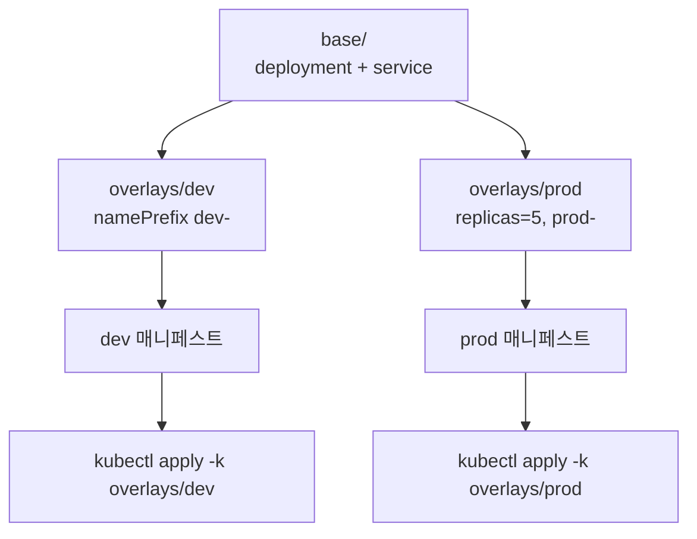
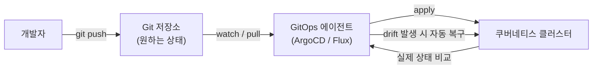
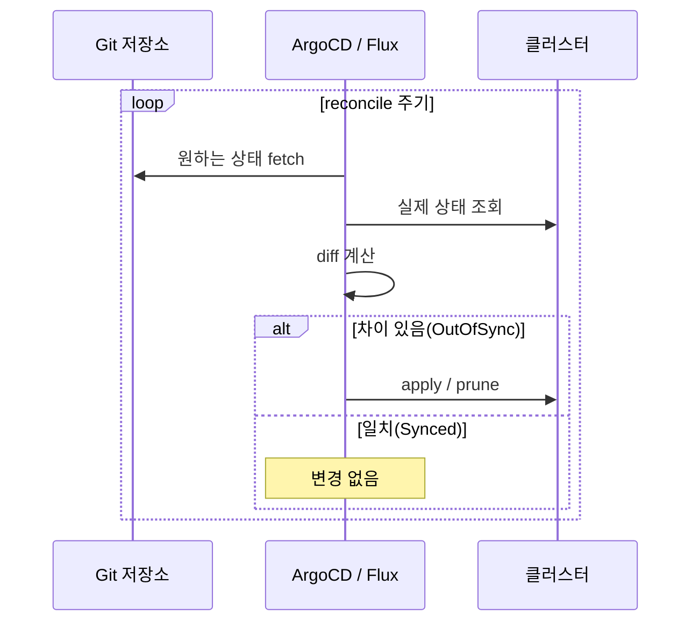

# Kustomize와 GitOps

::: info 학습 목표
- Kustomize의 base/overlays/patch 구조로 환경별 매니페스트를 템플릿 없이 합성하는 법을 익힌다.
- Helm과 Kustomize의 접근 차이와 선택·결합 기준을 이해한다.
- GitOps의 핵심 원칙(선언적·버전관리·자동 동기화·지속 조정)을 안다.
- ArgoCD와 Flux의 동작 방식과 동기화·드리프트 처리 흐름을 다룬다.
:::

## 1. Kustomize란 — 템플릿 없는 매니페스트 합성

Helm이 `{{ }}` 템플릿으로 매니페스트를 생성한다면, <strong>Kustomize</strong>는 순수 YAML로 작성한 기본 매니페스트(base)에 <strong>패치(patch)</strong>를 겹쳐(overlay) 변형을 만든다. 템플릿 언어가 없고, 입력도 출력도 유효한 쿠버네티스 YAML이라는 점이 핵심이다. Kustomize는 `kubectl`에 내장돼 있어 `kubectl apply -k`로 바로 쓸 수 있다.

진입점은 `kustomization.yaml`이다. 이 파일이 어떤 리소스를 모으고 어떤 변형을 적용할지 선언한다.

```yaml
# kustomization.yaml
apiVersion: kustomize.config.k8s.io/v1beta1
kind: Kustomization
resources:
  - deployment.yaml
  - service.yaml
commonLabels:
  app: myapp
images:
  - name: myapp
    newTag: "1.16.0"
```

`kubectl kustomize ./` 또는 `kubectl apply -k ./`로 렌더링·적용한다. 개념과 필드 전체는 [Kustomize 공식 가이드](https://kubernetes.io/docs/tasks/manage-kubernetes-objects/kustomization/)에 정리돼 있다.

## 2. base와 overlays — 환경별 구성

Kustomize의 진가는 base/overlays 구조에서 나온다. 공통 매니페스트를 <strong>base</strong>에 두고, 환경마다 다른 부분만 <strong>overlay</strong>에서 패치한다.

```text
myapp/
├── base/
│   ├── kustomization.yaml
│   ├── deployment.yaml
│   └── service.yaml
└── overlays/
    ├── dev/
    │   └── kustomization.yaml
    └── prod/
        ├── kustomization.yaml
        └── replica-patch.yaml
```

overlay의 `kustomization.yaml`은 base를 참조하고 그 위에 변형을 더한다.

```yaml
# overlays/prod/kustomization.yaml
apiVersion: kustomize.config.k8s.io/v1beta1
kind: Kustomization
namespace: prod
namePrefix: prod-
resources:
  - ../../base
patches:
  - path: replica-patch.yaml
    target:
      kind: Deployment
      name: myapp
```

패치는 변경할 부분만 적는다. 다음은 prod에서 레플리카만 5로 올리는 <strong>strategic merge patch</strong>다.

```yaml
# overlays/prod/replica-patch.yaml
apiVersion: apps/v1
kind: Deployment
metadata:
  name: myapp
spec:
  replicas: 5
```

값 하나를 정밀하게 바꿀 때는 <strong>JSON 6902 patch</strong>도 쓸 수 있다.

```yaml
patches:
  - target:
      kind: Deployment
      name: myapp
    patch: |
      - op: replace
        path: /spec/template/spec/containers/0/resources/limits/memory
        value: 512Mi
```

base와 overlay의 합성 흐름은 다음과 같다.



이 밖에 `configMapGenerator`·`secretGenerator`로 파일에서 ConfigMap/Secret을 생성하고, 내용 해시를 이름에 붙여 변경 시 자동 롤아웃을 유도하는 기능도 자주 쓴다.

## 3. Helm vs Kustomize

두 도구는 같은 문제(환경별 매니페스트 관리)를 다른 철학으로 푼다.

| 구분 | Helm | Kustomize |
|------|------|-----------|
| 접근 | 템플릿으로 생성 | 순수 YAML에 patch 오버레이 |
| 변수/로직 | 조건·반복·함수 가능 | 템플릿 로직 없음 |
| 패키징·배포 | 차트 리포지토리·릴리스 관리 | 별도 패키징 없음(디렉터리) |
| 재배포 가능성 | 외부 차트 설치가 쉬움 | 외부 공유는 약함 |
| 학습 곡선 | 템플릿 문법 학습 필요 | YAML만 알면 시작 가능 |

선택 기준은 단순하다. 복잡한 분기·반복이 필요하고 차트를 패키지로 배포·공유해야 하면 Helm이, 입력이 항상 유효한 YAML로 유지되길 원하고 환경별 차이가 "값 몇 개"라면 Kustomize가 유리하다.

둘은 배타적이지 않다. Helm으로 차트를 렌더링한 결과에 Kustomize 패치를 덧입히는 결합도 흔하다. `kustomization.yaml`의 `helmCharts` 필드로 Helm 차트를 inflate한 뒤 patch를 적용할 수 있고, ArgoCD도 이 조합을 지원한다.

## 4. GitOps 원칙

<strong>GitOps</strong>는 시스템의 원하는 상태(desired state)를 Git에 선언으로 저장하고, 에이전트가 클러스터를 그 상태로 지속적으로 수렴시키는 운영 방식이다. [OpenGitOps](https://opengitops.dev/) 프로젝트가 정의한 네 가지 원칙이 핵심이다.

- <strong>선언적(Declarative)</strong>: 원하는 상태를 명령이 아니라 선언으로 기술한다(쿠버네티스 매니페스트 자체가 그렇다).
- <strong>버전 관리·불변(Versioned and Immutable)</strong>: 그 선언을 Git에 저장해 모든 변경에 이력·리뷰·롤백이 따라온다.
- <strong>자동 당겨오기(Pulled Automatically)</strong>: 에이전트가 Git에서 원하는 상태를 자동으로 가져온다. 사람이 클러스터에 직접 push 하지 않는다.
- <strong>지속적 조정(Continuously Reconciled)</strong>: 에이전트가 실제 상태와 원하는 상태의 차이(drift)를 끊임없이 감지하고 되돌린다.

전통적인 push 방식 CI/CD와의 차이는 "누가 클러스터에 적용하는가"다. push 방식은 CI 파이프라인이 클러스터에 자격증명을 들고 `kubectl apply`를 한다. GitOps의 pull 방식은 클러스터 안의 에이전트가 Git을 지켜보다 스스로 당겨와 적용하므로, 외부에 클러스터 자격증명을 노출하지 않고 Git이 단일 진실의 원천(single source of truth)이 된다.



## 5. ArgoCD와 Flux

GitOps를 구현하는 대표 도구가 ArgoCD와 Flux다. 둘 다 CNCF Graduated 프로젝트다.

<strong>ArgoCD</strong>는 `Application`이라는 CRD로 "어느 Git 저장소의 어느 경로를 어느 클러스터의 어느 네임스페이스에 동기화할지"를 선언한다. 웹 UI로 동기화 상태와 리소스 트리를 시각적으로 보여 주는 게 강점이다.

```yaml
apiVersion: argoproj.io/v1alpha1
kind: Application
metadata:
  name: myapp
  namespace: argocd
spec:
  project: default
  source:
    repoURL: https://github.com/org/myapp-config
    targetRevision: main
    path: overlays/prod          # Kustomize/Helm/plain YAML 모두 가능
  destination:
    server: https://kubernetes.default.svc
    namespace: prod
  syncPolicy:
    automated:
      prune: true                # Git에서 사라진 리소스 삭제
      selfHeal: true             # 클러스터 직접 변경(drift) 자동 복구
```

`prune: true`는 Git에서 제거된 리소스를 클러스터에서도 지우고, `selfHeal: true`는 누군가 `kubectl edit`으로 클러스터를 직접 바꿔도 Git 상태로 되돌린다. 설정과 개념은 [Argo CD 공식 문서](https://argo-cd.readthedocs.io/en/stable/)에 자세히 있다.

<strong>Flux</strong>는 여러 컨트롤러(source-controller, kustomize-controller, helm-controller)의 조합으로 동작한다. `GitRepository`로 소스를 정의하고 `Kustomization`이나 `HelmRelease`로 적용 방식을 선언한다.

```yaml
apiVersion: kustomize.toolkit.fluxcd.io/v1
kind: Kustomization
metadata:
  name: myapp
  namespace: flux-system
spec:
  interval: 5m
  path: ./overlays/prod
  prune: true
  sourceRef:
    kind: GitRepository
    name: myapp-config
```

두 도구의 동기화 사이클은 본질적으로 같다 — Git에서 원하는 상태를 가져오고(fetch), 실제 상태와 비교하며(diff), 차이를 적용하고(apply), 이를 주기적으로 반복(reconcile)한다.



ArgoCD와 Flux는 둘 다 Kustomize와 Helm을 입력으로 받으므로, 앞서 다룬 base/overlays나 차트가 그대로 GitOps 파이프라인의 소스가 된다. 어느 쪽을 쓰든 핵심은 "사람은 Git에만 변경을 가하고, 클러스터 적용은 에이전트에 맡긴다"는 원칙을 지키는 것이다.

::: tip 핵심 정리
- Kustomize는 템플릿 없이 base 매니페스트에 patch를 오버레이해 환경별 구성을 만들고, `kubectl apply -k`로 적용한다.
- base/overlays 구조로 공통 부분과 환경별 차이를 분리하며, strategic merge·JSON 6902 patch와 generator를 쓴다.
- Helm은 템플릿·패키징에, Kustomize는 순수 YAML 유지에 강하며 둘을 결합할 수도 있다.
- GitOps는 선언적·버전관리·자동 당겨오기·지속 조정의 네 원칙으로, Git을 단일 진실의 원천으로 삼는 pull 방식 운영이다.
- ArgoCD(Application CRD, UI)와 Flux(다중 컨트롤러)는 fetch→diff→apply→reconcile 사이클로 drift를 자동 복구한다.
:::

## 다음 챕터

지금까지 애플리케이션을 패키징하고 배포하는 방법을 다뤘다. 마이크로서비스가 많아지면 서비스 간 통신의 보안·관측·제어가 새로운 문제로 떠오른다. 다음 챕터 [서비스 메시](/study/kubernetes/45-service-mesh)에서 사이드카·mTLS·트래픽 관리로 이 문제를 다루는 Istio·Linkerd를 살펴본다.
