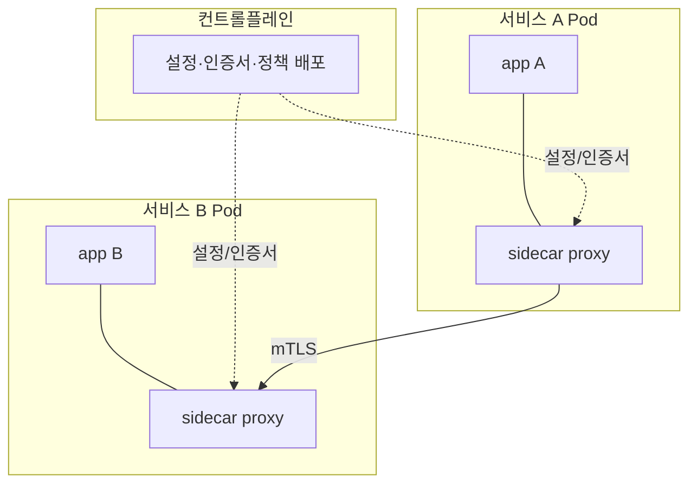
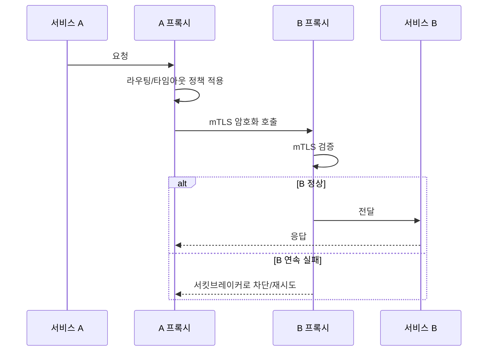

# 서비스 메시

::: info 학습 목표
- 서비스 메시가 해결하는 문제와 데이터플레인/컨트롤플레인의 역할을 이해한다.
- 사이드카 프록시가 트래픽을 가로채는 방식과 Istio·Linkerd의 차이를 안다.
- mTLS와 라우팅·리트라이·서킷브레이커 같은 트래픽 관리 기능을 다룬다.
- 사이드카 없는 ambient mesh 동향과 서비스 메시 도입의 트레이드오프를 판단한다.
:::

## 1. 서비스 메시란 — 왜 필요한가

마이크로서비스가 수십 개로 늘면 서비스 간 통신에서 같은 문제가 반복된다 — 호출 암호화(mTLS), 재시도·타임아웃, 부하 분산, 장애 격리(서킷브레이커), 그리고 누가 누구를 얼마나 호출했는지에 대한 관측. 이걸 각 서비스의 애플리케이션 코드와 라이브러리에 일일이 넣으면, 언어마다 다시 구현해야 하고 버전도 제각각이 된다.

<strong>서비스 메시(Service Mesh)</strong>는 이 관심사를 애플리케이션 밖, 즉 인프라 계층으로 옮긴다. 각 서비스 옆에 프록시를 붙여 모든 트래픽을 그 프록시가 대신 처리하게 하고, 정책은 중앙에서 선언적으로 관리한다. 애플리케이션은 통신 로직을 몰라도 되고, 메시가 그 위에서 보안·신뢰성·관측을 일괄 제공한다.

서비스 메시는 두 평면으로 나뉜다.

| 평면 | 역할 |
|------|------|
| 데이터플레인(Data Plane) | 실제 트래픽을 처리하는 프록시들. 가로채기·암호화·라우팅·재시도 수행 |
| 컨트롤플레인(Control Plane) | 프록시에 설정·인증서·정책을 배포하고 메시 전체를 관리 |



## 2. 사이드카 — 트래픽 가로채기

전통적인 메시는 <strong>사이드카(sidecar)</strong> 패턴으로 데이터플레인을 구성한다. 애플리케이션 컨테이너와 같은 Pod에 프록시 컨테이너(Istio는 Envoy, Linkerd는 자체 Rust 프록시)를 함께 넣는다. 같은 Pod이므로 네트워크 네임스페이스를 공유하고, 프록시가 그 Pod의 모든 인·아웃바운드 트래픽을 가로챈다.

가로채기는 보통 Pod 시작 시 init 컨테이너가 iptables 규칙을 심어 트래픽을 사이드카로 우회시키는 방식으로 이뤄진다. 그래서 애플리케이션은 자신이 프록시를 거치는지조차 모른다. Istio에서는 네임스페이스에 레이블을 붙이면 자동으로 사이드카가 주입된다.

```bash
kubectl label namespace prod istio-injection=enabled
# 이후 이 네임스페이스에 배포되는 Pod에 Envoy 사이드카가 자동 주입됨
```

사이드카 모델은 강력하지만 비용이 있다. Pod마다 프록시가 하나씩 더 떠서 CPU·메모리를 추가로 쓰고, 컨테이너 수가 두 배가 되며, 트래픽이 프록시를 두 번(송신 측·수신 측) 거치므로 약간의 지연이 더해진다. 이 비용이 뒤에서 다룰 ambient mesh가 등장한 배경이다.

## 3. Istio와 Linkerd

대표적인 두 메시는 지향점이 다르다.

<strong>Istio</strong>는 기능이 풍부하다. 데이터플레인으로 [Envoy](https://www.envoyproxy.io/) 프록시를 쓰고, 컨트롤플레인 `istiod`가 설정 배포·인증서 발급·서비스 디스커버리를 담당한다. VirtualService·DestinationRule·Gateway 같은 풍부한 CRD로 정교한 트래픽 제어가 가능하지만, 그만큼 학습·운영 복잡도가 높다. 상세는 [Istio 공식 문서](https://istio.io/latest/docs/)를 참고한다.

<strong>Linkerd</strong>는 단순함과 경량을 지향한다. 전용으로 만든 가벼운 Rust 마이크로프록시를 쓰고, 설정 표면을 작게 유지해 운영 부담이 낮다. mTLS가 기본으로 켜지는 등 "안전한 기본값"에 무게를 둔다. 상세는 [Linkerd 공식 문서](https://linkerd.io/2/overview/)를 참고한다.

| 구분 | Istio | Linkerd |
|------|-------|---------|
| 데이터플레인 | Envoy | 전용 Rust 마이크로프록시 |
| 지향점 | 기능 풍부·세밀한 제어 | 단순·경량·낮은 운영 부담 |
| 트래픽 제어 | VirtualService 등 다양한 CRD | 상대적으로 단순한 설정 |
| ambient 모드 | 지원(사이드카 없는 모드) | sidecar 중심(경량) |

선택은 결국 "얼마나 정교한 제어가 필요한가" 대 "얼마나 단순하게 운영하고 싶은가"의 균형이다.

## 4. mTLS와 트래픽 관리

서비스 메시가 제공하는 핵심 기능을 살펴본다.

<strong>mTLS(상호 TLS).</strong> 메시는 컨트롤플레인이 발급한 인증서를 프록시에 배포해, 서비스 간 모든 통신을 양방향 인증·암호화한다. 애플리케이션 코드 변경 없이 "제로 트러스트" 네트워크를 만들 수 있는 게 큰 장점이다. Istio에서는 `PeerAuthentication`으로 메시 전체나 네임스페이스 단위로 mTLS를 강제한다.

```yaml
apiVersion: security.istio.io/v1
kind: PeerAuthentication
metadata:
  name: default
  namespace: prod
spec:
  mtls:
    mode: STRICT          # 평문 거부, mTLS만 허용
```

<strong>라우팅.</strong> 트래픽을 버전·헤더·가중치로 나눠 보낼 수 있다. 카나리 배포(새 버전에 10%만 흘리기)나 A/B 테스트가 코드 없이 선언으로 가능하다.

```yaml
apiVersion: networking.istio.io/v1
kind: VirtualService
metadata:
  name: myapp
spec:
  hosts: [myapp]
  http:
    - route:
        - destination:
            host: myapp
            subset: v1
          weight: 90
        - destination:
            host: myapp
            subset: v2
          weight: 10        # v2로 10% 카나리
```

<strong>리트라이·타임아웃.</strong> 일시적 실패에 대한 재시도와 호출 시간 제한을 프록시가 처리한다.

```yaml
  http:
    - route:
        - destination: { host: myapp }
      retries:
        attempts: 3
        perTryTimeout: 2s
      timeout: 10s
```

<strong>서킷브레이커.</strong> 특정 대상이 계속 실패하면 호출을 일시 차단해 연쇄 장애를 막는다. Istio에서는 `DestinationRule`의 `outlierDetection`으로 설정한다.

```yaml
apiVersion: networking.istio.io/v1
kind: DestinationRule
metadata:
  name: myapp
spec:
  host: myapp
  trafficPolicy:
    outlierDetection:
      consecutive5xxErrors: 5     # 5xx 5번 연속이면
      interval: 10s
      baseEjectionTime: 30s       # 30초간 대상에서 제외
```

요청이 프록시를 거쳐 정책을 적용받는 흐름은 다음과 같다.



## 5. ambient mesh 동향과 도입 트레이드오프

사이드카의 자원·지연 비용을 줄이려는 흐름이 <strong>ambient mesh</strong>다. Istio ambient 모드는 Pod마다 프록시를 넣는 대신, 노드 단위의 L4 컴포넌트(ztunnel)가 mTLS·기본 라우팅을 처리하고, L7 정책이 필요한 경우에만 별도의 waypoint 프록시를 거치게 한다. 사이드카를 없애 자원 사용과 운영 복잡도를 낮추고, 메시를 점진적으로 도입할 수 있게 하는 것이 목표다. 상세는 [Istio Ambient Mesh 문서](https://istio.io/latest/docs/ambient/overview/)에 있다.

도입을 결정할 때는 트레이드오프를 분명히 따져야 한다.

- <strong>이점</strong>: 애플리케이션 코드 변경 없이 mTLS·관측·트래픽 제어를 일괄 확보. 언어·프레임워크에 독립적.
- <strong>비용</strong>: 프록시로 인한 자원·지연 오버헤드, 컨트롤플레인 운영 부담, 디버깅 난이도 상승(트래픽 경로가 길어짐).
- <strong>판단 기준</strong>: 서비스 수가 적고 통신 정책이 단순하면 메시 없이 [NetworkPolicy](https://kubernetes.io/docs/concepts/services-networking/network-policies/)·Ingress·앱 라이브러리로 충분할 수 있다. 서비스가 많고 mTLS·세밀한 트래픽 제어·통합 관측이 반복적으로 필요해질 때 메시의 가치가 비용을 넘어선다.

즉 서비스 메시는 "기본으로 까는 것"이 아니라, 통신 관심사가 충분히 복잡해졌을 때 도입하는 도구다. ambient 모드는 이 도입 문턱을 낮추는 방향의 진화로 이해하면 된다.

::: tip 핵심 정리
- 서비스 메시는 mTLS·재시도·트래픽 제어·관측 같은 통신 관심사를 애플리케이션 밖 인프라 계층으로 옮긴다.
- 데이터플레인(프록시)이 트래픽을 처리하고 컨트롤플레인이 설정·인증서·정책을 배포하며, 전통적으로 사이드카로 구성한다.
- Istio는 Envoy 기반 기능 풍부형, Linkerd는 경량 단순형으로 지향점이 다르다.
- mTLS로 통신을 암호화하고, 가중치 라우팅·리트라이·타임아웃·서킷브레이커를 선언으로 적용한다.
- ambient mesh는 사이드카 비용을 줄이는 방향이며, 메시는 통신 복잡도가 비용을 넘어설 때 도입하는 트레이드오프다.
:::

## 다음 챕터

서비스 메시로 서비스 간 통신을 다뤘다면, 이제 시야를 클러스터 단위로 넓힐 차례다. 하나의 클러스터를 여러 팀·테넌트가 안전하게 나눠 쓰고, 여러 클러스터를 함께 운영하는 방법이 남았다. 다음 챕터 [멀티테넌시와 멀티클러스터](/study/kubernetes/46-multi-tenancy-cluster)에서 격리 모델과 멀티클러스터 패턴을 다룬다.
