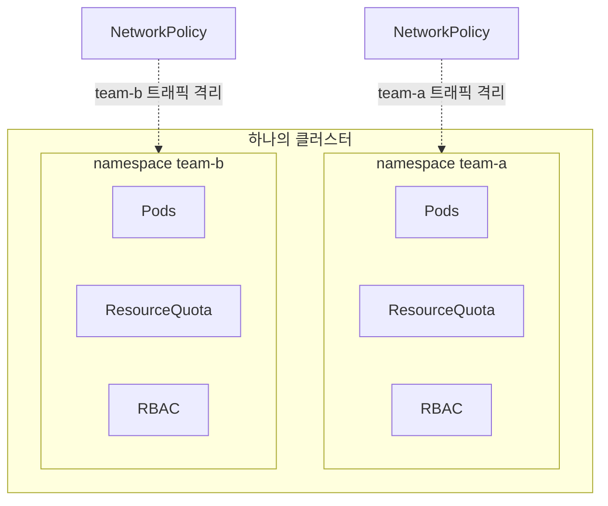
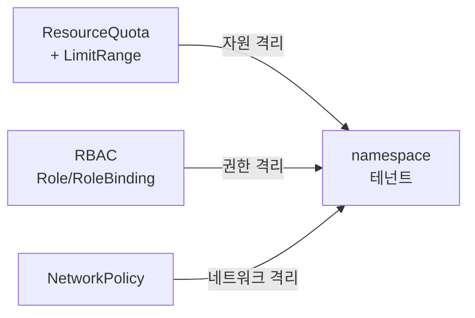
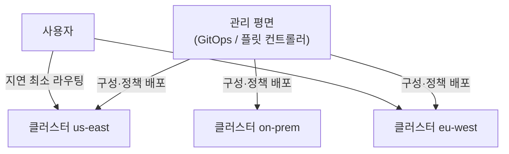

# 멀티테넌시와 멀티클러스터

::: info 학습 목표
- 멀티테넌시의 의미와 소프트/하드 멀티테넌시의 격리 강도 차이를 이해한다.
- ResourceQuota·RBAC·NetworkPolicy를 조합해 namespace 단위 격리를 구성하는 법을 익힌다.
- 단일 클러스터 격리의 한계와 멀티클러스터로 넘어가는 판단 기준을 안다.
- 멀티클러스터 패턴(연합·플릿)과 이를 운영하는 관리 도구를 다룬다.
:::

## 1. 멀티테넌시란 — 소프트 vs 하드

<strong>멀티테넌시(multi-tenancy)</strong>는 하나의 쿠버네티스 클러스터를 여러 <strong>테넌트(tenant)</strong>가 공유하는 형태를 말한다. 테넌트는 한 회사의 여러 팀일 수도, 한 SaaS의 여러 고객일 수도 있다. 클러스터를 공유하면 자원 활용률이 오르고 운영 비용이 줄지만, 테넌트끼리 서로의 자원·데이터·네트워크에 영향을 주지 않도록 격리가 필요하다.

격리 강도에 따라 두 가지로 나뉜다.

| 구분 | 신뢰 수준 | 격리 방식 |
|------|-----------|-----------|
| 소프트 멀티테넌시 | 서로 신뢰하는 내부 팀 | namespace + RBAC + Quota + NetworkPolicy |
| 하드 멀티테넌시 | 서로 신뢰하지 않는 외부 고객 | 위 + 가상 컨트롤플레인 또는 클러스터 분리 |

<strong>소프트 멀티테넌시</strong>는 같은 조직 안에서 어느 정도 서로 신뢰하는 팀들이 클러스터를 나눠 쓰는 경우다. namespace를 테넌트 경계로 삼고 그 위에 정책을 얹어 격리한다. <strong>하드 멀티테넌시</strong>는 서로 신뢰할 수 없는 테넌트(예: 외부 고객)를 격리하는 경우로, namespace만으로는 부족하다 — 컨트롤플레인 자체가 공유되고, 노드·커널이 공유되며, 한 테넌트의 오작동·악의적 행위가 다른 테넌트에 닿을 수 있기 때문이다. 개념과 권고는 [Multi-tenancy 공식 문서](https://kubernetes.io/docs/concepts/security/multi-tenancy/)에 정리돼 있다.



## 2. namespace 격리 — ResourceQuota, RBAC, NetworkPolicy

namespace는 그 자체로 이름 충돌만 막을 뿐 강한 경계가 아니다. 다음 세 가지를 조합해야 실질 격리가 된다.

<strong>ResourceQuota</strong>는 namespace가 쓸 수 있는 자원 총량을 제한해, 한 테넌트가 클러스터 자원을 독식하는 것(noisy neighbor)을 막는다.

```yaml
apiVersion: v1
kind: ResourceQuota
metadata:
  name: team-a-quota
  namespace: team-a
spec:
  hard:
    requests.cpu: "10"
    requests.memory: 20Gi
    limits.cpu: "20"
    limits.memory: 40Gi
    pods: "50"
    persistentvolumeclaims: "10"
```

개별 Pod·컨테이너의 기본/최대 한도는 `LimitRange`로 보완한다. ResourceQuota가 컨테이너 한도를 요구할 때, LimitRange가 기본값을 채워 준다.

<strong>RBAC</strong>은 각 테넌트가 자기 namespace에만 접근하도록 권한을 제한한다. Role(namespace 범위)과 RoleBinding으로 권한을 매는 게 기본이다.

```yaml
apiVersion: rbac.authorization.k8s.io/v1
kind: Role
metadata:
  namespace: team-a
  name: team-a-developer
rules:
  - apiGroups: ["", "apps"]
    resources: ["pods", "deployments", "services", "configmaps"]
    verbs: ["get", "list", "watch", "create", "update", "delete"]
---
apiVersion: rbac.authorization.k8s.io/v1
kind: RoleBinding
metadata:
  namespace: team-a
  name: team-a-developer-binding
subjects:
  - kind: Group
    name: team-a
    apiGroup: rbac.authorization.k8s.io
roleRef:
  kind: Role
  name: team-a-developer
  apiGroup: rbac.authorization.k8s.io
```

<strong>NetworkPolicy</strong>는 namespace 간 트래픽을 차단한다. 기본적으로 쿠버네티스의 모든 Pod는 서로 통신 가능하므로, 먼저 모든 인바운드를 막는 default-deny를 깔고 필요한 통신만 연다.

```yaml
apiVersion: networking.k8s.io/v1
kind: NetworkPolicy
metadata:
  name: default-deny-ingress
  namespace: team-a
spec:
  podSelector: {}              # namespace의 모든 Pod
  policyTypes: [Ingress]       # 인바운드 전부 차단(아래 허용 규칙 없음)
```

세 가지의 역할 분담을 정리하면 다음과 같다.



## 3. 소프트 격리의 한계

위 조합으로 소프트 멀티테넌시는 충분히 구성된다. 그러나 신뢰할 수 없는 테넌트에 대해서는 한계가 분명하다.

- <strong>공유 컨트롤플레인</strong>: 모든 테넌트가 같은 API 서버·etcd를 쓴다. CRD나 클러스터 범위 리소스는 테넌트 간에 보이고, 한 테넌트의 과도한 API 호출이 전체에 영향을 줄 수 있다.
- <strong>공유 노드·커널</strong>: 같은 노드에 여러 테넌트 Pod가 섞일 수 있고, 컨테이너 격리는 VM만큼 강하지 않다. 커널 취약점이 곧 테넌트 경계 돌파로 이어질 수 있다.
- <strong>클러스터 범위 자원</strong>: PriorityClass, IngressClass, 일부 webhook 등은 namespace로 가둘 수 없다.

이 한계를 줄이는 접근으로는 노드를 테넌트별로 전용 배치(taint/toleration + nodeSelector)하거나, 강한 컨테이너 격리 런타임([gVisor](https://gvisor.dev/), Kata Containers)을 쓰거나, [vcluster](https://www.vcluster.com/) 같은 가상 컨트롤플레인으로 테넌트마다 별도의 논리 클러스터를 주는 방법이 있다. 그래도 진짜 강한 격리가 필요하면 결국 클러스터 자체를 분리하게 된다 — 여기서 멀티클러스터로 넘어간다.

## 4. 멀티클러스터 패턴 — 연합과 플릿

여러 클러스터를 운영하는 이유는 격리만이 아니다. 지역별 지연 최소화, 장애 도메인 분리, 클라우드·온프렘 혼용, 규제로 인한 데이터 위치 제약 등이 함께 작용한다.

대표적인 패턴은 다음과 같다.

| 패턴 | 설명 |
|------|------|
| 복제(Replication) | 같은 워크로드를 여러 클러스터에 동일 배포(지역 분산·DR) |
| 분할(Partitioning) | 테넌트·서비스별로 클러스터를 나눠 강한 격리 확보 |
| 연합(Federation) | 여러 클러스터를 하나처럼 보고 정책·워크로드를 묶어 관리 |
| 플릿(Fleet) | 다수 클러스터를 한 관리 평면에서 일괄 운영(정책·구성 배포) |

<strong>연합</strong>은 여러 클러스터에 워크로드를 펼치고 서비스 디스커버리·DNS를 가로질러 잇는 접근이다. 다만 단일 거대 연합은 복잡도가 커서, 최근에는 각 클러스터를 독립적으로 두고 <strong>플릿</strong> 관리 평면에서 GitOps로 구성을 일괄 배포하는 방식이 선호된다. 앞 챕터에서 본 ArgoCD·Flux가 여러 클러스터를 대상으로 동작하므로, 플릿 관리의 핵심 도구가 된다.



멀티클러스터는 강한 격리·가용성·지역성을 주지만 비용이 따른다 — 클러스터마다 컨트롤플레인·업그레이드·모니터링이 늘고, 클러스터를 가로지르는 네트워킹·서비스 디스커버리·시크릿 동기화가 새로운 과제가 된다. 그래서 "기본은 단일 클러스터 + namespace 격리, 신뢰 경계나 가용성·규제 요구가 namespace로 감당되지 않을 때 클러스터를 늘린다"가 합리적인 출발점이다.

## 5. 클러스터 관리 도구

다수 클러스터를 일관되게 운영하려면 전용 관리 도구가 필요하다. 영역별로 대표적인 것들을 본다.

- <strong>플릿·정책 관리</strong>: [Open Cluster Management](https://open-cluster-management.io/), Rancher, Google Anthos, Red Hat ACM 등이 여러 클러스터를 한 콘솔에서 등록·구성·정책 배포한다.
- <strong>GitOps 배포</strong>: ArgoCD의 ApplicationSet, Flux의 멀티클러스터 구성으로 같은 매니페스트를 여러 클러스터에 자동 배포한다.
- <strong>정책 강제</strong>: [Kyverno](https://kyverno.io/), [OPA Gatekeeper](https://open-policy-agent.github.io/gatekeeper/) 같은 정책 엔진을 admission webhook으로 걸어 모든 클러스터에 거버넌스(예: "모든 Pod에 resource limit 필수", "특정 레지스트리 이미지만 허용")를 강제한다.
- <strong>클러스터 수명주기</strong>: [Cluster API](https://cluster-api.sigs.k8s.io/)로 클러스터 자체를 선언적 쿠버네티스 리소스로 만들고 관리한다 — 클러스터를 만드는 일조차 GitOps 대상이 된다.

이 도구들의 공통 철학은 앞 챕터들과 같다. 클러스터가 하나든 수십 개든, 원하는 상태를 Git에 선언하고 정책을 admission 단계에서 강제하며 관리 평면이 이를 일괄 수렴시킨다 — 멀티클러스터는 GitOps와 정책 엔진 위에서 비로소 운영 가능한 규모가 된다.

::: tip 핵심 정리
- 멀티테넌시는 한 클러스터를 여러 테넌트가 공유하는 형태로, 신뢰 수준에 따라 소프트/하드로 나뉜다.
- namespace는 경계의 출발점일 뿐이고, ResourceQuota·RBAC·NetworkPolicy를 조합해야 실질 격리가 된다.
- 공유 컨트롤플레인·노드·커널 때문에 소프트 격리는 신뢰할 수 없는 테넌트에는 부족하며, 강한 격리는 클러스터 분리로 간다.
- 멀티클러스터 패턴(복제·분할·연합·플릿)은 격리·가용성·지역성을 주지만 운영 비용과 클러스터 간 네트워킹 과제가 따른다.
- Cluster API·정책 엔진·GitOps 도구로 다수 클러스터를 선언적으로 일괄 관리한다.
:::

## 다음 챕터

지금까지 쿠버네티스의 컨테이너 기초부터 운영·배포·메시·멀티클러스터까지 폭넓게 다뤘다. 이제 배운 것을 손으로 엮어 볼 차례다. 다음 챕터 [실습 종합](/study/kubernetes/47-practice)에서 지금까지의 개념을 하나의 흐름으로 직접 구성하며 정리한다.
