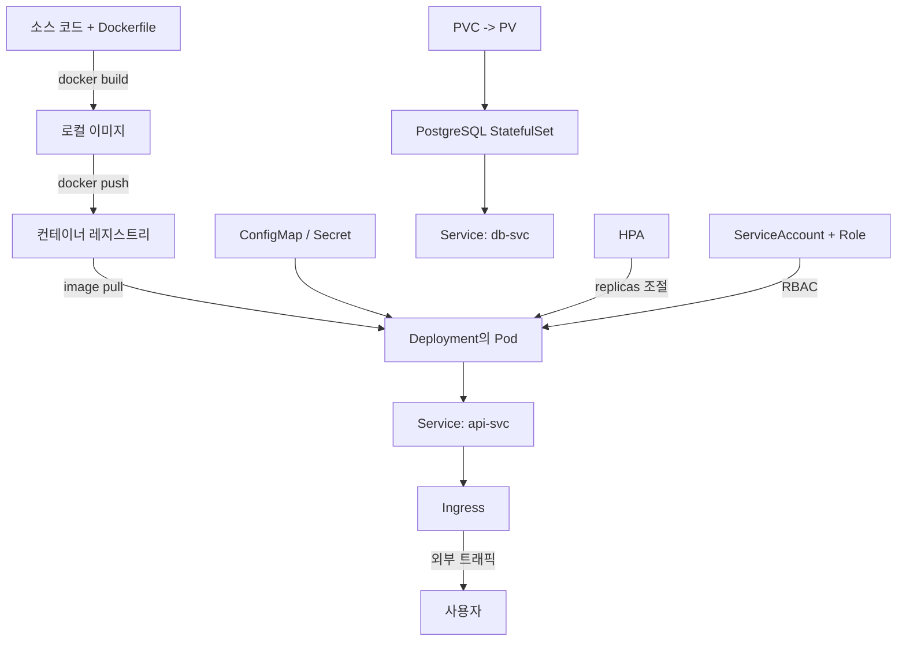
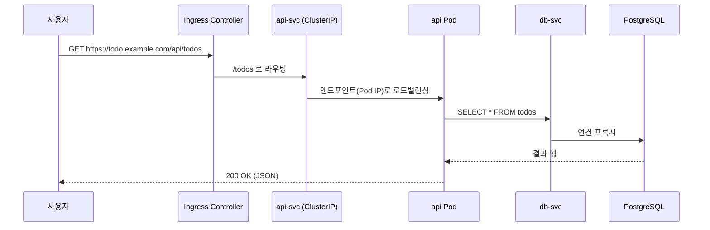

# 종합 실습

::: info 학습 목표
- 간단한 웹앱(API 서버 + DB)을 Dockerfile로 빌드하고 레지스트리에 푸시하는 흐름을 익힌다.
- Deployment·Service·Ingress·ConfigMap·Secret·PVC 매니페스트를 하나의 애플리케이션으로 엮어 작성한다.
- probe·HPA·RBAC를 실제 워크로드에 적용해 자가 치유·자동 확장·최소 권한을 구성한다.
- 롤링 업데이트와 롤백을 수행하고, 흔한 장애를 `kubectl`로 진단하는 트러블슈팅 절차를 몸에 익힌다.
:::

지금까지 챕터별로 다룬 오브젝트를 하나의 시나리오로 모은다. 시나리오는 <strong>todo API 서버 + PostgreSQL DB</strong>로 구성된 작은 웹 서비스다. API 서버는 직접 만든 컨테이너 이미지로, DB는 공식 `postgres` 이미지로 띄운다. 전체 흐름은 다음과 같다.



## 1. 애플리케이션과 Dockerfile

API 서버는 `/healthz`(liveness), `/readyz`(readiness), `/todos`(기능) 세 엔드포인트를 가진다고 가정한다. 환경변수로 DB 접속 정보를 받는다. 핵심은 매니페스트이므로 애플리케이션 코드 자체는 최소화하고 Dockerfile에 집중한다.

```dockerfile
# syntax=docker/dockerfile:1
FROM node:20-alpine AS build
WORKDIR /app
COPY package*.json ./
RUN npm ci --omit=dev
COPY . .

FROM node:20-alpine
WORKDIR /app
# 비루트 사용자로 실행 — 보안 기본값
RUN addgroup -S app && adduser -S app -G app
COPY --from=build /app /app
USER app
EXPOSE 8080
ENV NODE_ENV=production
CMD ["node", "server.js"]
```

멀티스테이지 빌드로 빌드 의존성을 최종 이미지에서 제외하고, `USER app`으로 비루트 실행을 강제했다. 이미지 빌드 모범 사례는 [이미지 빌드 베스트 프랙티스](https://docs.docker.com/build/building/best-practices/) 문서를 참고한다.

```bash
# 이미지 빌드 — 레지스트리 경로를 태그로 직접 지정
docker build -t registry.example.com/todo-api:1.0.0 .

# 레지스트리 로그인 후 푸시
docker login registry.example.com
docker push registry.example.com/todo-api:1.0.0
```

태그에는 `latest` 대신 `1.0.0` 같은 명시적 버전을 쓴다. `latest`는 어떤 빌드가 떠 있는지 추적이 어렵고, `imagePullPolicy` 기본 동작과 맞물려 예측 불가능한 배포를 유발한다.

## 2. 네임스페이스와 설정 — ConfigMap, Secret

먼저 애플리케이션을 격리할 네임스페이스를 만든다.

```bash
kubectl create namespace todo
```

비밀이 아닌 설정은 ConfigMap, 비밀번호 같은 민감 정보는 Secret으로 분리한다.

```yaml
apiVersion: v1
kind: ConfigMap
metadata:
  name: todo-config
  namespace: todo
data:
  LOG_LEVEL: "info"
  DB_HOST: "db-svc"
  DB_PORT: "5432"
  DB_NAME: "todo"
---
apiVersion: v1
kind: Secret
metadata:
  name: todo-secret
  namespace: todo
type: Opaque
stringData:
  DB_USER: "todo"
  DB_PASSWORD: "s3cr3t-change-me"
```

`stringData`를 쓰면 평문으로 적어도 API 서버가 저장 시 base64로 인코딩한다. 다만 base64는 암호화가 아니므로, 실제 운영에서는 [Secret 보안](https://kubernetes.io/docs/concepts/configuration/secret/#information-security-for-secrets)에 따라 etcd 암호화나 외부 시크릿 매니저를 함께 쓴다.

```bash
kubectl apply -f config.yaml
kubectl get configmap,secret -n todo
```

## 3. DB 계층 — PVC, StatefulSet, Service

DB는 데이터를 잃으면 안 되므로 영속 볼륨이 필요하다. StatefulSet의 `volumeClaimTemplates`로 Pod마다 안정적인 PVC를 받게 한다.

```yaml
apiVersion: v1
kind: Service
metadata:
  name: db-svc
  namespace: todo
spec:
  clusterIP: None        # 헤드리스 — StatefulSet 안정 네트워크 식별자용
  selector:
    app: db
  ports:
  - port: 5432
    targetPort: 5432
---
apiVersion: apps/v1
kind: StatefulSet
metadata:
  name: db
  namespace: todo
spec:
  serviceName: db-svc
  replicas: 1
  selector:
    matchLabels:
      app: db
  template:
    metadata:
      labels:
        app: db
    spec:
      containers:
      - name: postgres
        image: postgres:16-alpine
        ports:
        - containerPort: 5432
        env:
        - name: POSTGRES_DB
          valueFrom:
            configMapKeyRef:
              name: todo-config
              key: DB_NAME
        - name: POSTGRES_USER
          valueFrom:
            secretKeyRef:
              name: todo-secret
              key: DB_USER
        - name: POSTGRES_PASSWORD
          valueFrom:
            secretKeyRef:
              name: todo-secret
              key: DB_PASSWORD
        volumeMounts:
        - name: data
          mountPath: /var/lib/postgresql/data
        readinessProbe:
          exec:
            command: ["pg_isready", "-U", "todo"]
          initialDelaySeconds: 5
          periodSeconds: 10
  volumeClaimTemplates:
  - metadata:
      name: data
    spec:
      accessModes: ["ReadWriteOnce"]
      resources:
        requests:
          storage: 5Gi
```

`volumeClaimTemplates`는 StatefulSet이 각 Pod(`db-0`)마다 `data-db-0` PVC를 자동 생성하게 한다. 자세한 동작은 [StatefulSet 문서](https://kubernetes.io/docs/concepts/workloads/controllers/statefulset/)를 참고한다.

```bash
kubectl apply -f db.yaml
kubectl get statefulset,pvc,pod -n todo
```

## 4. API 계층 — Deployment, probe, 리소스

API 서버는 stateless이므로 Deployment로 배포한다. 여기서 liveness/readiness/startup probe와 리소스 요청·제한을 함께 건다.

```yaml
apiVersion: apps/v1
kind: Deployment
metadata:
  name: api
  namespace: todo
  labels:
    app: api
spec:
  replicas: 2
  selector:
    matchLabels:
      app: api
  template:
    metadata:
      labels:
        app: api
    spec:
      serviceAccountName: api-sa     # RBAC용 — 5절에서 생성
      containers:
      - name: api
        image: registry.example.com/todo-api:1.0.0
        ports:
        - containerPort: 8080
        envFrom:
        - configMapRef:
            name: todo-config
        - secretRef:
            name: todo-secret
        resources:
          requests:
            cpu: "100m"
            memory: "128Mi"
          limits:
            cpu: "500m"
            memory: "256Mi"
        startupProbe:
          httpGet:
            path: /healthz
            port: 8080
          failureThreshold: 30
          periodSeconds: 2
        livenessProbe:
          httpGet:
            path: /healthz
            port: 8080
          periodSeconds: 10
        readinessProbe:
          httpGet:
            path: /readyz
            port: 8080
          periodSeconds: 5
```

`startupProbe`는 느린 초기화 동안 liveness가 컨테이너를 죽이는 것을 막는다. `requests`는 스케줄링·HPA 기준이 되고, `limits`는 노드 자원을 보호한다. probe 종류와 설정은 [liveness/readiness/startup probe 문서](https://kubernetes.io/docs/tasks/configure-pod-container/configure-liveness-readiness-startup-probes/)에 자세하다.

API를 묶는 Service는 ClusterIP로 둔다. 외부 노출은 Ingress가 맡는다.

```yaml
apiVersion: v1
kind: Service
metadata:
  name: api-svc
  namespace: todo
spec:
  selector:
    app: api
  ports:
  - port: 80
    targetPort: 8080
```

```bash
kubectl apply -f api.yaml
kubectl apply -f api-svc.yaml
kubectl rollout status deployment/api -n todo
```

## 5. RBAC — ServiceAccount, Role, RoleBinding

API 서버가 자기 네임스페이스의 ConfigMap을 런타임에 읽어야 한다고 가정하면, 그 권한만 최소로 부여한다. 기본 ServiceAccount에 권한을 몰아주지 말고 전용 SA를 만든다.

```yaml
apiVersion: v1
kind: ServiceAccount
metadata:
  name: api-sa
  namespace: todo
---
apiVersion: rbac.authorization.k8s.io/v1
kind: Role
metadata:
  name: config-reader
  namespace: todo
rules:
- apiGroups: [""]
  resources: ["configmaps"]
  verbs: ["get", "list", "watch"]
---
apiVersion: rbac.authorization.k8s.io/v1
kind: RoleBinding
metadata:
  name: api-config-reader
  namespace: todo
subjects:
- kind: ServiceAccount
  name: api-sa
  namespace: todo
roleRef:
  kind: Role
  name: config-reader
  apiGroup: rbac.authorization.k8s.io
```

`verbs`는 필요한 것만 나열했다. 권한이 제대로 걸렸는지는 `auth can-i`로 SA를 가장해 확인한다.

```bash
kubectl apply -f rbac.yaml
kubectl auth can-i get configmaps \
  --as=system:serviceaccount:todo:api-sa -n todo   # yes
kubectl auth can-i delete configmaps \
  --as=system:serviceaccount:todo:api-sa -n todo   # no
```

RBAC 모델 전반은 [RBAC 권한 부여 문서](https://kubernetes.io/docs/reference/access-authn-authz/rbac/)에 정리돼 있다.

## 6. Ingress — 외부 노출

외부 트래픽을 호스트/경로 기준으로 Service에 라우팅한다. Ingress 컨트롤러(예: ingress-nginx)가 클러스터에 설치돼 있다고 가정한다.

```yaml
apiVersion: networking.k8s.io/v1
kind: Ingress
metadata:
  name: todo-ingress
  namespace: todo
  annotations:
    nginx.ingress.kubernetes.io/rewrite-target: /
spec:
  ingressClassName: nginx
  rules:
  - host: todo.example.com
    http:
      paths:
      - path: /api
        pathType: Prefix
        backend:
          service:
            name: api-svc
            port:
              number: 80
```

```bash
kubectl apply -f ingress.yaml
kubectl get ingress -n todo
```

이제 외부 사용자의 요청이 처리되는 경로는 다음과 같다.



전체 개념은 [Ingress 문서](https://kubernetes.io/docs/concepts/services-networking/ingress/)를 참고한다.

## 7. HPA — 자동 확장

부하에 따라 API Pod 수를 늘리고 줄인다. HPA는 4절에서 건 `requests.cpu`를 기준으로 사용률을 계산하므로, requests가 반드시 설정돼 있어야 한다. metrics-server가 클러스터에 있어야 한다.

```yaml
apiVersion: autoscaling/v2
kind: HorizontalPodAutoscaler
metadata:
  name: api-hpa
  namespace: todo
spec:
  scaleTargetRef:
    apiVersion: apps/v1
    kind: Deployment
    name: api
  minReplicas: 2
  maxReplicas: 10
  metrics:
  - type: Resource
    resource:
      name: cpu
      target:
        type: Utilization
        averageUtilization: 60
```

```bash
kubectl apply -f hpa.yaml
kubectl get hpa -n todo -w        # TARGETS, REPLICAS 변화 관찰
```

평균 CPU 사용률이 60%를 넘으면 replicas를 늘린다. 동작 원리는 [HPA 문서](https://kubernetes.io/docs/tasks/run-application/horizontal-pod-autoscale/)에 있다.

## 8. 롤링 업데이트와 롤백

API 코드를 고쳐 `1.1.0` 이미지를 새로 푸시했다고 하자. Deployment의 이미지 태그만 바꾸면 롤링 업데이트가 시작된다.

```bash
# 이미지 교체 — 롤링 업데이트 트리거
kubectl set image deployment/api api=registry.example.com/todo-api:1.1.0 -n todo

# 진행 상황 추적
kubectl rollout status deployment/api -n todo

# 리비전 이력 확인
kubectl rollout history deployment/api -n todo
```

새 버전이 잘못됐다면 직전 리비전으로 즉시 롤백한다.

```bash
kubectl rollout undo deployment/api -n todo
# 특정 리비전으로: kubectl rollout undo deployment/api --to-revision=2 -n todo
```

readiness probe가 있으므로, 새 Pod가 `/readyz`에 200을 줄 때까지 Service 엔드포인트에 추가되지 않는다. 덕분에 업데이트 중에도 트래픽이 준비 안 된 Pod로 가지 않는다.

## 9. 트러블슈팅

배포 후 문제가 생겼을 때의 진단 순서다. 위에서 아래로 좁혀 간다.

```bash
# 1) 전체 리소스 상태 한눈에
kubectl get all -n todo

# 2) Pod가 Pending/CrashLoopBackOff면 이벤트부터
kubectl describe pod <pod> -n todo        # Events 섹션 확인

# 3) 애플리케이션 로그
kubectl logs <pod> -n todo
kubectl logs <pod> -n todo --previous      # 크래시 직전 로그

# 4) 컨테이너 안에서 직접 확인
kubectl exec -it <pod> -n todo -- sh
```

흔한 증상과 원인을 정리한다.

| 증상 | 자주 보는 원인 | 확인 명령 |
|---|---|---|
| `ImagePullBackOff` | 잘못된 이미지 태그, 레지스트리 인증 누락 | `kubectl describe pod` Events |
| `CrashLoopBackOff` | 앱 기동 실패, 잘못된 env, DB 연결 불가 | `kubectl logs --previous` |
| Pod `Pending` | 노드 자원 부족, PVC 바인딩 실패, 셀렉터 불일치 | `kubectl describe pod`, `kubectl get pvc` |
| readiness 계속 실패 | `/readyz` 경로·포트 오류, DB 미준비 | `kubectl describe pod`, probe 설정 |
| Ingress 404/502 | `ingressClassName` 누락, Service 셀렉터 불일치 | `kubectl get endpoints api-svc -n todo` |
| HPA `<unknown>` 타겟 | metrics-server 부재, requests 미설정 | `kubectl top pod -n todo` |

Service가 Pod를 못 찾는지(엔드포인트 비어 있음)는 특히 자주 막히는 지점이다.

```bash
# 엔드포인트가 비어 있으면 Service 셀렉터와 Pod 라벨 불일치를 의심한다
kubectl get endpoints api-svc -n todo
kubectl get pods -n todo --show-labels
```

체계적인 디버깅 흐름은 [애플리케이션 트러블슈팅 문서](https://kubernetes.io/docs/tasks/debug/debug-application/)를 참고한다.

::: tip 핵심 정리
- 하나의 애플리케이션은 이미지 빌드·푸시 → ConfigMap/Secret → DB(PVC/StatefulSet) → API(Deployment/probe/resources) → RBAC → Service → Ingress → HPA 순으로 쌓아 올린다.
- probe와 리소스 requests는 자가 치유·HPA·무중단 배포의 전제 조건이다. 빠뜨리면 롤링 업데이트와 자동 확장이 의도대로 동작하지 않는다.
- RBAC는 전용 ServiceAccount에 최소 권한만 부여하고 `kubectl auth can-i`로 검증한다.
- 트러블슈팅은 `get → describe(Events) → logs(--previous) → exec → endpoints` 순으로 좁혀 가는 것이 정석이다.
:::

## 다음 챕터

이것으로 컨테이너부터 클러스터 운영, 멀티테넌시, 종합 실습까지 한 바퀴를 돌았다. 이후 부록에서는 실무에서 곧바로 꺼내 쓰는 [kubectl 치트시트](/study/kubernetes/appendix-kubectl-cheatsheet)로 자주 쓰는 명령을 카테고리별로 정리한다.
