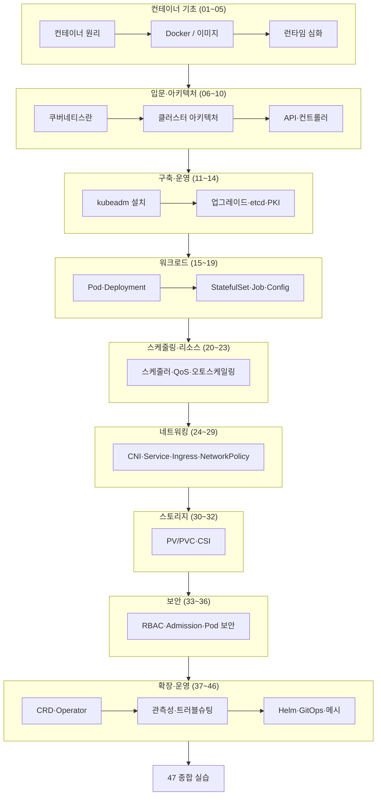

# 쿠버네티스 & 도커

<strong>쿠버네티스(Kubernetes)</strong>는 컨테이너화된 애플리케이션의 배포·확장·운영을 자동화하는 오픈소스 오케스트레이션 플랫폼이다. 이 스터디는 도커로 컨테이너의 원리를 다진 뒤, 쿠버네티스의 아키텍처·워크로드·네트워킹·스토리지·보안·확장·관측성까지 운영자와 개발자 양쪽 관점에서 빠짐없이 다룬다.

각 장은 [쿠버네티스 공식 문서](https://kubernetes.io/docs/home/)를 기준으로 개념을 설명하고, 실제 매니페스트와 명령어로 확인한다.

이 스터디에서 배우는 것:

- **컨테이너의 원리** — namespace·cgroup부터 OCI 런타임, containerd, CRI까지
- **클러스터 아키텍처** — control plane / node 컴포넌트, 선언적 API와 컨트롤러 패턴
- **워크로드** — Pod, Deployment, StatefulSet, Job 등 모든 워크로드 리소스
- **스케줄링·리소스** — affinity, taint, QoS, 오토스케일링
- **네트워킹** — CNI, Service, Ingress, Gateway API, NetworkPolicy
- **스토리지** — PV/PVC, CSI, 동적 프로비저닝
- **보안** — RBAC, Admission Control, Pod Security, 공급망/런타임 보안
- **확장과 운영** — CRD/Operator, 관측성, 트러블슈팅, Helm/GitOps, 서비스 메시

## 학습 로드맵

## 전체 목차

### 컨테이너 기초와 런타임 (01~05)

| 챕터 | 제목 | 한줄 설명 |
|------|------|-----------|
| 01 | [컨테이너란 무엇인가](/study/kubernetes/01-container-basics) | VM과의 차이, namespace·cgroup·UnionFS로 본 격리 원리 |
| 02 | [Docker 기초](/study/kubernetes/02-docker-basics) | 이미지·컨테이너·레지스트리 개념과 핵심 명령어 |
| 03 | [Dockerfile과 이미지 빌드](/study/kubernetes/03-dockerfile-image) | 레이어 캐시, 멀티스테이지 빌드, 이미지 최적화 |
| 04 | [컨테이너 네트워크와 볼륨](/study/kubernetes/04-container-network-volume) | bridge 네트워크, 볼륨, Docker Compose |
| 05 | [컨테이너 런타임 심화](/study/kubernetes/05-container-runtime) | OCI, runc, containerd, CRI, gVisor/Kata |

### 쿠버네티스 입문과 아키텍처 (06~10)

| 챕터 | 제목 | 한줄 설명 |
|------|------|-----------|
| 06 | [쿠버네티스란](/study/kubernetes/06-what-is-k8s) | 오케스트레이션의 필요성, 선언적 모델, 등장 배경 |
| 07 | [클러스터 아키텍처](/study/kubernetes/07-cluster-architecture) | control plane / node 컴포넌트와 상호작용 |
| 08 | [API와 오브젝트 모델](/study/kubernetes/08-api-objects) | API 그룹/버전, 오브젝트 spec/status, etcd |
| 09 | [kubectl과 선언형 관리](/study/kubernetes/09-kubectl-declarative) | apply, manifest, 선언형 vs 명령형 |
| 10 | [컨트롤러와 reconcile 루프](/study/kubernetes/10-controllers-reconcile) | 컨트롤 루프, desired/current state 조정 |

### 클러스터 구축과 운영 (11~14)

| 챕터 | 제목 | 한줄 설명 |
|------|------|-----------|
| 11 | [클러스터 설치 (kubeadm)](/study/kubernetes/11-kubeadm-install) | kubeadm으로 control plane·worker 구성 |
| 12 | [업그레이드와 유지보수](/study/kubernetes/12-upgrade-maintenance) | 버전 스큐, drain/cordon, 무중단 업그레이드 |
| 13 | [etcd 백업과 복구](/study/kubernetes/13-etcd-backup) | etcdctl 스냅샷, 복구 절차 |
| 14 | [인증서·PKI·kubeconfig](/study/kubernetes/14-pki-kubeconfig) | 클러스터 PKI, 인증서 갱신, kubeconfig 구조 |

### 워크로드 (15~19)

| 챕터 | 제목 | 한줄 설명 |
|------|------|-----------|
| 15 | [Pod](/study/kubernetes/15-pod) | 라이프사이클, multi-container, init, probe |
| 16 | [ReplicaSet과 Deployment](/study/kubernetes/16-deployment) | 롤링 업데이트, 롤백, 배포 전략 |
| 17 | [DaemonSet과 StatefulSet](/study/kubernetes/17-daemonset-statefulset) | 노드별 파드, 안정적 식별자·순서 보장 |
| 18 | [Job과 CronJob](/study/kubernetes/18-job-cronjob) | 배치 작업, 병렬성, 스케줄 실행 |
| 19 | [ConfigMap과 Secret](/study/kubernetes/19-configmap-secret) | 설정 분리, 시크릿 주입, 마운트 방식 |

### 스케줄링과 리소스 관리 (20~23)

| 챕터 | 제목 | 한줄 설명 |
|------|------|-----------|
| 20 | [스케줄러와 배치](/study/kubernetes/20-scheduler) | nodeSelector, affinity, taint/toleration |
| 21 | [고급 스케줄링](/study/kubernetes/21-advanced-scheduling) | priority/preemption, topology spread |
| 22 | [리소스 관리와 QoS](/study/kubernetes/22-resource-qos) | requests/limits, QoS, LimitRange, ResourceQuota |
| 23 | [오토스케일링](/study/kubernetes/23-autoscaling) | HPA, VPA, Cluster Autoscaler, KEDA |

### 네트워킹 (24~29)

| 챕터 | 제목 | 한줄 설명 |
|------|------|-----------|
| 24 | [네트워킹 모델과 CNI](/study/kubernetes/24-networking-cni) | 쿠버네티스 네트워크 모델, CNI 플러그인 |
| 25 | [Service](/study/kubernetes/25-service) | ClusterIP/NodePort/LoadBalancer/headless |
| 26 | [kube-proxy와 데이터플레인](/study/kubernetes/26-kube-proxy) | iptables/IPVS/eBPF, Cilium |
| 27 | [Ingress와 Gateway API](/study/kubernetes/27-ingress-gateway) | L7 라우팅, Ingress Controller, Gateway API |
| 28 | [DNS와 서비스 디스커버리](/study/kubernetes/28-dns-discovery) | CoreDNS, 서비스/파드 DNS 레코드 |
| 29 | [NetworkPolicy](/study/kubernetes/29-network-policy) | 파드 간 트래픽 제어, ingress/egress 규칙 |

### 스토리지 (30~32)

| 챕터 | 제목 | 한줄 설명 |
|------|------|-----------|
| 30 | [Volume과 PV/PVC](/study/kubernetes/30-volume-pv-pvc) | Volume 종류, PV/PVC 바인딩, StorageClass |
| 31 | [CSI와 동적 프로비저닝](/study/kubernetes/31-csi-snapshot) | CSI 드라이버, 동적 프로비저닝, 볼륨 스냅샷 |
| 32 | [StatefulSet 스토리지 패턴](/study/kubernetes/32-statefulset-storage) | volumeClaimTemplates, 데이터 영속성 |

### 보안 (33~36)

| 챕터 | 제목 | 한줄 설명 |
|------|------|-----------|
| 33 | [인증과 인가 (RBAC)](/study/kubernetes/33-authn-authz-rbac) | 인증 방식, RBAC, ServiceAccount |
| 34 | [Admission Control](/study/kubernetes/34-admission-control) | validating/mutating webhook, OPA/Kyverno |
| 35 | [Pod 보안과 seccomp](/study/kubernetes/35-pod-security) | Pod Security Standards, SecurityContext, seccomp/AppArmor |
| 36 | [공급망·런타임 보안](/study/kubernetes/36-supplychain-runtime-security) | 이미지 스캔, etcd 암호화, Falco |

### 확장 (37~39)

| 챕터 | 제목 | 한줄 설명 |
|------|------|-----------|
| 37 | [CRD와 커스텀 리소스](/study/kubernetes/37-crd) | CustomResourceDefinition, 스키마 검증 |
| 38 | [Operator 패턴](/study/kubernetes/38-operator) | controller-runtime, Operator SDK |
| 39 | [API Aggregation과 Webhook](/study/kubernetes/39-api-extension) | Aggregation Layer, 동적 admission webhook |

### 관측성과 운영 (40~42)

| 챕터 | 제목 | 한줄 설명 |
|------|------|-----------|
| 40 | [메트릭과 모니터링](/study/kubernetes/40-metrics-monitoring) | metrics-server, Prometheus, Grafana |
| 41 | [로깅과 트레이싱](/study/kubernetes/41-logging-tracing) | EFK/Loki, OpenTelemetry |
| 42 | [트러블슈팅](/study/kubernetes/42-troubleshooting) | 노드/파드/네트워크/컨트롤플레인 디버깅 |

### 배포와 생태계 (43~46)

| 챕터 | 제목 | 한줄 설명 |
|------|------|-----------|
| 43 | [Helm](/study/kubernetes/43-helm) | 차트 구조, 템플릿, 릴리스 관리 |
| 44 | [Kustomize와 GitOps](/study/kubernetes/44-kustomize-gitops) | Kustomize 오버레이, ArgoCD/Flux |
| 45 | [서비스 메시](/study/kubernetes/45-service-mesh) | Istio/Linkerd, 사이드카, mTLS |
| 46 | [멀티테넌시와 멀티클러스터](/study/kubernetes/46-multi-tenancy-cluster) | namespace 격리, 멀티클러스터 패턴 |

### 종합 실습 (47)

| 챕터 | 제목 | 한줄 설명 |
|------|------|-----------|
| 47 | [종합 실습](/study/kubernetes/47-practice) | 앱 빌드부터 배포·운영까지 전 과정 시나리오 |

### 부록

| | 제목 | 설명 |
|--|------|------|
| | [kubectl 치트시트](/study/kubernetes/appendix-kubectl-cheatsheet) | 자주 쓰는 kubectl 명령어 모음 |
| | [용어집](/study/kubernetes/appendix-glossary) | 쿠버네티스 핵심 용어 정리 |
| | [참고 자료](/study/kubernetes/appendix-references) | 공식 문서·표준·심화 학습 링크 |

## 대상

컨테이너와 쿠버네티스를 체계적으로 깊게 학습하려는 개발자·운영자를 위한 스터디다. 도커 기초부터 시작하므로 컨테이너를 처음 접해도 따라올 수 있으며, 클러스터 운영·보안·확장까지 다루므로 실무 운영자에게도 참조 자료가 된다.
