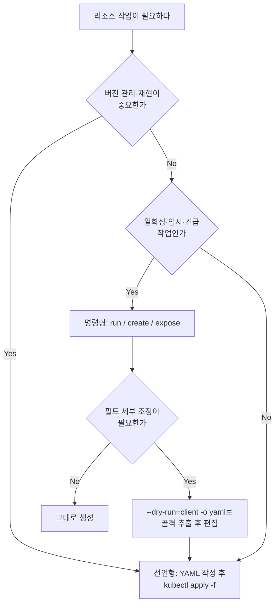
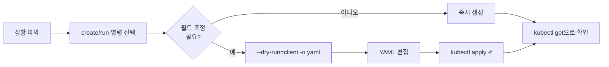

# imperative 명령 드릴

실무에서 장애 대응이나 임시 리소스 생성처럼 시간이 촉박한 상황에서는 선언형 YAML을 한 줄씩 손으로 쓰고 있을 여유가 없다. 이때 가장 빠른 방법은 `kubectl`의 imperative(명령형) 명령으로 리소스의 골격을 만들고, 필요하면 `--dry-run=client -o yaml`로 YAML을 뽑아 일부만 손으로 편집하는 것이다. 이 부록은 그 패턴을 반복 훈련해 속도를 끌어올리는 드릴이다.

공식 레퍼런스는 [kubectl 명령어 레퍼런스](https://kubernetes.io/docs/reference/kubectl/)와 [kubectl 전체 명령 목록](https://kubernetes.io/docs/reference/generated/kubectl/kubectl-commands)에 있다. 명령의 정확한 플래그가 헷갈리면 항상 이 두 문서를 1차 출처로 삼는다.

::: info 학습 목표
- 명령형과 선언형을 언제 각각 써야 하는지 판단 기준을 세운다.
- `kubectl run`/`create`/`expose`로 리소스 골격을 즉시 만드는 패턴을 익힌다.
- `--dry-run=client -o yaml`로 YAML을 뽑아 최소 편집만 하는 워크플로우를 몸에 익힌다.
- 상황 설명만 보고 가장 빠른 명령을 즉시 떠올리는 속도를 훈련한다.
:::

## 1. 명령형 vs 선언형

명령형은 "이 리소스를 지금 만들어라"라고 행위를 직접 지시한다. 선언형은 "최종 상태는 이래야 한다"라고 원하는 상태를 파일로 선언하고 `kubectl apply`로 맞춘다. 둘 중 무엇을 쓸지는 다음 기준으로 갈린다.



핵심 패턴은 명령형 명령에 `--dry-run=client -o yaml`을 붙여 클러스터에 적용하지 않고 YAML만 출력하는 것이다. 이걸 파일로 저장하면 손으로 처음부터 작성할 필요 없이 골격이 생긴다.

```bash
# 클러스터에 만들지 않고 YAML 골격만 파일로 추출한다
kubectl run nginx --image=nginx --dry-run=client -o yaml > pod.yaml

# 추출한 파일을 편집한 뒤 선언형으로 적용한다
kubectl apply -f pod.yaml
```

::: tip
`--dry-run=client`는 클라이언트 측에서만 검증하고 서버로 보내지 않는다. `--dry-run=server`는 실제로 서버에 보내 admission까지 거친 결과를 확인하되 영구 저장은 하지 않는다. YAML 골격을 뽑을 때는 `client`로 충분하다.
:::

::: warning
`kubectl run`은 Pod만 만든다. 예전 버전처럼 `--generator`로 Deployment를 만드는 기능은 제거됐다. Deployment가 필요하면 `kubectl create deployment`를 써야 한다.
:::

## 2. 리소스 빠른 생성

리소스 종류별로 명령형 생성 명령이 정해져 있다. 상황별로 정리한다.

| 상황 | 명령 |
|---|---|
| nginx 이미지로 Pod 하나 | `kubectl run nginx --image=nginx` |
| Deployment 생성 | `kubectl create deployment web --image=nginx` |
| replica 3개로 Deployment | `kubectl create deployment web --image=nginx --replicas=3` |
| 일회성 Job | `kubectl create job hello --image=busybox -- echo hi` |
| 기존 CronJob에서 Job 즉시 실행 | `kubectl create job --from=cronjob/backup run-now` |
| 주기 실행 CronJob | `kubectl create cronjob report --image=busybox --schedule="*/5 * * * *" -- date` |
| literal로 ConfigMap | `kubectl create configmap cfg --from-literal=key=val` |
| 파일에서 ConfigMap | `kubectl create configmap cfg --from-file=app.properties` |
| generic Secret | `kubectl create secret generic db --from-literal=password=1234` |
| TLS Secret | `kubectl create secret tls tls-secret --cert=tls.crt --key=tls.key` |
| ClusterIP Service(Deployment 노출) | `kubectl expose deployment web --port=80 --target-port=8080` |
| NodePort Service | `kubectl create service nodeport web --tcp=80:8080` |
| ServiceAccount | `kubectl create serviceaccount ci-bot` |
| Role | `kubectl create role reader --verb=get,list --resource=pods` |
| RoleBinding | `kubectl create rolebinding read-bind --role=reader --serviceaccount=default:ci-bot` |
| ClusterRole | `kubectl create clusterrole node-reader --verb=get,list --resource=nodes` |
| Namespace | `kubectl create namespace dev` |



::: tip
`kubectl run`으로 임시 디버깅 Pod를 띄울 때는 `--rm -it --restart=Never`를 조합한다. 종료 시 Pod가 자동 삭제되고(`--rm`), 셸에 붙으며(`-it`), 재시작 정책이 Never라 Job 취급되지 않는다.

```bash
kubectl run tmp --image=busybox --rm -it --restart=Never -- sh
```
:::

## 3. 빠른 수정·운영

이미 떠 있는 리소스를 고칠 때도 YAML을 다시 쓰는 대신 명령형으로 바로 건드린다.

| 작업 | 명령 |
|---|---|
| 이미지 교체(롤링 업데이트 유발) | `kubectl set image deployment/web nginx=nginx:1.27` |
| replica 수 조정 | `kubectl scale deployment/web --replicas=5` |
| 조건부 스케일 | `kubectl scale deployment/web --current-replicas=3 --replicas=5` |
| Deployment를 Service로 노출 | `kubectl expose deployment web --port=80 --target-port=8080` |
| 라벨 추가 | `kubectl label pod nginx tier=frontend` |
| 라벨 덮어쓰기 | `kubectl label pod nginx tier=backend --overwrite` |
| 라벨 제거 | `kubectl label pod nginx tier-` |
| 어노테이션 추가 | `kubectl annotate pod nginx description="temp pod"` |
| 롤아웃 상태 확인 | `kubectl rollout status deployment/web` |
| 롤아웃 히스토리 | `kubectl rollout history deployment/web` |
| 직전 버전으로 롤백 | `kubectl rollout undo deployment/web` |
| 특정 리비전으로 롤백 | `kubectl rollout undo deployment/web --to-revision=2` |
| 롤아웃 재시작(Pod 재생성) | `kubectl rollout restart deployment/web` |
| 에디터로 직접 수정 | `kubectl edit deployment/web` |
| 특정 필드만 패치 | `kubectl patch deployment web -p '{"spec":{"replicas":4}}'` |

::: warning
`kubectl edit`나 `kubectl patch`로 라이브 리소스를 직접 고치면 원본 YAML 파일과 클러스터 상태가 어긋난다(구성 드리프트). 긴급 상황에는 빠르지만, 평상시 운영은 YAML을 고치고 `kubectl apply`하는 선언형으로 되돌리는 것이 안전하다.
:::

## 4. 시간 절약 세팅

명령 자체를 빠르게 만들어 주는 환경 세팅과 조회 옵션을 모아둔다. 드릴 전에 깔아두면 모든 입력이 짧아진다.

```bash
# 별칭 — kubectl을 k로 줄이고 자동완성까지 연결
alias k=kubectl
source <(kubectl completion bash)        # zsh면 completion zsh
complete -o default -F __start_kubectl k

# 기본 네임스페이스 고정 — -n 반복 입력 제거
kubectl config set-context --current --namespace=dev
```

조회·확인을 빠르게 하는 옵션은 다음과 같다.

| 작업 | 명령 |
|---|---|
| 필드 구조·설명 확인 | `kubectl explain pod.spec.containers` |
| 모든 필드를 재귀로 펼쳐 보기 | `kubectl explain pod.spec --recursive` |
| 노드·IP까지 넓게 출력 | `kubectl get pods -o wide` |
| 상태로 필터(서버 측) | `kubectl get pods --field-selector=status.phase=Running` |
| 특정 노드의 Pod만 | `kubectl get pods --field-selector=spec.nodeName=node1 -A` |
| Pod IP만 뽑기 | `kubectl get pod nginx -o jsonpath='{.status.podIP}'` |
| 모든 Pod 이름만 한 줄로 | `kubectl get pods -o jsonpath='{.items[*].metadata.name}'` |
| 컨테이너 이미지만 추출 | `kubectl get pods -o jsonpath='{.items[*].spec.containers[*].image}'` |
| 라벨로 필터 | `kubectl get pods -l app=web` |

::: tip
`kubectl explain`은 필드 이름이나 중첩 구조가 헷갈릴 때 문서를 열지 않고 터미널에서 즉시 확인하는 가장 빠른 방법이다. `--recursive`를 붙이면 하위 필드를 전부 펼쳐 한눈에 본다.
:::

## 5. 드릴 문제 모음

상황 설명만 읽고 가장 빠른 명령을 머릿속으로 먼저 떠올린 다음, 정답을 펼쳐 비교한다. 명령을 손으로 다시 쳐 보면서 플래그를 몸에 익히는 것이 목적이다.

<strong>문제 1.</strong> nginx 이미지로 Pod를 만들되, 클러스터에 적용하지 말고 YAML만 출력하라.

::: details 정답
```bash
kubectl run nginx --image=nginx --dry-run=client -o yaml
```
`--dry-run=client`로 서버에 보내지 않고, `-o yaml`로 골격만 출력한다. 뒤에 `> pod.yaml`을 붙이면 파일로 저장해 편집할 수 있다.
:::

<strong>문제 2.</strong> `web`이라는 Deployment를 nginx 이미지·replica 3개로 만들고, 80번 포트로 노출하라.

::: details 정답
```bash
kubectl create deployment web --image=nginx --replicas=3
kubectl expose deployment web --port=80 --target-port=80
```
`create deployment`로 워크로드를, `expose`로 ClusterIP Service를 만든다. 컨테이너 포트가 80이면 `--target-port`도 80이다.
:::

<strong>문제 3.</strong> `key1=val1`, `key2=val2` 두 항목을 가진 ConfigMap을 literal로 생성하라.

::: details 정답
```bash
kubectl create configmap app-config --from-literal=key1=val1 --from-literal=key2=val2
```
`--from-literal`은 항목마다 반복해서 붙인다. 파일 통째로 넣을 때는 `--from-file`을 쓴다.
:::

<strong>문제 4.</strong> 비밀번호 `s3cr3t`를 담은 generic Secret을 만들어라.

::: details 정답
```bash
kubectl create secret generic db-secret --from-literal=password=s3cr3t
```
generic 타입은 임의 key-value를 담는다. TLS 인증서는 `kubectl create secret tls`, 레지스트리 인증은 `kubectl create secret docker-registry`를 쓴다.
:::

<strong>문제 5.</strong> 디버깅용으로 busybox 셸을 임시로 띄우고, 종료하면 Pod가 자동 삭제되게 하라.

::: details 정답
```bash
kubectl run tmp --image=busybox --rm -it --restart=Never -- sh
```
`--rm`으로 종료 시 자동 삭제, `-it`로 셸 연결, `--restart=Never`로 Pod 단발 실행이 된다. 클러스터 내부에서 DNS·연결 테스트할 때 자주 쓴다.
:::

<strong>문제 6.</strong> `web` Deployment의 nginx 컨테이너 이미지를 `nginx:1.27`로 교체하고, 롤아웃이 끝날 때까지 지켜봐라.

::: details 정답
```bash
kubectl set image deployment/web nginx=nginx:1.27
kubectl rollout status deployment/web
```
`set image`는 `<컨테이너이름>=<새이미지>` 형식이다. 컨테이너 이름이 틀리면 아무 일도 일어나지 않으니 `kubectl get deploy web -o jsonpath='{.spec.template.spec.containers[*].name}'`로 확인한다.
:::

<strong>문제 7.</strong> 방금 한 이미지 교체가 잘못됐다. 직전 버전으로 즉시 롤백하라.

::: details 정답
```bash
kubectl rollout undo deployment/web
```
바로 이전 리비전으로 되돌린다. 특정 리비전을 지정하려면 `--to-revision=<번호>`를 붙인다. 리비전 번호는 `kubectl rollout history deployment/web`로 본다.
:::

<strong>문제 8.</strong> `node1` 노드를 새 Pod 스케줄 대상에서 제외하고, 그 위의 Pod를 안전하게 비워라(노드 점검 준비).

::: details 정답
```bash
kubectl cordon node1
kubectl drain node1 --ignore-daemonsets --delete-emptydir-data
```
`cordon`으로 신규 스케줄을 막고, `drain`으로 기존 Pod를 다른 노드로 옮긴다. DaemonSet Pod는 옮길 수 없으므로 `--ignore-daemonsets`가 필요하고, emptyDir 데이터가 있으면 `--delete-emptydir-data`로 명시 동의한다. 점검이 끝나면 `kubectl uncordon node1`로 되돌린다.
:::

<strong>문제 9.</strong> `nginx` Pod에 설정된 환경변수를 명령 하나로 빠르게 확인하라.

::: details 정답
```bash
kubectl exec nginx -- env
```
컨테이너 안에서 `env`를 실행해 실제 주입된 환경변수를 본다. spec에 정의된 값만 보려면 `kubectl get pod nginx -o jsonpath='{.spec.containers[*].env}'`를 쓴다.
:::

<strong>문제 10.</strong> 전체 네임스페이스에서 `Running` 상태가 아닌 Pod만 빠르게 추려라.

::: details 정답
```bash
kubectl get pods -A --field-selector=status.phase!=Running
```
`--field-selector`는 서버 측에서 필터링하므로 출력 후 `grep`하는 것보다 빠르고 정확하다. `!=`로 부정 조건을 건다.
:::

<strong>문제 11.</strong> `web` Deployment를 nginx로 만들되, replica를 5로 두고 메모리 limit을 추가해야 한다. 골격을 명령형으로 뽑은 뒤 편집해서 적용하는 흐름으로 처리하라.

::: details 정답
```bash
kubectl create deployment web --image=nginx --replicas=5 \
  --dry-run=client -o yaml > web.yaml
# web.yaml의 containers 아래에 resources.limits.memory를 추가한 뒤
kubectl apply -f web.yaml
```
replica처럼 명령형으로 되는 필드는 플래그로 넣고, `resources`처럼 플래그가 없는 필드는 YAML을 뽑아 편집한다. 명령형과 선언형을 섞어 쓰는 전형적인 패턴이다.
:::

<strong>문제 12.</strong> `default` 네임스페이스의 ServiceAccount `ci-bot`에게 Pod를 조회(get·list)할 수 있는 권한만 부여하라.

::: details 정답
```bash
kubectl create serviceaccount ci-bot
kubectl create role pod-reader --verb=get,list --resource=pods
kubectl create rolebinding ci-bot-read \
  --role=pod-reader --serviceaccount=default:ci-bot
```
ServiceAccount, Role, RoleBinding 세 개를 모두 명령형으로 만들 수 있다. `--serviceaccount`는 `<네임스페이스>:<이름>` 형식이고, Role/RoleBinding은 네임스페이스 범위이므로 최소 권한 원칙에 맞는다.
:::

::: tip 핵심 정리
- 긴급·일회성 작업은 명령형, 버전 관리·재현이 필요한 작업은 선언형으로 가른다.
- `--dry-run=client -o yaml > file.yaml`은 손으로 YAML을 쓰는 시간을 없애는 핵심 패턴이다. 플래그로 안 되는 필드만 편집한다.
- Pod는 `run`, 그 밖의 워크로드·리소스는 `create`, 노출은 `expose`로 만든다.
- 수정·운영은 `set image`·`scale`·`rollout`·`label`로 라이브 리소스를 바로 건드리되, 평상시엔 선언형으로 되돌려 드리프트를 줄인다.
- alias·completion·`explain`·`--field-selector`·`-o jsonpath`를 깔아두면 모든 명령이 짧아진다.
:::
