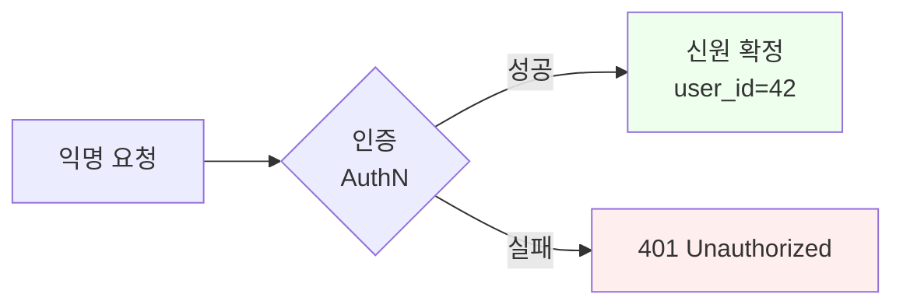
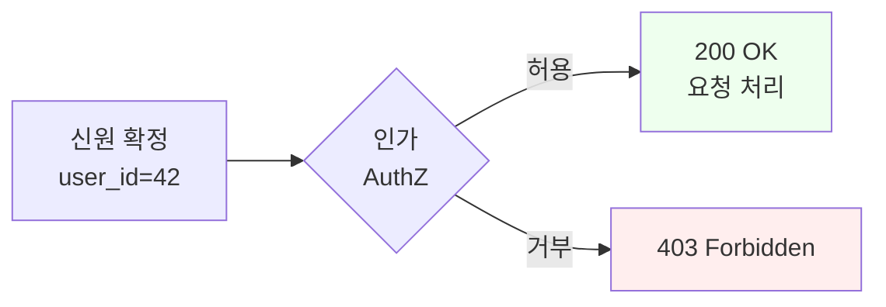
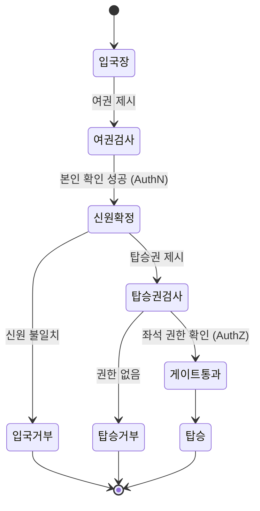
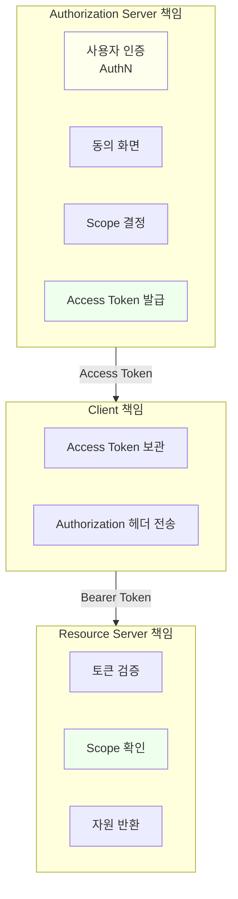
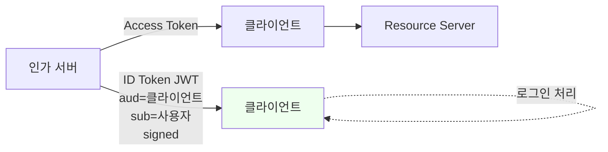
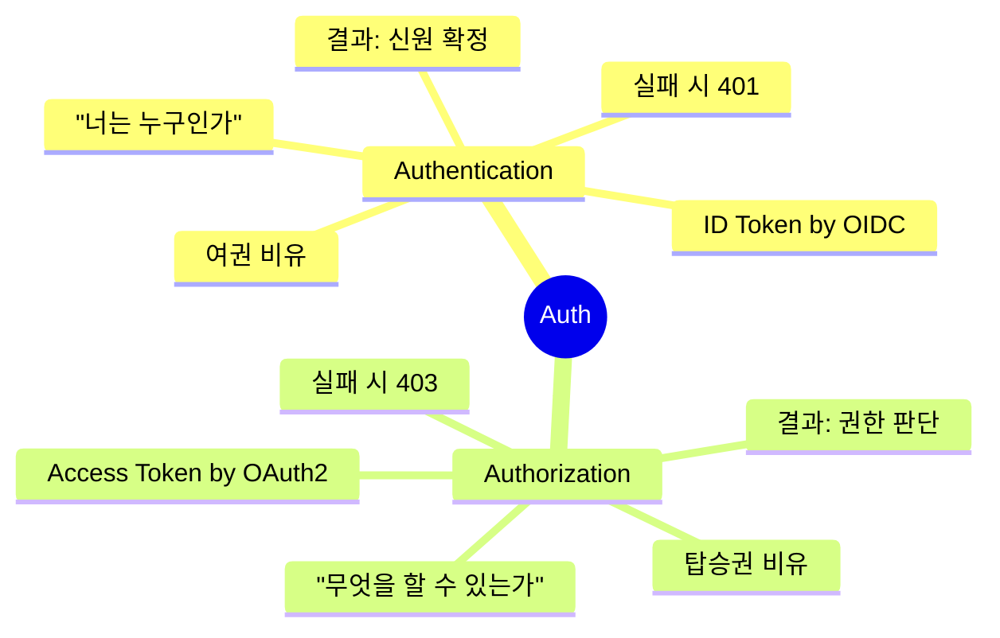

# 인증과 인가는 어떻게 다른가

::: info 학습 목표
- Authentication(인증)과 Authorization(인가)을 정확한 정의로 구분할 수 있다.
- 공항 체크인과 같은 일상 비유로 두 개념을 설명할 수 있다.
- OAuth 2.0이 "인가 프레임워크"라고 불리는 이유를 RFC 제목에서 확인한다.
- "OAuth로 로그인"이라는 표현이 왜 기술적으로 부정확한지, OIDC가 필요한 이유 예고를 이해한다.
:::

---

## 1. 인증(Authentication)

인증은 "당신이 주장하는 그 사람이 맞는지" 확인하는 과정이다. 영어 표기가 길어 실무에서는 흔히 <strong>AuthN</strong>이라고 줄여 쓴다. 주체의 <strong>정체성(identity)</strong>을 검증하는 단계다.

### 정의

> Authentication (AuthN) — 주체가 주장하는 신원이 진짜 그 신원인지 검증하는 과정.

인증이 답해야 할 질문은 하나다. <strong>"너는 누구인가?(Who are you?)"</strong>

### 인증의 세 가지 요소(Factor)

전통적으로 인증은 다음 세 가지 요소 중 하나 이상을 조합해 이루어진다.

| 요소 | 의미 | 예시 |
|----|-----|------|
| 지식(Something you know) | 알고 있는 것 | 비밀번호, PIN, 보안 질문 |
| 소유(Something you have) | 가지고 있는 것 | 휴대폰, 하드웨어 키, OTP 토큰 |
| 생체(Something you are) | 본인의 특성 | 지문, 얼굴, 홍채 |

두 가지 이상을 조합하면 <strong>MFA(Multi-Factor Authentication)</strong>가 된다. 이 조합이 중요한 이유는 각 요소의 위협이 다르기 때문이다. 비밀번호는 피싱에 약하지만 하드웨어 키는 강하고, 지문은 복제 난이도는 높지만 탈취되면 바꿀 수 없다는 식이다.

### 인증의 결과물

인증에 성공하면 시스템은 "이 요청의 주체는 <strong>user_id=42</strong>이며 이름은 <strong>홍길동</strong>이다"라는 <strong>신원 정보</strong>를 확정한다. 이 정보가 없으면 그다음 단계(인가)로 넘어갈 수 없다.



---

## 2. 인가(Authorization)

인가는 "확인된 그 사람이 지금 요청한 일을 할 권한이 있는지" 결정하는 과정이다. <strong>AuthZ</strong>로 줄여 쓴다. 주체의 <strong>권한(permission)</strong>을 확인하는 단계다.

### 정의

> Authorization (AuthZ) — 인증된 주체가 특정 자원에 대해 특정 동작을 수행할 권한이 있는지 판단하는 과정.

인가가 답해야 할 질문도 하나다. <strong>"너는 무엇을 할 수 있는가?(What can you do?)"</strong>

### 인가의 표현 방식

실무에서 인가는 여러 모델로 표현된다.

| 모델 | 설명 | 예시 |
|----|-----|------|
| RBAC (역할 기반) | 사용자 → 역할 → 권한 매핑 | admin, editor, viewer |
| ABAC (속성 기반) | 사용자/자원/환경 속성의 조합 | "같은 부서이며 근무 시간 내" |
| Scope 기반 | 위임받은 권한의 범위를 문자열로 표현 | `drive.readonly`, `mail.send` |
| ACL (접근 제어 목록) | 자원마다 허용 주체 목록 | 파일별 읽기/쓰기 권한 |

OAuth는 이 중 <strong>Scope 기반</strong>을 핵심 메커니즘으로 채택했다. 이유는 CH4에서 자세히 다룬다.

### 인가의 결과물

인가가 성공하면 요청이 처리되고, 실패하면 `403 Forbidden`이 반환된다. 중요한 점은 <strong>401과 403의 의미가 다르다</strong>는 것이다.

- `401 Unauthorized` — 인증 실패 (너 누군지 모르겠다)
- `403 Forbidden` — 인증은 됐지만 인가 실패 (누군지 알겠는데 이건 못한다)

HTTP 표준이 이 두 코드를 구분해 둔 자체가 "인증과 인가는 다른 개념"이라는 설계 의도를 드러낸다.



---

## 3. 비유 — 공항의 신분증과 탑승권

가장 자주 쓰이는 비유가 공항 출국장이다. 이 비유가 좋은 이유는 <strong>인증과 인가가 물리적으로 다른 서류로 분리되어 있기</strong> 때문이다.

### 신분증 = 인증

출국장에서 제일 먼저 보여주는 것은 여권이다. 여권은 "이 사람은 홍길동이다"라는 신원을 증명한다. 여권만 있다고 비행기에 탈 수 있는 것은 아니다. 여권은 <strong>어느 나라로 가는지</strong>, <strong>어느 항공사를 타는지</strong>에 대해 아무 말도 하지 않는다.

### 탑승권 = 인가

탑승권은 "홍길동은 오늘 14시 KE123편, 23A 좌석에 탑승할 권리가 있다"는 <strong>권한</strong>을 증명한다. 탑승권만 있고 여권이 없으면? 그게 진짜 본인 것인지 검증할 방법이 없으므로 역시 탑승할 수 없다.

### 둘이 합쳐져야 탑승 가능



### 비유와 기술의 대응

| 공항 | 웹 | OAuth |
|------|-----|------|
| 여권 | 로그인 세션/ID Token | OIDC의 ID Token |
| 탑승권 | 권한 토큰 | OAuth의 Access Token |
| 여권 심사관 | 인증 서버 | 인증 서버(IdP) |
| 탑승구 직원 | 자원 서버 | Resource Server |
| 좌석 정보 | 권한 정보 | Scope |

OAuth 2.0의 Access Token은 본질적으로 <strong>탑승권</strong>이다. 그 안에는 "이 토큰을 들고 있는 누군가가 특정 자원에 접근할 권리"만 명시되어 있고, "들고 있는 사람이 누구인지"는 확실히 말해주지 않는다.

---

## 4. OAuth 2.0은 '인가 프레임워크'다

여기서 OAuth에 대한 가장 중요한 오해가 시작된다. "OAuth로 로그인한다"는 표현이 너무 흔해서, 많은 개발자가 OAuth를 인증 수단으로 생각한다. 그러나 <strong>OAuth는 그 자체로는 인증을 하지 않는다</strong>.

### RFC 6749의 제목이 말해주는 것

OAuth 2.0의 공식 표준 문서인 RFC 6749의 제목은 다음과 같다.

> <strong>The OAuth 2.0 Authorization Framework</strong>

"Authentication"이라는 단어는 제목에 없다. 문서 내용 전체가 <strong>"사용자의 자원에 대한 접근 권한을 어떻게 클라이언트에게 위임할 것인가"</strong>를 다룬다. 인증은 이 프레임워크의 <strong>전제 조건</strong>일 뿐, 결과물이 아니다.

### OAuth의 책임 경계



- AS는 사용자를 인증하고, 어떤 권한을 줄지 결정하고, 토큰을 발급한다.
- 클라이언트는 토큰을 받아 보관하고, 요청 시 첨부한다.
- RS는 토큰을 검증하고, Scope를 확인하고, 자원을 반환한다.

<strong>어디에도 "RS가 사용자를 인증한다"는 단계가 없다</strong>. RS 입장에서 사용자가 누군지는 관심 밖이다. "이 토큰이 이 자원을 요청할 권한이 있는가"만 본다.

### OAuth만으로는 얻을 수 없는 것

OAuth 2.0의 Access Token은 다음을 <strong>보장하지 않는다</strong>.

- 토큰을 제시한 클라이언트가 현재 사용자와 같은 사람인지 (리플레이 가능)
- 토큰의 주인이 누구인지 (페이로드를 안 봐도 됨, opaque여도 동작)
- 토큰이 언제 발급됐는지, 누구에게 발급됐는지 (표준 필드가 없음)

이 때문에 <strong>OAuth 위에서 인증을 하려면 추가 규격이 필요</strong>했고, 그것이 OpenID Connect(OIDC)다. CH9에서 자세히 다룬다.

---

## 5. 인증 오남용의 함정

"OAuth로 로그인"을 기술적으로 정확히 구현하지 않으면, 실제 보안 사고로 이어진다. 대표적인 안티패턴을 살펴본다.

### 안티패턴 — Access Token으로 사용자 식별

많은 초심자 코드가 이런 식으로 짠다.

```java
// 안티패턴 - 절대 하지 말 것
@GetMapping("/login/callback")
public String callback(@RequestParam String code) {
    String accessToken = exchangeCodeForToken(code);
    Map<String, Object> userInfo = callUserInfoApi(accessToken);
    String userId = (String) userInfo.get("id");

    // 이 userId로 세션 생성
    session.setAttribute("userId", userId);
    return "redirect:/home";
}
```

이 코드는 "Access Token으로 `/userinfo` 호출 → 거기서 받은 `id`로 로그인 처리"를 한다. 겉보기에는 동작하지만 치명적 결함이 있다.

### 왜 위험한가

Access Token은 <strong>탑승권</strong>이지 <strong>여권</strong>이 아니다. 다음과 같은 문제가 있다.

1. <strong>토큰의 의도된 수신자가 불명확</strong> — 어떤 Access Token은 A 클라이언트용으로 발급됐는데, 이걸 B 클라이언트가 주워서 "내 토큰으로 userinfo 호출"해도 똑같이 성공한다. <strong>Confused Deputy</strong> 공격의 고전적 예시다.
2. <strong>서명 검증 부재</strong> — Access Token은 일반적으로 불투명(opaque)이다. 페이로드 검증이 필요한데, JWT가 아니면 할 수도 없다.
3. <strong>유효 기간의 의미 혼동</strong> — Access Token의 `exp`는 "API를 호출할 수 있는 기간"이지 "이 사용자 로그인 세션의 유효 기간"이 아니다.
4. <strong>재생(Replay) 공격</strong> — 누군가가 토큰을 가로채면 그 사람이 "사용자로 로그인"할 수 있다. 토큰 하나로 인증과 인가가 둘 다 뚫린다.

### 실제 발생한 사고 — Facebook 2012

2012년 Facebook의 iOS SDK에서 이 패턴으로 인한 취약점이 보고됐다. 공격자가 악성 앱으로 발급받은 Access Token을, 다른 정상 앱의 `/me` 엔드포인트에 제시해 <strong>다른 사용자로 로그인</strong>하는 것이 가능했다. Facebook은 이후 "Login" 전용 플로우를 분리하고, OIDC와 유사한 signed request를 도입했다.

### OIDC가 필요한 이유

OIDC는 이 문제를 <strong>ID Token</strong>이라는 별도 토큰으로 해결한다.



ID Token은 JWT 형태로 반드시 서명되어 있고, <strong>누구(sub)에게</strong> <strong>어느 클라이언트(aud)를 위해</strong> <strong>언제(iat, exp)</strong> 발급됐는지가 표준 필드로 명시된다. 이 표준 덕분에 "OAuth로 로그인"을 안전하게 구현할 수 있다.

### 개념 구분 총정리



OAuth와 OIDC를 정확히 구분해 쓰면 두 가지 효과가 있다.

- <strong>보안</strong>: Confused Deputy·토큰 재생 공격을 원천적으로 막는다.
- <strong>설계 명료성</strong>: 서비스 간 책임 경계가 분명해진다. "AS는 인증과 인가 모두, RS는 인가만"이라는 역할 분담이 선명해진다.

---

::: tip 핵심 정리
- 인증(AuthN)은 "너는 누구인가", 인가(AuthZ)는 "너는 무엇을 할 수 있는가"를 묻는다. HTTP 401과 403이 이 차이를 반영한다.
- 공항 비유에서 여권은 인증, 탑승권은 인가에 대응한다. OAuth Access Token은 탑승권이지 여권이 아니다.
- OAuth 2.0(RFC 6749)의 공식 제목은 "Authorization Framework"이며 인증 절차를 정의하지 않는다. AS가 사용자를 인증하는 것은 전제일 뿐 OAuth의 책임이 아니다.
- Access Token으로 사용자 식별을 하는 패턴(Confused Deputy)은 실제 사고로 이어졌다. 안전한 로그인을 위해 OpenID Connect의 ID Token이 필요하다 — CH9에서 이어진다.
:::

## 다음 챕터

- 이전 : [세션·쿠키 vs 토큰](/study/oauth/02-session-vs-token)
- 다음 : [OAuth는 무엇을 해결했는가](/study/oauth/04-what-oauth-solves)
