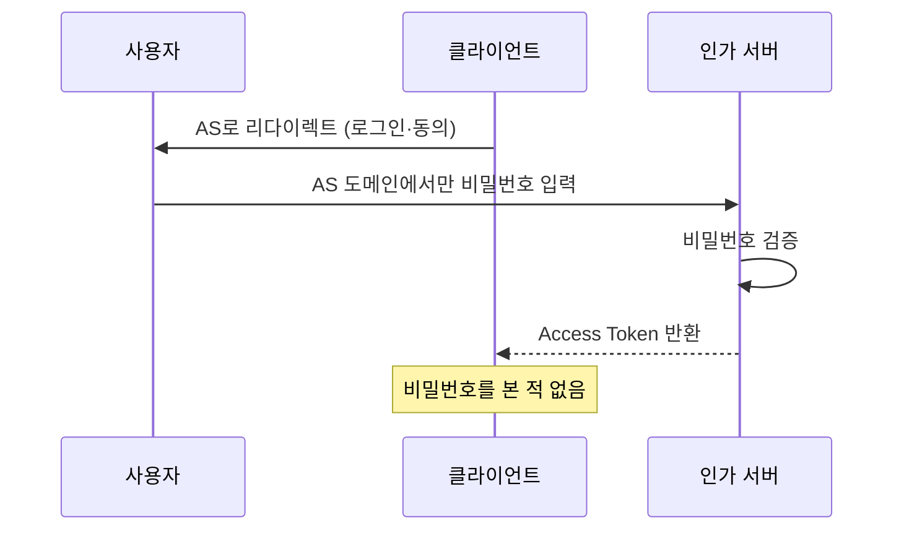
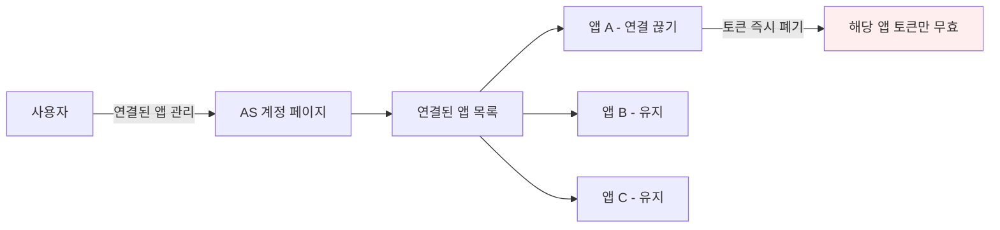
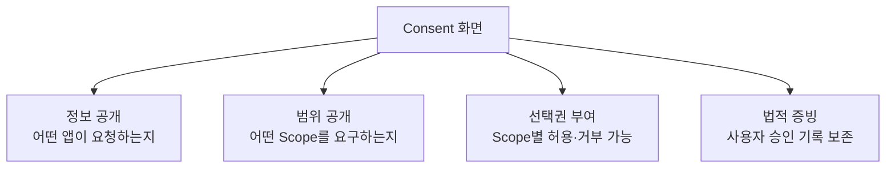
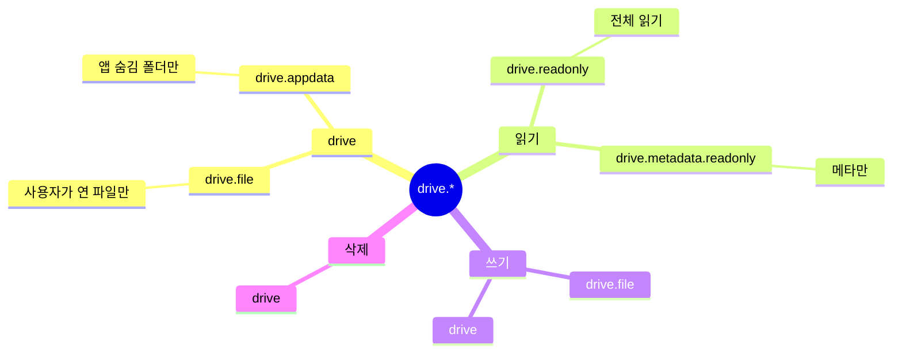
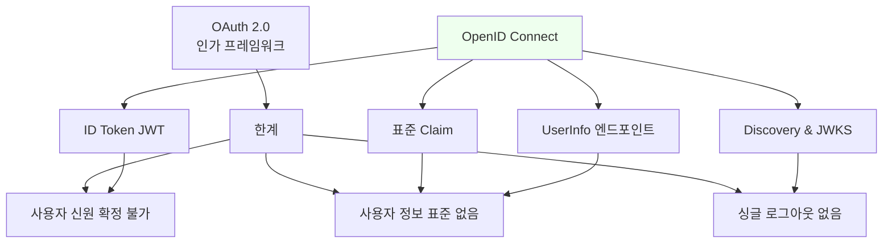
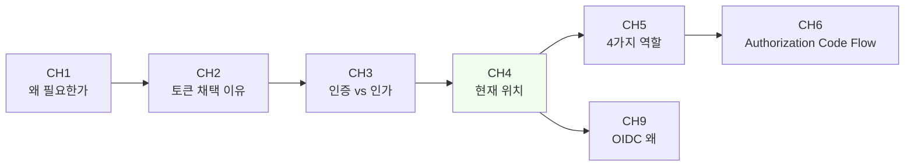

# OAuth는 무엇을 해결했는가

::: info 학습 목표
- 권한 위임(delegation)의 개념과 기존 공유 모델과의 차이를 설명할 수 있다.
- OAuth가 해결한 4가지 핵심 문제를 구체적인 시나리오로 열거할 수 있다.
- Scope의 존재 이유와 세분화된 권한 부여가 왜 중요한지 이해한다.
- 사용자 동의(Consent) 화면의 역할과 OAuth의 한계(인증 아님)를 안다.
:::

---

## 1. "대신 접근한다"는 아이디어

OAuth의 핵심 아이디어는 놀랍도록 단순하다. <strong>"비밀번호 대신, 제한된 권한만 담긴 증표(token)를 건넨다"</strong>는 것이다. 이 문장 하나로 CH1에서 본 4대 문제가 거의 다 풀린다.

### 전통적 방식과의 대비

```mermaid
flowchart LR
    subgraph 과거[기존 - 비밀번호 공유]
        U1[사용자] -->|Gmail ID+PW| APP1[제3자 앱]
        APP1 -->|ID+PW로 로그인| G1[Gmail]
        G1 -.모든 권한 전권.-> APP1
    end
    subgraph 현재[OAuth - 권한 위임]
        U2[사용자] -->|AS에서 동의| AS[Authorization Server]
        AS -->|Scope 제한 토큰| APP2[제3자 앱]
        APP2 -->|Bearer Token| G2[Gmail API]
        G2 -.contacts.readonly 만.-> APP2
    end
    style APP1 fill:#fee
    style APP2 fill:#efe
```

핵심 전환은 두 가지다.

- 사용자가 <strong>제3자 앱이 아니라 인가 서버(AS)</strong>에 직접 인증한다. 제3자 앱은 사용자의 비밀번호를 볼 수 없다.
- 제3자 앱이 받는 토큰은 <strong>허용된 범위만</strong> 담고 있다. 토큰으로는 "주소록 읽기"는 가능하지만 "메일 발송"은 불가능할 수 있다.

### 위임(Delegation)이라는 관계

일상 언어로 "위임"은 "A가 자신의 권한 일부를 B에게 맡긴다"는 뜻이다. OAuth의 위임도 같다.

| 요소 | 일상 위임 | OAuth 위임 |
|----|---------|-----------|
| 위임자 | 본인 | Resource Owner (사용자) |
| 수임자 | 대리인 | Client (제3자 앱) |
| 권한 범위 | 위임장 명시 | Scope |
| 증거 | 위임장 | Access Token |
| 승인자 | 본인 서명 | Consent 화면 승인 |
| 취소 | 위임장 파기 | Revocation 엔드포인트 |

OAuth는 위임 관계를 <strong>프로토콜 수준에서 명시적으로 표현</strong>한다. 이 명시성이 다음 단계에서 네 가지 문제를 푸는 토대가 된다.

---

## 2. 해결한 4가지

CH1에서 나열한 비밀번호 공유의 4대 문제(유출·전권·취소 불가·감사 불가)를 OAuth가 각각 어떻게 풀었는지 본다.

### 문제 1 — 비밀번호 유출 방지

OAuth에서 클라이언트는 사용자 비밀번호를 <strong>본 적도 없고 저장하지도 않는다</strong>. 사용자는 오직 AS(인가 서버) 도메인에서만 비밀번호를 입력한다. 클라이언트는 결과물인 토큰만 받는다.



클라이언트가 털려도 <strong>토큰만 노출</strong>된다. 토큰은 스코프가 제한되어 있고, 만료되며, 폐기 가능하다. 비밀번호 유출에 비해 피해 반경이 훨씬 작다.

### 문제 2 — 최소 권한(Scope)

Scope는 "이 토큰으로 무엇을 할 수 있는가"를 문자열로 표현한 것이다. AS가 토큰을 발급할 때 어떤 Scope를 포함시킬지 결정한다.

```http
POST /authorize?
    response_type=code
    &client_id=abc123
    &scope=contacts.readonly%20calendar.events.readonly
    &redirect_uri=https://app.example.com/cb
```

이 요청은 "주소록 읽기"와 "캘린더 이벤트 읽기" 두 권한만 요구한다. 사용자가 동의 화면에서 승인하면, 발급되는 토큰은 오직 이 두 범위 안에서만 동작한다. 메일 발송, 파일 업로드 같은 다른 API 호출은 `403 Forbidden`으로 거부된다.

Scope의 실무적 이점은 다음과 같다.

- <strong>최소 권한 원칙(Principle of Least Privilege)</strong>: 앱이 필요 이상 권한을 갖지 않는다.
- <strong>사용자 신뢰</strong>: 동의 화면에 "주소록 읽기만 허용"이라고 명시되면 사용자가 안심한다.
- <strong>피해 억제</strong>: 토큰이 탈취돼도 허용 범위 이상은 할 수 없다.

### 문제 3 — 사용자가 취소 가능

OAuth는 토큰 단위의 취소(Revocation)를 <strong>프로토콜로 정의</strong>한다. RFC 7009가 표준화한 `/revoke` 엔드포인트다.

```http
POST /oauth/revoke HTTP/1.1
Host: auth.example.com
Authorization: Basic <client credentials>
Content-Type: application/x-www-form-urlencoded

token=eyJhbGc...&token_type_hint=refresh_token
```

또한 사용자는 AS의 계정 관리 페이지에서 "연결된 앱" 목록을 보고 원하는 앱의 권한을 한 번에 취소할 수 있다.



중요한 것은 <strong>비밀번호를 바꾸지 않아도 된다</strong>는 점이다. 앱 A만 연결을 끊으면 앱 B, C는 정상 동작을 유지한다. 이 입도(granularity)는 비밀번호 공유 시대에는 불가능했다.

### 문제 4 — 감사(Audit) 가능

OAuth에서 모든 API 호출은 <strong>어떤 토큰으로</strong> 들어왔는지 식별된다. 토큰에는 다음 정보가 결합되어 있다.

- 사용자(Resource Owner)
- 클라이언트(Client ID)
- Scope
- 발급 시각·만료 시각
- 세션/디바이스 정보 (확장)

자원 서버의 로그를 분석하면 "사용자 42가 2026-04-17 10:23:45에 <strong>앱 Notion</strong>에게 `drive.readonly` 권한을 위임했고, 그 토큰으로 `/drive/files/xxx`를 조회했다"처럼 책임 소재가 명확하게 추적된다.

비정상 패턴 탐지도 가능하다. 같은 토큰이 갑자기 해외에서 사용된다거나, 평소와 다른 Scope를 호출한다거나 하는 이상 행동을 토큰 단위로 감지할 수 있다.

---

## 3. 사용자 동의(Consent) 화면의 역할

"앱이 당신의 구글 캘린더에 접근해도 될까요?" 우리가 익숙한 이 화면이 Consent(동의) 화면이다. OAuth의 설계에서 Consent는 <strong>법적·윤리적 장치</strong>의 역할도 겸한다.

### Consent 화면의 네 가지 기능



1. <strong>정보 공개</strong>: 어떤 클라이언트가 요청하는지 이름·로고·도메인을 표시한다. 피싱 앱을 식별할 단서가 된다.
2. <strong>범위 공개</strong>: 요청된 Scope를 사람이 읽을 수 있는 형태로 나열한다. ("이 앱은 주소록을 읽을 수 있어요")
3. <strong>선택권 부여</strong>: Google·Facebook 등 주요 IdP는 Scope별로 개별 허용/거부가 가능하다.
4. <strong>법적 증빙</strong>: 사용자 승인이 기록된다. GDPR·개인정보보호법상 "정보주체의 동의"의 근거가 된다.

### Consent 화면 예시

```
[Google 계정 로고]
홍길동님, Notion에서 Google 계정에 접근하려고 합니다.

Notion이 다음 작업을 수행할 수 있도록 허용하시겠습니까?

  [v] 내 기본 계정 정보 보기
  [v] 내 Google Drive 파일 조회 (읽기 전용)
  [ ] Google Drive 파일 수정

  [거부]          [허용]

이 권한은 언제든지 https://myaccount.google.com 에서 취소할 수 있습니다.
```

### Consent Fatigue 문제

실무에서 Consent 화면이 너무 자주 뜨면 사용자가 <strong>무조건 "허용"을 누르는 습관</strong>이 생긴다. 이를 Consent Fatigue라고 한다. 주요 IdP는 이 문제를 다음처럼 완화한다.

- 같은 앱·같은 Scope는 한 번 승인 후 일정 기간 재표시 안 함
- Scope를 최소 단위로 세분화 유도
- 새로운 Scope 추가 시에만 재확인 요구
- "필수" vs "선택" Scope 구분

---

## 4. Scope가 없었다면

Scope는 OAuth의 핵심 발명품 중 하나다. 없다면 어떤 일이 벌어지는지 구체적인 Google Drive 예시로 본다.

### Google Drive Scope 예시

Google Drive API는 다음과 같이 세분화된 Scope를 제공한다.

| Scope | 의미 |
|-------|-----|
| `drive.file` | 앱이 생성/연 파일만 |
| `drive.readonly` | 모든 파일 읽기 전용 |
| `drive.metadata.readonly` | 파일 메타데이터만 읽기 |
| `drive.appdata` | 앱 전용 숨김 폴더만 |
| `drive` | 모든 파일 읽기·쓰기·삭제 (전체 권한) |

### Scope 계층



### 시나리오 비교

"파일 업로드 기능만 있는 단순 백업 앱"을 만든다고 하자.

| 선택 | 효과 |
|----|-----|
| `drive.file` | 앱이 직접 생성한 파일만 접근. 사용자 기존 파일은 건드리지 못함. 안전. |
| `drive` | 사용자 모든 파일에 대한 전권. 백업 앱이 해킹되면 모든 파일 유출·삭제 가능. |

최소 권한 원칙대로 `drive.file`을 선택하는 것이 옳다. Scope가 없다면 이런 선택 자체가 불가능하다.

### Scope 설계 가이드

AS(인가 서버)를 직접 운영하는 경우 Scope 설계는 중요한 결정이다.

- <strong>동사·명사 조합</strong>: `read:profile`, `write:posts`처럼 동작과 자원을 명시한다.
- <strong>자원 계층 반영</strong>: `org:admin`, `team:write`처럼 조직 구조를 반영한다.
- <strong>최소 단위 분리</strong>: 읽기와 쓰기를 합치지 않는다.
- <strong>사람이 읽을 설명</strong>: 동의 화면에 표시할 한국어·영어 설명을 함께 정의한다.

```yaml
# AS scope 정의 예시
scopes:
  - name: contacts.readonly
    description_ko: 주소록 읽기
    description_en: Read your contacts
  - name: contacts.write
    description_ko: 주소록 추가·수정
    description_en: Create and modify contacts
  - name: calendar.events.readonly
    description_ko: 캘린더 일정 조회
    description_en: View your calendar events
```

---

## 5. OAuth의 한계

OAuth가 모든 걸 해결한 것은 아니다. CH3에서 이미 짚었듯, OAuth는 <strong>인증을 책임지지 않는다</strong>. 이 한계는 OIDC로 보완된다.

### OAuth 혼자 할 수 없는 것

1. <strong>사용자 로그인(인증)</strong> — Access Token으로 사용자 신원을 확정하는 것은 위험하다.
2. <strong>사용자 정보 표준화</strong> — "이름", "이메일"을 담는 표준 필드가 없다. 각 IdP가 임의 정의한다.
3. <strong>세션 관리</strong> — 싱글 로그아웃(Single Logout), 세션 타임아웃 표준이 없다.
4. <strong>토큰 포맷 규정</strong> — Access Token이 opaque인지 JWT인지, 어떤 필드를 담는지 명시되지 않는다.

### OIDC는 이 공백을 채운다



OIDC는 OAuth 2.0 위에 <strong>얇은 인증 레이어</strong>를 얹는다. 핵심은 `openid` scope를 요청하면 함께 받게 되는 <strong>ID Token</strong>이다. 이 JWT는 서명된 상태로 "누가(sub), 언제(iat), 어디(iss) 발급했고, 누구(aud)를 위한 것인지" 표준 필드로 명시한다.

### 이 챕터의 위치



다음 챕터에서는 OAuth가 정의하는 <strong>4가지 역할</strong>(Resource Owner, Client, AS, RS)과 실제 <strong>엔드포인트·토큰 용어</strong>를 본격적으로 정리한다. 이 용어들이 잡히면 Authorization Code Flow 같은 실제 플로우를 보는 시야가 열린다.

---

::: tip 핵심 정리
- OAuth의 본질은 "비밀번호 대신 제한된 권한 토큰을 건넨다"는 권한 위임(delegation) 모델이다. AS에서만 비밀번호를 입력하고 클라이언트는 토큰만 받는다.
- OAuth는 비밀번호 유출 방지, 최소 권한(Scope) 부여, 사용자 취소 가능(/revoke), 토큰 단위 감사 가능이라는 4대 문제를 구조적으로 해결했다.
- Consent 화면은 정보 공개·범위 공개·선택권·법적 증빙을 제공하며, Scope는 최소 권한 원칙을 실현하는 핵심 도구다. Google Drive의 `drive.file` vs `drive` 예시가 대표적이다.
- OAuth는 인증을 책임지지 않는다. 사용자 신원 확정과 세션 관리가 필요하면 OpenID Connect가 필요하며, 이는 CH9에서 본격적으로 다룬다.
:::

## 다음 챕터

- 이전 : [인증과 인가는 어떻게 다른가](/study/oauth/03-authn-vs-authz)
- 다음 : [4가지 역할과 용어](/study/oauth/05-roles-and-terms)
