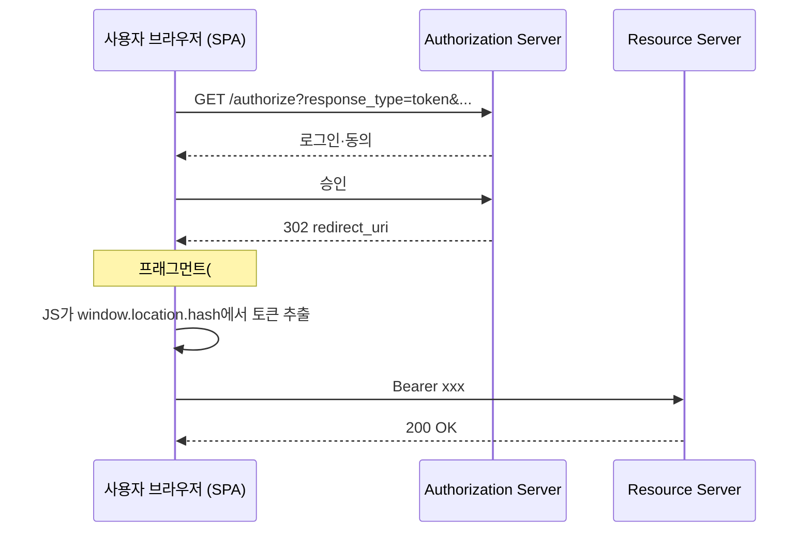
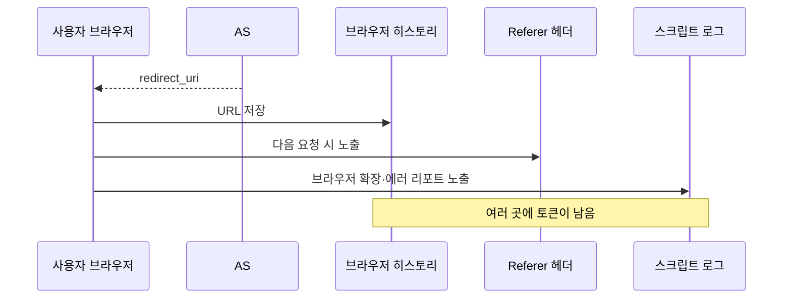
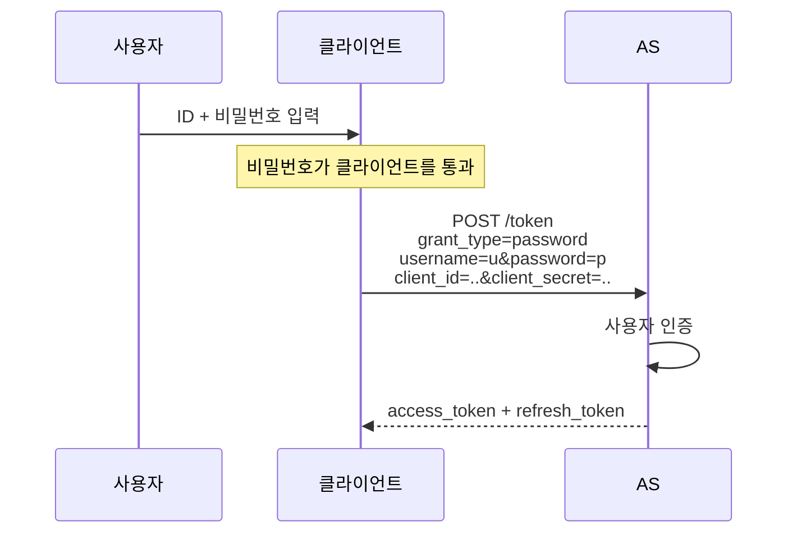
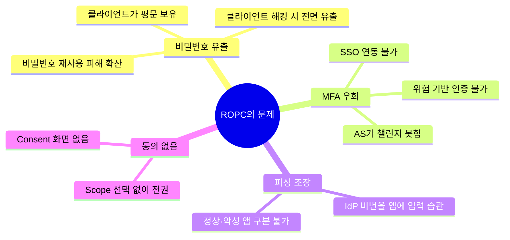
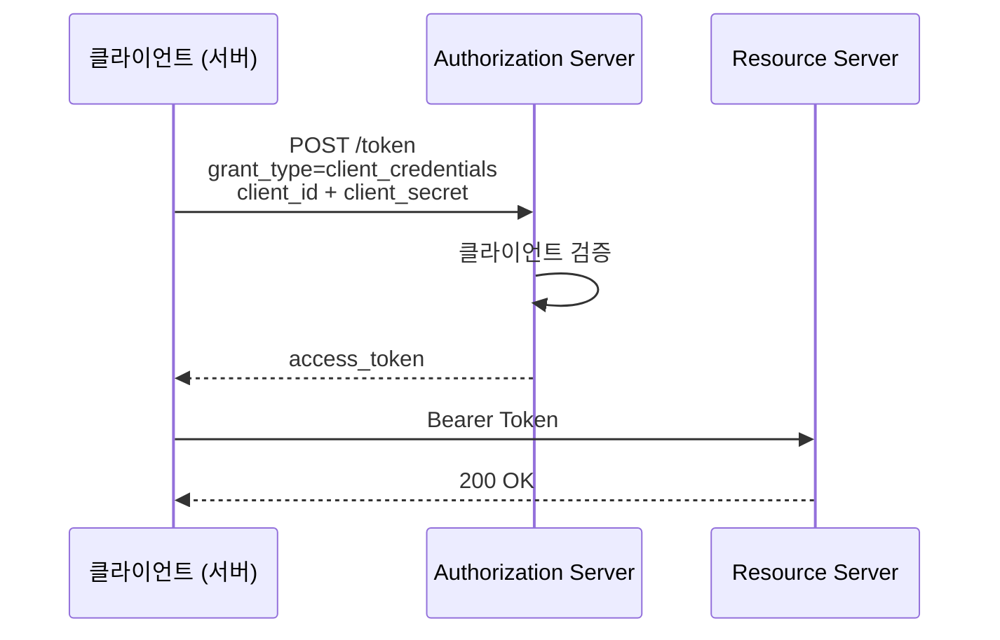
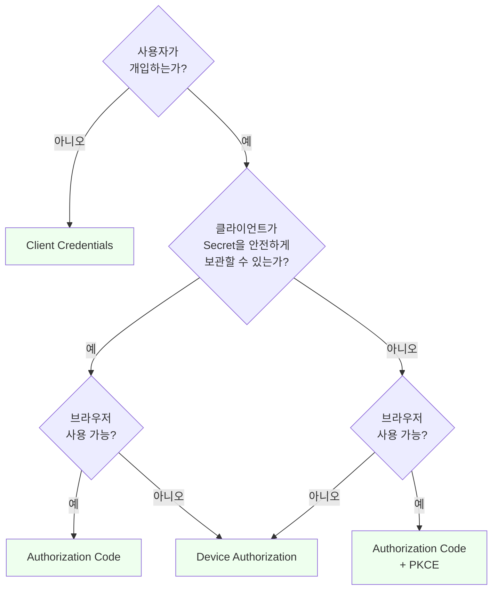
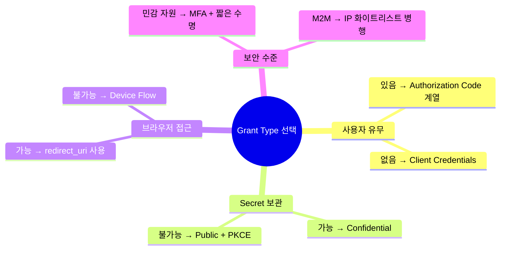

# 나머지 Grant Type과 그 한계

::: info 학습 목표
- 네 가지 주요 Grant Type(Authorization Code, Implicit, ROPC, Client Credentials)의 용도와 한계를 구분할 수 있다.
- Implicit과 ROPC가 왜 deprecated되었는지 구체적인 공격 시나리오로 설명할 수 있다.
- Client Credentials가 언제 적합하고 언제 쓰면 안 되는지 판단한다.
- 클라이언트 유형·사용자 유무·보안 수준에 따른 Grant Type 선택 체크리스트를 만들 수 있다.
:::

---

## 1. Implicit Flow — 프래그먼트로 토큰을 바로 받는다

Implicit Flow는 OAuth 2.0 초기에 <strong>SPA·Native 앱을 위해</strong> 고안됐다. Authorization Code Flow의 Code 교환 단계를 생략하고, `/authorize` 응답 자체에 Access Token을 싣는다.

### 기본 동작



핵심은 <strong>URL 프래그먼트(`#` 이후)</strong>에 토큰을 싣는다는 점이다. 프래그먼트는 브라우저가 서버로 전송하지 않으므로, AS 응답 직후 클라이언트 JS만 이 부분을 읽는다는 아이디어였다.

### 등장 배경

2012년 당시 SPA·Native 환경에서는 다음 문제가 있었다.

- CORS가 아직 보편화되지 않아 SPA가 직접 AS `/token`을 호출하기 어려웠다.
- 모바일 OS의 WebView가 다양했고, 브라우저 세션과 앱 상태 연결이 복잡했다.
- Public Client에 Client Secret을 줄 수 없으므로 Authorization Code + Secret 조합이 불가능했다.

이런 상황에서 "Code 교환 단계를 생략하자"는 타협안이 Implicit Flow였다.

### 공격 시나리오 — URL 노출

Implicit Flow의 가장 근본적인 약점은 <strong>토큰이 URL에 찍힌다</strong>는 것이다.



프래그먼트 자체는 서버로 가지 않지만, 실제로는 여러 경로로 유출된다.

- 브라우저 확장 프로그램이 `window.location.href`를 읽음
- 에러 리포트 서비스(Sentry 등)가 URL을 포함시킴
- 브라우저 히스토리 동기화 기능
- 악성 CSS나 이미지 로더가 URL 참조

### 공격 시나리오 — Token Injection

공격자가 피해자에게 자신이 이미 받은 Access Token이 담긴 URL을 클릭하게 만든다.

```
https://app.example.com/callback#access_token=<공격자 토큰>&token_type=Bearer
```

피해자 SPA의 JS는 이 토큰을 그대로 `localStorage`에 저장하고 "로그인됨"으로 처리한다. 피해자가 이후 수행하는 모든 작업이 <strong>공격자 계정으로</strong> 기록된다. "Login CSRF"의 OAuth 판이다.

Authorization Code Flow는 `state` 검증과 Code 교환으로 이 공격을 막지만, Implicit은 그 장치가 부족하다.

### 공격 시나리오 — Refresh Token 없음

Implicit은 설계상 <strong>Refresh Token을 발급하지 않는다</strong>. 짧은 Access Token 만료 시, 사용자는 매번 재인증해야 한다. 이를 피하려고 Implicit 구현체들은 "조용한 재인증(silent authentication)"을 위해 숨겨진 iframe에서 `/authorize`를 다시 호출하는 꼼수를 썼다. 이는 다시 <strong>Cross-Site 트래킹</strong>과 연동돼 새 취약점을 만들었다.

### 현재 상태

- <strong>OAuth 2.0 Security Best Current Practice (draft-ietf-oauth-security-topics)</strong>가 Implicit Flow 사용을 금지한다.
- <strong>OAuth 2.1</strong>은 Implicit을 공식 제거 예정이다.
- 주요 IdP(Google, Auth0 등)도 신규 클라이언트에서 Implicit을 기본 비활성화했다.

대체안은 <strong>Authorization Code + PKCE</strong>다. CORS가 보편화된 현재 SPA도 `/token`을 직접 호출할 수 있으므로, Implicit의 존재 이유가 사라졌다.

---

## 2. ROPC — Resource Owner Password Credentials

ROPC는 OAuth 2.0의 네 가지 기본 Grant Type 중 하나이지만, 이름만 들어도 왜 위험한지 짐작이 간다. 클라이언트가 <strong>사용자의 ID와 비밀번호를 직접 받아서</strong> AS에 전달하는 방식이다.

### 기본 동작



요청 예시.

```http
POST /token HTTP/1.1
Host: auth.example.com
Authorization: Basic <client credentials>
Content-Type: application/x-www-form-urlencoded

grant_type=password
&username=alice@example.com
&password=TopSecret
&scope=openid profile
```

### 왜 존재했는가

RFC 6749가 ROPC를 포함시킨 이유는 제한적 상황을 위한 것이었다.

- 레거시 앱이 비밀번호 입력 UI에 의존해서 즉시 브라우저 리다이렉트로 전환할 수 없을 때
- 1차 신뢰 관계인 앱(같은 회사 자체 모바일 앱)이 고유 로그인 UX를 유지할 때

이 조건은 처음부터 좁았고, 시간이 지나면서 거의 사라졌다.

### 공격 시나리오 — 비밀번호 노출

CH1에서 다룬 "비밀번호 공유의 4대 문제"가 그대로 재현된다. 클라이언트가 사용자 비밀번호를 <strong>평문으로 보고 저장까지 할 수 있다</strong>. OAuth의 핵심 목표(비밀번호 공유 제거)를 정면으로 위배한다.

### 공격 시나리오 — MFA 우회 불가

MFA, 소셜 로그인, 위험 기반 인증(Risk-based Authentication) 같은 AS의 모든 보안 기능이 <strong>우회된다</strong>. AS는 username+password만 받으므로, MFA 챌린지를 띄울 수 없다. 기업 SSO·OTP·생체 인증 등 현대 인증 플로우와 호환되지 않는다.

### 공격 시나리오 — 피싱 표면 확대

사용자가 "이 앱에 내 IdP 비밀번호를 입력하는 게 정상"이라는 습관을 갖게 된다. 이는 피싱 앱이 정상 앱과 구분되지 않게 만드는 최악의 관행이다. OAuth가 처음부터 없애려 했던 안티패턴이다.

### 거버넌스 관점



### 현재 상태

- <strong>OAuth 2.0 Security BCP</strong>와 <strong>OAuth 2.1</strong>이 명시적으로 제거 대상으로 지정.
- 주요 IdP가 지원을 축소·폐지 중. Azure AD는 2024년부터 신규 애플리케이션에서 차단.

기존에 ROPC를 쓰던 코드가 있다면 즉시 Authorization Code + PKCE로 마이그레이션해야 한다.

---

## 3. Client Credentials — 서버 간 인증

Client Credentials Grant는 OAuth 2.0의 네 가지 Grant 중 유일하게 <strong>사용자가 등장하지 않는</strong> 플로우다. M2M(Machine-to-Machine) 통신용이다.

### 기본 동작



사용자 개입 없이, <strong>클라이언트가 자신을 직접 인증</strong>해서 토큰을 받는다. 토큰의 `sub`는 사용자가 아니라 <strong>클라이언트 자신</strong>이다.

### 요청·응답 예시

```http
POST /token HTTP/1.1
Host: auth.example.com
Authorization: Basic <client credentials>
Content-Type: application/x-www-form-urlencoded

grant_type=client_credentials
&scope=reports.read%20metrics.write
```

응답.

```json
{
  "access_token": "eyJhbGciOiJSUzI1NiJ9...",
  "token_type": "Bearer",
  "expires_in": 3600,
  "scope": "reports.read metrics.write"
}
```

Refresh Token은 일반적으로 발급되지 않는다. 만료 시 그냥 새로 요청하면 된다.

### 적합한 시나리오

- <strong>백엔드 배치 작업</strong>: 야간에 외부 API를 호출하는 스케줄러
- <strong>서비스 간 호출</strong>: 마이크로서비스 A가 B의 API를 호출할 때
- <strong>서버 대 서버 데이터 동기화</strong>: ERP ↔ CRM 간 연동
- <strong>관리자 API</strong>: 조직 단위 관리(사용자 생성 등)

### 부적합한 시나리오

- <strong>사용자가 직접 쓰는 앱</strong>: SPA, 모바일, 웹 앱
- <strong>사용자별 자원 접근</strong>: "alice의 파일"을 호출할 때
- <strong>감사가 사용자 단위로 필요한 경우</strong>: 개인별 행위 로깅

### Scope와 권한 경계

Client Credentials는 <strong>클라이언트 자체가 가진 권한</strong>만 요청할 수 있다. AS는 클라이언트 등록 시 허용한 Scope 집합만 발급한다. 예를 들어 "배치 서버" 클라이언트는 `reports.read`, `metrics.write`만 요청 가능하고, 사용자 개인 파일 접근(`drive.readonly`)은 요청해도 거부된다.

### Confused Deputy 주의

Client Credentials로 받은 토큰으로 사용자별 자원을 조작하면 <strong>Confused Deputy</strong> 공격에 노출된다. 예를 들어 API가 "이 토큰이 유효하고 `files.write` Scope가 있으니 허용"이라고만 판단하면, 악의적 요청이 어떤 사용자의 파일이든 수정할 수 있다.

```java
// 안티패턴
@PostMapping("/files/{userId}")
public void writeFile(@PathVariable String userId, @RequestBody String content) {
    // 토큰 Scope만 확인하고 userId 소유권 검증 안 함
    fileService.write(userId, content);
}
```

이 경우 <strong>비즈니스 레이어의 인가</strong>가 별도로 필요하다. OAuth 토큰은 "무엇을 할 수 있는가"를 알려주지만, "누구의 자원에 접근하는가"는 앱이 직접 검증해야 한다.

---

## 4. Grant Type 선택 가이드

지금까지 본 네 가지 Grant Type을 어떻게 선택할지 체계적으로 정리한다.

### 결정 트리



### 클라이언트 유형별 권장

| 클라이언트 | 권장 Grant | 비고 |
|---------|----------|------|
| 전통 웹 서버 앱 (Spring, Django) | Authorization Code (+ Secret + PKCE) | Confidential, PKCE도 함께(2.1 권장) |
| SPA (React, Vue) | Authorization Code + PKCE | Public, BFF 패턴 고려(CH14) |
| Native 앱 (iOS, Android) | Authorization Code + PKCE | 커스텀 스킴 redirect_uri, AppAuth 라이브러리 |
| 데스크톱 앱 | Authorization Code + PKCE | loopback IP redirect_uri |
| TV·IoT·CLI | Device Authorization Grant | 두 기기 플로우 |
| 서버 데몬·배치 | Client Credentials | 사용자 불필요, Confidential |
| 레거시 앱 (임시) | ROPC | 즉시 마이그레이션 권장 |

### Scope와 Consent 설계 체크리스트

- 최소 권한 원칙을 따르는가? 읽기/쓰기를 분리했는가?
- 동의 화면이 사람이 읽을 수 있는 설명을 제공하는가?
- 동의 없이 Scope를 추가할 수 없도록 했는가?
- Scope별 만료 시간을 다르게 줄 수 있는가? (예: 결제 권한은 짧게)

### 선택 체크리스트



---

## 5. OAuth 2.1 방향성

OAuth 2.1은 현재 IETF에서 드래프트로 진행 중인 규격으로, 2.0의 다양한 RFC와 Best Current Practice를 통합·단순화한다. 핵심 변경은 다음과 같다.

### Implicit 공식 제거

`response_type=token` 사용이 규격에서 제거된다. 모든 인가 요청은 `response_type=code`로 수렴한다.

### ROPC 공식 제거

`grant_type=password` 지원이 규격에서 제거된다. 기존 호환성을 위해 AS가 지원할 수는 있으나 <strong>비표준 확장</strong>으로 분류된다.

### PKCE 필수화

<strong>모든 Authorization Code Flow에 PKCE가 필수</strong>가 된다. Confidential Client도 예외가 아니다. Client Secret이 있더라도 PKCE를 병행해서 "이 토큰 요청이 그 Authorization 요청과 같은 세션"임을 이중으로 증명한다.

### Refresh Token 권장 사항

- Public Client에서 Refresh Token 사용 시 <strong>회전(Rotation)</strong>이 필수
- Refresh Token 재사용 탐지(reuse detection) 권장
- Sender-constrained token(DPoP, mTLS) 장려

### redirect_uri 매칭 엄격화

- <strong>정확 일치(exact match)</strong>가 기본 규칙
- 부분 매칭·와일드카드 금지

### 변경 전후 비교

| 규칙 | OAuth 2.0 | OAuth 2.1 |
|----|---------|---------|
| Implicit Flow | 허용 | 제거 |
| ROPC | 허용 | 제거 |
| PKCE | Public만 권장 | 모든 클라이언트 필수 |
| redirect_uri 매칭 | 일부 매칭 허용 | 정확 일치 필수 |
| Bearer Token in URI | 허용 | 금지 |
| Refresh Token Rotation | 권장 | Public은 필수 |

### 마이그레이션 체크리스트

OAuth 2.0 기반 코드를 유지보수한다면 다음을 점검한다.

- Implicit Flow를 쓰고 있지 않은가?
- ROPC를 쓰고 있지 않은가?
- PKCE를 적용했는가? (Confidential Client도)
- redirect_uri가 정확 일치 검증되는가?
- Refresh Token Rotation이 설정됐는가?

### 앞으로의 여정

다음 챕터(CH8)는 Access Token과 Refresh Token의 수명 주기를 다룬다. OAuth 2.1의 권장 사항(Rotation, Introspection, Revocation)이 왜 필요한지가 명확해진다. 이어지는 CH12(PKCE), CH13(토큰 수명 관리 전략), CH14(BFF)에서 실무 구현 패턴으로 들어간다.

---

::: tip 핵심 정리
- Implicit Flow는 토큰을 URL 프래그먼트로 전달해 브라우저 이력·Referer·Token Injection 공격에 취약하며, OAuth 2.1에서 제거된다. 대체는 Authorization Code + PKCE다.
- ROPC는 클라이언트가 사용자 비밀번호를 평문으로 보유하게 만들어 OAuth의 핵심 목표를 정면으로 위배하고 MFA·SSO와 호환되지 않는다. 즉시 마이그레이션해야 한다.
- Client Credentials는 사용자 없는 M2M 시나리오 전용이며, 사용자별 자원 접근에는 부적합하다. 토큰 Scope 확인만으로 끝나면 Confused Deputy 공격이 생길 수 있어 비즈니스 레이어의 인가가 필요하다.
- OAuth 2.1은 Implicit/ROPC 제거, PKCE 모든 클라이언트 필수화, redirect_uri 정확 일치, Refresh Token Rotation 필수화로 방향이 정리되고 있다.
:::

## 다음 챕터

- 이전 : [Authorization Code Flow](/study/oauth/06-authorization-code-flow)
- 다음 : [Access·Refresh Token의 수명 주기](/study/oauth/08-token-lifecycle)
