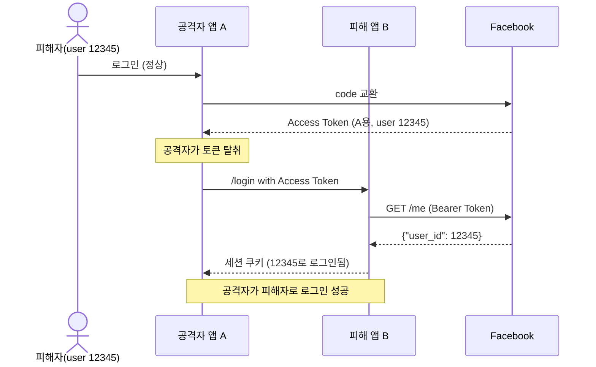
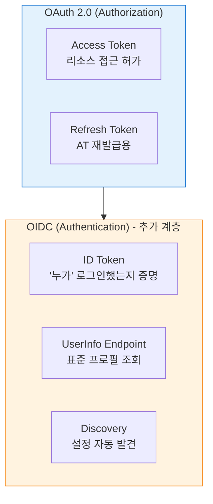
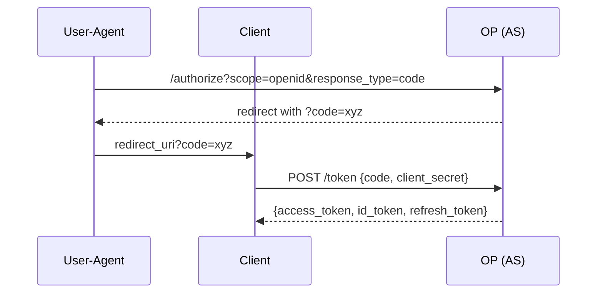

# OIDC는 왜 태어났나

::: info 학습 목표
- OAuth 2.0만으로 "인증"을 할 수 없는 이유를 설명할 수 있다.
- Confused Deputy 공격의 메커니즘을 이해한다.
- OIDC가 OAuth 위에 얹은 "얇은 층"이 무엇인지 구분할 수 있다.
- OIDC의 세 가지 플로우(Authorization Code / Hybrid / Implicit)와 권고 사항을 안다.
:::

---

## 1. "Access Token으로 로그인" 안티패턴

OAuth 2.0이 널리 퍼진 2010년대 초반, 개발자들은 한 가지 유혹에 빠졌다. "소셜 로그인"을 구현하려고 OAuth 액세스 토큰을 "누가 로그인했는가"의 증거로 사용한 것이다.

전형적인 흐름은 이렇다.

```
1. 사용자가 "Facebook으로 로그인" 버튼을 누른다.
2. 클라이언트가 Facebook에서 Access Token을 받는다.
3. 클라이언트가 Facebook Graph API(/me)를 호출해 user_id를 얻는다.
4. 그 user_id로 자체 세션을 만든다. "로그인 완료".
```

얼핏 동작하는 듯 보인다. 그러나 여기에는 근본적인 결함이 있다. <strong>Access Token은 "이 토큰으로 리소스에 접근해도 된다"만 말해 줄 뿐, "이 토큰의 주인이 누구인가"를 보장하지 않는다.</strong>

### Access Token이 보장하지 않는 것

| 질문 | OAuth Access Token이 답할 수 있는가 |
|------|--------------------------------------|
| 이 토큰으로 리소스에 접근할 수 있는가? | 예 |
| 이 토큰은 언제까지 유효한가? | 예 (exp) |
| 이 토큰은 어떤 스코프를 가지는가? | 예 (scope) |
| 이 토큰은 누구(end-user)를 대표하는가? | <strong>아니오</strong> |
| 이 토큰은 누구(client)에게 발급되었는가? | <strong>아니오 (토큰만으로는 모름)</strong> |
| 언제 로그인했는가? | <strong>아니오</strong> |

Access Token은 은행 금고 열쇠에 비유할 수 있다. 열쇠를 가지고 있다고 해서 그 사람이 금고 주인이라는 뜻은 아니다. 주운 열쇠를 쓰는 사람도 금고를 열 수 있다.

### 안티패턴이 만든 실제 피해

- <strong>토큰 사본만 있으면 로그인 성공</strong>: 공격자가 어떤 경로로든 Access Token을 얻으면 그 사용자로 "로그인"이 된다.
- <strong>발급 대상 확인 불가</strong>: 토큰이 "우리 앱용"으로 발급된 것인지 "다른 앱용"으로 발급된 것인지 알 수 없다. 이로 인해 다음 절의 Confused Deputy 공격이 가능해진다.

```mermaid
flowchart LR
    A[공격자가 탈취한<br>Access Token] --> B[공격 대상 서버]
    B --> C[/me 호출]
    C --> D[user_id 획득]
    D --> E[세션 생성<br>로그인 성공]
    style E fill:#ffd2d2,stroke:#b00
```

---

## 2. Confused Deputy 공격

"Confused Deputy"는 권한을 위임받은 대리인(deputy)이 자신이 누구를 위해 행동하는지 혼동하도록 유도되는 공격 패턴이다. OAuth 인증 오용 상황에서 이 공격은 다음과 같이 나타난다.

### 시나리오

- <strong>공격자의 앱 A</strong>: 사용자가 합법적으로 로그인한 서비스. A는 Facebook OAuth로 Access Token을 받아 두었다.
- <strong>피해자의 앱 B</strong>: "Facebook으로 로그인"을 받아 주는 서비스. B는 A와 무관하다.

공격자는 A가 받은 Access Token을 B에 그대로 제출한다. B는 이렇게 한다.

1. 받은 토큰으로 Facebook `/me`를 호출한다.
2. Facebook은 "이 토큰은 유효하고, user_id=12345"라고 응답한다.
3. B는 "12345가 로그인했구나" 하고 세션을 만든다.

결과: 공격자 A가 피해자 user_id=12345로 B에 로그인한 상태가 된다.



### 왜 문제인가

OAuth 2.0의 Access Token은 "누구에게 발급되었는가(audience)"를 토큰 자체로 검증할 방법이 없다. Facebook API는 "이 토큰은 유효하다"만 답하고, 그 토큰이 B용인지 A용인지 구분해 주지 않는다. B 입장에서는 "내 앱용으로 발급된 토큰"인지 확인할 수단이 없는 것이다.

### 실제로 있었던 사고

- 2014년경 Facebook의 "Login with Facebook" 구현 가이드에서 Access Token을 identity 증명으로 쓰는 샘플이 널리 복사되었고, 이 패턴을 채택한 여러 서비스가 취약해졌다.
- Wang 등(2012)의 논문 "Signing Me onto Your Accounts through Facebook and Google"에서 Facebook Connect와 Google OAuth에 기반한 10여 개 사이트가 이 안티패턴으로 계정 탈취에 취약함이 실증되었다.

핵심은 이것이다. <strong>OAuth 2.0은 "인가(Authorization)" 프로토콜이고, 인증(Authentication)을 위해 설계되지 않았다.</strong> 인증은 별도 표준이 필요했다.

---

## 3. OIDC는 OAuth 위의 얇은 층

OpenID Connect(OIDC)는 2014년 OpenID Foundation이 표준화한 프로토콜이다. 이름에 "Connect"가 붙은 이유가 있다. OIDC는 OAuth 2.0을 <strong>대체하지 않고, 그 위에 덧씌우는 식(On top of OAuth)</strong>으로 설계되었다.

### 얇은 층이라 부르는 이유

- OIDC는 OAuth 2.0의 엔드포인트(/authorize, /token)를 그대로 쓴다.
- 스코프 메커니즘, 리다이렉트, 코드 교환 모두 동일하다.
- 단지 요청에 `scope=openid`를 포함시키면, AS가 응답에 <strong>ID Token</strong>을 추가해 준다.



### OAuth vs OIDC: 질문이 다르다

| 프로토콜 | 답하는 질문 | 대표 산출물 |
|----------|-------------|-------------|
| OAuth 2.0 | "이 클라이언트가 리소스에 접근해도 되는가?" | Access Token |
| OIDC | "누가 지금 로그인했으며, 언제 로그인했는가?" | ID Token |

즉, OIDC는 OAuth를 <strong>인증 용도로 "올바르게 쓰는 법"</strong>을 표준화한 것이다.

### 요청 하나로 두 마리 토끼

`scope=openid profile email` 같은 요청 하나로 AS는 다음 두 가지를 모두 돌려 준다.

- Access Token: 리소스 서버(보통 UserInfo 엔드포인트) 호출용.
- ID Token: "이 사용자가 방금 로그인했음"의 증명.

ID Token은 JWT 형식이며, <strong>aud(audience)</strong> 클레임으로 "이 토큰이 어느 클라이언트용인지" 명시한다. CH2의 Confused Deputy 공격은 aud를 검증하는 순간 차단된다.

---

## 4. OIDC 3가지 플로우

OIDC 1.0은 세 가지 "response_type"을 정의한다. 모두 OAuth 플로우의 변형이다.

### (1) Authorization Code Flow

- `response_type=code`
- 브라우저로 code를 받고, 서버 간 통신으로 code를 ID Token + Access Token으로 교환한다.
- <strong>현재 표준 권장</strong>. 서버 측 시크릿을 안전하게 보관할 수 있는 Confidential Client에 적합하다.



### (2) Implicit Flow

- `response_type=id_token` 혹은 `id_token token`
- 브라우저가 직접 ID Token을 URL fragment로 받는다.
- 과거 SPA를 위해 만들어졌지만, <strong>프론트에서 토큰 노출·재생 공격 등 보안 이슈가 많아 현재는 권장되지 않는다.</strong> OAuth 2.1에서는 사실상 폐기 대상이며, SPA도 PKCE를 붙인 Authorization Code Flow 사용이 권장된다.

### (3) Hybrid Flow

- `response_type=code id_token`, `code token`, `code id_token token` 등
- 브라우저로 ID Token을 "먼저" 받아 즉시 사용자를 식별하고, 동시에 code를 받아 서버에서 Access Token으로 교환한다.
- 로그인 지연을 줄이면서 Access Token은 안전하게 받는 절충안이다. 엔터프라이즈에서 종종 쓰인다.

### 플로우별 권고 사항

| 플로우 | 권고 시점 | 주의 |
|--------|-----------|------|
| Authorization Code (+PKCE) | <strong>모든 신규 구현의 기본</strong> | Public Client도 PKCE 필수 |
| Implicit | <strong>피해야 함</strong> | URL fragment 토큰 노출, refresh token 없음 |
| Hybrid | 특수 케이스에만 | code + token 동시 검증 로직 복잡 |

::: warning
OAuth 2.1(현재 IETF Draft)과 OAuth Security BCP(RFC 9700)는 <strong>Implicit Flow와 ROPC Grant를 사용 중단하도록 권고</strong>한다. 2026년 현재 신규 구현에서 Implicit을 선택할 이유는 사실상 없다.
:::

---

## 5. OIDC가 추가한 핵심 3가지

OIDC는 OAuth에 없던 세 가지 표준화된 구성 요소를 더한다.

### (1) ID Token

JWT 형식의 서명된 토큰으로, "누가 언제 로그인했는가"를 증명한다. 주요 클레임은 다음과 같다.

| 클레임 | 의미 |
|--------|------|
| iss | ID Token을 발급한 Issuer URL |
| sub | Subject — 사용자 고유 식별자 |
| aud | Audience — 이 토큰이 발급된 Client ID |
| exp | 만료 시각 (Unix timestamp) |
| iat | 발급 시각 |
| auth_time | 사용자가 실제 인증을 수행한 시각 |
| nonce | Replay 공격 방지용 난수 (클라이언트가 제공) |

<strong>aud를 검증하는 것만으로</strong> Confused Deputy 문제를 차단할 수 있다. 상세는 다음 챕터에서 다룬다.

### (2) UserInfo 엔드포인트

표준화된 사용자 프로필 조회 API. Access Token으로 호출하면 JSON으로 `name`, `email`, `picture` 등 표준 클레임을 돌려준다.

```http
GET /userinfo HTTP/1.1
Host: accounts.example.com
Authorization: Bearer eyJhbGciOi...

{
  "sub": "248289761001",
  "name": "Jane Doe",
  "email": "janedoe@example.com",
  "picture": "https://example.com/janedoe/me.jpg"
}
```

Facebook Graph API나 Google People API는 각자의 스키마로 프로필을 돌려준다. OIDC는 이를 <strong>공통 스펙</strong>으로 만들어, 어떤 OP(OpenID Provider)를 쓰든 같은 코드로 프로필을 읽을 수 있게 한다.

### (3) Discovery

OP의 엔드포인트 URL, 지원 알고리즘, JWKS 위치 등을 `/.well-known/openid-configuration`이라는 고정 경로의 JSON으로 공개한다.

```http
GET /.well-known/openid-configuration

{
  "issuer": "https://accounts.example.com",
  "authorization_endpoint": "https://accounts.example.com/authorize",
  "token_endpoint": "https://accounts.example.com/token",
  "userinfo_endpoint": "https://accounts.example.com/userinfo",
  "jwks_uri": "https://accounts.example.com/jwks.json",
  "id_token_signing_alg_values_supported": ["RS256"],
  "scopes_supported": ["openid", "profile", "email"]
}
```

덕분에 클라이언트는 <strong>OP의 URL 하나만 설정</strong>하면 나머지 엔드포인트와 서명 키를 자동으로 발견할 수 있다. 과거 OAuth 2.0에서는 이 정보가 공급자마다 제각각이어서 클라이언트 라이브러리가 공급자별로 하드코딩되어야 했다.

---

## 6. OIDC가 바꾼 것 정리

OIDC 이전과 이후의 차이를 한 표로 요약하면 이렇다.

| 항목 | OAuth만 쓰던 시절 | OIDC 도입 이후 |
|------|-------------------|----------------|
| 사용자 식별 | `/me` 호출 후 user_id 추출 (공급자별로 다름) | ID Token의 `sub` 클레임 (표준) |
| 토큰 대상 검증 | 불가능 | aud 클레임 검증 |
| 로그인 시각 | 알 수 없음 | auth_time 클레임 |
| 재생 공격 방어 | 직접 구현 | nonce 클레임 표준화 |
| 설정 관리 | 공급자별 수동 설정 | Discovery로 자동 |
| 프로필 조회 | 공급자별 API 스키마 | UserInfo 표준 스키마 |

관련 내용은 블로그 포스트 [OAuth와 비교한 OIDC 개념](/posts/tech/2025-08-29-oidc)에서 실제 스크린샷과 함께 복습할 수 있다.

---

::: tip 핵심 정리
- OAuth Access Token은 "리소스 접근 허가"만 보장하며, "누가 로그인했는가"를 증명하지 않는다. 인증 용도로 쓰면 Confused Deputy 공격에 노출된다.
- OIDC는 OAuth 2.0 위에 얹는 얇은 인증 계층이다. `scope=openid`를 붙이면 AS가 ID Token을 추가로 발급한다.
- ID Token의 `aud` 클레임을 검증하면 "다른 앱용 토큰으로 내 앱에 로그인"하는 공격을 원천 차단할 수 있다.
- 신규 구현은 Authorization Code Flow + PKCE를 기본으로 하고, Implicit Flow는 피한다. Hybrid Flow는 특수 요구사항이 있을 때만 고려한다.
- OIDC는 ID Token, UserInfo 엔드포인트, Discovery 세 가지를 표준화하여 공급자 독립적인 인증 구현을 가능하게 했다.
:::

## 다음 챕터

- 이전 : [Access·Refresh Token 수명 주기](/study/oauth/08-token-lifecycle)
- 다음 : [ID Token과 JWT 구조](/study/oauth/10-id-token-jwt)
