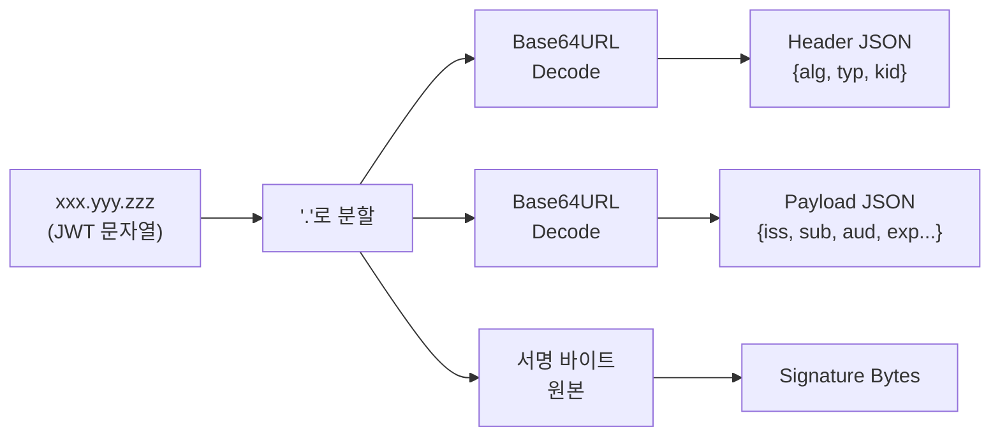
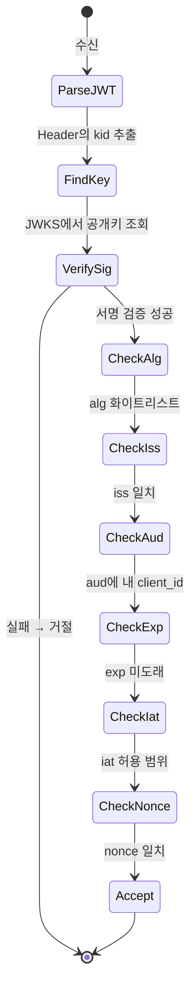

# ID Token과 JWT 구조

::: info 학습 목표
- JWT의 세 부분 구조(Header.Payload.Signature)를 설명할 수 있다.
- 표준 클레임(iss, sub, aud, exp, iat, nonce 등)의 의미를 정확히 구분한다.
- 대칭 서명(HS256)과 비대칭 서명(RS256)의 차이와 OIDC가 RS256을 권장하는 이유를 안다.
- ID Token 검증 체크리스트를 단계별로 작성할 수 있다.
:::

---

## 1. JWT 한 조각 뜯어보기

ID Token은 실체가 <strong>JWT(JSON Web Token, RFC 7519)</strong>다. JWT는 점(`.`)으로 구분된 세 부분으로 이루어진 문자열이다.

```
xxxxx.yyyyy.zzzzz
  ↑      ↑      ↑
Header Payload Signature
```

각 부분은 <strong>Base64URL</strong>로 인코딩되어 있다. 일반 Base64와 달리 `+`→`-`, `/`→`_`로 대체하고 패딩(`=`)을 생략해서 URL·헤더·쿠키에 안전하게 실을 수 있다.

### 실제 ID Token 예시

```
eyJhbGciOiJSUzI1NiIsInR5cCI6IkpXVCIsImtpZCI6IjE2YjMyMzQifQ.
eyJpc3MiOiJodHRwczovL2FjY291bnRzLmV4YW1wbGUuY29tIiwic3ViIjoi
MjQ4Mjg5NzYxMDAxIiwiYXVkIjoiczZCaGRSa3F0MyIsImV4cCI6MTcxNTAw
MDAwMCwiaWF0IjoxNzE0OTk2NDAwLCJub25jZSI6Im40NTJhYmMifQ.
rJ5oP9mXHqKa7...서명바이트...
```

이 문자열을 점 기준으로 잘라 각각 Base64URL 디코드하면 JSON으로 복원된다. 실습은 [jwt.io](https://jwt.io)에서 바로 해 볼 수 있다.



### JWT의 성질

- <strong>서명은 가능, 암호화는 옵션</strong>: JWT = JWS(서명) 또는 JWE(암호화). 일반적인 ID Token은 JWS이고, 페이로드는 누구나 읽을 수 있다. 기밀 정보를 넣으면 안 된다.
- <strong>자체 포함(self-contained)</strong>: 서명이 유효하면 서버에 다시 물어볼 필요 없이 내용을 믿을 수 있다.
- <strong>무상태(stateless)</strong>: 서버 세션 저장소를 쓰지 않는다.

---

## 2. 헤더 (Header)

헤더는 "이 토큰을 어떻게 해석할지"에 대한 메타데이터를 담는다.

```json
{
  "alg": "RS256",
  "typ": "JWT",
  "kid": "16b3234"
}
```

### 주요 필드

| 필드 | 의미 | 비고 |
|------|------|------|
| `alg` | 서명 알고리즘 | `RS256`, `ES256`, `HS256`, `none` 등 |
| `typ` | 토큰 타입 | 보통 `"JWT"` |
| `kid` | Key ID | 여러 키를 로테이션할 때 어떤 키로 서명됐는지 식별 |
| `cty` | Content Type | 중첩 JWT 등 특수 용도 |

### `alg: "none"`의 함정

JWT 스펙은 서명 없이 토큰을 만드는 `alg: "none"`도 허용한다. 2015년 여러 JWT 라이브러리에 다음 취약점이 있었다.

- 공격자가 `alg: "none"`으로 바꾸고 서명 없이 전송한다.
- 라이브러리가 "alg가 none이니 검증 생략"하고 토큰을 받아들인다.

<strong>검증 시 반드시 `alg`를 서버가 기대하는 값으로 화이트리스트 체크</strong>해야 한다. 라이브러리 설정에 `algorithms: ['RS256']` 같은 옵션이 있는지 확인한다.

### `kid`의 역할

OIDC는 대개 <strong>키 로테이션</strong>을 수행한다. AS는 여러 서명 키를 동시에 운용하며, 각 토큰 헤더의 `kid`가 "어떤 공개키로 서명을 검증해야 하는지"를 가리킨다. 클라이언트는 `kid`를 보고 JWKS에서 해당 공개키를 찾아 검증한다(CH11).

---

## 3. 페이로드 (Payload)

페이로드는 <strong>클레임(Claim)</strong>들의 JSON 집합이다. 표준 클레임과 커스텀 클레임으로 나뉜다.

```json
{
  "iss": "https://accounts.example.com",
  "sub": "248289761001",
  "aud": "s6BhdRkqt3",
  "exp": 1715000000,
  "iat": 1714996400,
  "auth_time": 1714996390,
  "nonce": "n452abc",
  "email": "jane@example.com",
  "email_verified": true,
  "custom_role": "admin"
}
```

### 클레임 분류

- <strong>Registered Claims (등록된 표준)</strong>: `iss`, `sub`, `aud`, `exp`, `iat`, `nbf`, `jti`. RFC 7519에 정의.
- <strong>Public Claims (공개 클레임)</strong>: IANA JWT Claims Registry에 등록된 공용 이름. `name`, `email`, `picture` 등.
- <strong>Private Claims (커스텀)</strong>: 발급자와 소비자가 합의해 자유롭게 쓰는 필드. 위 예시의 `custom_role`.

### 페이로드 크기 주의

JWT는 보통 HTTP 헤더(`Authorization: Bearer ...`)에 실린다. 페이로드에 프로필 정보를 전부 넣기 시작하면 토큰이 비대해져 헤더 크기 제한(기본 8KB 근처)에 걸린다. 그래서 OIDC는 <strong>"ID Token에는 꼭 필요한 식별·보안 클레임만, 상세 프로필은 UserInfo 엔드포인트로"</strong> 권장한다.

---

## 4. 서명 (Signature)

서명은 "이 토큰이 AS가 발급한 것이고 중간에 변조되지 않았다"를 보장한다. 서명 방식은 `alg`에 따라 달라진다.

### HS256: 대칭키 (HMAC-SHA256)

- 발급자와 검증자가 <strong>같은 비밀</strong>(shared secret)을 공유한다.
- 구현 단순, 속도 빠름.
- 문제: 검증자가 곧 발급자가 될 수 있다. 즉, 비밀을 아는 누구나 토큰을 위조할 수 있다.

```
HMAC-SHA256(
  secret,
  base64url(header) + "." + base64url(payload)
)
```

### RS256: 비대칭키 (RSA + SHA-256)

- AS는 <strong>개인키</strong>로 서명, 클라이언트는 <strong>공개키</strong>로 검증.
- 공개키가 유출되어도 토큰을 위조할 수 없다.
- OIDC Discovery의 JWKS(`jwks_uri`)로 공개키를 자동 배포.

```
RSA-SHA256(
  private_key,
  base64url(header) + "." + base64url(payload)
)
```

### ES256: 타원곡선 (ECDSA P-256 + SHA-256)

- RS256과 같은 비대칭 구조이지만 키 크기가 작고(256 bit) 빠르다.
- 모바일·IoT 환경에서 선호.

### 알고리즘 비교

| 알고리즘 | 키 방식 | 키 크기 | 속도 | 배포 방식 | 적합 상황 |
|----------|---------|---------|------|-----------|-----------|
| HS256 | 대칭 | 256 bit | 매우 빠름 | 사전 공유 | 단일 서비스 내부 |
| RS256 | 비대칭 | 2048+ bit | 보통 | JWKS 공개 | <strong>표준 OIDC</strong> |
| ES256 | 비대칭(EC) | 256 bit | 빠름 | JWKS 공개 | 모바일·신규 구현 |

### 왜 OIDC는 RS256(혹은 ES256)을 권장하는가

OIDC 시나리오는 본질적으로 <strong>"AS(발급자)와 여러 클라이언트(검증자)가 분리"</strong>되어 있다. 클라이언트 수가 많을수록 대칭 비밀을 공유·로테이션하는 운영 부담이 커지고 유출 면적이 넓어진다. 비대칭 서명은 "개인키는 AS만, 공개키는 누구나"라는 구조로 이 문제를 해결한다.

- HS256은 AS 자기 자신이 검증자일 때(e.g., 자체 Resource Server) 한정적으로 쓸 수 있다.
- 외부에 공개된 ID Token은 반드시 비대칭 서명을 권장한다.

::: warning
`alg: "HS256"`인 ID Token을 받아들이도록 구성된 클라이언트에 공격자가 공개키 파일을 secret으로 이용해 HS256 토큰을 만들어 주입하는 "알고리즘 혼동(Algorithm Confusion)" 공격이 있다. <strong>검증 라이브러리에 반드시 허용 알고리즘을 명시적으로 고정</strong>해야 한다.
:::

---

## 5. ID Token 표준 클레임

OIDC Core 1.0은 ID Token에 포함되는 표준 클레임을 규정한다.

| 클레임 | 필수 | 의미 | 검증 방법 |
|--------|------|------|-----------|
| `iss` | 필수 | Issuer — 토큰을 발급한 OP URL | 클라이언트가 사전 설정한 iss와 정확히 일치 |
| `sub` | 필수 | Subject — 사용자 고유 식별자 | 같은 사용자 판별용, 길이 255자 이내 |
| `aud` | 필수 | Audience — 이 토큰이 발급된 대상 Client ID | 내 client_id가 포함되어 있는가 |
| `exp` | 필수 | Expiration — 만료 시각 (epoch seconds) | 현재 시각 < exp |
| `iat` | 필수 | Issued At — 발급 시각 | 너무 오래된 토큰은 거부 |
| `auth_time` | 조건부 | 사용자가 실제 로그인을 수행한 시각 | max_age 요청했거나 특정 레벨 인증 시 |
| `nonce` | 조건부 | 클라이언트가 보낸 난수 echo | 요청 시 보낸 nonce와 일치 |
| `acr` | 선택 | Authentication Context Class Reference | 인증 강도 (예: MFA 여부) |
| `amr` | 선택 | Authentication Methods References | 사용된 인증 수단 (예: ["pwd","mfa"]) |
| `azp` | 조건부 | Authorized Party — aud가 여러 개일 때 실제 수령자 | aud가 배열인 경우 검증 |

### sub는 email이 아니다

초보자들이 흔히 저지르는 실수: "이메일이 고유 식별자니까 `sub` 대신 `email`로 사용자 매칭". 이메일은 <strong>사용자가 바꿀 수 있고</strong>, <strong>재사용될 수 있고</strong>, OP에 따라 verified가 아닐 수도 있다. 항상 `iss + sub` 조합을 내부 사용자 ID와 매핑해야 한다.

### nonce는 왜 있는가

Implicit/Hybrid Flow처럼 ID Token이 브라우저를 거쳐 전달될 때 <strong>재생 공격(Replay Attack)</strong> 방지용이다.

1. 클라이언트가 /authorize에 `nonce=n452abc` 포함해 요청.
2. AS가 nonce를 ID Token에 그대로 넣어 발급.
3. 클라이언트는 받은 토큰의 nonce가 자신이 보낸 값과 같은지 확인.

만약 공격자가 과거 ID Token을 가로채 재사용하려 해도, 그 토큰의 nonce는 공격자가 새로 시작한 세션의 nonce와 일치하지 않아 거절된다.

### auth_time과 max_age

"마지막 로그인한 지 10분 넘었으면 재인증 요구" 같은 정책을 위해 쓴다.

```
# 클라이언트 요청
GET /authorize?...&max_age=600

# AS는 auth_time을 ID Token에 포함시켜
# 검증자는 now - auth_time <= 600 인지 확인
```

---

## 6. 검증 순서

받은 ID Token을 믿기 전에 수행해야 할 검증 절차는 순서가 있다. OIDC Core §3.1.3.7에 정의되어 있다.



### 7단계 체크리스트

1. <strong>서명 검증</strong>: Header의 `kid`로 JWKS에서 공개키를 찾고, `alg`로 서명을 검증한다. <strong>허용 alg는 반드시 화이트리스트</strong>.
2. <strong>iss 검증</strong>: 토큰의 `iss`가 사전 설정한 issuer와 정확히 일치해야 한다. (`https://accounts.example.com`과 `https://accounts.example.com/`는 엄격히 다름에 유의)
3. <strong>aud 검증</strong>: `aud`에 내 `client_id`가 포함되어야 한다. 배열이면 포함 여부, 문자열이면 동일성. 여러 aud가 있다면 `azp` 추가 확인.
4. <strong>exp 검증</strong>: `exp > now`. 시계 오차(clock skew)로 인해 ±5분 정도 허용하는 것이 일반적.
5. <strong>iat 검증</strong>: `iat`가 너무 미래이거나 너무 먼 과거면 거절(선택적).
6. <strong>nonce 검증</strong>: 요청 시 nonce를 보냈다면 토큰의 `nonce`가 그 값과 일치해야 한다.
7. <strong>(선택) auth_time 검증</strong>: `max_age` 요청 시 `now - auth_time <= max_age` 확인.

### 검증 코드 예시 (Node.js)

```javascript
import jwt from 'jsonwebtoken';
import jwksRsa from 'jwks-rsa';

const client = jwksRsa({ jwksUri: 'https://accounts.example.com/jwks.json' });

function getKey(header, callback) {
  client.getSigningKey(header.kid, (err, key) => {
    callback(null, key.getPublicKey());
  });
}

jwt.verify(
  idToken,
  getKey,
  {
    algorithms: ['RS256'],                     // 1. alg 화이트리스트
    issuer: 'https://accounts.example.com',    // 2. iss
    audience: 's6BhdRkqt3',                    // 3. aud
    clockTolerance: 300                        // 4. exp ±5분
  },
  (err, decoded) => {
    if (err) throw err;
    if (decoded.nonce !== sessionNonce) throw new Error('nonce mismatch'); // 6
    // 검증 성공
  }
);
```

### 수동 검증은 피하라

JWT 검증은 실수 한 번이 보안 구멍이다. `jwt.decode()`(검증 없이 디코드)를 `jwt.verify()` 대신 쓰거나, `aud` 체크를 생략하는 실수가 잦다. <strong>성숙한 라이브러리를 쓰고, 가능하면 OIDC 클라이언트 라이브러리(Spring Security OAuth2 Client, oidc-client-ts 등)의 고수준 API에 맡기는 편이 낫다.</strong>

다음 챕터에서 `kid`로 공개키를 실제로 어떻게 조회하는지, JWKS의 구조와 키 로테이션 전략을 다룬다.

---

::: tip 핵심 정리
- JWT는 `Header.Payload.Signature` 세 부분을 Base64URL로 인코딩한 문자열이다. 서명은 무결성을 보장하지만 페이로드는 암호화되지 않으므로 기밀 데이터를 넣지 않는다.
- Header의 `alg`는 반드시 검증자가 허용하는 화이트리스트로 고정한다. `alg: "none"`과 알고리즘 혼동 공격을 방지해야 한다.
- OIDC는 비대칭 서명(RS256/ES256)을 권장한다. 개인키는 AS만, 공개키는 JWKS로 공개하는 구조가 다수 클라이언트 운영에 적합하다.
- ID Token의 필수 클레임은 iss, sub, aud, exp, iat이며, nonce는 재생 공격 방지에 쓰인다. `sub`는 이메일이 아니라 `iss`와 조합된 고유 식별자다.
- 검증 순서는 (1) 서명 (2) alg (3) iss (4) aud (5) exp (6) iat (7) nonce로 고정된다. 라이브러리의 고수준 API를 사용해 실수를 줄인다.
:::

## 다음 챕터

- 이전 : [OIDC는 왜 태어났나](/study/oauth/09-why-oidc)
- 다음 : [Discovery · JWKS · UserInfo](/study/oauth/11-discovery-jwks-userinfo)
