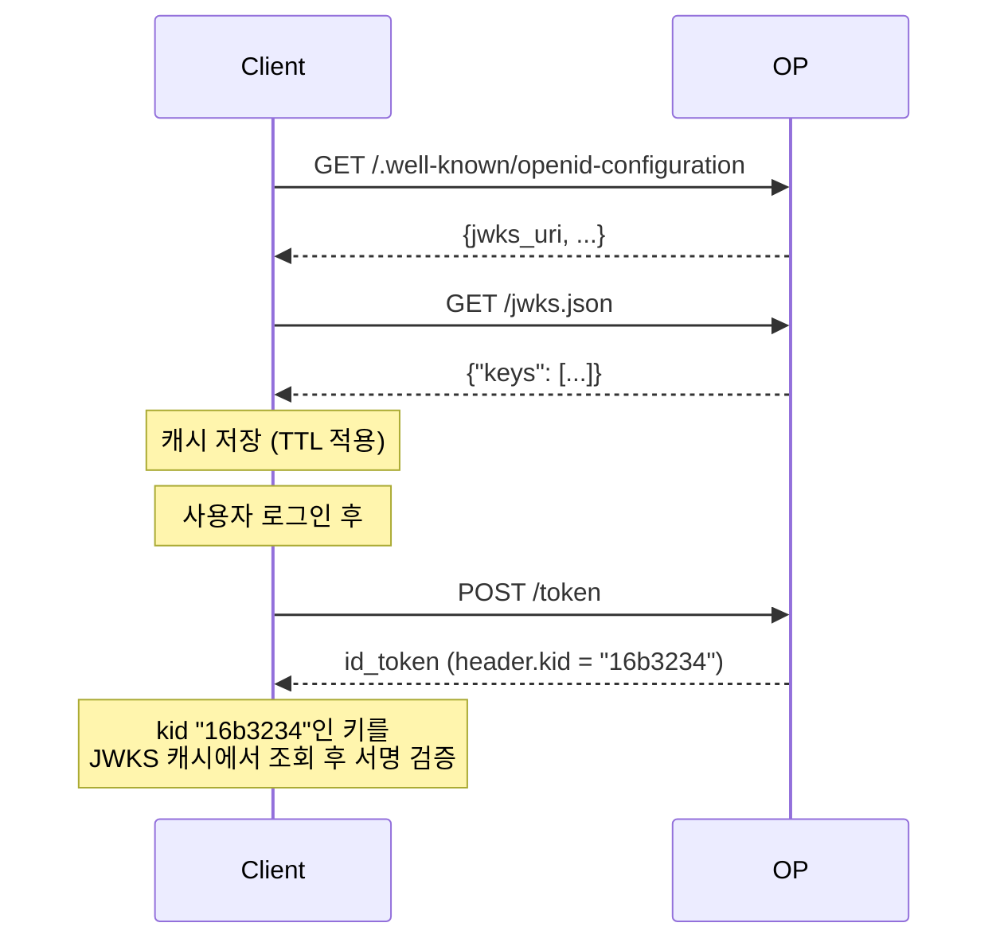
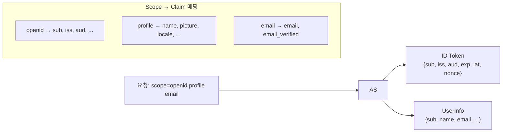

# Discovery · JWKS · UserInfo

::: info 학습 목표
- `/.well-known/openid-configuration`의 역할과 필드 구성을 설명할 수 있다.
- JWKS와 `kid`를 통해 ID Token 서명 검증용 공개키를 동적으로 조회하는 과정을 이해한다.
- UserInfo 엔드포인트의 용도와 ID Token과의 역할 분담을 안다.
- 표준 Scope(openid / profile / email / address / phone)로 반환되는 클레임 세트를 구분한다.
:::

---

## 1. Discovery 엔드포인트

OIDC 이전에는 클라이언트가 OP(OpenID Provider)의 각종 URL과 설정을 <strong>하드코딩</strong>해야 했다. 공급자마다 엔드포인트 경로가 달라 라이브러리는 "Google용", "Facebook용" 코드를 따로 가졌다.

OIDC Discovery(OpenID Connect Discovery 1.0)는 이 문제를 해결한다. OP는 <strong>고정된 경로</strong>에 자신의 설정을 JSON으로 공개한다.

```
GET https://{issuer}/.well-known/openid-configuration
```

### 실제 응답 예시 (간략화)

```json
{
  "issuer": "https://accounts.example.com",
  "authorization_endpoint": "https://accounts.example.com/authorize",
  "token_endpoint": "https://accounts.example.com/token",
  "userinfo_endpoint": "https://accounts.example.com/userinfo",
  "jwks_uri": "https://accounts.example.com/jwks.json",
  "registration_endpoint": "https://accounts.example.com/register",
  "revocation_endpoint": "https://accounts.example.com/revoke",
  "introspection_endpoint": "https://accounts.example.com/introspect",
  "end_session_endpoint": "https://accounts.example.com/logout",

  "response_types_supported": ["code", "id_token", "code id_token"],
  "subject_types_supported": ["public", "pairwise"],
  "id_token_signing_alg_values_supported": ["RS256", "ES256"],
  "scopes_supported": ["openid", "profile", "email", "address", "phone"],
  "token_endpoint_auth_methods_supported": ["client_secret_basic", "private_key_jwt"],
  "claims_supported": ["sub", "iss", "aud", "exp", "iat", "name", "email", "email_verified"],
  "code_challenge_methods_supported": ["S256"],
  "grant_types_supported": ["authorization_code", "refresh_token", "client_credentials"]
}
```

### 필드 그룹

| 그룹 | 주요 필드 | 용도 |
|------|-----------|------|
| Issuer | `issuer` | ID Token의 `iss` 값과 일치해야 함 |
| 엔드포인트 | `authorization_endpoint`, `token_endpoint`, `userinfo_endpoint`, `jwks_uri`, `end_session_endpoint` | 각 플로우 단계에서 호출 |
| 지원 기능 | `response_types_supported`, `grant_types_supported`, `scopes_supported` | 클라이언트가 어떤 플로우·스코프를 쓸 수 있는지 |
| 서명 | `id_token_signing_alg_values_supported` | 어떤 alg를 허용할지 결정 |
| PKCE | `code_challenge_methods_supported` | `S256` 포함 여부 |
| 인증 방식 | `token_endpoint_auth_methods_supported` | Client 인증 방법 |

### 클라이언트 초기화 시 한 번만

클라이언트는 보통 애플리케이션 기동 시 Discovery를 한 번 호출해 결과를 캐시한다. JWKS와 달리 Discovery 문서는 자주 바뀌지 않으므로 긴 TTL로 캐싱해도 된다. 다만 CI/CD로 OP 설정이 바뀔 수 있으니 <strong>캐시 무효화 수단</strong>은 마련한다.

### OAuth 2.0 Authorization Server Metadata와의 관계

RFC 8414는 OAuth 2.0용으로 같은 개념을 일반화했다. 경로는 `/.well-known/oauth-authorization-server`. OIDC OP는 대개 두 경로 모두 제공한다.

---

## 2. JWKS — JSON Web Key Set

Discovery의 `jwks_uri`가 가리키는 엔드포인트. AS의 <strong>공개 서명 키</strong>들을 JSON 배열로 공개한다. CH10에서 ID Token 검증 시 "kid로 공개키를 찾는다"고 했던 그 키가 여기 있다.

### JWKS 응답 예시

```json
{
  "keys": [
    {
      "kty": "RSA",
      "use": "sig",
      "kid": "16b3234",
      "alg": "RS256",
      "n": "0vx7agoebGcQSuuPiLJXZptN9nndrQmbXEps2aiAFbWhM78LhWx4...",
      "e": "AQAB"
    },
    {
      "kty": "RSA",
      "use": "sig",
      "kid": "a9f8c21",
      "alg": "RS256",
      "n": "xGqVpzBcHfwP3aPv9ZzB4R7KlX3vqGmJhKW2vJcZQ8H9K2Lp...",
      "e": "AQAB"
    }
  ]
}
```

### 주요 필드

| 필드 | 의미 |
|------|------|
| `kty` | Key Type — `RSA`, `EC`, `OKP` 등 |
| `use` | 용도 — `sig`(서명) 또는 `enc`(암호화) |
| `kid` | Key ID — JWT 헤더의 `kid`와 매칭 |
| `alg` | 이 키가 쓰이는 알고리즘 (선택) |
| `n`, `e` | RSA 공개키의 modulus와 exponent (Base64URL) |
| `x`, `y`, `crv` | EC 공개키 좌표와 곡선 |

### kid 매칭 흐름



### 키 로테이션 전략

AS는 주기적으로(보통 수 주~수 개월) 서명 키를 교체한다. 로테이션 중 <strong>구 키와 신 키가 동시에 JWKS에 존재</strong>하는 시기가 있어야, 아직 유효기간이 남은 기존 ID Token도 검증할 수 있다.

전형적인 로테이션 절차는 이렇다.

1. 신 키(`kid=new`)를 생성해 JWKS에 <strong>추가</strong> (AS는 여전히 구 키로 서명).
2. 클라이언트 캐시가 갱신될 시간(예: JWKS TTL 1시간) 대기.
3. AS가 서명 키를 신 키로 전환 (이때부터 `kid=new`로 서명 시작).
4. 구 ID Token 유효기간이 모두 지나면, JWKS에서 구 키 제거.

### 클라이언트 측 캐시 정책

- JWKS를 요청마다 새로 가져오면 AS에 부하가 쌓인다. <strong>캐시</strong>한다.
- 캐시된 JWKS에서 `kid`를 못 찾으면 즉시 재조회한다. 새 키가 막 추가된 상황일 수 있다.
- 재조회 후에도 없으면 토큰을 거절한다. 키 혼동 공격 방지.
- 캐시 TTL은 보통 <strong>5분~1시간</strong>. 너무 짧으면 부하, 너무 길면 로테이션 지연.

```javascript
// jwks-rsa 라이브러리 설정 예
const client = jwksRsa({
  jwksUri: discovery.jwks_uri,
  cache: true,
  cacheMaxAge: 600_000,    // 10분
  rateLimit: true,
  jwksRequestsPerMinute: 10
});
```

---

## 3. UserInfo 엔드포인트

UserInfo는 표준화된 사용자 프로필 조회 API다. <strong>Access Token</strong>을 Bearer로 실어 호출하면 JSON으로 클레임 세트가 돌아온다.

```http
GET /userinfo HTTP/1.1
Host: accounts.example.com
Authorization: Bearer SlAV32hkKG

HTTP/1.1 200 OK
Content-Type: application/json

{
  "sub": "248289761001",
  "name": "Jane Doe",
  "given_name": "Jane",
  "family_name": "Doe",
  "preferred_username": "j.doe",
  "email": "janedoe@example.com",
  "email_verified": true,
  "picture": "https://example.com/janedoe/me.jpg",
  "locale": "en-US"
}
```

### 중요 검증 사항

- 응답의 `sub`는 <strong>반드시 ID Token의 `sub`와 동일</strong>해야 한다. 다르면 토큰 치환 공격을 의심하고 거절한다.
- UserInfo 응답이 서명된 JWT(JWS)로 오는 경우도 있다. `userinfo_signed_response_alg` 설정에 따라 다르다. 이때는 ID Token과 동일한 방식으로 서명 검증.
- CORS 제약 주의: 브라우저에서 직접 호출할 때 OP가 CORS 허용 헤더를 내려줘야 한다.

### ID Token과의 차이

| 관점 | ID Token | UserInfo |
|------|----------|----------|
| 전달 시점 | 로그인 완료 시점에 한 번 | 언제든지 Access Token이 유효한 동안 |
| 크기 | 작게 유지 (HTTP 헤더에 실림) | 제한 없음, 상세 정보 포함 가능 |
| 위조 방지 | 서명(JWT) | HTTPS + 선택적 JWT 서명 |
| 주 용도 | "로그인했음"의 증명 | 프로필·상세 클레임 조회 |
| 재발급 | 로그인 세션 필요 | Access Token 갱신으로 가능 |

### 언제 UserInfo를 호출하는가

- ID Token에 없는 상세 프로필(주소·전화번호·사진 URL)이 필요할 때.
- 프로필이 바뀔 수 있는 장수명 세션에서 <strong>최신 상태</strong>를 주기적으로 재조회할 때.
- ID Token만 받은 Hybrid Flow에서 Access Token이 유효해진 이후의 확장 조회.

---

## 4. 표준 Scope와 클레임 매핑

OIDC는 표준 Scope를 정의해, 요청 스코프에 따라 ID Token/UserInfo가 돌려줄 클레임 집합을 규정한다.

### 5가지 표준 Scope

| Scope | 반환 클레임 |
|-------|-------------|
| `openid` | `sub` (이 스코프는 OIDC 요청임을 표시, <strong>필수</strong>) |
| `profile` | `name`, `family_name`, `given_name`, `middle_name`, `nickname`, `preferred_username`, `profile`, `picture`, `website`, `gender`, `birthdate`, `zoneinfo`, `locale`, `updated_at` |
| `email` | `email`, `email_verified` |
| `address` | `address` (구조화된 객체) |
| `phone` | `phone_number`, `phone_number_verified` |

### 핵심 규칙

- <strong>`openid`가 빠지면 OAuth 플로우일 뿐, OIDC 플로우가 아니다.</strong> ID Token이 발급되지 않는다.
- 스코프는 <strong>공백 구분</strong>으로 결합한다: `scope=openid profile email`.
- 표준 스코프 외에 OP가 커스텀 스코프(`https://example.com/groups` 같은 URI 형태)를 지원하기도 한다.

### Scope → Claim 매핑 흐름



### 어느 토큰에 어떤 클레임이 담기는가

OP 구현체에 따라 다르지만, 일반적으로:

- <strong>ID Token</strong>: `sub`, 로그인 관련 보안 클레임(`iss`, `aud`, `exp`, `iat`, `nonce`, `auth_time`)은 항상 포함. profile/email 등 상세 클레임은 OP 정책에 따라 선택적 포함.
- <strong>UserInfo</strong>: 요청한 스코프에 대응하는 모든 클레임을 반환.

Google과 Keycloak은 ID Token에도 `email`·`name`을 넣어 주지만, 순수 OIDC 스펙을 엄격히 지키는 OP는 이런 클레임을 UserInfo로만 제공한다. 이 차이로 인해 Google 토큰을 전제로 짠 코드가 다른 OP에서 NullPointer를 내는 경우가 흔하다.

### claims 요청 파라미터 (고급)

스코프 대신 세밀하게 "특정 클레임만 달라"고 요청할 수도 있다.

```
GET /authorize?
  response_type=code&
  scope=openid&
  claims={"id_token":{"email":{"essential":true}},"userinfo":{"picture":null}}&
  ...
```

복잡성 때문에 실무에서는 스코프 기반 접근이 훨씬 흔하다.

---

## 5. ID Token vs UserInfo — 언제 무엇을 쓰는가

두 가지 모두 사용자 정보를 담지만 목적이 다르다. 실무 선택 기준을 정리한다.

### 의사결정 매트릭스

| 요구사항 | 권장 |
|----------|------|
| "지금 누가 로그인했는가" 즉시 확인 | ID Token (서명 검증만으로 OK) |
| 사용자 프로필의 최신 상태를 주기적으로 동기화 | UserInfo |
| 세션 쿠키·JWT 토큰의 페이로드에 식별 정보를 실음 | ID Token의 sub만 |
| 주소·전화번호 등 상세 PII | UserInfo |
| OP가 Access Token을 짧게 발급(5분) | ID Token (짧은 AT 수명에 독립) |
| 오프라인 검증이 필요(외부 API 호출 금지) | ID Token |

### 권장 패턴

```
1. /token 응답 수신
   - ID Token 검증 (서명, iss, aud, exp, nonce)
   - sub 추출해 로컬 사용자 ID와 매핑
   - 세션 생성 (session_id에 iss+sub 바인딩)

2. 필요 시 UserInfo 호출
   - Access Token으로 프로필 조회
   - 응답의 sub가 ID Token의 sub와 같은지 재확인
   - 프로필을 로컬 DB에 캐싱
```

### 안티패턴

- <strong>매 요청마다 UserInfo 호출</strong>: OP에 과도한 부하, 레이턴시 증가. 세션 시작 시 한 번만.
- <strong>UserInfo 응답을 서명 없이 신뢰</strong>: HTTPS 외엔 무결성 보장이 약하다. sub 일치 검증 필수.
- <strong>ID Token의 sub 대신 email을 사용자 식별자로 사용</strong>: email은 변경 가능, 재사용 가능.
- <strong>`openid` 스코프 없이 UserInfo 호출</strong>: OIDC 플로우가 아니어서 UserInfo가 동작하지 않거나 제한된 응답만 준다.

### 블로그 포스트 참고

실제 OP별 Discovery·JWKS 응답 차이와 Keycloak에서의 UserInfo 사용 예는 [Keycloak 개념 및 간단 사용](/posts/tech/2025-10-01-keycloak) 포스트에 정리되어 있다.

---

::: tip 핵심 정리
- OIDC Discovery는 `/.well-known/openid-configuration`에서 모든 엔드포인트와 지원 기능을 JSON으로 공개한다. 클라이언트는 issuer URL 하나로 자동 초기화할 수 있다.
- JWKS는 AS의 공개 서명 키 목록이다. JWT 헤더의 `kid`로 적절한 키를 조회하며, 키 로테이션 시 구·신 키가 일정 기간 공존한다. 클라이언트는 JWKS를 캐싱하되 `kid` 미스 시 즉시 재조회한다.
- UserInfo 엔드포인트는 Access Token으로 표준화된 프로필을 조회한다. 응답의 `sub`는 반드시 ID Token의 `sub`와 일치해야 한다.
- 표준 Scope는 openid(필수), profile, email, address, phone이며 각각 반환 클레임 세트가 규정되어 있다. `openid` 없는 요청은 OIDC가 아니다.
- ID Token은 "로그인 증명", UserInfo는 "상세 프로필 조회"로 역할을 나눈다. 매 요청마다 UserInfo를 호출하는 대신 세션 생성 시 한 번만 호출하는 패턴이 권장된다.
:::

## 다음 챕터

- 이전 : [ID Token과 JWT 구조](/study/oauth/10-id-token-jwt)
- 다음 : [PKCE](/study/oauth/12-pkce)
