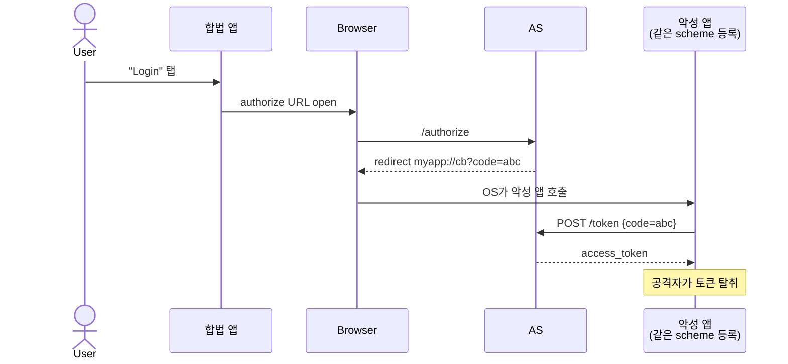
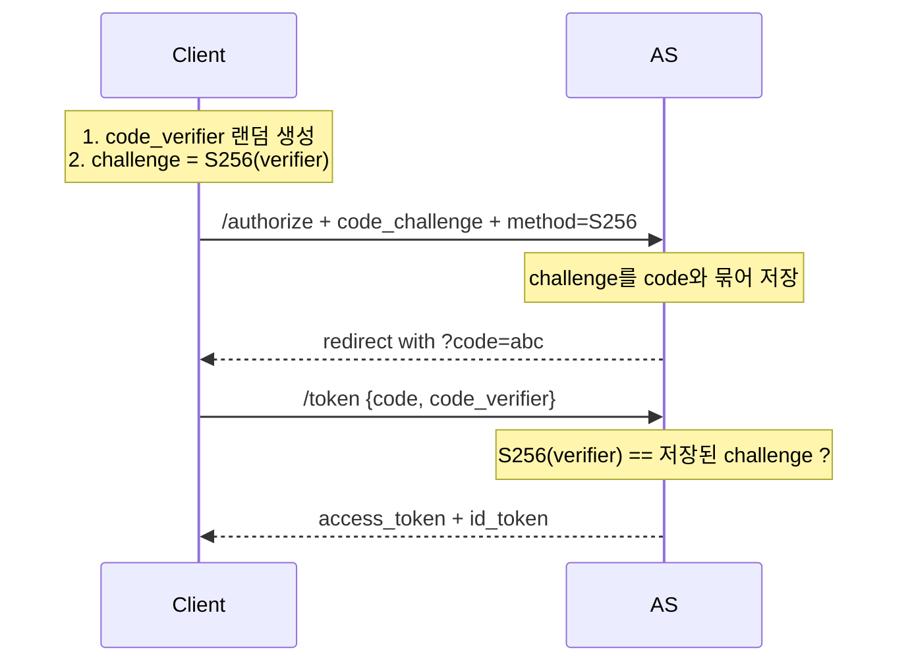
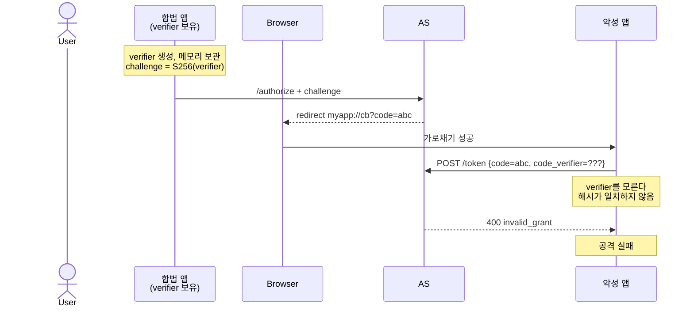

# PKCE

::: info 학습 목표
- 공개 클라이언트(Public Client)에서 Authorization Code 가로채기가 가능한 구조적 이유를 설명할 수 있다.
- `code_verifier`와 `code_challenge`의 관계, 생성 방식(S256)을 구현 수준으로 안다.
- PKCE가 어떻게 가로챈 Code만으로는 토큰 교환을 못 하게 막는지 수학적으로 이해한다.
- OAuth 2.1이 PKCE를 모든 Authorization Code Flow에 필수화한 배경을 안다.
:::

---

## 1. 공개 클라이언트의 취약점

OAuth 2.0은 클라이언트를 두 종류로 구분한다.

- <strong>Confidential Client</strong>: 서버에서 동작해 `client_secret`을 안전하게 보관할 수 있는 클라이언트. 전통적인 웹 백엔드.
- <strong>Public Client</strong>: 클라이언트 시크릿을 비밀로 유지할 수 없는 환경. 모바일 앱, SPA(Single Page Application), 데스크톱 앱 등.

Public Client가 문제가 되는 이유는, <strong>Authorization Code가 네이티브 앱·브라우저 경로를 타고 돌아오는 과정에서 탈취될 수 있기 때문</strong>이다.

### 모바일 앱의 Custom URL Scheme 가로채기

네이티브 앱은 OAuth 리다이렉트를 받기 위해 보통 <strong>Custom URL Scheme</strong>(`myapp://callback`) 또는 <strong>App Link / Universal Link</strong>를 등록한다.

- Custom URL Scheme은 <strong>여러 앱이 같은 스킴을 등록할 수 있다.</strong> OS가 어느 앱을 띄울지 미리 보장하지 않는다.
- 악성 앱이 `myapp://`를 먼저 등록하거나 동시에 등록해 놓으면, 사용자가 합법 앱의 로그인 버튼을 눌러도 악성 앱이 리다이렉트를 가로챌 수 있다.



### 추가 위협 벡터

- <strong>로그 유출</strong>: 리다이렉트 URL이 브라우저 히스토리, OS 로그, 프록시 로그 등에 남는다.
- <strong>Referer 헤더 유출</strong>: 쿼리스트링의 `code`가 외부로 새 나갈 수 있다.
- <strong>SPA의 네트워크 관찰자</strong>: 브라우저 확장·프록시가 /authorize 응답을 엿볼 수 있다.

### 왜 client_secret으로 못 막는가

Confidential Client에서는 `client_secret`이 필수라 Code만 가로채도 토큰 교환을 못 한다. 그러나 Public Client는 시크릿을 앱 바이너리나 JS 번들에 담을 수 없다. <strong>디컴파일·개발자 도구로 노출되는 시크릿은 시크릿이 아니다.</strong>

해결책이 필요했다. 그것이 PKCE다.

---

## 2. PKCE의 핵심 아이디어

PKCE는 <strong>Proof Key for Code Exchange</strong>의 약자이며, RFC 7636로 2015년 표준화되었다. "픽시"로 읽는다.

핵심 아이디어는 단순하다.

- <strong>요청 시</strong>: 클라이언트가 "일회용 비밀(code_verifier)"의 해시(code_challenge)를 AS에 먼저 알려 준다.
- <strong>교환 시</strong>: Code를 토큰으로 바꿀 때 원본 비밀(code_verifier)을 같이 제시한다.
- AS는 받은 verifier를 해시해 사전에 저장해 둔 challenge와 비교한다. 일치해야만 토큰을 발급한다.

결과: <strong>요청을 시작한 클라이언트만 code_verifier를 알고 있으므로, Code를 가로챈 공격자는 verifier를 만들 수 없어 교환에 실패한다.</strong>



### verifier의 소유자만 통과

PKCE의 안전성은 "verifier가 <strong>요청 시작 시점에만 클라이언트 메모리에 존재</strong>하며, 외부로 절대 나가지 않는다"는 전제에 기반한다. Code는 브라우저·OS를 오가므로 노출 가능성이 있지만, verifier는 클라이언트 프로세스 내부에서만 쓰인다.

---

## 3. code_verifier → code_challenge 생성

### code_verifier 규격 (RFC 7636)

- <strong>문자셋</strong>: `[A-Z] [a-z] [0-9] "-" "." "_" "~"`
- <strong>길이</strong>: 43~128 문자
- <strong>엔트로피</strong>: 암호학적 난수로 생성 (예: 32바이트 이상을 Base64URL 인코딩)

### code_challenge 생성 방법 두 가지

| method | 계산 방식 | 권장 |
|--------|-----------|------|
| `plain` | `code_challenge = code_verifier` | 비추 (레거시용) |
| `S256`  | `code_challenge = BASE64URL(SHA256(ASCII(code_verifier)))` | <strong>표준</strong> |

S256을 쓰지 않을 이유가 거의 없다. OAuth 2.1은 `plain`을 사실상 허용하지 않는다.

### JavaScript 예시

```javascript
// Web Crypto API 사용 (브라우저/Node 18+)
function base64url(bytes) {
  return btoa(String.fromCharCode(...new Uint8Array(bytes)))
    .replace(/\+/g, '-').replace(/\//g, '_').replace(/=+$/, '');
}

async function generatePkcePair() {
  // 1. 랜덤 32바이트 → verifier (Base64URL 43자)
  const randomBytes = crypto.getRandomValues(new Uint8Array(32));
  const verifier = base64url(randomBytes);

  // 2. SHA-256(verifier) → challenge
  const hashed = await crypto.subtle.digest(
    'SHA-256',
    new TextEncoder().encode(verifier)
  );
  const challenge = base64url(hashed);

  return { verifier, challenge, method: 'S256' };
}
```

### Python 예시

```python
import hashlib, secrets, base64

def generate_pkce_pair():
    # 1. 32바이트 난수 → Base64URL 43자
    verifier = base64.urlsafe_b64encode(secrets.token_bytes(32)).rstrip(b'=').decode()

    # 2. SHA-256 해시 → Base64URL
    digest = hashlib.sha256(verifier.encode('ascii')).digest()
    challenge = base64.urlsafe_b64encode(digest).rstrip(b'=').decode()

    return {'verifier': verifier, 'challenge': challenge, 'method': 'S256'}
```

### 구체적 값 예시

```
verifier:  dBjftJeZ4CVP-mB92K27uhbUJU1p1r_wW1gFWFOEjXk
challenge: E9Melhoa2OwvFrEMTJguCHaoeK1t8URWbuGJSstw-cM
```

verifier를 SHA-256으로 해시해 Base64URL 인코딩하면 challenge가 된다. 반대 방향(challenge → verifier)은 SHA-256의 단방향성 때문에 계산 불가능하다.

---

## 4. PKCE 플로우 전체

### 요청 단계 (/authorize)

```http
GET /authorize?
  response_type=code&
  client_id=s6BhdRkqt3&
  redirect_uri=myapp://callback&
  scope=openid%20profile&
  state=abc123&
  code_challenge=E9Melhoa2OwvFrEMTJguCHaoeK1t8URWbuGJSstw-cM&
  code_challenge_method=S256
```

- 클라이언트는 `code_verifier`를 <strong>세션 메모리(또는 SessionStorage)</strong>에 보관한다.
- AS는 `code_challenge`와 `method`를 내부 세션에 code와 연결해 저장한다.

### 교환 단계 (/token)

```http
POST /token HTTP/1.1
Host: accounts.example.com
Content-Type: application/x-www-form-urlencoded

grant_type=authorization_code&
code=SplxlOBeZQQYbYS6WxSbIA&
redirect_uri=myapp%3A%2F%2Fcallback&
client_id=s6BhdRkqt3&
code_verifier=dBjftJeZ4CVP-mB92K27uhbUJU1p1r_wW1gFWFOEjXk
```

### AS 검증 로직

```
1. code로 세션 조회 → 저장된 challenge, method 획득
2. method가 S256이면:
     computed = BASE64URL(SHA256(code_verifier))
   else (plain):
     computed = code_verifier
3. computed == stored_challenge 인가?
   - 예: 토큰 발급
   - 아니오: invalid_grant 에러
4. Code 즉시 무효화 (재사용 방지)
```

### 공격 시나리오 — PKCE 적용 후



악성 앱이 Code를 가로채는 것 자체는 막지 못한다. 그러나 verifier를 모르면 그 Code는 쓸모없다. 이것이 PKCE의 핵심 보호 효과다.

---

## 5. OAuth 2.1과 PKCE 전면 필수화

OAuth 2.1(IETF Draft, 2026년 현재 최종 단계)은 OAuth 2.0의 여러 RFC를 통합하고 보안 Best Current Practice를 반영한 개정판이다. 큰 변경 중 하나가 PKCE 정책이다.

### 주요 변화

| 항목 | OAuth 2.0 | OAuth 2.1 |
|------|-----------|-----------|
| PKCE 의무화 대상 | Public Client 권장 | <strong>모든 Authorization Code Flow 필수</strong> |
| Implicit Flow | 지원 | <strong>제거</strong> |
| ROPC Grant | 지원 | <strong>제거</strong> |
| redirect_uri 매칭 | 일부 부분 일치 허용 | <strong>정확 일치 의무</strong> |
| Refresh Token | 권장 사항 | Public Client에서 Sender-Constrained 또는 Rotation 필수 |

### Confidential Client까지 PKCE를 요구하는 이유

- <strong>심층 방어(Defense in Depth)</strong>: `client_secret`이 유출되는 상황(로그·저장소·레포지토리 노출)에서도 PKCE가 추가 방어선이 된다.
- <strong>CSRF·Code Injection 대응</strong>: `state`와 별개로 PKCE는 Authorization Code Injection을 구조적으로 차단한다.
- <strong>일관성</strong>: 모든 플로우가 같은 보안 프로파일을 가지면 구현·감사 단순.

### OAuth Security BCP (RFC 9700)

2024년 발간된 RFC 9700 "OAuth 2.0 Security Best Current Practice"도 모든 Authorization Code Flow에 PKCE 사용을 권고한다. 주요 권고 조항:

- `code_challenge_method=S256`만 사용 (`plain` 금지).
- `code_verifier`는 최소 32바이트 엔트로피.
- AS는 PKCE 없는 요청을 public client로부터 받으면 거절해야 한다.
- Confidential Client도 PKCE 사용을 권장.

### 마이그레이션 체크리스트

기존 OAuth 2.0 구현을 OAuth 2.1 수준으로 올리는 최소 항목이다.

- Authorization 요청에 `code_challenge`·`code_challenge_method=S256` 추가
- 토큰 교환 시 `code_verifier` 전송
- AS가 PKCE를 지원하는지 Discovery의 `code_challenge_methods_supported`로 확인
- Implicit 플로우·ROPC가 있다면 Authorization Code + PKCE로 전환
- redirect_uri 등록·비교 로직을 정확 일치로 강화

---

## 6. 자주 빠지는 함정

### state와 PKCE의 역할 혼동

- <strong>state</strong>: CSRF 방지. 공격자가 임의의 Code를 피해자 세션에 주입(CSRF 로그인 강제)하는 것을 막는다.
- <strong>PKCE</strong>: Code 가로채기 방지. 공격자가 탈취한 Code로 토큰 교환하는 것을 막는다.

둘은 다른 공격을 다루며, <strong>함께 사용</strong>해야 한다.

### verifier 저장 위치

- SPA: SessionStorage 또는 메모리(가장 안전). LocalStorage는 피한다(XSS 노출).
- 모바일: 앱 메모리. 디스크에 쓰지 않는다.
- 인증 플로우가 여러 탭에서 동시 진행될 수 있으므로 <strong>state와 함께 key로 구분</strong>해 저장한다.

### plain method 금지

일부 구형 AS나 라이브러리는 `code_challenge_method=plain`을 기본으로 쓸 수 있다. `plain`은 challenge를 verifier와 동일하게 쓰므로, 요청 단계에서 challenge가 유출되면 verifier도 노출된다. <strong>S256만 쓰라.</strong>

### PKCE를 한다고 state를 생략하지 마라

PKCE는 "Code가 다른 사람에게 가지 않게" 하지만, "다른 사람의 Code가 내 세션에 꽂히는" CSRF는 여전히 가능하다. 두 방어는 직교한다.

---

::: tip 핵심 정리
- Public Client는 `client_secret`을 안전하게 보관할 수 없어, Authorization Code 가로채기에 구조적으로 취약하다. PKCE는 이를 보완하는 RFC 7636 표준이다.
- PKCE의 원리는 "요청자만 아는 일회용 비밀(verifier)"의 해시를 미리 약속하고, 교환 시점에 원본 비밀을 제시하는 것이다. `code_challenge = BASE64URL(SHA256(code_verifier))`.
- `code_challenge_method`는 `S256`만 사용한다. `plain`은 보안 이득이 없다.
- PKCE는 Code 가로채기를 막지만 CSRF(로그인 강제)는 막지 못한다. `state` 파라미터와 함께 반드시 사용한다.
- OAuth 2.1과 RFC 9700은 Confidential Client를 포함한 모든 Authorization Code Flow에 PKCE를 필수화한다. 신규 구현에서는 예외 없이 적용한다.
:::

## 다음 챕터

- 이전 : [Discovery · JWKS · UserInfo](/study/oauth/11-discovery-jwks-userinfo)
- 다음 : [토큰 수명 관리 전략](/study/oauth/13-token-strategy)
