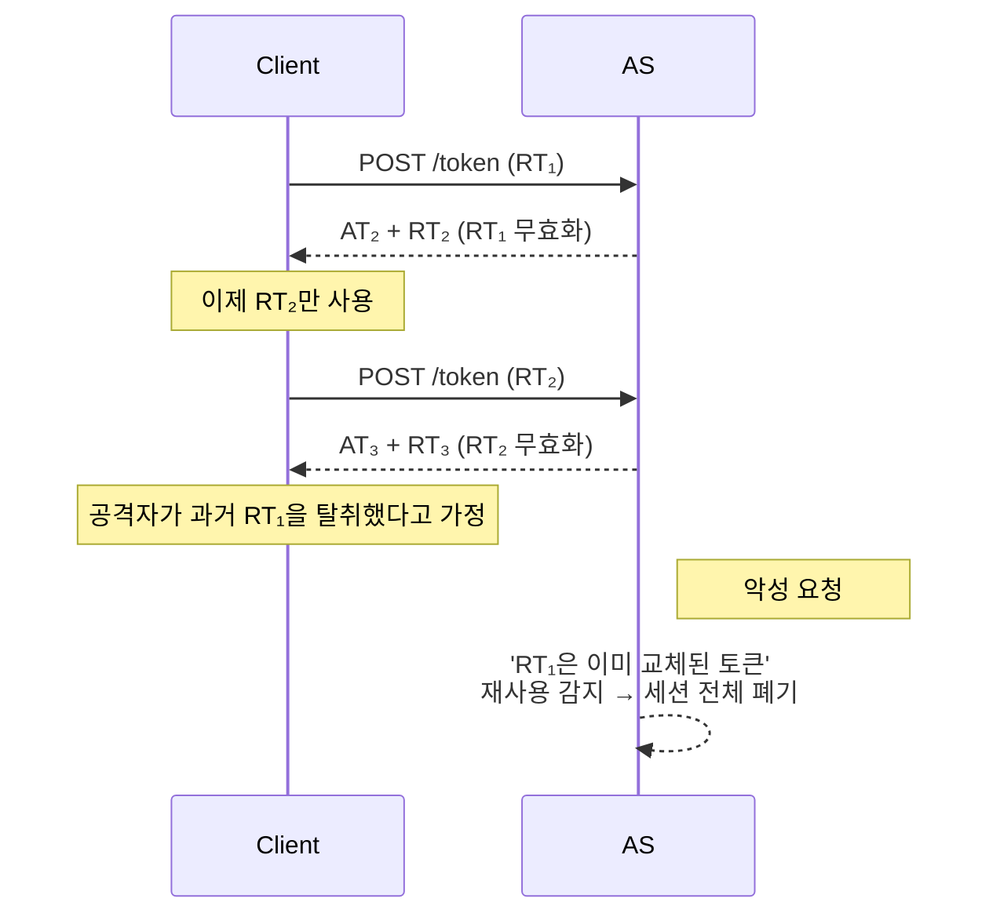
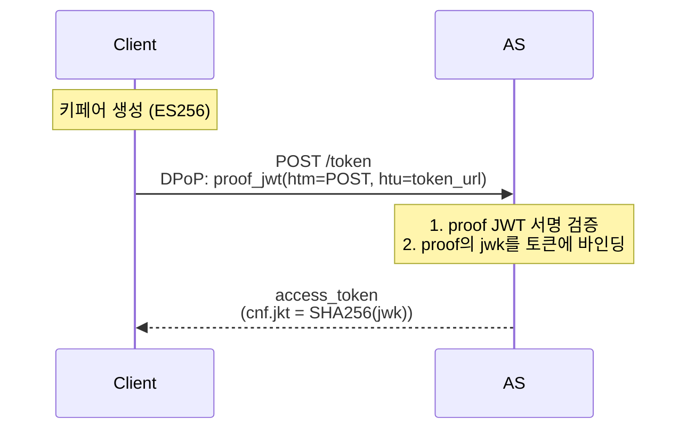

# 토큰 수명 관리 전략

::: info 학습 목표
- Bearer Token의 근본적 한계와 "토큰 탈취 시 속수무책"인 이유를 설명할 수 있다.
- Refresh Token Rotation의 세대 추적과 재사용 감지 로직을 구현 수준으로 이해한다.
- DPoP(RFC 9449)가 Proof-of-Possession을 어떻게 구현하는지 안다.
- mTLS Client Certificate-Bound Token(RFC 8705)의 `cnf.x5t#S256` 바인딩 메커니즘을 안다.
:::

---

## 1. Bearer Token의 문제

OAuth 2.0이 규정하는 기본 토큰 타입은 `Bearer`다. "Bearer"는 "소지자"라는 뜻 그대로, <strong>토큰을 가진 자 누구에게나 권한을 인정</strong>한다.

```http
Authorization: Bearer eyJhbGciOi...
```

### Bearer의 구조적 한계

- <strong>토큰 자체가 권한의 유일한 증거</strong>다. 발신자가 누구인지, 정당한 소유자인지 검증하지 않는다.
- 중간자(MITM)·프록시·로그·브라우저 확장·악성 앱 등 어떤 경로로든 토큰이 유출되면, 공격자는 <strong>만료 시각까지 자유롭게</strong> 그 토큰을 사용할 수 있다.
- 짧은 Access Token 수명(5~15분)은 완화 수단이지만, Refresh Token으로 재발급받는 구조에서 RT가 유출되면 장기간 토큰 자동 재생산이 가능하다.

### 유출 시나리오 4가지

| 시나리오 | 탈취 경로 | 완화 방안 |
|----------|-----------|-----------|
| XSS | 브라우저에서 JS로 localStorage 읽기 | HttpOnly Cookie, BFF |
| 로그 유출 | Access Log의 Authorization 헤더 | 로그 마스킹, 짧은 exp |
| 프록시 관찰 | 사내 SSL Interception 프록시 | 토큰 페이로드에 민감정보 금지 |
| 단말 분실 | 모바일 앱의 Keychain 탈취 | RTR, 디바이스 바인딩 |

Bearer의 한계를 근본적으로 해결하려면 <strong>"토큰을 가진 것만으로는 부족하고, 발신자가 정당한 소유자임을 추가로 증명"</strong>해야 한다. 이것이 Sender-Constrained Token의 개념이다.

이 챕터는 세 방향으로 대책을 살펴본다.

- <strong>Refresh Token Rotation</strong>: RT 유출을 감지하고 조기 차단.
- <strong>DPoP</strong>: 요청마다 개인키 서명으로 소유 증명.
- <strong>mTLS Bound Token</strong>: 클라이언트 TLS 인증서에 토큰을 바인딩.

---

## 2. Refresh Token Rotation (RTR)

Refresh Token Rotation은 "매 갱신마다 새 RT를 발급하고, 이전 RT를 즉시 무효화"하는 전략이다. 구 RT가 재사용되면 탈취 의심으로 간주해 <strong>전체 세션을 폐기</strong>한다.

상세 구현 사례는 블로그 포스트 [Refresh 토큰과 RTR](/posts/spring/2023-04-18-rtr)에 Spring Security 기반 예제로 정리되어 있다.

### 동작 개요



### 재사용 감지 로직

AS는 RT마다 <strong>세대(generation)</strong>를 추적한다. 한 "패밀리(family)"의 RT가 순차적으로 갱신되며, 같은 패밀리 내에서 <strong>과거 세대 RT가 다시 제시되면</strong> 탈취로 간주한다.

### RT 패밀리 테이블 예시

| family_id | gen | rt_id | status | issued_at | replaced_by |
|-----------|-----|-------|--------|-----------|-------------|
| fam_001 | 1 | rt_a1 | replaced | 10:00 | rt_b2 |
| fam_001 | 2 | rt_b2 | replaced | 10:15 | rt_c3 |
| fam_001 | 3 | rt_c3 | <strong>active</strong> | 10:30 | null |

여기서 공격자가 `rt_a1`을 제출하면 AS는 다음을 수행한다.

```
1. rt_a1 조회 → status가 replaced
2. 재사용 감지! fam_001 전체를 폐기
   - fam_001의 모든 RT를 revoked 상태로 전환
   - 현재 발급된 Access Token도 블록리스트에 추가 (또는 짧은 AT 수명에 의존)
3. 클라이언트에 invalid_grant 응답
4. 운영 알림: 세션 탈취 의심 감사 로그 기록
```

### 감지 플로우 차트

```mermaid
flowchart TD
    Start[/token with RT 수신] --> Find[DB에서 RT 조회]
    Find --> NotFound{RT 존재?}
    NotFound -->|No| Reject1[invalid_grant]
    NotFound -->|Yes| Status{status}
    Status -->|active| Rotate[새 RT 발급<br>기존 RT → replaced]
    Status -->|replaced| Breach[재사용 감지!]
    Status -->|revoked| Reject2[invalid_grant]
    Breach --> KillFamily[패밀리 전체 revoked]
    KillFamily --> Alert[운영 알림]
    Alert --> Reject3[invalid_grant]
    Rotate --> Issue[AT + 새 RT 반환]
```

### 정상 vs 탈취 상황 구분의 어려움

현실에서는 모바일 앱 네트워크 재전송이나 클라이언트 동시성 이슈로 <strong>같은 RT를 짧은 간격으로 두 번 보내는 정상 케이스</strong>가 발생한다. 대응 방안:

- <strong>짧은 grace period</strong>: 같은 RT의 재요청을 N초 이내에는 "첫 요청과 동일한 응답" 반복 반환.
- <strong>요청 고유성</strong>: 클라이언트가 `request_id`를 함께 보내 멱등성 구분.
- <strong>네트워크 오류 재시도는 단일 inflight</strong> 유지하도록 클라이언트 측 뮤텍스.

### 장점과 한계

- <strong>장점</strong>: Bearer 구조를 그대로 두면서도 장기 세션 탈취를 조기 감지. 서버 상태만 있으면 구현 가능.
- <strong>한계</strong>: AT 자체의 탈취는 막지 못함(짧은 수명에 의존). 재사용 감지 false positive 가능성.

---

## 3. Sender-Constrained Token 개요

Sender-Constrained Token은 <strong>"이 토큰은 특정 발신자만 사용할 수 있다"</strong>는 제약을 토큰에 내장한 것이다. 핵심은 "토큰 발급 시 발신자의 키 재료(public key, certificate)를 토큰에 바인딩"하고, "토큰 사용 시 발신자가 그 키를 실제로 소유함을 증명"하게 하는 것이다.

| 방식 | 바인딩 대상 | 증명 방법 | 적용 레이어 |
|------|-------------|-----------|-------------|
| DPoP | 클라이언트의 JWK | 요청마다 JWT 서명 | 애플리케이션(HTTP 헤더) |
| mTLS Bound | TLS 클라이언트 인증서 지문 | TLS 핸드셰이크 | 전송 계층 |
| Token Binding | TLS Exporter 값 | TLS Binding | 전송 계층 (폐기됨) |

Token Binding(RFC 8471)은 브라우저 지원 부재로 2018년에 사실상 폐기되었다. 현재 실전에서 의미 있는 것은 DPoP과 mTLS다.

---

## 4. DPoP (Demonstrating Proof-of-Possession)

DPoP는 RFC 9449(2023)로 표준화된 경량 Proof-of-Possession 메커니즘이다. 클라이언트가 키페어를 생성해 공개키를 토큰에 바인딩하고, 요청마다 개인키로 <strong>DPoP Proof JWT</strong>를 서명해 보낸다.

### 클라이언트 측 준비

- 클라이언트가 기동 시 키페어 생성(ES256 권장). 개인키는 디스크에 쓰지 않는다. SPA는 브라우저 메모리나 비내보낸(non-extractable) Web Crypto 키.
- 공개키는 JWK 형태로 준비해 토큰 요청에 포함.

### 토큰 발급 흐름



### DPoP Proof JWT 구조

```
Header:
  typ: "dpop+jwt"
  alg: "ES256"
  jwk: { kty, crv, x, y }       ← 공개키 포함

Payload:
  jti: "unique-id"              ← nonce-like
  htm: "POST"                   ← HTTP method
  htu: "https://rs/resource"    ← HTTP target URL
  iat: 1715000000
  ath: "b64(SHA256(AT))"        ← AT 요청 시 AT 바인딩

Signature: (개인키로 서명)
```

### 리소스 서버 요청

```http
GET /resource HTTP/1.1
Host: rs.example.com
Authorization: DPoP eyJhbGciOi...AT
DPoP: eyJ0eXAiOiJkcG9wK2p3dC...proof
```

주목할 점은 두 가지다.

- `Authorization`의 스킴이 `Bearer`가 아니라 <strong>`DPoP`</strong>다.
- 매 요청마다 <strong>새 DPoP Proof JWT</strong>가 필요하다. `htm`·`htu`에 해당 요청의 method와 URL을 담는다.

### RS 검증 로직

```
1. Authorization 헤더에서 AT 추출 → 서명/만료 검증
2. AT의 cnf.jkt 추출 (바인딩된 공개키 지문)
3. DPoP 헤더에서 proof JWT 추출
4. proof header의 jwk로 서명 검증
5. jwk의 SHA-256 지문이 cnf.jkt와 일치하는가?
6. proof의 htm, htu가 현재 요청과 일치하는가?
7. proof의 iat이 최근(±1분)이고 jti가 재사용 아닌가?
```

### DPoP의 효과

공격자가 AT를 탈취해도 클라이언트의 <strong>개인키가 없으면 유효한 DPoP Proof를 만들 수 없다</strong>. AT 자체만으로는 쓸모가 없어진다.

### 한계

- 매 요청마다 JWT 서명이 필요해 <strong>연산 비용 증가</strong>. ES256은 비교적 빠르지만 무시할 수준은 아니다.
- RS에서 `jti`를 단기간 저장해 재사용 방지해야 함. 분산 RS 환경에서는 replay cache 공유가 필요.
- Proof의 `htu`가 정확해야 하므로 프록시가 URL을 재작성하면 실패.

---

## 5. mTLS Certificate-Bound Token

RFC 8705(2020)는 TLS 클라이언트 인증서에 Access Token을 바인딩하는 방식을 규정한다. 엔터프라이즈 B2B 시나리오에서 널리 쓰인다.

### 개요

- 클라이언트는 토큰 요청 시 mTLS로 AS에 연결. AS는 TLS 층에서 클라이언트 인증서를 확인.
- 발급된 Access Token의 `cnf` 클레임에 <strong>클라이언트 인증서의 SHA-256 지문</strong>을 담는다.
- 리소스 서버는 TLS 핸드셰이크에서 얻은 클라이언트 인증서 지문이 AT의 `cnf.x5t#S256`과 일치하는지 검증.

### AT의 cnf 클레임 예시

```json
{
  "iss": "https://as.example.com",
  "sub": "service-A",
  "aud": "https://rs.example.com",
  "exp": 1715003600,
  "cnf": {
    "x5t#S256": "bwcK0esc3ACC3DB2Y5_lESsXE8o9ltc05O89jdN-dg2"
  }
}
```

`x5t#S256`은 X.509 인증서의 SHA-256 thumbprint다.

### RS 검증 흐름

```
1. TLS 핸드셰이크 완료 → 클라이언트 인증서 확보
2. 인증서 SHA-256 지문 계산 → cert_thumbprint
3. AT 서명 검증, cnf.x5t#S256 추출 → bound_thumbprint
4. cert_thumbprint == bound_thumbprint 인가?
   - 예: 처리
   - 아니오: 401 invalid_token
```

### 장점

- 별도 애플리케이션 레벨 서명이 필요 없다. TLS 스택이 모든 무거운 일을 한다.
- 성능 영향이 DPoP보다 작다(핸드셰이크는 세션 재사용).
- 엔터프라이즈 PKI가 이미 있다면 즉시 도입 가능.

### 한계

- <strong>브라우저/SPA는 현실적으로 못 씀</strong>. 클라이언트 인증서 관리 UX가 사용자에게 맞지 않음.
- 서비스 메시·API 게이트웨이에서 TLS가 종료되면 클라이언트 인증서가 손실됨. 게이트웨이가 지문을 헤더(`x-ssl-client-sha256`)로 전달하도록 구성 필요.
- 인증서 로테이션 시 토큰도 재발급 필요.

주된 사용처는 <strong>서비스 간(B2B·M2M) 통신</strong>이다. 모바일·SPA에는 DPoP가 더 적합하다.

---

## 6. 전략 선택 가이드

실무에서 어떤 조합을 쓸지 결정할 때의 가이드라인이다.

### 애플리케이션 유형별 권장

| 클라이언트 | AT 보호 | RT 보호 |
|-----------|---------|---------|
| 전통 웹 백엔드(Confidential) | Bearer + 짧은 exp | Rotation |
| 모바일 네이티브 앱 | DPoP 권장 | Rotation + 디바이스 바인딩 |
| SPA | <strong>BFF 패턴(다음 챕터)</strong> 우선, 불가피 시 DPoP | BFF 내부 저장 |
| 서비스 간(M2M) | mTLS Bound | RT 불필요한 경우가 많음 (Client Credentials) |

### 조합 패턴

- <strong>RTR + DPoP</strong>: AT는 DPoP로 소유 증명, RT는 Rotation으로 탈취 감지. 가장 강력한 조합.
- <strong>RTR + mTLS</strong>: 엔터프라이즈 B2B에 적합.
- <strong>Short AT + RTR</strong>: 가장 널리 쓰이는 중간 강도 프로파일.

### 현실적 판단

완벽한 보안은 없다. 트레이드오프를 받아들이고 <strong>"이 서비스가 노리는 위협 수준"</strong>에 맞게 선택한다.

- 소규모 B2C 서비스: Short AT + RTR로 충분.
- 금융·헬스케어 등 규제 산업: DPoP 또는 mTLS 필수.
- 모바일 전용 앱: OS Keystore에 저장된 키 + DPoP가 유력.

### 공통 체크리스트

- AT 수명은 <strong>5~15분</strong> 범위.
- RT는 <strong>Rotation</strong>을 기본값으로.
- 토큰 revocation 엔드포인트를 제공하고 클라이언트가 로그아웃 시 호출.
- 발급·사용·revocation 이벤트를 <strong>감사 로그</strong>로 남긴다.
- AS·RS 간 시계 동기화(NTP)는 필수. 서명 토큰의 exp/iat 검증이 깨지는 주된 원인이다.

---

::: tip 핵심 정리
- Bearer Token은 "소지자가 곧 정당한 사용자"로 간주하는 구조라, 유출 시 만료까지 무력하다. 이를 보완하려면 짧은 수명·Rotation·Sender-Constrained 전략을 조합한다.
- Refresh Token Rotation은 매 갱신마다 RT를 교체하고, 과거 RT 재사용을 탈취 신호로 간주해 패밀리 전체를 폐기한다. 정상 재시도를 구분하려 짧은 grace period를 둔다.
- DPoP는 클라이언트가 키페어를 생성해 공개키를 AT에 바인딩하고 요청마다 개인키로 Proof JWT를 서명한다. AT 탈취자는 개인키가 없어 재사용 불가.
- mTLS Bound Token은 TLS 클라이언트 인증서의 SHA-256 지문을 AT의 `cnf.x5t#S256`에 심어, RS가 TLS 층 검증으로 소유를 확인한다. B2B·M2M 환경에 적합.
- 신규 구현의 권장 조합은 "Short AT + RTR + (필요 시 DPoP)"이며, 애플리케이션 유형과 규제 수준에 따라 mTLS나 BFF 패턴을 추가한다.
:::

## 다음 챕터

- 이전 : [PKCE](/study/oauth/12-pkce)
- 다음 : [토큰 저장·전송과 BFF 패턴](/study/oauth/14-token-storage-bff)
