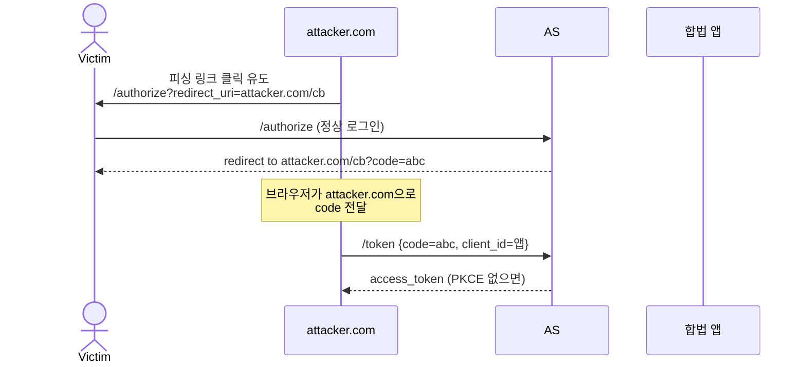
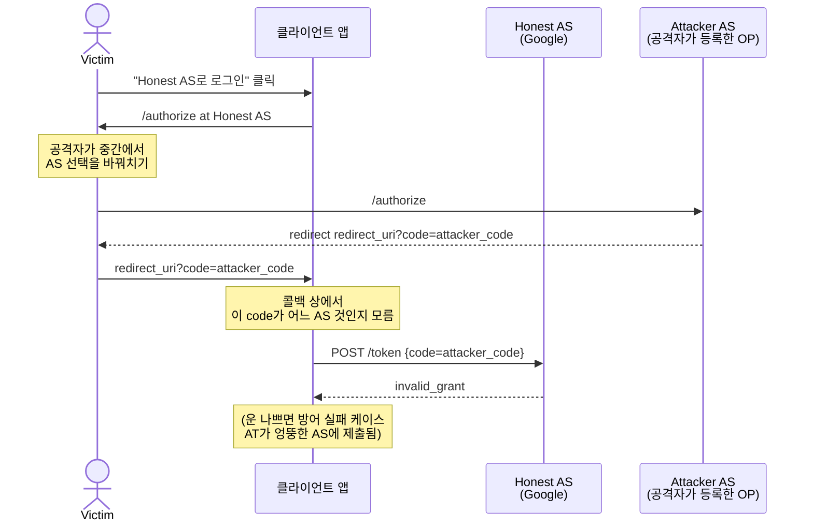
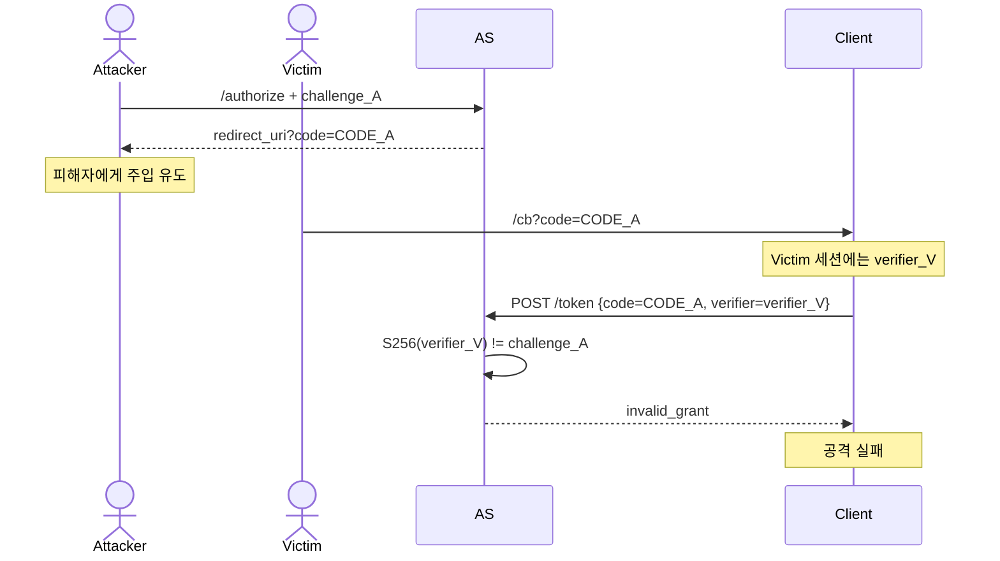

# OAuth를 노리는 공격들

::: info 학습 목표
- Open Redirect, State CSRF, Mix-up Attack, Authorization Code Injection의 메커니즘을 각각 설명할 수 있다.
- 각 공격에 대응하는 방어책(redirect_uri 완전 일치, state, iss 검증, PKCE)을 실제 구현에 적용할 수 있다.
- RFC 9700(OAuth Security BCP)의 주요 권고를 항목 단위로 안다.
- 자체 서비스의 OAuth 구현을 점검하기 위한 체크리스트를 만들 수 있다.
:::

---

## 1. Open Redirect

### 공격 개요

Open Redirect는 <strong>AS가 등록된 redirect_uri를 느슨하게 검증</strong>할 때 발생한다. 공격자는 합법 AS의 `/authorize`에 자기가 제어하는 redirect_uri를 실어, 사용자가 로그인을 마치면 Code가 공격자에게 가도록 만든다.

### 취약 AS 예시

AS가 redirect_uri 매칭을 "prefix 매칭"이나 "query 무시"로 구현한 경우를 가정한다.

```
등록된 redirect_uri: https://app.example.com/callback
클라이언트 요청:    https://app.example.com.attacker.com/callback
                    ↑ prefix 매칭이면 매칭될 수 있음
```

```
등록된 redirect_uri: https://app.example.com/callback
클라이언트 요청:    https://app.example.com/callback@attacker.com/xyz
                    ↑ URL 파서 차이로 attacker.com으로 흘러갈 수 있음
```

### 실제 공격 시퀀스



### 방어 — 완전 일치

- <strong>redirect_uri는 문자열 완전 일치로 검증</strong>한다. scheme, host, port, path 모두 동일해야 한다.
- 와일드카드 등록을 허용하지 말 것. `https://*.example.com/callback`류는 DNS 하이재킹 등으로 우회된다.
- 여러 redirect_uri가 필요하면 전부 사전 등록. 클라이언트 요청과 등록 목록 중 하나와 정확히 일치해야만 수용.
- URL 파싱에 앞서 <strong>정규화(normalize)</strong> 단계를 둘 것. `%2e`, trailing slash, 대소문자 혼합 등.

### 관련 사례

- Facebook, Google, Microsoft 모두 과거 하위 서비스에서 redirect_uri 검증 우회로 취약점이 보고된 적이 있다.
- `@` 기호 URL 파싱 차이(RFC 3986 vs WHATWG URL)를 이용한 공격이 여러 CTF·버그바운티에서 반복 등장.

### OAuth 2.1의 입장

OAuth 2.1은 <strong>"redirect_uri는 정확 문자열 매칭만 허용"</strong>으로 명시한다. 부분 매칭·쿼리 무시 같은 유연한 처리는 모두 금지된다.

---

## 2. State CSRF

### 공격 개요

`state` 파라미터를 클라이언트가 검증하지 않으면, 공격자가 <strong>자신의 OAuth 세션을 피해자의 브라우저에 이식</strong>할 수 있다. 피해자는 자기도 모르게 공격자 계정으로 로그인된다.

이로 인해 피해자가 "자기 계정"이라고 믿으며 저장하는 개인 정보(메모, 결제 정보, 업로드 파일 등)가 <strong>공격자 계정에 쌓인다</strong>. 공격자는 나중에 자기 계정으로 로그인해 그 정보를 회수한다.

### 공격 시나리오

```
1. 공격자가 자기 계정으로 앱에 로그인 시도
2. /authorize 단계까지 진행해 redirect_uri에 도착하기 직전의
   code=XXXX 링크를 획득
3. 피해자에게 "이 링크 눌러 보세요" 유도
4. 피해자 브라우저가 그 링크를 열면, 앱은 code=XXXX를 토큰으로 교환
5. 피해자의 세션이 공격자 계정으로 생성됨
6. 피해자는 "내 계정"인 줄 알고 개인 정보 입력
7. 공격자가 자기 계정으로 로그인하면 피해자가 입력한 정보가 보임
```

### 방어 — state 파라미터

```
/authorize?
  response_type=code&
  client_id=...&
  redirect_uri=...&
  scope=...&
  state=RANDOM_UNPREDICTABLE_VALUE
```

- 클라이언트가 요청 시작 시 <strong>암호학적 난수</strong> state를 생성하고 사용자 세션(쿠키 혹은 서버 세션)에 저장.
- AS는 같은 state를 redirect로 돌려 준다.
- 콜백에서 받은 state가 저장된 값과 일치해야만 교환 진행. 불일치면 거절.

### 왜 동작하는가

공격자는 "자기 세션의 state 값"과 "피해자 브라우저의 저장된 state 값"을 동기화할 수 없다. 공격자의 link를 피해자가 열면 state 불일치로 앱이 거절하며 공격이 차단된다.

### OIDC에서는 nonce도 추가

ID Token에는 `nonce` 클레임이 들어간다. state가 브라우저의 CSRF를 막는다면, nonce는 <strong>ID Token의 재사용(replay)</strong>을 막는 역할로 구분된다. 두 가지는 직교하므로 함께 쓴다.

### 구현 시 주의

- state를 URL 파라미터에만 보관하지 말 것. 쿠키 또는 서버 세션에 "현재 OAuth 요청의 state"를 저장하고 콜백에서 비교.
- 탭이 여럿 동시에 OAuth를 수행할 수 있으므로, 세션 내에 <strong>state → request context 맵</strong>을 두고 key로 찾는 방식이 안전.
- state 길이는 최소 16바이트 난수.

---

## 3. Mix-up Attack

### 공격 개요

Mix-up Attack은 2016년 Fett 등이 IETF에 보고한 공격이다. <strong>클라이언트가 여러 AS를 지원</strong>할 때(예: "Google로 로그인", "Microsoft로 로그인"), 공격자가 자기 AS로 받은 code나 토큰을 합법 AS로 속여 제출하도록 유도한다.

### 필수 조건

- 클라이언트가 <strong>여러 AS</strong>에 동일한 redirect_uri를 사용.
- 클라이언트가 "지금 돌아온 code가 어느 AS에서 발급된 것인지"를 분별하지 않음.

### 공격 시퀀스



실제 공격 효과는 구현 디테일에 따라 여러 방식으로 나타난다. 핵심은 <strong>"돌아온 code/token이 어느 AS에서 온 것인지 분별 안 함"</strong>이 공격 벡터라는 점이다.

### 방어 — iss 파라미터와 iss 응답

RFC 9207 "OAuth 2.0 Authorization Server Issuer Identification"(2022)은 방어책을 표준화했다.

- AS는 Authorization Response에 <strong>`iss` 파라미터</strong>를 포함해 "내가 누구인지" 알린다.
- 클라이언트는 받은 `iss`가 "방금 자신이 요청을 보낸 AS"와 일치하는지 검증한다.

```
# 정상 AS의 redirect
https://client.example.com/cb?
  code=abc&
  state=xyz&
  iss=https://honest-as.example.com
```

### 추가 방어

- 각 AS마다 별도의 redirect_uri를 사용: `/cb/google`, `/cb/microsoft`. 콜백 경로로 AS를 분별.
- OIDC에서는 ID Token의 `iss`로 검증 가능.
- 클라이언트가 "지금 어떤 AS로 요청 보냈는지"를 세션에 저장하고 콜백에서 비교.

### 조직적 대응

멀티 IdP를 지원하는 엔터프라이즈 앱이라면 다음 정책을 확정해 둔다.

- 지원 AS 목록을 <strong>화이트리스트</strong>로 고정.
- AS마다 별도 client_id, redirect_uri.
- Discovery 문서의 `issuer`를 신뢰 루트로 등록.

---

## 4. Authorization Code Injection

### 공격 개요

Code Injection은 공격자가 <strong>자신의 세션에서 발급된 code를 피해자의 콜백 URL에 주입</strong>하는 공격이다. State CSRF와 비슷해 보이지만, 진짜 위험은 "PKCE 없이 Code를 교환하는 플로우"에서 AS가 Code와 세션을 느슨하게 묶을 때 드러난다.

### 세부 시나리오 (PKCE 없는 클라이언트)

```
1. 공격자가 자신의 브라우저로 합법 앱에 OAuth 진행
2. /authorize 완료 후 code=ATTACK_CODE 획득 (아직 /token 교환 전)
3. 피해자를 유도해 /cb?code=ATTACK_CODE를 열게 함
4. 피해자 세션에서 클라이언트가 ATTACK_CODE를 교환
5. 피해자 세션이 공격자 계정으로 전환
```

이는 사실상 state CSRF의 확장이다. state만 잘 체크해도 상당 부분 막히지만, <strong>state가 동적 난수 대신 정적 값</strong>이거나, 공격자가 피해자의 state를 엿볼 수 있는 환경이라면 여전히 가능하다.

### PKCE가 구조적으로 차단하는 방식

PKCE를 쓰면 /token 교환에 `code_verifier`가 필요하다. 공격자 세션의 code에는 공격자 세션의 challenge가 바인딩되어 있다. 피해자 세션에는 <strong>자신의 verifier</strong>만 있고, 그 verifier는 공격자의 challenge와 맞지 않는다. 따라서 교환이 실패한다.



### 방어 조합

- <strong>PKCE</strong>: Code와 클라이언트 세션을 암호학적으로 묶는다(CH12).
- <strong>state</strong>: 콜백이 "내가 시작한 요청"인지 확인.
- <strong>nonce</strong>(OIDC): ID Token 재사용 방지.
- <strong>iss 검증</strong>(멀티 AS): Mix-up 동반 방지.

### RFC 9700 권고 요약

- Authorization Code는 <strong>1회 사용 후 즉시 무효화</strong>.
- PKCE를 모든 플로우에 필수 적용.
- 콜백에서 `state`, `iss` 검증을 서버 측에서 수행.
- redirect_uri는 정확 문자열 매칭.

---

## 5. 방어 체크리스트 요약

실무 OAuth/OIDC 구현을 점검할 때 쓸 수 있는 체크리스트다. 표의 각 항목은 앞 절에서 다룬 공격 중 하나 이상을 차단한다.

### 클라이언트 측 체크리스트

| 항목 | 체크 |
|------|------|
| state를 암호학적 난수로 생성하고 세션에 저장 | state CSRF |
| state가 콜백과 일치하는지 서버에서 검증 | state CSRF |
| PKCE(S256) 사용 | Code 가로채기, Code Injection |
| code_verifier는 세션 저장, 디스크 쓰지 않음 | verifier 유출 |
| redirect_uri는 고정 값, 빌드 타임에 박음 | Open Redirect |
| iss(또는 ID Token의 iss) 검증 | Mix-up |
| ID Token의 서명·iss·aud·exp·nonce 전량 검증 | 토큰 위조, Replay |
| 허용 alg 화이트리스트 고정(RS256 등) | 알고리즘 혼동 |
| Access Token은 HttpOnly Cookie 또는 BFF로 | XSS 탈취 |
| Refresh Token Rotation 사용 | 장기 탈취 감지 |

### AS(서버) 측 체크리스트

| 항목 | 체크 |
|------|------|
| 등록된 redirect_uri와 <strong>완전 문자열 일치</strong> 매칭 | Open Redirect |
| Authorization Code는 1회 사용 후 즉시 무효화 | Code 재사용 |
| Code는 짧은 수명(30~60초) | Code 탈취 창 축소 |
| PKCE 미전송 요청 거절(특히 Public Client) | Code 가로채기 |
| Authorization Response에 `iss` 포함 (RFC 9207) | Mix-up |
| 발급된 AT/RT의 감사 로그 유지 | 탈취 조사 |
| JWKS 키 로테이션을 정기 수행 | 장기 키 유출 |
| Token Revocation 엔드포인트 제공 | 로그아웃·폐기 |

### 운영 체크리스트

| 항목 | 체크 |
|------|------|
| HTTPS 강제(HSTS 포함) | 전송 도청 |
| HTTP 헤더에 토큰이 실린 요청은 <strong>로그 마스킹</strong> | 로그 유출 |
| npm/Maven 의존성 취약점 스캔 정기 | Supply Chain XSS |
| CSP·SRI 적용 | 스크립트 주입 |
| Penetration Test / Bug Bounty 운영 | 구현 실수 탐지 |
| Incident Response 플레이북 마련 | 탈취 발생 시 초기 대응 |

### 주요 표준 문서

| 표준 | 내용 |
|------|------|
| RFC 6749 | OAuth 2.0 Core |
| RFC 7636 | PKCE |
| RFC 8252 | OAuth for Native Apps |
| RFC 8705 | mTLS Client Authentication & Bound Tokens |
| RFC 9207 | Authorization Server Issuer Identification |
| RFC 9449 | DPoP |
| RFC 9700 | OAuth 2.0 Security Best Current Practice |
| draft-ietf-oauth-v2-1 | OAuth 2.1 (통합·개정판) |
| draft-ietf-oauth-browser-based-apps | 브라우저 앱 권고(BFF 우선) |

RFC 9700은 OAuth 보안 관련 권고의 합본에 가깝다. 이 문서 하나를 따라가며 자사 구현을 점검하면 대부분의 전형적 공격을 차단할 수 있다.

---

::: tip 핵심 정리
- Open Redirect는 redirect_uri의 느슨한 매칭에서 비롯된다. 정확 문자열 일치 외에 와일드카드·prefix·쿼리 무시 매칭을 금지해야 한다.
- state 파라미터는 암호학적 난수로 생성·저장·비교해야 하며, 생략하면 공격자가 자기 세션을 피해자 브라우저에 이식하는 CSRF가 가능하다.
- Mix-up Attack은 다중 AS 환경에서 "돌아온 code가 어느 AS 것인지 분별 안 함"을 노린다. RFC 9207의 `iss` 응답 파라미터와 AS별 분리된 redirect_uri로 대응한다.
- Authorization Code Injection은 state 검증이 허약한 환경에서 가능하며, PKCE가 Code와 verifier의 암호학적 바인딩으로 구조적으로 차단한다.
- 방어의 본질은 개별 조치가 아니라 조합이다. state + PKCE + iss 검증 + redirect_uri 정확 일치 + RT Rotation을 기본 세트로 가져가고, RFC 9700을 체크리스트로 삼아 자사 구현을 정기 감사한다.
:::

## 다음 챕터

- 이전 : [토큰 저장·전송과 BFF 패턴](/study/oauth/14-token-storage-bff)
- 다음 : [Spring Security OAuth2 Client](/study/oauth/16-spring-security)
