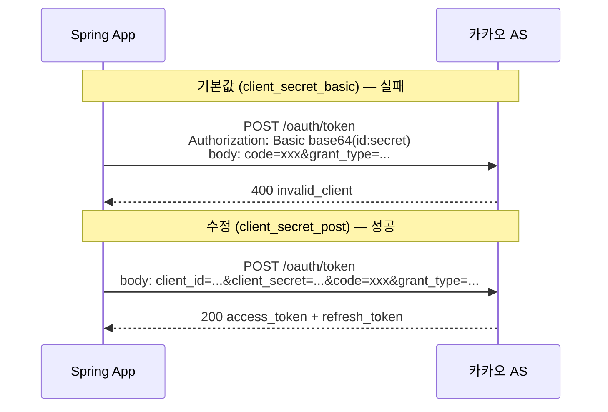
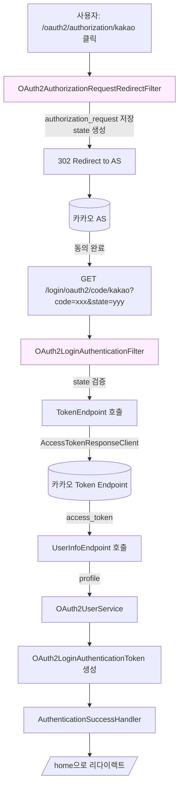

# Spring Security OAuth2 Client 실전

::: info 학습 목표
- Spring Security OAuth2 Client 설정을 작성할 수 있다.
- CommonOAuth2Provider가 제공하는 것과 그 한계를 안다.
- 카카오의 client_id 위치 등 비표준 이슈를 파악한다.
- OAuth2LoginAuthenticationFilter의 흐름을 설명할 수 있다.
:::

---

## 1. 의존성과 기본 설정

Spring Security는 OAuth 2.0 Client 기능을 `spring-boot-starter-oauth2-client` 한 줄로 통합 제공한다. 이 스타터는 RP(Relying Party)로 동작하는 데 필요한 필터, 엔드포인트, 자동 설정을 모두 포함한다.

### 의존성 추가

Gradle(Kotlin DSL) 기준으로 다음과 같이 추가한다.

```kotlin
dependencies {
    implementation("org.springframework.boot:spring-boot-starter-security")
    implementation("org.springframework.boot:spring-boot-starter-oauth2-client")
    implementation("org.springframework.boot:spring-boot-starter-web")
}
```

Spring Boot 3.x부터는 `org.springframework.security:spring-security-oauth2-client`가 자동으로 묶여 들어오므로 별도 명시는 필요 없다. 다만 토큰 기반 API를 함께 제공한다면 `spring-boot-starter-oauth2-resource-server`를 따로 추가해야 한다.

### 자동 설정이 하는 일

`spring-boot-starter-oauth2-client`를 추가하면 Spring Security가 아래 빈(bean)들을 조건부로 등록한다.

| 빈 | 역할 |
|----|----|
| `ClientRegistrationRepository` | `application.yml`에 등록된 Client 메타데이터를 보관한다 |
| `OAuth2AuthorizedClientRepository` | 로그인 성공 후 발급받은 Access/Refresh 토큰을 사용자 단위로 저장한다 |
| `OAuth2LoginAuthenticationFilter` | `/login/oauth2/code/{registrationId}` 요청을 가로채 토큰 교환을 수행한다 |
| `OAuth2AuthorizationRequestRedirectFilter` | `/oauth2/authorization/{registrationId}` 요청에서 AS로 리다이렉트한다 |

이 네 조각이 맞물려 "로그인 버튼 클릭 → 동의 → 콜백 → 사용자 생성"까지 자동으로 이어진다.

### application.yml 기본 등록

가장 단순한 Google 로그인 설정은 다음과 같다.

```yaml
spring:
  security:
    oauth2:
      client:
        registration:
          google:
            client-id: ${GOOGLE_CLIENT_ID}
            client-secret: ${GOOGLE_CLIENT_SECRET}
            scope:
              - openid
              - profile
              - email
```

`registration.google`만 적어도 동작하는 이유는 다음 절에서 다룰 `CommonOAuth2Provider` 덕분이다. Spring Security가 Google에 대한 provider 메타데이터(엔드포인트 URL, 사용자 이름 속성 등)를 이미 알고 있기 때문이다.

### SecurityFilterChain 구성

Spring Security 6 기준의 최소 구성은 다음과 같다.

```kotlin
@Configuration
@EnableWebSecurity
class SecurityConfig {

    @Bean
    fun securityFilterChain(http: HttpSecurity): SecurityFilterChain {
        http
            .authorizeHttpRequests { auth ->
                auth
                    .requestMatchers("/", "/login/**", "/error").permitAll()
                    .anyRequest().authenticated()
            }
            .oauth2Login { oauth ->
                oauth
                    .loginPage("/login")
                    .defaultSuccessUrl("/home", true)
            }
            .logout { it.logoutSuccessUrl("/") }
        return http.build()
    }
}
```

`oauth2Login()` DSL을 켜는 순간 Spring Security는 위에서 설명한 필터 체인을 자동으로 조립한다.

---

## 2. CommonOAuth2Provider

Spring Security는 주요 공급자 4곳에 대한 프로바이더 템플릿을 내장한다. `org.springframework.security.config.oauth2.client.CommonOAuth2Provider` enum이 그 주체다.

### 내장 프로바이더 목록

| Provider | scope 기본값 | 특이사항 |
|---------|-------------|---------|
| `GOOGLE` | openid, profile, email | OIDC Discovery 지원 |
| `GITHUB` | read:user | OIDC 아님, `/user` 엔드포인트 사용 |
| `FACEBOOK` | public_profile, email | Graph API 기반 |
| `OKTA` | openid, profile, email | 조직별 issuer URI 필요 |

예를 들어 `CommonOAuth2Provider.GOOGLE.getBuilder("google").build()`는 다음 속성들을 이미 세팅한 `ClientRegistration` 빌더를 돌려준다.

- `authorization-uri`: `https://accounts.google.com/o/oauth2/v2/auth`
- `token-uri`: `https://www.googleapis.com/oauth2/v4/token`
- `jwk-set-uri`: `https://www.googleapis.com/oauth2/v3/certs`
- `user-info-uri`: `https://www.googleapis.com/oauth2/v3/userinfo`
- `user-name-attribute-name`: `sub`

사용자는 `client-id`와 `client-secret`만 채우면 된다.

### 제공하지 않는 것

국내에서 가장 많이 요구하는 <strong>Naver</strong>와 <strong>Kakao</strong>는 `CommonOAuth2Provider`에 들어 있지 않다. 또한 엔터프라이즈 AS(예: 자체 Keycloak, Auth0, AWS Cognito)도 기본 템플릿이 없다. 이 경우 `provider` 블록을 직접 작성해 엔드포인트를 명시해야 한다.

### Provider 확인용 코드

내장 프로바이더가 어떤 값을 세팅하는지는 런타임에도 꺼내볼 수 있다.

```kotlin
@Component
class ProviderInspector(
    private val repository: ClientRegistrationRepository
) : CommandLineRunner {
    override fun run(vararg args: String?) {
        (repository as InMemoryClientRegistrationRepository).forEach { reg ->
            println("[${reg.registrationId}] tokenUri=${reg.providerDetails.tokenUri}")
        }
    }
}
```

디버깅할 때 "내가 지금 어떤 엔드포인트를 호출하고 있는지" 빠르게 확인할 수 있어 유용하다.

---

## 3. Naver·Kakao 커스텀 등록

`CommonOAuth2Provider`가 비워 둔 자리는 사용자가 직접 채운다. `spring.security.oauth2.client.provider.{id}` 블록에 엔드포인트를 정의하고, `registration.{id}.provider`에서 그 이름을 참조하는 구조다.

### Naver 등록 예시

```yaml
spring:
  security:
    oauth2:
      client:
        registration:
          naver:
            client-id: ${NAVER_CLIENT_ID}
            client-secret: ${NAVER_CLIENT_SECRET}
            redirect-uri: "{baseUrl}/login/oauth2/code/{registrationId}"
            authorization-grant-type: authorization_code
            scope:
              - name
              - email
            client-name: Naver
        provider:
          naver:
            authorization-uri: https://nid.naver.com/oauth2.0/authorize
            token-uri: https://nid.naver.com/oauth2.0/token
            user-info-uri: https://openapi.naver.com/v1/nid/me
            user-name-attribute: response
```

Naver는 사용자 정보 응답을 `{ "response": { "id": "...", "email": "..." } }` 형태로 내려준다. 그래서 `user-name-attribute`를 최상위 `response`로 지정해야 Spring Security가 사용자 ID 후보로 그 안을 뒤진다.

### Kakao 등록 예시

```yaml
spring:
  security:
    oauth2:
      client:
        registration:
          kakao:
            client-id: ${KAKAO_REST_API_KEY}
            client-secret: ${KAKAO_CLIENT_SECRET}    # 선택 사항
            client-authentication-method: client_secret_post
            authorization-grant-type: authorization_code
            redirect-uri: "{baseUrl}/login/oauth2/code/{registrationId}"
            scope:
              - profile_nickname
              - account_email
            client-name: Kakao
        provider:
          kakao:
            authorization-uri: https://kauth.kakao.com/oauth/authorize
            token-uri: https://kauth.kakao.com/oauth/token
            user-info-uri: https://kapi.kakao.com/v2/user/me
            user-name-attribute: id
```

여기서 핵심은 `client-authentication-method: client_secret_post`이다. 기본값 `client_secret_basic`(Authorization 헤더)을 쓰면 카카오는 `invalid_client`를 돌려준다. 이유는 다음 절에서 자세히 다룬다.

### 네 공급자 비교

| 항목 | Google | GitHub | Naver | Kakao |
|-----|--------|--------|-------|-------|
| OIDC | O | X | X | 일부(ID Token 옵션) |
| Common에 포함 | O | O | X | X |
| user-name-attribute | `sub` | `id` | `response` | `id` |
| client_secret 위치 | Basic 가능 | Basic 가능 | Basic 가능 | Body(Post) 필수 |
| 비표준 포인트 | — | scope 표기 | 응답 래핑 | 토큰 엔드포인트 인증 방식 |

---

## 4. 카카오의 client_id 이슈

실제 프로젝트에서 시간을 가장 많이 잡아먹는 대목이다. [카카오 OAuth API 스펙 문제 포스트](/posts/spring/2025-02-13-security)에서 다룬 실전 사례를 스터디 관점에서 재정리한다.

### 증상

카카오 로그인 버튼을 누르면 동의 화면까지는 잘 뜬다. 동의 후 콜백으로 돌아오면 Spring Security가 토큰 요청을 보내는데, 이 단계에서 카카오가 400을 돌려준다.

```
[invalid_client] invalid client_id or redirect_uri
```

`client-id`, `redirect-uri`, `client-secret`을 눈으로 대조해도 오타는 없다. 그런데도 실패한다.

### 원인

RFC 6749 §2.3.1은 토큰 엔드포인트에서 클라이언트를 인증하는 방법을 두 가지로 제시한다.

- <strong>client_secret_basic</strong>: `Authorization: Basic base64(client_id:client_secret)` 헤더
- <strong>client_secret_post</strong>: 요청 본문에 `client_id`, `client_secret`를 싣는다

Spring Security의 기본값은 <strong>client_secret_basic</strong>이다. 그런데 카카오 토큰 엔드포인트는 `Authorization: Basic` 헤더를 <strong>무시</strong>하고, 본문에 들어 있는 `client_id`만 본다. 게다가 Spring Security는 basic 방식일 때 본문에 `client_id`를 넣지 않는다. 결과적으로 카카오 입장에서는 "client_id가 누락된 요청"이 되어 `invalid_client`를 내뱉는다.

### 요청 비교



### 해결

`application.yml`의 카카오 registration에 `client-authentication-method: client_secret_post` 한 줄을 추가하면 된다. Spring Security 6부터는 이 값을 `ClientAuthenticationMethod.CLIENT_SECRET_POST`로 매핑한다.

### 2024년 이후 주의점

카카오 개발자 센터가 2024년 이후 "Client Secret 사용" 토글을 추가했다. 이 토글이 꺼져 있으면 `client_secret` 자체를 보내서는 안 된다. 토글이 켜져 있으면 반드시 보내야 한다. 상태에 따라 yml의 `client-secret` 라인을 주석 처리하거나 유지해야 한다.

::: warning 한국형 소셜 로그인 체크리스트
- `client-authentication-method`를 `client_secret_post`로 설정했는가
- Kakao 개발자 센터의 "Client Secret 사용" 토글과 yml 설정이 일치하는가
- Redirect URI가 카카오 콘솔과 yml에서 문자 단위로 일치하는가 (끝의 `/` 포함)
- `scope`에 사용자 동의 항목을 정확히 나열했는가 (미등록 scope는 무음 실패)
:::

---

## 5. OAuth2AccessTokenResponseClient 커스터마이징

카카오처럼 응답 포맷·인코딩이 표준과 다른 공급자를 다룰 때는 yml 설정만으로 부족한 경우가 있다. 이때 손대는 지점이 `OAuth2AccessTokenResponseClient`다.

### 기본 구현

Spring Security는 기본값으로 `DefaultAuthorizationCodeTokenResponseClient`를 사용한다. 내부적으로 `RestOperations`(기본은 `RestTemplate`)를 써서 토큰 엔드포인트로 POST를 보낸다. 응답은 `OAuth2AccessTokenResponseHttpMessageConverter`가 JSON을 `OAuth2AccessTokenResponse`로 역직렬화한다.

### 커스터마이즈가 필요한 경우

| 상황 | 해결 방법 |
|-----|---------|
| 응답이 `application/x-www-form-urlencoded`로 옴 | `OAuth2AccessTokenResponseHttpMessageConverter` 외에 `FormHttpMessageConverter` 추가 |
| 응답 JSON 필드명이 스펙과 다름 | `setAccessTokenResponseConverter`로 커스텀 Converter 주입 |
| 프록시·mTLS 필요 | `RestTemplate`을 직접 만든 것으로 교체 |
| 요청 헤더/파라미터 추가 | `setRequestEntityConverter`로 요청 변환기 교체 |

### 커스텀 Bean 예제

```kotlin
@Configuration
class TokenClientConfig {

    @Bean
    fun tokenResponseClient(): OAuth2AccessTokenResponseClient<OAuth2AuthorizationCodeGrantRequest> {
        val tokenResponseHttpMessageConverter = OAuth2AccessTokenResponseHttpMessageConverter()
        tokenResponseHttpMessageConverter.setAccessTokenResponseConverter(KakaoTokenResponseConverter())

        val restTemplate = RestTemplate(
            listOf(
                FormHttpMessageConverter(),
                tokenResponseHttpMessageConverter
            )
        )
        restTemplate.errorHandler = OAuth2ErrorResponseErrorHandler()

        val client = DefaultAuthorizationCodeTokenResponseClient()
        client.setRestOperations(restTemplate)
        return client
    }
}
```

그리고 `SecurityFilterChain`에서 다음과 같이 연결한다.

```kotlin
http.oauth2Login { oauth ->
    oauth.tokenEndpoint { endpoint ->
        endpoint.accessTokenResponseClient(tokenResponseClient())
    }
}
```

### 커스텀 Converter 예제

카카오는 과거 `expires_in`을 문자열로 내려준 적이 있다(현재는 숫자). 이런 비표준에 대응하는 Converter를 예시로 보이면 다음과 같다.

```kotlin
class KakaoTokenResponseConverter : Converter<Map<String, Any>, OAuth2AccessTokenResponse> {
    override fun convert(source: Map<String, Any>): OAuth2AccessTokenResponse {
        val accessToken = source["access_token"] as String
        val expiresIn = (source["expires_in"] as? Number)?.toLong()
            ?: (source["expires_in"] as String).toLong()
        val refreshToken = source["refresh_token"] as String?
        val scopes = (source["scope"] as String?)
            ?.split(" ")?.toSet() ?: emptySet()

        return OAuth2AccessTokenResponse.withToken(accessToken)
            .tokenType(OAuth2AccessToken.TokenType.BEARER)
            .expiresIn(expiresIn)
            .refreshToken(refreshToken)
            .scopes(scopes)
            .build()
    }
}
```

이런 방식으로 "Spring Security가 기본으로 모르는 모든 비표준"을 흡수한다.

---

## 6. OAuth2LoginAuthenticationFilter 흐름

마지막으로 Spring Security가 내부적으로 어떻게 OAuth 로그인을 처리하는지 필터 체인 관점에서 정리한다. 문제가 생겼을 때 어디서 끊어졌는지 파악하려면 이 흐름을 알아야 한다.

### 전체 필터 체인



### 주요 필터의 역할

| 필터/컴포넌트 | 역할 | 실패 시 증상 |
|------------|-----|-----------|
| `OAuth2AuthorizationRequestRedirectFilter` | AS로 보낼 `authorization_request` 생성·저장·리다이렉트 | 리다이렉트 URL이 틀어지면 AS에서 에러 페이지 |
| `OAuth2LoginAuthenticationFilter` | 콜백 `/login/oauth2/code/{id}` 수신, state 검증, 인증 위임 | state 불일치 시 `invalid_state_parameter` |
| `OAuth2LoginAuthenticationProvider` | 토큰 교환 + UserInfo 호출을 조율 | 토큰 교환 실패 시 `OAuth2AuthenticationException` |
| `DefaultAuthorizationCodeTokenResponseClient` | `/oauth/token` 호출 | Kakao `invalid_client` 에러 발생 지점 |
| `DefaultOAuth2UserService` | `/userinfo` 호출 후 `OAuth2User` 생성 | `user-info-uri` 미설정 시 NPE |
| `AuthenticationSuccessHandler` | 세션 저장, 리다이렉트 | `defaultSuccessUrl` 무시되면 여기를 커스터마이즈 확인 |

### attemptAuthentication 내부

`OAuth2LoginAuthenticationFilter.attemptAuthentication()`은 개념적으로 다음 순서를 따른다.

```text
1. 요청에서 code와 state를 꺼낸다.
2. HttpSessionOAuth2AuthorizationRequestRepository에서 저장된 authorizationRequest를 꺼낸다.
3. state가 일치하지 않으면 OAuth2AuthenticationException 던진다.
4. OAuth2LoginAuthenticationToken(미인증)을 만들어 AuthenticationManager에 위임한다.
5. Provider가 토큰 교환 + 사용자 정보 로드를 수행하고 인증된 토큰을 돌려준다.
6. SessionAuthenticationStrategy 적용 후 SuccessHandler로 넘긴다.
```

### 사용자 정보를 커스터마이즈하고 싶다면

앱 자체 `User` 엔티티를 만들고 싶다면 `OAuth2UserService`를 교체한다.

```kotlin
@Component
class CustomOAuth2UserService(
    private val userRepository: UserRepository
) : DefaultOAuth2UserService() {

    override fun loadUser(userRequest: OAuth2UserRequest): OAuth2User {
        val oAuth2User = super.loadUser(userRequest)
        val registrationId = userRequest.clientRegistration.registrationId
        val attributes = oAuth2User.attributes

        val email = when (registrationId) {
            "google" -> attributes["email"] as String
            "naver" -> (attributes["response"] as Map<*, *>)["email"] as String
            "kakao" -> {
                val account = attributes["kakao_account"] as Map<*, *>
                account["email"] as String
            }
            else -> throw OAuth2AuthenticationException("Unknown provider: $registrationId")
        }

        val user = userRepository.findByEmail(email)
            ?: userRepository.save(User(email = email, provider = registrationId))

        return DefaultOAuth2User(
            listOf(SimpleGrantedAuthority("ROLE_USER")),
            attributes,
            "id"
        )
    }
}
```

`SecurityFilterChain`에서는 이렇게 물린다.

```kotlin
http.oauth2Login { oauth ->
    oauth.userInfoEndpoint { endpoint ->
        endpoint.userService(customOAuth2UserService)
    }
}
```

이 지점이 "OAuth 로그인으로 들어온 사용자 ↔ 앱 내부 `User`"를 연결하는 공식 확장 포인트다.

---

::: tip 핵심 정리
- `spring-boot-starter-oauth2-client` 한 줄로 RP에 필요한 필터·저장소·컨트롤러가 자동 조립된다.
- `CommonOAuth2Provider`는 Google/GitHub/Facebook/Okta만 내장한다. Naver·Kakao는 `provider` 블록을 직접 써야 한다.
- 카카오는 `client_secret_post`가 필수다. 기본값 `client_secret_basic`으로는 `invalid_client` 에러가 난다.
- 비표준 응답을 흡수하려면 `OAuth2AccessTokenResponseClient`와 `OAuth2AccessTokenResponseHttpMessageConverter`를 교체한다.
- 앱 내부 사용자와 매핑은 `OAuth2UserService`를 확장하는 것이 공식 확장 포인트다.
:::

## 다음 챕터

- 이전 : [OAuth를 노리는 공격들](/study/oauth/15-attacks)
- 다음 : [Keycloak으로 AS 구축](/study/oauth/17-keycloak)
