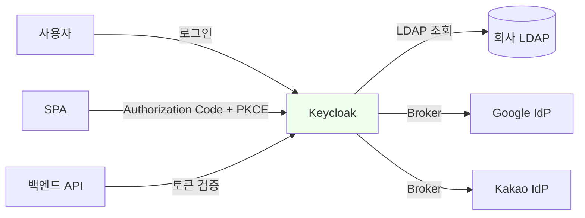
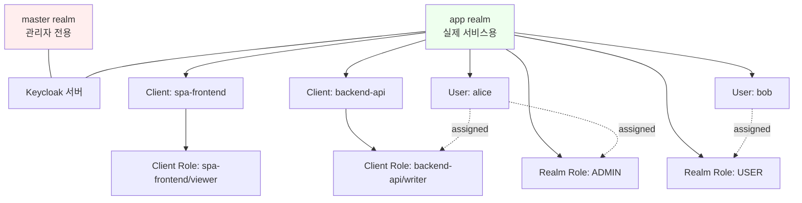
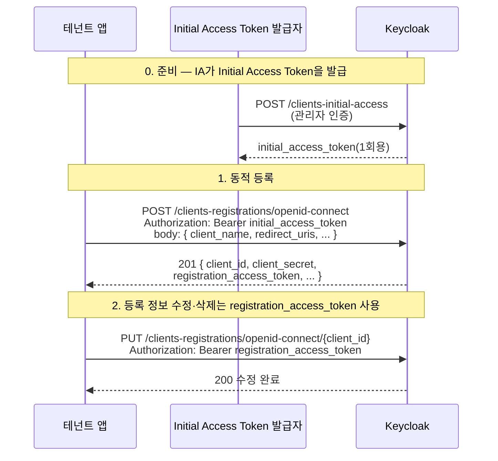

# Keycloak으로 AS 구축

::: info 학습 목표
- Keycloak의 Realm / Client / User / Role 개념을 설명할 수 있다.
- Docker Compose로 Keycloak을 기동할 수 있다.
- Dynamic Client Registration(RFC 7591)을 이해한다.
- Keycloak과 Spring 앱을 연동할 수 있다.
:::

---

## 1. Keycloak 개요

지금까지의 챕터는 모두 <strong>클라이언트 쪽</strong>에서 OAuth를 다뤘다. 이 장에서는 반대편, 즉 <strong>Authorization Server</strong>를 직접 띄우고 운영하는 방법을 학습한다. 선택한 도구는 [Keycloak 개념 및 간단 사용 포스트](/posts/tech/2025-10-01-keycloak)에서도 다룬 오픈소스 IAM 솔루션인 <strong>Keycloak</strong>이다.

### Keycloak이 제공하는 기능

Keycloak은 Red Hat이 2014년부터 개발해 온 Identity and Access Management(IAM) 솔루션이다. OAuth 2.0·OIDC·SAML 2.0을 모두 하나의 서버에서 제공한다.

| 영역 | 제공 기능 |
|-----|----------|
| 인증 | 로컬 ID/PW, OTP, WebAuthn, Magic Link |
| 인가 | OAuth 2.0·OIDC·UMA 2.0·Fine-grained 권한 |
| Federation | LDAP·Active Directory·소셜 IdP(Google, Kakao) |
| SSO | Realm 단위 단일 로그인, Single Logout |
| 관리 | Admin Console, REST API, Import/Export |

"우리 회사 자체 로그인 서버를 만들고 싶다"는 요구가 있을 때 가장 먼저 검토할 후보다. 규모가 커지면 Auth0·Okta·Amazon Cognito 같은 유료 SaaS로 옮겨가는 경우가 많지만, 개념 학습과 사내 운영 관점에서는 Keycloak이 가장 투명하다.

### Keycloak의 기본 위상



Keycloak은 클라이언트 입장에서 보면 "OIDC 호환 AS + UserInfo 엔드포인트"이고, 사용자 입장에서는 "모든 서비스 로그인이 통과하는 관문"이다. 뒤쪽으로는 LDAP/AD 같은 기존 ID 저장소나 외부 IdP와 페더레이션한다. 이 삼각 구도를 머릿속에 두고 이 장을 읽으면 각 개념이 어디에 붙는지 쉽게 보인다.

### 버전과 호환성

2024년 이후 Keycloak의 메이저 버전은 24.x → 25.x → 26.x로 올라왔다. Keycloak 17부터는 기존 WildFly 기반에서 <strong>Quarkus 기반</strong>으로 완전히 전환되었다. 따라서 구버전 인터넷 자료(`keycloak/keycloak:14.x` 이하, `standalone.sh` 등)를 그대로 따라 하면 동작하지 않을 수 있다. 이 장의 예제는 Quarkus 기반(`quay.io/keycloak/keycloak:26.x`)을 전제로 한다.

---

## 2. Docker Compose 기동

로컬 학습 환경은 Docker Compose로 몇 분이면 구성할 수 있다. 운영 환경이라면 Helm Chart나 Operator를 쓰는 것이 정석이지만, 개념 학습에는 Compose가 충분하다.

### docker-compose.yml

```yaml
version: "3.9"

services:
  keycloak-db:
    image: postgres:16
    container_name: keycloak-db
    environment:
      POSTGRES_DB: keycloak
      POSTGRES_USER: keycloak
      POSTGRES_PASSWORD: keycloak
    volumes:
      - keycloak-db-data:/var/lib/postgresql/data
    networks:
      - keycloak-net

  keycloak:
    image: quay.io/keycloak/keycloak:26.0
    container_name: keycloak
    command: start-dev
    environment:
      KC_DB: postgres
      KC_DB_URL: jdbc:postgresql://keycloak-db:5432/keycloak
      KC_DB_USERNAME: keycloak
      KC_DB_PASSWORD: keycloak
      KEYCLOAK_ADMIN: admin
      KEYCLOAK_ADMIN_PASSWORD: admin
      KC_HOSTNAME: localhost
      KC_HTTP_ENABLED: "true"
    ports:
      - "8080:8080"
    depends_on:
      - keycloak-db
    networks:
      - keycloak-net

volumes:
  keycloak-db-data:

networks:
  keycloak-net:
```

### 기동과 접속

```bash
docker compose up -d
docker compose logs -f keycloak
```

로그에 `Keycloak 26.0.x ... started in xxx ms` 가 뜨면 준비 완료다. 브라우저에서 `http://localhost:8080`으로 접속하면 "Administration Console" 링크가 보인다. `admin/admin`으로 로그인한다.

### 개발용과 운영용의 차이

`start-dev` 명령은 개발용 단축 모드다. HTTPS, 프록시, 캐시 클러스터링, 헬스 엔드포인트 등이 비활성 상태로 열린다. 운영에서는 반드시 `start` 명령과 다음 환경 변수를 사용해야 한다.

| 변수 | 역할 | 운영 권장값 |
|-----|-----|-----------|
| `KC_HOSTNAME` | 공개 도메인 | `auth.example.com` |
| `KC_HTTPS_CERTIFICATE_FILE` | TLS 인증서 경로 | 필수 |
| `KC_PROXY_HEADERS` | 리버스 프록시 헤더 모드 | `xforwarded` |
| `KC_FEATURES` | 활성화할 기능 | `token-exchange,admin-fine-grained-authz` |
| `KC_CACHE` | 세션 캐시 모드 | `ispn`(Infinispan) |

`start-dev`로 만든 데이터는 HTTPS를 켜는 순간 "HTTPS required" 에러를 내므로, 운영 이관 전에는 Realm의 `Require SSL` 정책을 조정해야 한다.

---

## 3. Realm / Client / User / Role

Keycloak의 모든 관리 화면은 이 네 가지 개념 위에서 돌아간다. 개념 관계가 머릿속에 들어오면 Admin Console의 모든 메뉴가 해석된다.

### 관계도



### Realm

Realm은 Keycloak의 <strong>최상위 격리 단위</strong>다. Realm이 다르면 사용자·클라이언트·토큰 발행이 완전히 분리된다. 최초 설치 시 `master` realm 하나가 기본 제공되는데, 이는 <strong>Keycloak 자체 관리용</strong>이고 실제 서비스용으로 쓰면 안 된다. "우리 회사" 같은 별도 Realm을 새로 만드는 것이 정석이다.

### Client

Client는 이 Realm에서 토큰을 발급받을 자격이 있는 애플리케이션이다. OAuth 용어의 "Client"와 정확히 일치한다. 다음 축으로 분류된다.

| 축 | 값 | 의미 |
|----|----|------|
| Access Type | Confidential | client_secret 있음, 서버 사이드 앱 |
| Access Type | Public | client_secret 없음, SPA·네이티브 앱 |
| Access Type | Bearer-only | 토큰 검증만, 리소스 서버 |
| Client Authentication | On | `client_secret_basic`/`post`/`jwt` 요구 |
| Standard Flow | On | Authorization Code Flow 활성 |
| Direct Access Grants | On | ROPC 활성 (비권장) |
| Service Accounts | On | Client Credentials Flow 활성 |

### User

그 Realm에 소속된 실제 사용자다. 로컬 비밀번호로 저장할 수도, LDAP에서 가져올 수도, 외부 IdP에서 Broker로 받을 수도 있다.

### Role

권한의 단위. Keycloak은 두 계층을 제공한다.

- <strong>Realm Role</strong>: Realm 전역에서 쓰는 역할 (예: `ADMIN`, `USER`)
- <strong>Client Role</strong>: 특정 Client에만 유효한 역할 (예: `backend-api/writer`)

사용자에게 역할을 할당하면 토큰의 `realm_access.roles` 또는 `resource_access.{clientId}.roles` 클레임에 담겨 나간다.

---

## 4. Client 설정

가장 자주 건드리고, 가장 많이 실수하는 곳이다. 실습으로 SPA용 Public Client 하나, 백엔드용 Confidential Client 하나를 만들어 본다.

### Public Client: SPA

Admin Console → Clients → Create client → 다음과 같이 입력한다.

| 필드 | 값 |
|-----|---|
| Client type | OpenID Connect |
| Client ID | `spa-frontend` |
| Name | SPA Frontend |
| Client authentication | Off |
| Authorization | Off |
| Standard flow | On |
| Direct access grants | Off |
| Service accounts roles | Off |
| Valid redirect URIs | `http://localhost:3000/callback` |
| Web origins | `http://localhost:3000` |

<strong>PKCE 강제</strong>는 별도 설정 단계에서 한다. 생성 후 Advanced 탭 → Proof Key for Code Exchange Code Challenge Method → `S256`으로 지정한다. 이렇게 해 두면 PKCE 없는 요청이 거부된다.

### Confidential Client: Backend API

| 필드 | 값 |
|-----|---|
| Client ID | `backend-api` |
| Client authentication | On |
| Authorization | On(필요 시) |
| Service accounts roles | On |
| Valid redirect URIs | 사용하지 않음 |

생성 후 Credentials 탭에서 <strong>Client Secret</strong>을 확인해 환경변수로 주입한다. 이 값이 외부로 노출되면 그 시점에 회전해야 한다.

### Redirect URI 주의

Keycloak은 Redirect URI를 <strong>문자 단위 일치</strong>로 검증한다. 마지막 슬래시 여부, scheme(`http` vs `https`), 포트 번호까지 동일해야 한다. 와일드카드(`*`)를 지원하지만 한정된 서브패스에만 쓰고, 전체 경로에 적용하면 open redirect 위험이 커진다.

### Flow 활성화 매트릭스

| 용도 | Standard Flow | Direct Access | Service Accounts | Implicit Flow |
|-----|--------------|---------------|------------------|---------------|
| SPA | On | Off | Off | Off |
| 서버 앱 + 브라우저 로그인 | On | Off | Off | Off |
| 백엔드 서비스 간 호출 | Off | Off | On | Off |
| 레거시 | Off | On(극히 제한) | Off | Off |

Implicit Flow는 Keycloak도 지원하지만 [CH12](/study/oauth/12-pkce)에서 본 것처럼 비권장이므로 끈 채로 둔다.

---

## 5. Dynamic Client Registration

대규모 멀티테넌트 환경에서는 "테넌트가 생길 때마다 관리자가 Admin Console에서 Client를 수동 등록"하는 방식이 병목이 된다. RFC 7591이 정의한 <strong>Dynamic Client Registration(DCR)</strong>은 Client 등록 자체를 API로 만든 표준이다.

### 표준 엔드포인트

Keycloak은 Realm마다 다음 엔드포인트를 제공한다.

```
POST /realms/{realm}/clients-registrations/openid-connect
```

이 엔드포인트에 `application/json` 본문으로 클라이언트 메타데이터를 보내면, Keycloak이 새 Client를 만들고 `client_id`와 `client_secret`, `registration_access_token`을 내려준다.

### 등록 시퀀스



### 요청 예시

```http
POST /realms/app/clients-registrations/openid-connect HTTP/1.1
Host: localhost:8080
Authorization: Bearer {initial_access_token}
Content-Type: application/json

{
  "client_name": "tenant-acme-spa",
  "redirect_uris": ["https://acme.app.example.com/callback"],
  "grant_types": ["authorization_code", "refresh_token"],
  "response_types": ["code"],
  "token_endpoint_auth_method": "none",
  "scope": "openid profile email"
}
```

응답 예시는 다음과 같다.

```json
{
  "client_id": "a1b2c3d4",
  "registration_access_token": "eyJhbGciOi...",
  "registration_client_uri": "http://localhost:8080/realms/app/clients-registrations/openid-connect/a1b2c3d4",
  "redirect_uris": ["https://acme.app.example.com/callback"],
  "token_endpoint_auth_method": "none"
}
```

### 운영 시나리오

| 시나리오 | DCR 활용 방식 |
|---------|-------------|
| SaaS 테넌트 자동 프로비저닝 | 테넌트 가입 시 Keycloak에 Client 동적 생성 |
| 모바일 앱 대규모 배포 | 설치 때마다 Client 등록 후 DPoP로 디바이스 바인딩 |
| CI/CD 일회성 테스트 환경 | 파이프라인이 초기 액세스 토큰으로 임시 Client 발급·파기 |
| 서드파티 플러그인 마켓플레이스 | 플러그인 설치 시 자동 Client 등록 |

### 보안 고려

DCR은 강력한 기능이지만 무단 Client 생성의 위험이 있다. Keycloak에서는 다음 세 가지 정책을 조합해 방어한다.

- <strong>Initial Access Token</strong>: 관리자가 선발급한 1회용 토큰 없이는 등록 불가
- <strong>Registration Access Policy</strong>: 허용할 redirect_uri 도메인, scope 등을 정책으로 제한
- <strong>Trusted Hosts</strong>: 등록 요청의 출발지 IP 제한

프로덕션에서는 Initial Access Token 방식을 기본으로 두고, 토큰을 안전 저장소(HSM, Vault)에 두는 것이 관행이다.

---

## 6. Spring 앱 연동

이제 앞선 [CH16](/study/oauth/16-spring-security)에서 다룬 Spring Security OAuth2 Client를 Keycloak과 연결한다. 소셜 로그인 대신 자체 AS를 쓰는 구조다.

### application.yml

```yaml
spring:
  security:
    oauth2:
      client:
        registration:
          keycloak:
            client-id: spa-frontend
            client-secret: ""
            client-authentication-method: none
            authorization-grant-type: authorization_code
            redirect-uri: "{baseUrl}/login/oauth2/code/{registrationId}"
            scope:
              - openid
              - profile
              - email
        provider:
          keycloak:
            issuer-uri: http://localhost:8080/realms/app
            user-name-attribute: preferred_username
```

중요한 것은 `issuer-uri`다. Spring Security는 이 값만 주면 OIDC Discovery(`/.well-known/openid-configuration`)를 통해 `authorization_endpoint`, `token_endpoint`, `jwks_uri`, `userinfo_endpoint`를 자동으로 가져온다. [CH11](/study/oauth/11-discovery-jwks-userinfo)에서 본 Discovery가 여기서 실제로 동작한다.

### SecurityFilterChain

CH16의 설정을 그대로 써도 된다. 단, 로그아웃을 Keycloak 세션까지 끊으려면 `OidcClientInitiatedLogoutSuccessHandler`를 추가해야 한다.

```kotlin
@Bean
fun securityFilterChain(
    http: HttpSecurity,
    clientRegistrationRepository: ClientRegistrationRepository
): SecurityFilterChain {
    val logoutSuccessHandler = OidcClientInitiatedLogoutSuccessHandler(clientRegistrationRepository)
        .apply { setPostLogoutRedirectUri("{baseUrl}/") }

    http
        .authorizeHttpRequests { it.anyRequest().authenticated() }
        .oauth2Login { }
        .logout { it.logoutSuccessHandler(logoutSuccessHandler) }
    return http.build()
}
```

`/logout`에 POST하면 Spring이 세션을 정리한 뒤 Keycloak의 `end_session_endpoint`(OIDC RP-Initiated Logout, [CH11](/study/oauth/11-discovery-jwks-userinfo) 참조)로 리다이렉트한다.

### ID Token 검증

Spring Security는 `issuer-uri`로부터 받은 `jwks_uri`로 서명 검증을 자동 수행한다. 다음 항목을 함께 검증한다.

| 클레임 | 검증 규칙 |
|-------|----------|
| `iss` | `issuer-uri`와 일치 |
| `aud` | `client-id` 포함 |
| `exp` / `iat` | 만료 여부, clock skew 허용 |
| `nonce` | Authorization Request에서 보낸 값과 일치 |
| 서명 | `jwks_uri`의 공개키로 검증 |

이 중 하나라도 실패하면 `OAuth2AuthenticationException`을 던진다. 구체적으로 어떤 검증에서 떨어졌는지 로그에 나오므로 디버깅하기 좋다.

### Docker 네트워크 이슈

로컬에서 Spring 앱도 Docker로 띄우는 경우 `issuer-uri: http://localhost:8080/...`을 그대로 쓰면 동작하지 않는다. 컨테이너 내부에서 `localhost`는 그 컨테이너 자기 자신이기 때문이다. 이때는 다음 둘 중 하나를 써야 한다.

- Keycloak과 Spring 앱을 같은 Compose 네트워크에 놓고 `issuer-uri: http://keycloak:8080/realms/app`
- 브라우저와 서버가 다른 URL을 쓰게 되므로, Keycloak의 <strong>frontend URL</strong>과 <strong>backend URL</strong>을 분리 (`KC_HOSTNAME`과 `KC_HOSTNAME_ADMIN` 활용)

두 번째 방식은 Keycloak이 발급하는 토큰의 `iss`와 브라우저가 리다이렉트로 가는 URL이 달라져야 하는 상황을 풀어준다. 운영에서는 대부분 리버스 프록시 뒤에 Keycloak을 놓고 하나의 HTTPS 도메인으로 통일한다.

---

::: tip 핵심 정리
- Keycloak은 OAuth 2.0·OIDC·SAML을 한 서버에서 제공하는 오픈소스 IAM 솔루션이다.
- 로컬 학습은 `quay.io/keycloak/keycloak:26.x` 이미지를 Compose로 띄우는 것이 가장 빠르다. `start-dev`는 학습용 단축 모드다.
- Realm은 최상위 격리 단위이고, Client·User·Role은 그 안에서 정의된다. 실제 서비스용 Realm을 새로 만드는 것이 원칙이다.
- Dynamic Client Registration(RFC 7591)은 SaaS·멀티테넌트 환경에서 Client 등록을 API화한다. Initial Access Token으로 보호한다.
- Spring Security와는 `issuer-uri` 한 줄로 연동된다. OIDC Discovery가 나머지 엔드포인트를 자동으로 끌어온다.
:::

## 다음 챕터

- 이전 : [Spring Security OAuth2 Client 실전](/study/oauth/16-spring-security)
- 다음 : [SSO와 Federation](/study/oauth/18-sso-federation)
