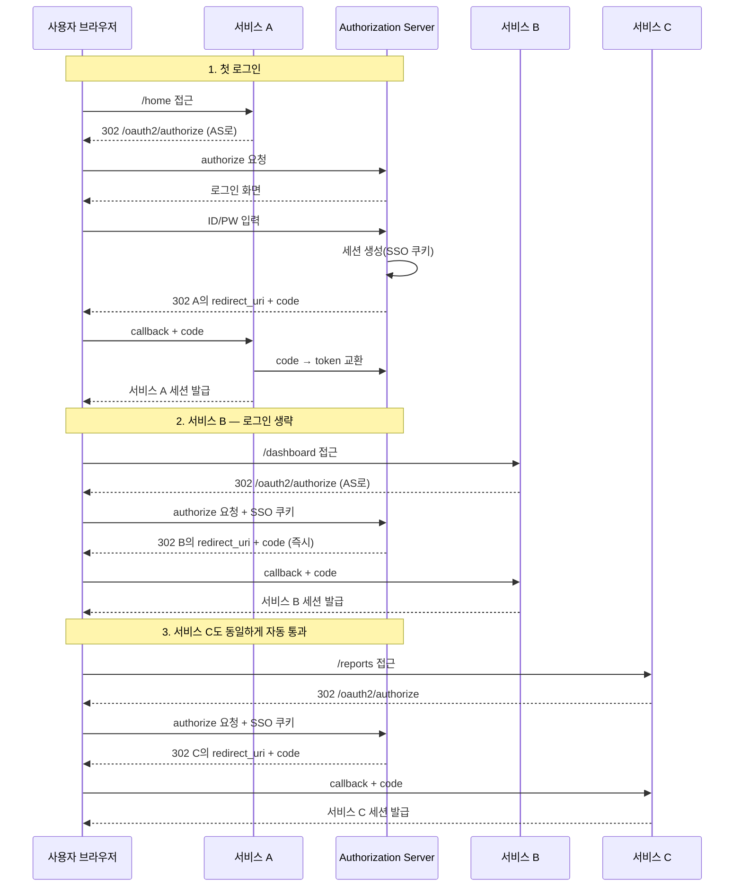
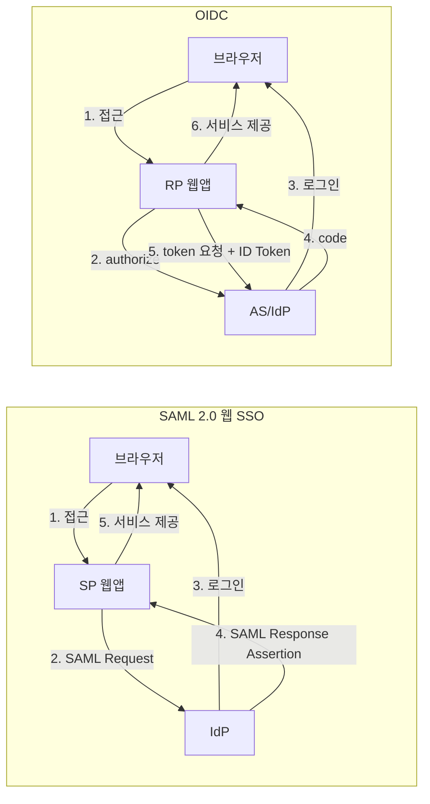
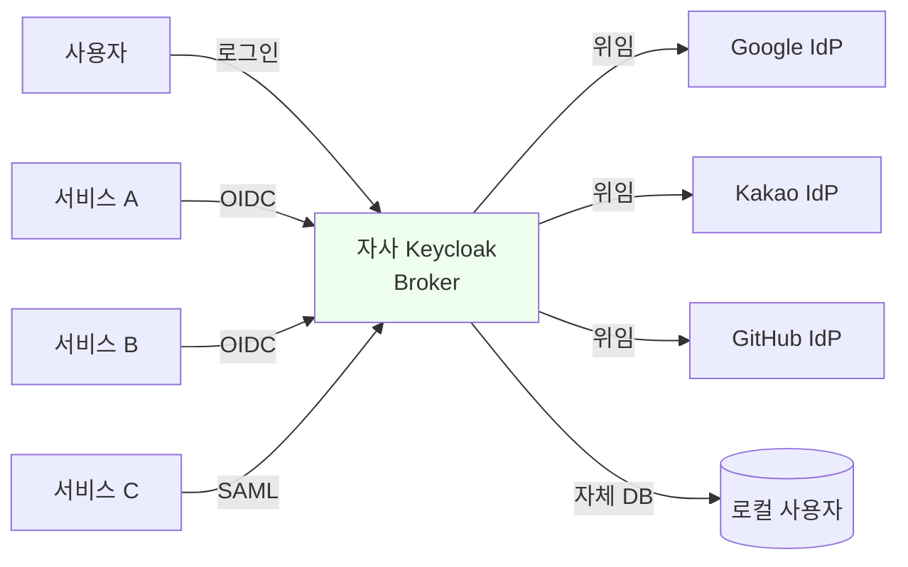
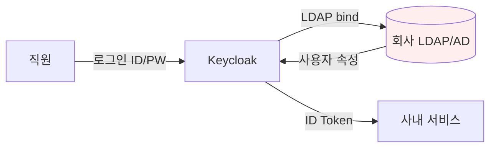
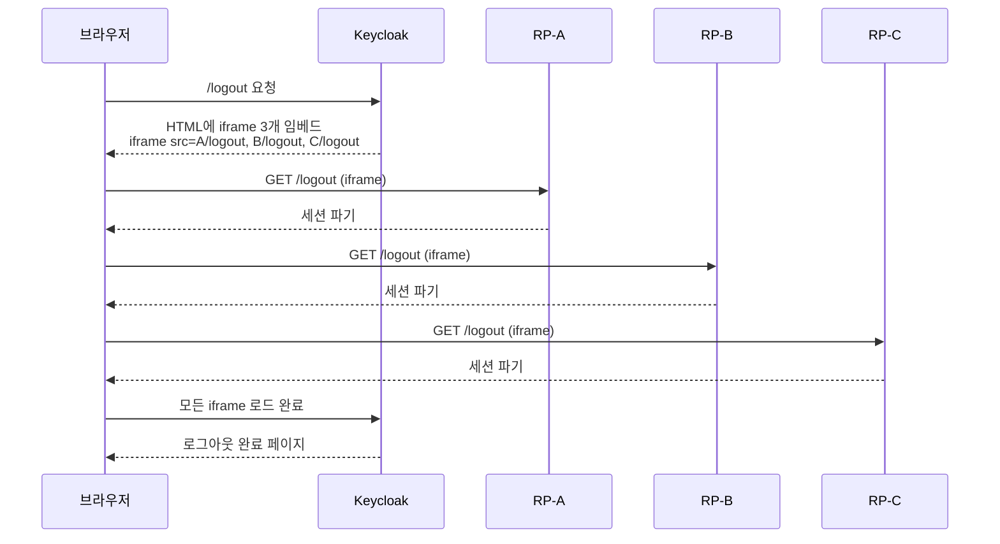

# SSO와 Federation

::: info 학습 목표
- SSO의 동작 원리를 설명할 수 있다.
- SAML과 OIDC의 차이를 안다.
- Identity Brokering 개념을 안다.
- SLO(Single Logout)의 한계를 안다.
:::

---

## 1. SSO는 어떻게 하나의 로그인으로 여러 서비스를 뚫는가

Single Sign-On(SSO)은 한 번의 로그인으로 여러 서비스를 이용할 수 있게 하는 기술이다. Google에 한 번 로그인하면 Gmail·Drive·YouTube가 모두 열리는 경험이 대표적인 예다. OAuth 스터디 내내 다룬 토큰 기반 인증의 확장이자, 엔터프라이즈 환경에서 가장 먼저 요구되는 기능이기도 하다.

### 왜 SSO가 필요한가

대기업 한 곳이 내부적으로 30~50개의 SaaS를 쓴다. 직원마다 "Jira 계정, Confluence 계정, Slack 계정, 사내 포털 계정"을 따로 관리한다면 다음 문제가 생긴다.

| 문제 | 설명 |
|-----|------|
| 사용자 피로 | 서비스마다 다른 비밀번호 기억 불가, 결국 재사용 |
| 관리 비용 | 입사·퇴사 때마다 N개 서비스에서 계정 생성·삭제 |
| 보안 취약 | 퇴사자 계정이 한두 개 누락되면 그 지점이 침입 경로가 됨 |
| 감사 불가 | 누가 어떤 서비스에 언제 접근했는지 분산 로그에 묻힘 |

SSO는 "인증을 한 곳으로 모으고, 각 서비스는 그 결과만 신뢰한다"는 발상으로 이 문제를 해결한다.

### SSO의 핵심 메커니즘

SSO의 비밀은 <strong>Authorization Server의 세션</strong>이다. 사용자가 AS에 한 번 로그인하면 AS는 브라우저에 자신의 도메인으로 <strong>세션 쿠키</strong>를 심는다. 이후 다른 서비스가 동일한 AS로 리다이렉트하면, 브라우저가 그 쿠키를 자동으로 들고 가므로 AS는 "이 사람은 이미 로그인했다"고 판정하고 즉시 인가 코드를 발급한다.

### 3사이트 시나리오 시퀀스

사용자 관점에서는 서비스 B·C로 이동할 때 로그인 화면을 전혀 보지 않는다. 실제로는 `AS ↔ 브라우저` 사이에 리다이렉트가 두 번 더 오가지만, 순간적으로 일어나 인지하지 못한다.

### SSO에 필요한 조건

| 조건 | 설명 |
|-----|------|
| 동일 AS | 모든 서비스가 같은 AS(Keycloak, Okta 등)를 신뢰 |
| AS 세션 쿠키 | AS 도메인에 HttpOnly 쿠키로 저장 |
| 서드파티 쿠키 정책 | 제3자 쿠키 차단 시에도 redirect 왕복으로 동작 가능 |
| 동일 브라우저 | 네이티브 앱은 SFSafariViewController·Custom Tabs 활용 |

Safari의 ITP나 Chrome의 CHIPS 같은 정책이 바뀌어도 SSO가 동작하는 이유는, 쿠키가 <strong>AS 자신의 도메인</strong>에만 저장되고 요청이 리다이렉트로 이뤄지기 때문이다. 이는 트래킹 쿠키와 구분된다.

---

## 2. SAML 2.0 vs OIDC

SSO를 구현하는 두 표준이 경쟁해 왔다. <strong>SAML 2.0</strong>(2005)과 <strong>OpenID Connect</strong>(2014)다. 둘 다 "한 번 로그인하면 여러 서비스에 들어갈 수 있다"는 목표는 같지만, 설계 철학과 기술 스택이 다르다.

### 등장 배경의 차이

- <strong>SAML 2.0</strong>: 2000년대 초 엔터프라이즈 웹 환경에서 태어났다. Java·.NET 서버 기반의 웹앱이 주류, XML-DSIG 서명, SOAP 영향권. OASIS가 표준화했다.
- <strong>OIDC</strong>: 2010년대 모바일·SPA가 폭증하며 OAuth 2.0 위에 OpenID Foundation이 추가 표준화했다. JSON·JWT·REST 철학.

### 기술 스택 비교

| 항목 | SAML 2.0 | OIDC |
|-----|----------|------|
| 포맷 | XML | JSON / JWT |
| 전송 | HTTP-Redirect / HTTP-POST binding | HTTP-Redirect |
| 서명 | XML-DSIG | JWS (RS256 등) |
| 암호화 | XML-ENC | JWE |
| 토큰 종류 | Assertion 1종 | Access + ID + Refresh 3종 |
| 인증 결과 전달 | SAML Assertion(XML) | ID Token(JWT) |
| 메타데이터 교환 | Metadata XML | Discovery JSON |
| 메타데이터 URL | `/.../saml/metadata` | `/.well-known/openid-configuration` |
| 모바일 친화 | 낮음(XML 파싱 비용) | 높음(JSON + JWT) |
| API 인가와 통합 | 설계에 없음 | OAuth 2.0 그대로 재활용 |

### 플로우 비교

흐름 자체는 매우 비슷하다. 둘 다 "서비스가 IdP로 보낸다 → IdP가 인증한다 → 서명된 결과를 서비스에 돌려준다"는 구조를 공유한다. 다만 SAML은 4단계에서 <strong>POST로 대형 XML</strong>을 주고, OIDC는 code를 받은 뒤 5단계에서 <strong>JSON JWT</strong>를 받는다.

### 어떤 것을 선택할까

| 상황 | 권장 |
|-----|-----|
| 기존 엔터프라이즈 SAML SP가 이미 있음 | SAML 유지, 필요시 Keycloak으로 Broker |
| 신규 웹앱·SPA·모바일 | OIDC |
| B2B SaaS가 고객 기업 SSO 연동 | 양쪽 모두 제공(SAML은 대기업 요건) |
| API Authorization도 함께 필요 | OIDC(OAuth 2.0과 자연 연계) |

현실적으로 2020년대 신규 프로젝트는 OIDC를 기본으로 쓰고, B2B SaaS 벤더는 엔터프라이즈 고객 대응을 위해 <strong>SAML 지원도 같이 제공</strong>한다. Keycloak·Auth0 같은 IdP 제품이 두 프로토콜을 모두 말해주는 이유다.

---

## 3. Identity Brokering

"이미 Google로 로그인한 사용자가 우리 서비스에도 그대로 들어오면 좋겠다"는 요구는 흔하다. 이런 <strong>IdP-to-IdP 위임</strong>을 Keycloak은 Identity Brokering이라 부른다. 사전적 의미로는 <strong>Federation</strong>에 해당한다.

### 브로커링의 구조

포인트는 두 가지다.

- 내 서비스(서비스 A·B·C)는 <strong>Keycloak 하나</strong>만 알면 된다. Google·Kakao·GitHub의 존재를 신경 쓸 필요가 없다.
- 외부 IdP(Google·Kakao·GitHub)의 스펙이 바뀌어도 <strong>Keycloak만 대응</strong>하면 된다.

이것이 바로 [CH16](/study/oauth/16-spring-security)에서 본 "공급자별 비표준 이슈"를 중앙에서 흡수하는 방법이다.

### Keycloak에서 설정하는 순서

Admin Console → Identity Providers → Add provider 를 선택한다. 지원되는 기본 프로바이더 목록은 다음과 같다.

- OpenID Connect v1.0
- SAML v2.0
- OAuth v2.0(일반)
- Google, Facebook, Twitter, GitHub, GitLab, BitBucket, Microsoft, LinkedIn, Instagram, PayPal, Stack Overflow, openshift-v3, openshift-v4
- Keycloak OpenID Connect(Keycloak-to-Keycloak)

Google을 선택하면 `Client ID`, `Client Secret`만 입력하면 된다. 엔드포인트는 내장 프리셋으로 자동 세팅된다. Kakao는 기본 프리셋이 없으므로 "OpenID Connect v1.0"을 고르고 Discovery URL 또는 각 엔드포인트를 수동 입력한다.

### First Broker Login Flow

외부 IdP로 처음 들어온 사용자를 Keycloak 내부 사용자로 어떻게 매핑할지 결정하는 단계다. 기본 Flow는 다음과 같다.

| 단계 | 동작 | 실패 시 |
|-----|-----|--------|
| Review Profile | 외부 IdP에서 받은 프로필을 사용자에게 보여주고 수정 기회 제공 | 사용자가 취소 |
| Create User If Unique | 이메일이 기존 로컬 사용자와 겹치지 않으면 새로 생성 | 충돌 시 다음 단계 |
| Handle Existing Account | 같은 이메일의 로컬 계정이 있다면 연결(link)하거나 로그인 요청 | 재인증 필요 |
| Verify Existing Account | 기존 로컬 사용자의 비밀번호/OTP로 본인 확인 | 실패 시 브로커링 중단 |

이 Flow를 수정하면 "외부 IdP 프로필을 자동 신뢰" 정책이나 "이메일 중복 무조건 거부" 정책 등 조직 요구에 맞출 수 있다.

### Attribute Mapper

외부 IdP가 주는 클레임을 Keycloak 내부 사용자 속성으로 변환한다. 대표적인 매퍼는 다음과 같다.

- <strong>Attribute Importer</strong>: 외부 클레임 → Keycloak 사용자 속성
- <strong>Username Template Importer</strong>: 외부 ID로부터 사용자명 생성
- <strong>Hardcoded Role Mapper</strong>: 외부 IdP에서 온 사용자에게 특정 Role 부여

예컨대 Google에서 들어온 사용자에게 자동으로 `ROLE_EXTERNAL_USER`를 붙이는 식이다.

---

## 4. LDAP / Active Directory 연동

기업 내부 ID 저장소는 대부분 LDAP 또는 Active Directory다. 직원 입·퇴사가 AD에 기록되고, 이메일·전화번호·부서 같은 디렉터리 정보가 여기에 있다. Keycloak은 이 디렉터리를 <strong>User Federation Provider</strong>로 통합한다.

### 브로커링과의 차이

Identity Brokering은 <strong>외부 IdP에 인증을 위임</strong>한다. 반면 User Federation은 <strong>Keycloak이 직접 LDAP에 인증 요청</strong>을 보내고, 사용자를 Keycloak의 `User`로 취급한다.

| 구분 | Identity Brokering | User Federation |
|-----|------------------|-----------------|
| 인증 주체 | 외부 IdP (Google) | Keycloak |
| 프로토콜 | OIDC / SAML | LDAP / Kerberos |
| 사용자 위치 | 외부 시스템 | 외부 시스템(캐시 가능) |
| 대상 | 외부 소셜·다른 회사 IdP | 자사 AD/LDAP |

### LDAP 연동 구조

Admin Console → User Federation → "ldap" 추가로 설정한다. 주요 항목은 다음과 같다.

| 항목 | 설명 |
|-----|------|
| Vendor | `Active Directory`, `Red Hat Directory Server`, `Other` |
| Connection URL | `ldap://ad.example.com:389` 또는 `ldaps://...` |
| Users DN | `OU=Users,DC=example,DC=com` |
| Bind DN | Keycloak이 LDAP에 접속할 서비스 계정 DN |
| Edit Mode | `READ_ONLY` / `WRITABLE` / `UNSYNCED` |
| Import Users | 최초 로그인 시 Keycloak DB에 복제할지 여부 |
| Sync Settings | 주기적으로 전체 동기화할지 |

### Edit Mode 비교

| 모드 | 의미 | 사용 시나리오 |
|-----|-----|-------------|
| READ_ONLY | Keycloak은 LDAP을 읽기만. 수정 불가 | AD가 마스터인 일반 기업 환경 |
| WRITABLE | Keycloak에서 수정하면 LDAP에도 반영 | Keycloak이 사용자 관리 UI 역할까지 |
| UNSYNCED | 초기 1회만 읽고 이후 로컬 관리 | LDAP을 마이그레이션 소스로만 쓸 때 |

### Kerberos SSO와 결합

Windows 도메인 환경에서는 Kerberos를 켜면 브라우저가 도메인 계정으로 자동 로그인된다. Keycloak의 LDAP Federation에 Kerberos 옵션을 활성화하고, 브라우저 측에 SPNEGO 인증이 허용되면 사용자가 <strong>ID/PW 입력 없이</strong> Keycloak 로그인 화면을 통과한다. 사내 인트라넷용 SSO에서 자주 쓰는 구성이다.

---

## 5. Single Logout (SLO)

"모든 서비스에 한 번에 로그인하는 것"의 대칭으로 "한 번에 로그아웃"도 필요하다. 이를 Single Logout이라 한다. 그런데 SLO는 SSO만큼 안정적으로 동작하기 어렵다. 그 이유와 한계를 정리한다.

### 왜 SLO가 어려운가

사용자 관점에서는 단순히 "로그아웃 버튼"이지만, 기술적으로는 다음을 동시에 해야 한다.

1. Keycloak의 SSO 세션을 파기한다.
2. 지금까지 그 SSO 세션으로 만들어진 <strong>모든 RP 세션</strong>을 파기한다.
3. RP가 발급한 Access Token은 이미 클라이언트 손에 있다 — 폐기하려면 Introspection/Revocation 필요.

1번은 Keycloak 내부 작업이라 쉽다. 문제는 2·3번이다.

### Front-Channel Logout

브라우저를 경유해 각 RP의 로그아웃 엔드포인트를 순차 호출한다.

실패 모드가 많다. iframe이 로드되지 못하면(네트워크 실패, 제3자 쿠키 차단, RP 다운), 일부 RP는 로그아웃되지 않는다. 사용자 브라우저를 반드시 거쳐야 하므로 <strong>네이티브 앱이나 백엔드 API 세션은 끊을 수 없다</strong>.

### Back-Channel Logout

OIDC Back-Channel Logout(OpenID Foundation, 2022)은 이 한계를 푼다. Keycloak이 각 RP에 <strong>서버 대 서버</strong>로 Logout Token(JWT)을 POST한다.

| 항목 | Front-Channel | Back-Channel |
|-----|---------------|--------------|
| 경로 | 브라우저 iframe | Server-to-Server HTTP |
| 신뢰 | 쿠키 | 서명된 Logout Token |
| 실패 관측 | 불가(iframe 로드 확인만) | HTTP 응답 코드 |
| 제3자 쿠키 영향 | 받음 | 없음 |
| 지원 | 대부분 RP | 비교적 최근 RP만 |

### 그래도 남는 한계

- <strong>이미 발급된 Access Token</strong>은 만료 전까지 유효. RP가 토큰 검증에 로컬 JWT 파싱만 쓰면 폐기가 반영되지 않는다.
- 네이티브 앱은 프론트채널 iframe 방식이 안 통한다. 백채널 로그아웃 구현이 선택이 아닌 필수.
- SaaS RP가 로그아웃 엔드포인트를 제공하지 않으면 Keycloak이 할 수 있는 게 없다.

### 실무 권장

- RP는 가능하면 <strong>Back-Channel Logout</strong>을 구현하고 `backchannel_logout_session_required`를 `true`로 받는다.
- Access Token 수명을 <strong>짧게</strong> 두고([CH13](/study/oauth/13-token-strategy)의 RTR과 조합) 실질적 폐기를 유도한다.
- 중요 API는 로컬 JWT 검증에 더해 <strong>Introspection</strong>을 병행해 폐기를 즉시 반영한다.
- "로그아웃 버튼"을 사용자에게 보여줄 때, 해당 버튼이 <strong>무엇을 끊고 무엇을 끊지 못하는지</strong> 내부 문서로 명확히 해 둔다.

::: warning SLO는 "완벽한 로그아웃"이 아니다
SLO는 <strong>서버 세션 파기의 신호</strong>이지, 이미 발급된 Access Token의 즉시 무효화를 보장하지 않는다. 보안 민감도가 높은 작업은 별도의 재인증(step-up authentication)으로 다뤄야 한다.
:::

---

::: tip 핵심 정리
- SSO는 "AS의 세션 쿠키"와 "서비스의 AS 공통 신뢰"라는 두 축으로 동작한다. 리다이렉트 왕복이지만 사용자는 재로그인을 인지하지 않는다.
- SAML과 OIDC는 목표는 같지만 XML/엔터프라이즈 vs JSON/모바일로 분화했다. 신규 프로젝트는 OIDC, B2B는 양쪽 지원이 현실적이다.
- Identity Brokering은 "외부 IdP에 인증 위임", User Federation은 "내부 LDAP을 통합 사용자 저장소로 사용"이다.
- SLO는 Front-Channel(iframe)과 Back-Channel(서버-서버 JWT) 두 방식이 있으며, 이미 발급된 Access Token의 즉시 무효화는 별도 수단(Introspection, 짧은 수명)으로 다뤄야 한다.
:::

## 다음 챕터

- 이전 : [Keycloak으로 AS 구축](/study/oauth/17-keycloak)
- 다음 : [관찰성과 감사](/study/oauth/19-observability)
