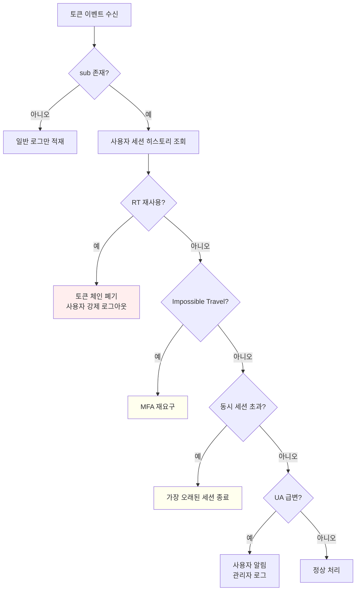
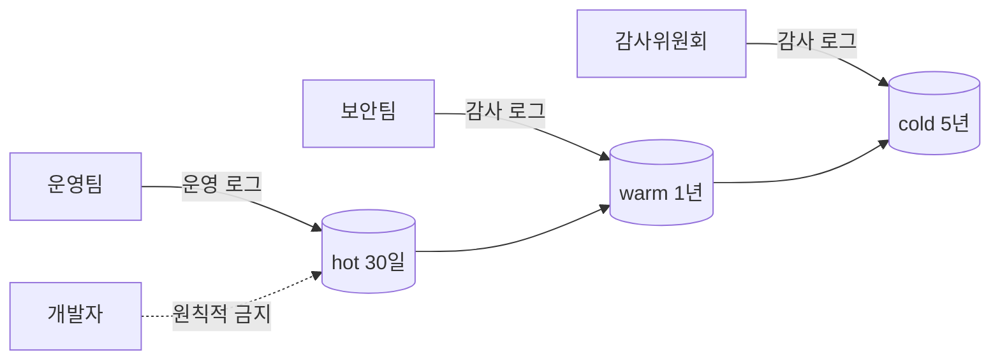
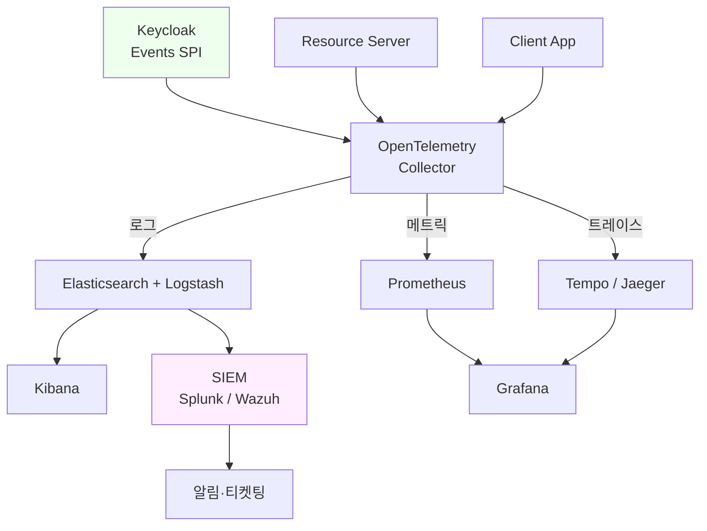

# 관찰성과 감사

::: info 학습 목표
- OAuth 시스템에서 남겨야 할 로그 항목을 안다.
- jti·sub·iss를 활용한 추적 방법을 안다.
- 이상 탐지 시그널(동시 세션·지역 급변·RT 재사용)을 안다.
- 개인정보·규제 관점의 로그 설계를 고려한다.
:::

---

## 1. 무엇을 로그로 남길 것인가

OAuth 시스템에서 "관찰성(observability)"은 단순히 디버그 로그가 아니라 <strong>보안 사고 대응의 증거</strong>이기도 하다. 금융권이라면 규제 감사 대상이고, 일반 B2C 서비스라도 개인정보 사고 발생 시 로그가 유일한 반박 자료가 된다. 그래서 이 장의 첫 질문은 "어느 시점에, 어떤 항목을 남길 것인가"다.

### 로그를 남겨야 하는 이벤트

OAuth 전체 라이프사이클에서 반드시 기록할 이벤트는 다음과 같다.

| 카테고리 | 이벤트 | 필수 여부 |
|---------|-------|---------|
| 인증 | 로그인 성공·실패, MFA 통과·실패 | 필수 |
| 동의 | Consent 화면 노출, 동의 결과, 동의 철회 | 필수 |
| 토큰 발급 | Access Token 발급, ID Token 발급, Refresh Token 발급 | 필수 |
| 토큰 갱신 | Refresh Token 회전, 갱신 실패 | 필수 |
| 토큰 폐기 | Revocation, 로그아웃, 관리자 강제 폐기 | 필수 |
| Introspection | RS가 토큰 유효성을 조회한 결과 | 권장 |
| 관리 | Client 생성·삭제, Role 변경, 사용자 생성·비활성화 | 필수 |
| 오류 | `invalid_grant`, `invalid_client`, `invalid_scope` | 필수 |

### 이벤트별 필수 필드

각 이벤트에 공통으로 남겨야 할 최소 필드를 정의한다.

| 필드 | 예 | 설명 |
|-----|---|-----|
| `timestamp` | `2026-04-17T09:12:33.421Z` | RFC 3339, 밀리초 단위 |
| `event_type` | `token.issued` | 열거형 상수 |
| `client_id` | `spa-frontend` | 어느 클라이언트의 요청인가 |
| `user_id` / `sub` | `u-482910` | 사용자 식별자(PII 분리) |
| `session_id` | `sess-ab12` | AS 세션 식별자 |
| `jti` | `tkn-93a1...` | 토큰 고유 ID |
| `ip` | `203.0.113.42` | 요청 IP |
| `user_agent` | `Mozilla/5.0 ...` | UA 원본 |
| `result` | `success` / `failure` | 결과 |
| `reason_code` | `invalid_grant` | 실패 이유 |
| `trace_id` | `4f8c...` | 분산 추적 ID |

### 남기지 <strong>말아야</strong> 할 것

로그는 사고 시 증거이지만, 로그 자체가 사고의 원인이 되기도 한다. 다음은 절대 로그에 담아서는 안 된다.

| 항목 | 이유 | 대안 |
|-----|-----|------|
| Access Token 전체 값 | 유출 시 즉시 도용 가능 | 마지막 8자리만 기록 |
| Refresh Token 전체 값 | 지속적 도용 가능 | `rt_...` 프리픽스 + 해시 |
| Authorization Code | 10분간 유효, 즉시 토큰 교환 가능 | 마스킹 또는 미기록 |
| client_secret | 탈취 시 토큰 발급 가능 | 절대 미기록 |
| 주민번호·카드번호 | PII·PCI 위반 | 절대 미기록 |
| 비밀번호 | 평문 저장은 곧 사고 | 절대 미기록 |

RFC 6819(OAuth 2.0 Threat Model)의 §5.1.6은 이 항목을 공식 권고로 명시한다.

---

## 2. 추적용 표준 클레임

JWT 기반 토큰에는 추적에 특화된 클레임이 정의되어 있다. `iss`, `sub`, `aud`, `exp`, `jti`는 [CH10](/study/oauth/10-id-token-jwt)에서 다룬 표준 클레임인데, 관찰성 관점에서 이들을 어떻게 활용하는지 다시 본다.

### 추적 핵심 4대 클레임

| 클레임 | 의미 | 추적 활용 |
|-------|-----|---------|
| `iss` | Issuer(AS URL) | 어느 AS가 발급했는가 — 멀티 IdP 환경에서 필수 |
| `sub` | Subject(사용자 ID) | 누가 사용 중인가 |
| `aud` | Audience(대상 RS) | 어느 RS용 토큰인가 |
| `jti` | JWT ID | 토큰 개별 식별자 — 폐기·중복 감지 열쇠 |

### jti가 특히 중요한 이유

`jti`는 RFC 7519 §4.1.7이 정의한 <strong>토큰 고유 ID</strong>다. 관찰성에서 다음 세 가지를 가능케 한다.

1. <strong>한 토큰의 라이프사이클 추적</strong>: 발급 → 여러 RS 호출 → 갱신 → 폐기를 같은 `jti`로 묶어 시계열로 본다.
2. <strong>재사용 탐지</strong>: Refresh Token Rotation에서 이전 `jti`가 다시 올라오면 즉시 차단.
3. <strong>폐기 목록</strong>: Revocation 테이블에 `jti`만 담아 DB 부담을 최소화.

### 토큰 라이프사이클 타임라인

```mermaid
timeline
    title 한 Access Token의 라이프사이클 (jti=tkn-93a1)
    09:12:33 : token.issued<br>client=spa, sub=u-482910
    09:15:11 : token.used<br>aud=orders-api, path=/orders
    09:17:42 : token.used<br>aud=payments-api, path=/pay
    09:20:19 : introspection.called<br>active=true
    09:52:33 : token.expired<br>natural expiry (40min)
    09:52:34 : refresh.rotated<br>old jti=tkn-93a1, new jti=tkn-c7f4
```

이 타임라인 한 장만 있으면 "이 토큰이 언제 어디에 쓰였는지"를 사고 조사 시 즉시 재구성할 수 있다. OpenTelemetry 트레이스에 `jti`를 `span attribute`로 붙여 두면 Jaeger나 Tempo 같은 도구에서 같은 질의가 가능하다.

### 상관관계 분석

클레임을 조합하면 다양한 관점으로 사용자 행동을 재구성할 수 있다.

| 질의 | 필드 조합 |
|-----|---------|
| "이 사용자가 오늘 어떤 서비스를 썼나" | `sub` + `aud` + `timestamp` |
| "이 클라이언트가 발급받은 토큰 총량" | `client_id` + `event_type=token.issued` |
| "같은 IP에서 다른 sub로 로그인" | `ip` + distinct `sub` count |
| "RT 재사용 시도" | `jti` 중복 + `event_type=refresh.*` |

---

## 3. 이상 탐지 시그널

관찰성이 갖춰지면 그 위에 탐지 규칙을 올릴 수 있다. 완전한 UEBA(User and Entity Behavior Analytics)는 머신러닝 영역이지만, 규칙 기반만으로도 상당한 효과가 있다.

### 핵심 탐지 시그널

| 시그널 | 판정 조건 | 대응 |
|-------|---------|------|
| 다중 지역 동시 로그인 | 동일 `sub`, 10분 내 2개 이상 국가 IP | MFA 요구 또는 세션 강제 종료 |
| 동시 세션 초과 | 동일 `sub`, 활성 세션 N개 초과(예: 5) | 가장 오래된 세션 강제 종료 |
| Refresh Token 재사용 | 이미 회전된 `jti`의 재요청 | 토큰 체인 전체 폐기 |
| 비정상 scope 요청 | 승인된 scope 외 요청 | 거부 + 로그 |
| 브루트포스 추정 | `invalid_grant` N회 연속(IP/client 단위) | 해당 client/IP 일시 차단 |
| 관리 API 오남용 | 평소 안 쓰던 관리자가 대량 토큰 폐기 | 알림 + 승인 프로세스 |
| Impossible Travel | 10분 전 서울, 지금 베를린 | MFA 재요구 |
| User-Agent 이상 | 평소와 다른 UA에서 토큰 갱신 | 알림 |

### 이상 탐지 의사결정 플로우



### Refresh Token 재사용 — 가장 중요한 시그널

[CH13](/study/oauth/13-token-strategy)에서 다룬 RTR의 안전성은 <strong>재사용 탐지</strong>가 있어야 완성된다. 재사용 탐지는 관찰성의 영역이다. 저장 스키마 예시를 들면 다음과 같다.

```sql
CREATE TABLE refresh_token_chain (
    jti          VARCHAR(64) PRIMARY KEY,
    parent_jti   VARCHAR(64),
    user_id      VARCHAR(64) NOT NULL,
    client_id    VARCHAR(64) NOT NULL,
    issued_at    TIMESTAMPTZ NOT NULL,
    rotated_at   TIMESTAMPTZ,
    revoked_at   TIMESTAMPTZ,
    status       VARCHAR(16) NOT NULL -- 'active' | 'rotated' | 'revoked'
);
```

`rotated_at`이 NULL이 아닌 토큰의 `jti`가 다시 교환 요청으로 오면 즉시 다음을 수행한다.

```sql
UPDATE refresh_token_chain
SET status = 'revoked', revoked_at = now()
WHERE user_id = ? AND client_id = ?;
```

토큰 체인 전체를 끊어 공격자와 피해자 모두를 로그아웃시킨다. 사용자에게는 재로그인을 요구하지만, 공격자의 지속적 접근을 차단하는 대가로 받아들인다.

### 지리·디바이스 핑거프린팅의 주의

Impossible Travel 판정은 오탐이 흔하다. VPN·모바일 캐리어 게이트웨이·회사 프록시는 자연스럽게 원격지 IP를 만든다. 다음 보정이 필요하다.

- IP geo DB의 정확도가 도시 단위에서 ±50km 정도. 국가 단위로 보수적 판정
- 신뢰 IP 대역(회사 대역 등)은 화이트리스트
- 판정 결과는 <strong>즉시 차단</strong>이 아니라 <strong>MFA 재요구</strong>가 1차 대응

---

## 4. 규제와 개인정보

OAuth 시스템 로그는 개인정보를 다수 포함한다. GDPR·개인정보보호법·PCI-DSS·전자금융감독규정 등 각종 규제가 적용된다.

### PII와 로그의 긴장 관계

로그에 필요한 필드를 열거하면 이미 PII 투성이다.

| 필드 | PII 여부 | 처리 방안 |
|-----|---------|---------|
| `sub` | 간접 식별자 | 내부용으로 유지, 외부 노출 시 해시 |
| `email` | 직접 식별자 | 마스킹 또는 별도 저장 |
| `ip` | 간접 식별자(GDPR 해당) | 부분 마스킹(`203.0.113.0/24`) |
| `user_agent` | 약한 핑거프린트 | 일반화(브라우저 종류만) |
| 이름·전화번호 | 직접 식별자 | 로그에 싣지 않음 |

### 마스킹 패턴

실무에서 자주 쓰는 규칙이다.

```
email  : "a***@example.com"
ip     : "203.0.113.***"
jti    : 전체 (식별자이지만 PII는 아님)
token  : 마지막 8자리만 "...ab12cd34"
name   : "홍**"
phone  : "010-****-5678"
```

### 보존 기간

| 기준 | 권장 보존 기간 |
|-----|-------------|
| 일반 B2C | 90일(운영 로그) / 1년(감사 로그) |
| 전자금융감독규정 | <strong>5년</strong> (금융위원회 고시) |
| PCI-DSS | <strong>최소 1년</strong>, 최근 3개월 즉시 조회 가능 |
| GDPR | 목적 달성 후 즉시 삭제 또는 가명처리 |

한국 전자금융업자라면 5년을 기준으로 둔다. 보존 자체가 규제 의무이므로 "저장 공간이 비싸다"는 논리는 통하지 않는다.

### Right to be Forgotten

GDPR의 <strong>삭제권</strong>과 감사 로그 보존 의무가 충돌할 수 있다. 실무적 타협점은 다음과 같다.

- 감사 로그의 `sub`는 <strong>내부 ID</strong>로 유지
- 사용자가 탈퇴하면 매핑 테이블(내부 ID ↔ 이메일·이름)만 삭제
- 로그 자체는 유지되지만 <strong>원복 불가</strong>한 상태가 됨(가명처리)

### 접근 통제

로그 자체가 민감 정보이므로 로그 조회에도 권한이 필요하다.



원칙은 "개발자는 운영 로그에 접근하지 않는다"다. 반드시 필요하면 <strong>임시 승인 + 감사 로그 기록</strong>으로 처리한다.

---

## 5. 관찰성 스택 예

마지막으로 실제 구성 예를 본다. 특정 벤더에 종속되지 않는 오픈소스 조합이다.

### 참조 아키텍처



### 계층별 역할

| 계층 | 도구 | 역할 |
|-----|-----|------|
| 이벤트 수집 | Keycloak Events SPI, Spring Logback | OAuth 이벤트 구조화 로그 발행 |
| 전송·정규화 | OpenTelemetry Collector | 트레이스·로그·메트릭을 공통 포맷으로 변환 |
| 저장 | Elasticsearch, Prometheus, Tempo | 시계열 질의와 풀텍스트 검색 |
| 시각화 | Kibana, Grafana | 대시보드, 임시 조사 |
| 탐지 | SIEM(Splunk, Wazuh, Elastic Security) | 규칙 매칭 · 이상 탐지 · 대응 |
| 대응 | PagerDuty, Slack | 알림 · 티켓 자동 생성 |

### Keycloak Events SPI 활용

Keycloak은 자체적으로 `Event Listener SPI`를 제공한다. 기본 제공되는 `jboss-logging` 리스너 외에 <strong>HTTP 웹훅</strong>이나 <strong>Kafka</strong>로 이벤트를 쏘는 커스텀 리스너를 붙일 수 있다.

| 이벤트 타입 | 설명 |
|-----------|------|
| `LOGIN` | 로그인 성공 |
| `LOGIN_ERROR` | 로그인 실패(사유 포함) |
| `CODE_TO_TOKEN` | Authorization Code → Token 교환 |
| `REFRESH_TOKEN` | Refresh 성공 |
| `REFRESH_TOKEN_ERROR` | Refresh 실패(RT 재사용 등) |
| `LOGOUT` | 로그아웃 |
| `REVOKE_GRANT` | 동의 철회 |
| `CLIENT_LOGIN` | Client Credentials 성공 |
| `USER_INFO_REQUEST` | UserInfo 호출 |

Keycloak Admin Console → Realm Settings → Events 에서 기록 대상 이벤트를 선택한다. DB 저장 외에 listener로 Kafka topic에 복제해 두면, 그 topic을 SIEM이 구독하는 구조가 된다.

### 대시보드 예시 지표

Grafana 대시보드에 기본으로 얹을 만한 지표는 다음과 같다.

| 지표 | 식 | 해석 |
|-----|----|-----|
| 초당 토큰 발급 | `rate(token_issued_total[1m])` | 트래픽 감 |
| 로그인 실패율 | `login_failed / (login_success + login_failed)` | 브루트포스 감지 |
| RT 재사용 탐지 | `count(refresh_reuse_detected_total)` | 즉시 경보 |
| P99 토큰 발급 지연 | `histogram_quantile(0.99, token_latency_seconds)` | 성능 회귀 |
| 동시 활성 세션 | `active_sessions` gauge | 용량 계획 |

### 알림 임계값 설계

임계값은 조직마다 다르지만 출발점은 다음과 같다.

- RT 재사용 탐지 1건 이상: <strong>즉시</strong> 보안팀 페이지
- 특정 IP에서 `login_failed` 10회/분: 해당 IP 5분 차단 + 알림
- `invalid_client` 1회/시간 이상: Client 설정 오류 가능성 조사
- 특정 Client에서 `token_issued`가 평시 대비 5배: 이상 트래픽 조사

::: warning 관찰성은 보안의 전제이자 성능의 전제다
보안 사고 대응은 "사후적"이라 생각하기 쉽지만, 로그 설계는 <strong>사고 이전에</strong> 끝나야 한다. 사고가 난 뒤 "그 로그는 안 남겼다"라는 말만큼 조사팀을 무력하게 만드는 문장도 없다.
:::

---

::: tip 핵심 정리
- OAuth 시스템은 인증·동의·토큰 발급/갱신/폐기·관리 이벤트를 모두 구조화 로그로 남긴다. Access/Refresh Token 원문, Authorization Code, client_secret은 절대 기록하지 않는다.
- `jti`·`sub`·`aud`·`iss` 네 클레임이 토큰 라이프사이클 추적의 뼈대다. 특히 `jti`는 RT 재사용 탐지와 폐기 테이블의 열쇠다.
- RT 재사용·Impossible Travel·동시 세션 초과·비정상 scope 요청은 규칙 기반으로도 충분히 탐지 가능하다. 탐지 결과는 차단보다는 MFA 재요구를 1차 대응으로 둔다.
- 개인정보와 로그는 긴장 관계다. 보존 기간(금융권 5년), PII 마스킹, 접근 통제, 삭제권 대응 설계를 초기부터 포함해야 한다.
- 실무 스택은 Keycloak Events SPI → OpenTelemetry → ELK/Prometheus/Tempo → SIEM → PagerDuty 흐름이 표준적이다.
:::

## 다음 챕터

- 이전 : [SSO와 Federation](/study/oauth/18-sso-federation)
- 다음 : [OAuth의 미래](/study/oauth/20-future)
