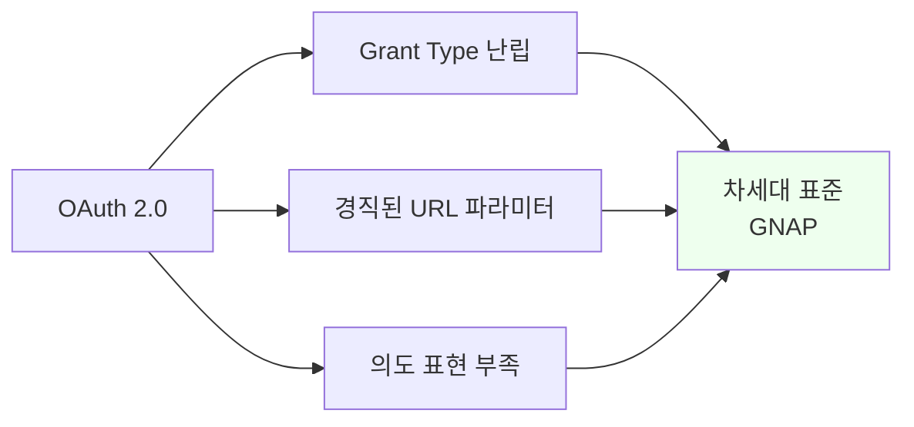
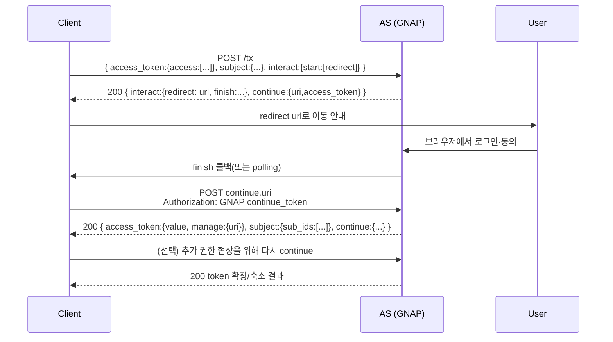
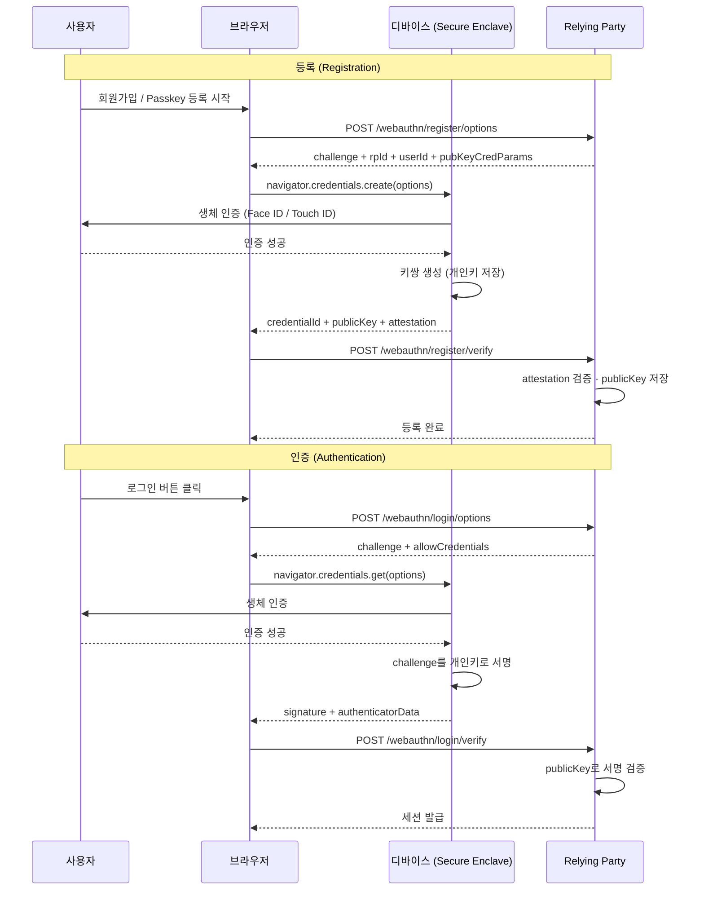
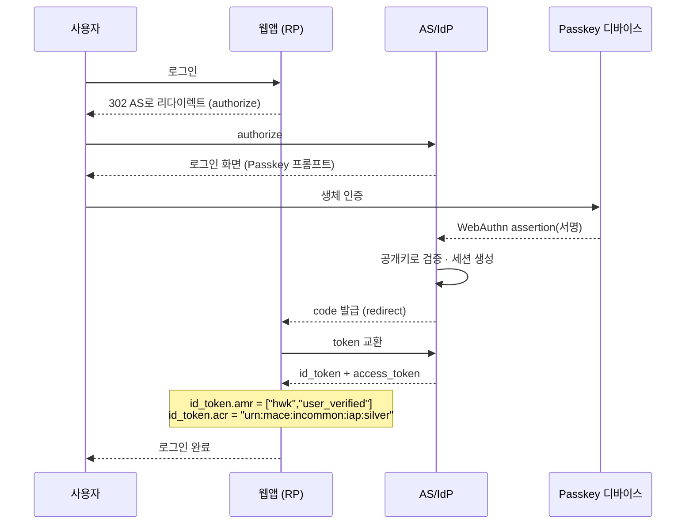
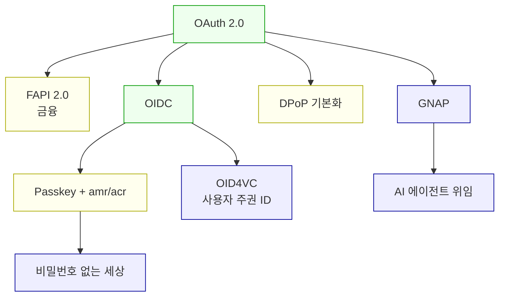

# OAuth의 미래

::: info 학습 목표
- GNAP이 OAuth 2.0의 한계를 어떻게 극복하는지 안다.
- Passkey와 WebAuthn/FIDO2의 관계를 안다.
- Passkey가 OIDC 인증 수단으로 어떻게 통합되는지 안다.
- 앞으로 3~5년 OAuth/Identity 지형을 전망한다.
:::

---

## 1. OAuth 2.0의 구조적 한계

OAuth 2.0은 2012년 RFC 6749로 자리 잡은 이후 13년 넘게 업계 표준 역할을 했다. 동시에 다음 세대 표준이 필요하다는 논의도 같은 기간 이어져 왔다. 왜 새로운 표준이 요구되는지 한계를 정리한다.

### Grant Type 난립

OAuth 2.0은 Authorization Code, Implicit, Resource Owner Password Credentials, Client Credentials 네 가지 기본 Grant Type으로 시작했다. 그 후 Device Authorization, JWT Bearer, SAML 2.0 Bearer, Token Exchange 등이 별도 RFC로 추가되면서 <strong>10개 이상</strong>의 Grant이 난립하는 상황이 되었다.

| 문제 | 구체 증상 |
|-----|---------|
| 선택 복잡도 | 어떤 시나리오에 어떤 Grant를 써야 할지 판단이 어렵다 |
| 보안 함정 | Implicit·ROPC는 이제 권장되지 않지만 구현은 남아 있다 |
| 표현력 부족 | "3분 동안만, 결제 금액 X 이하만" 같은 미세한 위임을 Grant Type만으로는 말할 수 없다 |
| 동적 협상 불가 | 클라이언트가 필요한 권한 폭을 요청 시점에 협상하기 어렵다 |

### 요청·응답 구조의 경직성

OAuth 2.0의 authorize 요청은 URL 쿼리 파라미터다. redirect_uri의 길이 제한, URL 인코딩 문제, 브라우저 주소창 노출 등 근본적 제약이 있다. PAR(RFC 9126)이 파라미터를 서버 사이드에 선등록하는 방식으로 일부 해결했지만, 여전히 "요청 = URL 파라미터 세트"라는 프레임은 유지된다.

### 인가 의도 표현의 부족

"결제를 수행한다"는 의도(intent)를 표현할 표준 장치가 없다. scope로 표현하려 하면 `payments.execute` 같은 문자열이 되는데, "금액", "수취인", "승인 유효기간"을 붙이려면 각 RP가 자체 규약을 만들게 된다. 이것이 오픈뱅킹·PSD2 생태계에서 반복적으로 문제가 되었고, FAPI·CIBA 같은 파생 표준을 만들어야 했다.

### 정리



이 세 가지 한계를 <strong>처음부터 다시 설계</strong>하자는 움직임에서 나온 것이 GNAP이다.

---

## 2. GNAP (Grant Negotiation and Authorization Protocol)

GNAP은 <strong>RFC 9635</strong>(2024)로 표준화된 OAuth의 차세대 후보다. 이름 그대로 "권한 협상(Grant Negotiation)" 프로토콜이며, OAuth 2.0의 한계를 의식적으로 풀기 위해 설계되었다.

### 설계 원칙

| 원칙 | 의미 |
|-----|-----|
| JSON 기반 | URL 파라미터가 아닌 JSON 본문으로 요청/응답을 교환한다 |
| 협상 가능 | 클라이언트가 원하는 권한을 요청하면 AS가 승인·수정·추가 인증을 요구한다 |
| 의도 객체 | 권한의 단위가 "문자열 scope"가 아닌 "JSON 객체"로 표현된다 |
| 대화형 | 한 번의 요청·응답이 아니라 여러 라운드로 이어질 수 있다 |
| 사용자 상호작용 분리 | 인증 수단(ID/PW, Passkey, 푸시)을 프로토콜 레벨에서 독립 |
| 강결합된 키 바인딩 | 모든 요청이 클라이언트 키로 서명됨 — Sender-Constrained가 기본 |

### 기본 흐름

GNAP은 세 가지 엔드포인트로 요약된다.

| 엔드포인트 | 역할 |
|----------|------|
| Grant Request | 클라이언트가 AS에 권한 요청(JSON) |
| Interact | 사용자 상호작용(로그인, 동의) |
| Continue | 상호작용 결과를 받아 요청을 이어감 |

### GNAP 협상 시퀀스



### 요청 본문 예시

GNAP의 표현력을 보려면 JSON 본문 자체가 가장 직관적이다.

```json
POST /tx
Content-Type: application/json
{
  "access_token": {
    "access": [
      {
        "type": "payments.execute",
        "actions": ["create"],
        "locations": ["https://api.bank.example/payments"],
        "amount": { "currency": "KRW", "max": 200000 },
        "datatypes": ["transfer"]
      }
    ]
  },
  "client": {
    "key": { "proof": "httpsig", "jwk": { "kty": "EC", "kid": "..." } },
    "display": { "name": "Acme Pay" }
  },
  "subject": { "sub_id_formats": ["opaque"] },
  "interact": {
    "start": ["redirect"],
    "finish": {
      "method": "redirect",
      "uri": "https://client.example/cb",
      "nonce": "random"
    }
  }
}
```

"금액 20만원 이하의 payments.execute"라는 <strong>의도</strong>가 요청에 그대로 실린다. OAuth 2.0에서는 이런 미세 권한을 scope 문자열로는 전달할 수 없었다.

### OAuth 2.0과의 비교

| 항목 | OAuth 2.0 | GNAP |
|-----|-----------|------|
| 전송 | URL Query / Form | JSON Body |
| 권한 표현 | scope 문자열 | access object(계층적 JSON) |
| 요청 반복 | 별도 플로우 | continue로 확장 가능 |
| 인증 수단 | implicit(브라우저 쿠키 + AS 화면) | interact 블록으로 명시 분리 |
| 키 바인딩 | 선택(DPoP, mTLS) | 기본(httpsig) |
| 하위 호환 | — | OAuth 2.0 토큰과 공존 가능 |

### 도입 전망

GNAP은 OAuth 2.0을 즉시 대체할 물건이 아니다. IETF의 공식 기록도 "OAuth 2.0을 대체하는 것이 목적이 아니라, OAuth 2.0으로 풀기 어려운 문제 공간을 커버한다"고 밝힌다. 실제 도입 후보는 다음 영역이다.

- 오픈뱅킹·결제처럼 <strong>의도 표현이 필요한 시나리오</strong>
- IoT·디바이스·에이전트처럼 <strong>비인터랙티브 클라이언트</strong>
- 연합 ID·위임 체인이 깊은 <strong>B2B SaaS</strong>

일반 로그인 수준이라면 OAuth 2.0 + OIDC가 당분간 계속 주력이다.

---

## 3. Passkey와 WebAuthn/FIDO2

OAuth가 <strong>권한 위임</strong>을 다룬다면, 인증 자체의 차세대는 <strong>Passkey</strong>다. Passkey는 비밀번호를 완전히 없애려는 업계 합의의 결과물이며, 그 기술적 기반이 WebAuthn과 FIDO2다.

### 세 용어의 관계

| 용어 | 정체 | 범위 |
|-----|-----|------|
| FIDO2 | FIDO Alliance의 인증 표준 세트 | WebAuthn + CTAP |
| WebAuthn | 브라우저·JS에서 쓰는 W3C 표준 API | 프런트엔드 인터페이스 |
| CTAP | 인증기(보안 키·휴대폰)와 브라우저 간 프로토콜 | 디바이스 레벨 |
| Passkey | WebAuthn 크리덴셜 + 디바이스 간 동기화 | 사용자 체감 제품명 |

### 동작 원리

전통적 비밀번호 인증은 "서버가 해시를 저장하고, 사용자가 비밀번호를 보낸다"는 구조였다. Passkey는 정반대다.

1. 사용자의 디바이스가 <strong>공개키/개인키 쌍</strong>을 생성한다.
2. 공개키를 서비스(Relying Party)에 등록한다.
3. 로그인할 때는 서비스가 보낸 Challenge를 개인키로 서명해 응답한다.
4. 서비스는 공개키로 서명을 검증한다. 개인키는 <strong>디바이스를 절대 떠나지 않는다</strong>.

### Passkey 등록·인증 시퀀스



### 왜 Passkey가 비밀번호보다 강한가

| 공격 | 비밀번호 | Passkey |
|-----|---------|---------|
| 유출(서버 털림) | 해시 크랙 → 계정 탈취 | 공개키만 노출, 의미 없음 |
| 피싱 | 가짜 사이트에 입력 | `rpId`로 도메인 바인딩, 가짜 사이트에서 동작 안 함 |
| 재사용 | 동일 비밀번호 여러 사이트 | 사이트마다 별도 키 쌍 |
| 키로거 | 타이핑 시 노출 | 타이핑 없음(생체 인증) |
| 중간자 공격 | 평문 전송 시 노출 | 서명 응답 + HTTPS |

Passkey의 구조적 우위는 <strong>"공유 비밀(shared secret)이 없다"</strong>는 점이다. 비밀번호는 서버와 사용자가 같은 비밀을 알아야 하지만, Passkey는 서버가 공개키만 알고 있어도 된다.

### Passkey vs FIDO U2F 보안 키

FIDO U2F 시절의 하드웨어 보안 키(YubiKey 등)는 <strong>디바이스 종속</strong>이었다. 키를 잃어버리면 계정에서 영구 잠길 수 있어 백업 키를 여러 개 등록하는 운용이 필요했다. Passkey는 여기에 <strong>동기화(synced)</strong>를 추가했다. iCloud Keychain, Google Password Manager, 1Password 등이 Passkey를 디바이스 간 암호화 동기화해 준다.

### 크로스 디바이스 인증

휴대폰에 등록된 Passkey로 PC에 로그인하는 시나리오는 CTAP 2.2가 정의한 <strong>hybrid transport</strong>로 동작한다. PC에 QR 코드가 뜨고, 휴대폰으로 스캔하면 BLE로 근접 검증 후 서명이 전달된다. "내가 근처에 있다"는 물리적 증거까지 인증에 포함되는 셈이다.

---

## 4. Passkey + OIDC

OAuth/OIDC와 Passkey는 경쟁이 아니다. <strong>보완 관계</strong>다. Passkey는 AS에서 일어나는 <strong>인증 수단</strong>으로 자리 잡고, 그 결과는 OIDC 토큰으로 각 RP에 전달된다.

### 통합 아키텍처



### acr / amr 클레임

OIDC는 ID Token에 <strong>인증 방법과 강도</strong>를 담는 표준 클레임을 이미 정의해 두었다.

| 클레임 | 풀네임 | 의미 |
|-------|-------|------|
| `acr` | Authentication Context Class Reference | 인증 강도의 문자열 클래스(예: `loa2`) |
| `amr` | Authentication Methods References | 사용한 인증 수단 배열 |

`amr` 값 예시(RFC 8176):

| 값 | 의미 |
|---|-----|
| `pwd` | 비밀번호 |
| `otp` | OTP |
| `hwk` | Hardware-Secured Key (Passkey 포함) |
| `swk` | Software-Secured Key |
| `user` | 사용자 존재 확인(Presence) |
| `pin` | PIN |
| `mfa` | 다중 요소 |

Passkey 기반 로그인은 일반적으로 `amr: ["hwk","user"]` 또는 `amr: ["hwk","pin","mfa"]`로 표현된다. RP는 이 값을 보고 "이 토큰은 Passkey 로그인으로 얻은 것"임을 인지한다.

### 민감 작업에는 step-up

OIDC의 `acr_values` 파라미터를 쓰면 "이 요청에는 더 강한 인증이 필요하다"고 AS에 요구할 수 있다. 예컨대 결제 확인 단계에서 다음과 같이 보낸다.

```
GET /authorize?...&acr_values=urn:mace:incommon:iap:gold&prompt=login
```

AS는 이미 로그인된 사용자라도 <strong>Passkey 재인증</strong>을 요구한다. 이것이 [CH18](/study/oauth/18-sso-federation)에서 언급한 step-up authentication의 표준 구현 방식이다.

### Passkey Only 로그인 전망

점진적 로드맵은 다음과 같이 예상된다.

| 단계 | 상태 |
|-----|-----|
| 0단계 | 비밀번호만 — 2020년대 초까지의 주류 |
| 1단계 | 비밀번호 + 2FA(OTP/보안키) — 현재 표준 |
| 2단계 | Passkey 공존(비밀번호 선택적) — 2024~2026 |
| 3단계 | Passkey Only + 계정 복구 정책 성숙 — 2027~2030 |
| 4단계 | 비밀번호 필드 제거 — 그 이후 |

Apple, Google, Microsoft가 2022년 FIDO Alliance와 함께 "Passkey 공동 지원"을 선언한 이후 브라우저·OS 레벨 지원이 완료되었다. 남은 허들은 <strong>계정 복구</strong>(디바이스 분실 시 어떻게 복구할 것인가)와 <strong>엔터프라이즈 환경의 정책 관리</strong>다.

---

## 5. 앞으로의 방향

OAuth·OIDC·Identity 생태계의 향후 3~5년을 정리한다. 스터디의 마지막 장이기도 하니, 지금까지 다룬 모든 개념을 축으로 삼아 관통한다.

### Sender-Constrained Token의 기본화

[CH13](/study/oauth/13-token-strategy)에서 본 DPoP(RFC 9449)와 mTLS(RFC 8705)는 현재 "옵션"이지만, 향후 5년 내 <strong>기본값</strong>이 될 가능성이 높다. 그 이유는 다음과 같다.

- Bearer Token의 도용 위험은 수년간 반복되는 사고 패턴
- 이미 FAPI 2.0(금융 표준)에서 Sender-Constrained가 필수
- GNAP은 httpsig로 Sender-Constrained가 기본

대형 IdP들이 mTLS 또는 DPoP를 default로 켜는 시점이 전환점이 될 것이다.

### BFF 패턴의 표준화

[CH14](/study/oauth/14-token-storage-bff)에서 다룬 BFF 패턴은 2020년대 초까지 "권장 사항"이었다. 앞으로는 SPA 프레임워크 자체가 BFF를 전제로 내장할 가능성이 크다. Next.js의 App Router, Remix, SvelteKit의 Server Routes 모두 이미 BFF가 자연스러운 구조다.

### 사용자 주권 ID (SSI, DID)

"내 신원 데이터를 내가 관리한다"는 Self-Sovereign Identity 운동이 W3C DID(Decentralized Identifier)와 VC(Verifiable Credentials) 표준으로 구체화되고 있다. 유럽 연합은 eIDAS 2.0으로 <strong>EU Digital Identity Wallet</strong>을 추진 중이다. OAuth/OIDC는 이 신원 지갑과 어떻게 공존할지를 <strong>OID4VC(OpenID for Verifiable Credentials)</strong>로 표준화하고 있다.

### AI 에이전트 시대의 권한 위임

AI 에이전트가 사용자를 대신해 이메일을 읽고, 캘린더를 잡고, 결제를 수행하는 시나리오가 빠르게 현실화되고 있다. 이때 에이전트에 <strong>어떤 권한을 얼마나 오래</strong> 위임할지 표현하려면 OAuth 2.0의 scope로는 부족하다. GNAP의 access object 같은 풍부한 표현이 이 문제에 대응한다. Anthropic의 MCP(Model Context Protocol), 각종 에이전트 프레임워크에 OAuth가 녹아들고 있다.

### 생태계 지도



범례: 초록(현재 주류), 노랑(1~3년 내 확산), 파랑(3~7년 후 전망).

### 스터디의 결산

비밀번호를 남에게 넘기던 시대에서 출발해, 권한 위임을 표준화한 OAuth 2.0, 인증 계층을 덧붙인 OIDC, PKCE·RTR·BFF·DPoP 같은 보안 패턴들을 지나, 이제 Passkey로 비밀번호 자체를 없애고 GNAP으로 다시 설계하는 시대 직전까지 왔다. 이 20장의 여정은 결국 하나의 질문에 답하는 과정이었다.

> <strong>"자기 자원에 대한 접근을, 얼마나 안전하게 남에게 위임할 수 있는가."</strong>

이 질문의 구체적 답은 시대마다 달라져 왔지만, 설계 원칙은 일관됐다. <strong>비밀은 가능한 한 적게 공유하고, 권한은 가능한 한 작게 쪼개고, 위임은 항상 취소 가능해야 한다</strong>. 이 원칙을 붙잡고 있으면 앞으로 어떤 새 표준이 나와도 그 구조가 왜 그런지 해석할 수 있다.

::: warning 마지막 조언
표준은 내일도 바뀌지만 원칙은 그대로다. 특정 RFC 번호를 외우기보다 <strong>왜 그 설계가 나왔는지</strong>를 이해하는 쪽으로 공부를 이어가라. 그러면 GNAP이 OAuth 3.0으로 명명되든, Passkey가 새 이름을 얻든, 설명서를 다시 읽지 않아도 바로 읽힌다.
:::

---

::: tip 핵심 정리
- OAuth 2.0은 Grant Type 난립·경직된 URL 파라미터·의도 표현 부족이라는 구조적 한계가 있고, GNAP(RFC 9635)은 JSON 협상 기반으로 이를 재설계한다.
- Passkey는 WebAuthn/FIDO2 표준 위에 디바이스 간 동기화를 얹은 제품 개념이다. 공유 비밀이 없어 피싱·유출·재사용에 구조적으로 강하다.
- Passkey와 OIDC는 경쟁이 아니라 보완이다. AS가 Passkey로 인증하고 OIDC가 그 결과를 `amr`·`acr` 클레임으로 RP에 전달한다.
- 앞으로 3~5년은 Sender-Constrained Token 기본화, BFF 표준화, OID4VC, AI 에이전트 권한 위임이 주요 흐름이다.
- 표준은 바뀌어도 "비밀은 적게, 권한은 작게, 위임은 취소 가능하게"라는 원칙은 불변이다.
:::

## 다음 챕터

- 이전 : [관찰성과 감사](/study/oauth/19-observability)
- 다음 : 스터디 완주를 축하한다. [OAuth 스터디 소개](/study/oauth/)로 돌아가 복습하자.
