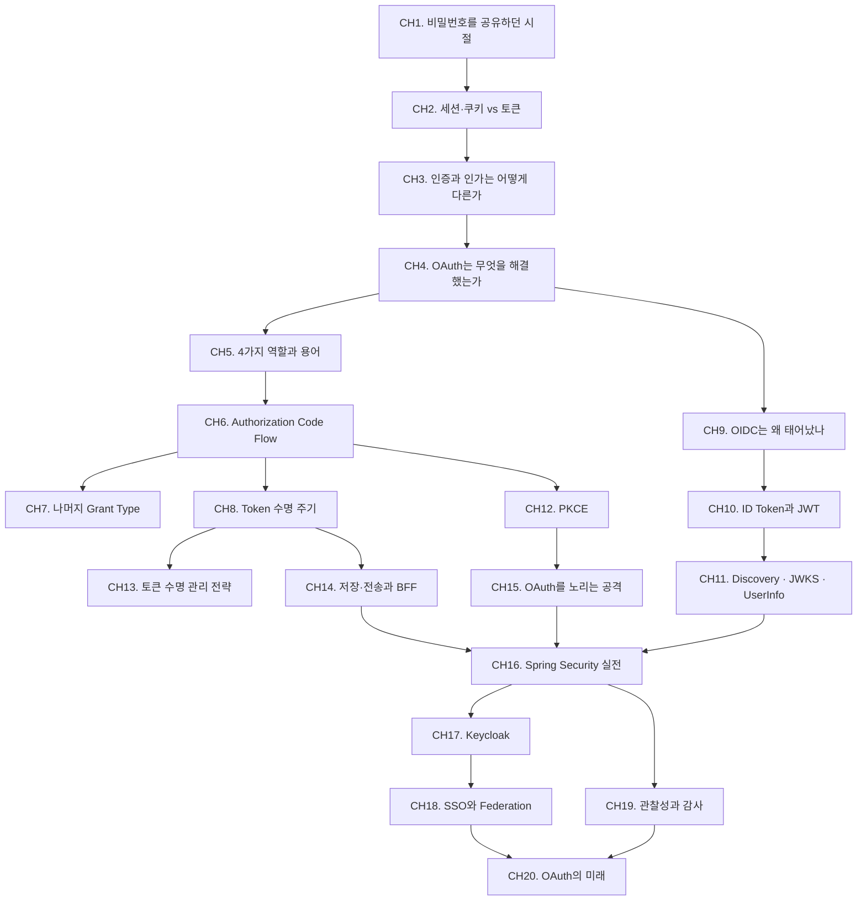

# OAuth 2.0 + OpenID Connect

"이 앱이 당신의 구글 캘린더에 접근해도 될까요?" 모든 로그인 버튼 뒤에는 OAuth가 있다. 이 스터디는 비밀번호를 공유하던 시절의 불편함에서 출발해, OAuth 2.0이 어떻게 권한 위임 문제를 풀었는지, OpenID Connect가 왜 추가로 필요했는지, 그리고 실제 서비스에서 부딪히는 보안·운영 이슈까지 체계적으로 학습한다.

비개발자가 "로그인이 어떻게 동작하는가"를 이해하는 수준부터, 시니어 백엔드가 PKCE·RTR·BFF 패턴을 설계하는 수준까지 한 권으로 커버한다.

## 학습 로드맵

## 목차

### 왜 OAuth가 필요한가
1. [비밀번호를 공유하던 시절](/study/oauth/01-password-sharing-era) — 로그인의 진화와 제3자 접근의 위험
2. [세션·쿠키 vs 토큰](/study/oauth/02-session-vs-token) — 상태 관리의 두 갈래, stateful과 stateless
3. [인증과 인가는 어떻게 다른가](/study/oauth/03-authn-vs-authz) — Authentication과 Authorization의 분리
4. [OAuth는 무엇을 해결했는가](/study/oauth/04-what-oauth-solves) — "대신 접근" 권한 위임 모델

### OAuth 2.0 핵심
5. [4가지 역할과 용어](/study/oauth/05-roles-and-terms) — Resource Owner / Client / AS / RS
6. [Authorization Code Flow](/study/oauth/06-authorization-code-flow) — 표준 플로우와 Device Authorization Grant
7. [나머지 Grant Type과 한계](/study/oauth/07-other-grant-types) — Implicit / ROPC / Client Credentials
8. [Access·Refresh Token 수명 주기](/study/oauth/08-token-lifecycle) — 발급·검증·Introspection·Revocation

### OpenID Connect
9. [OIDC는 왜 태어났나](/study/oauth/09-why-oidc) — OAuth 인증 오남용과 표준화
10. [ID Token과 JWT 구조](/study/oauth/10-id-token-jwt) — 헤더·페이로드·서명과 검증 절차
11. [Discovery · JWKS · UserInfo](/study/oauth/11-discovery-jwks-userinfo) — 표준 스코프와 키 로테이션

### 보안 심화
12. [PKCE](/study/oauth/12-pkce) — 공개 클라이언트 코드 가로채기 방어
13. [토큰 수명 관리 전략](/study/oauth/13-token-strategy) — Refresh Token Rotation · DPoP · mTLS
14. [토큰 저장·전송과 BFF 패턴](/study/oauth/14-token-storage-bff) — SPA 권장 아키텍처
15. [OAuth를 노리는 공격들](/study/oauth/15-attacks) — Open Redirect · State CSRF · Mix-up

### 실전 구현·운영
16. [Spring Security OAuth2 Client](/study/oauth/16-spring-security) — 소셜 로그인 함정들
17. [Keycloak으로 AS 구축](/study/oauth/17-keycloak) — Dynamic Client Registration 포함
18. [SSO와 Federation](/study/oauth/18-sso-federation) — SAML 비교와 IdP 연동
19. [관찰성과 감사](/study/oauth/19-observability) — 토큰 라이프사이클 로깅과 이상 탐지
20. [OAuth의 미래](/study/oauth/20-future) — GNAP · Passkey · WebAuthn

## 관련 자료

::: info 블로그 포스트와 함께 읽기
- [OAuth와 비교한 OIDC 개념](/posts/tech/2025-08-29-oidc) — CH5, CH6, CH9의 실제 플로우 이미지
- [Keycloak 개념 및 간단 사용](/posts/tech/2025-10-01-keycloak) — CH17의 실습 레퍼런스
- [카카오 OAuth API 스펙 문제](/posts/spring/2025-02-13-security) — CH16의 소셜 로그인 함정 사례
- [Refresh 토큰과 RTR](/posts/spring/2023-04-18-rtr) — CH13의 RTR 실제 구현
:::
