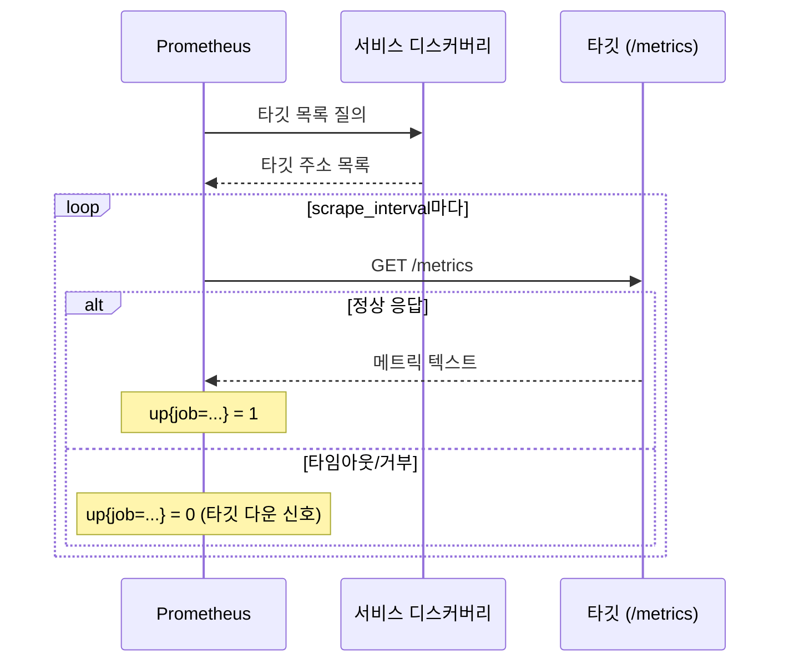
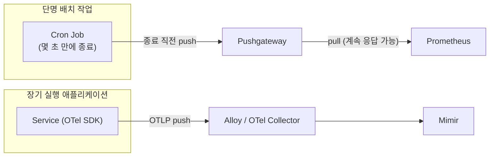
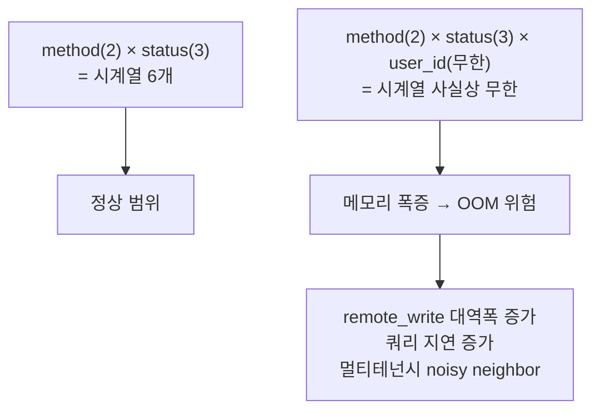

# Pull/Push와 카디널리티

::: info 학습 목표
- Prometheus가 채택한 pull 모델의 동작 방식과, 타깃 헬스·서비스 디스커버리 측면의 장점을 설명할 수 있다.
- OTLP·Pushgateway 기반 push 모델이 어떤 상황(배치, 단명 작업)에서 필요한지 이해한다.
- pull과 push 중 무엇을 선택할지 실전 기준으로 판단할 수 있다.
- 카디널리티가 "메트릭 이름 + 라벨 조합"으로 정의되는 시계열 유일성 개념임을 안다.
- user_id·request_id 같은 라벨이 왜 카디널리티 폭발을 일으키고 메모리·비용에 어떤 영향을 주는지 안다.
- 카디널리티를 사전에 통제하는 원칙과 그 도구를 파악한다.
:::

## 1. Pull 모델 — Prometheus

Prometheus는 <strong>pull</strong> 모델을 채택한다. 메트릭을 생성하는 쪽(애플리케이션, exporter)은 그저 `/metrics` HTTP 엔드포인트에 현재 상태를 노출해둘 뿐이고, Prometheus 서버가 `scrape_interval`마다 그 엔드포인트를 능동적으로 긁어간다.

이 모델의 가장 큰 장점은 <strong>타깃 헬스를 스크레이핑 자체가 알려준다</strong>는 점이다. 스크레이프가 실패하면 `up{job="..."} == 0`이라는 시계열이 자동으로 생기고, 이는 곧 "이 타깃이 죽었거나 응답하지 않는다"는 신호가 된다. 별도의 헬스체크 시스템 없이 수집 메커니즘 자체가 가용성 신호를 겸하는 셈이다. 둘째, <strong>서비스 디스커버리(SD)</strong>와 자연스럽게 결합된다. Prometheus는 Kubernetes API, Consul, EC2 태그 등에서 타깃 목록을 동적으로 가져와 스크레이프 대상을 갱신하므로, 타깃이 어디 있는지는 Prometheus가 알아서 찾고 각 타깃은 자신이 어디로 데이터를 보내야 하는지 몰라도 된다. 셋째, 스크레이프 주기·타임아웃을 <strong>중앙에서 통제</strong>할 수 있어 특정 타깃이 과도한 부하를 유발하는 상황을 서버 쪽에서 조절하기 쉽다.

단점은 방향이 반대로 흘러야 하는 상황에서 드러난다. 네트워크 경계 너머(NAT 뒤, 방화벽 안쪽) 타깃은 Prometheus가 직접 접근할 수 없고, 배치 작업처럼 스크레이프 시점에 이미 종료된 프로세스는 pull로 잡아낼 수 없다.



## 2. Push 모델 — OTLP, Pushgateway

<strong>Push</strong> 모델에서는 메트릭을 만드는 쪽이 능동적으로 수집기로 데이터를 밀어보낸다. OpenTelemetry의 OTLP 프로토콜이 대표적이며, Alloy나 OpenTelemetry Collector가 수신자 역할을 한다. Push는 pull이 구조적으로 못 하는 두 가지 상황을 커버한다.

첫째는 <strong>단명 작업(short-lived job)</strong>이다. 배치 스크립트나 서버리스 함수처럼 몇 초 만에 끝나는 프로세스는 Prometheus의 스크레이프 주기(보통 15~60초)보다 수명이 짧아, pull로는 존재 자체를 포착하지 못한다. Prometheus 생태계에서는 이 문제를 <strong>Pushgateway</strong>로 보완한다 — 단명 작업이 종료 직전 Pushgateway에 최종 메트릭을 push하면, Pushgateway가 그 값을 들고 있다가 Prometheus의 스크레이프에 응답한다. 다만 Pushgateway는 값이 갱신되지 않는 한 계속 마지막 값을 노출하므로, 오래된 데이터가 stale 상태로 남는 문제를 `honor_labels`나 수동 삭제로 관리해야 한다.

둘째는 <strong>네트워크 경계</strong>다. 수집기가 각 서비스에 직접 접근할 수 없는 구조(에이전트가 아웃바운드만 가능한 환경, 멀티 클라우드)에서는 서비스가 중앙 Collector로 push하는 편이 훨씬 단순하다.



## 3. Pull vs Push 실전 선택 기준

이론적으로는 어느 쪽이든 메트릭을 옮길 수 있지만, 실전에서는 워크로드 특성이 선택을 사실상 결정한다.

| 상황 | 권장 모델 | 이유 |
|---|---|---|
| 장기 실행 서비스, 쿠버네티스 Pod | Pull | SD로 자동 타깃 갱신, up 메트릭으로 헬스 겸용 |
| 배치/Cron/서버리스 | Push (Pushgateway 또는 OTLP) | 스크레이프 시점에 프로세스가 이미 종료 |
| 방화벽 뒤/아웃바운드 전용 네트워크 | Push (OTLP) | 수집기가 타깃에 인바운드로 접근 불가 |
| 멀티 벤더/멀티 백엔드 전송 | Push (OTLP) | 하나의 SDK로 여러 백엔드에 동시 전송 가능 |
| 온프레미스 클러스터, SD 인프라 존재 | Pull | 기존 SD(Consul, k8s API) 재사용 |

Grafana 스택 안에서는 이 선택이 배타적이지 않다. Alloy가 pull(Prometheus 스크레이프 컴포넌트)과 push(OTLP 리시버) 컴포넌트를 동시에 구성할 수 있어, 같은 파이프라인 안에서 장기 실행 서비스는 pull로, 배치 작업은 push로 받는 혼합 구성이 일반적이다.

## 4. 카디널리티란

<strong>카디널리티(cardinality)</strong>는 한 메트릭이 가질 수 있는 <strong>유일한 시계열의 개수</strong>를 뜻한다. Prometheus 데이터 모델에서 하나의 시계열은 메트릭 이름과 라벨 값의 조합으로 식별된다.

```
http_requests_total{method="GET", status="200", handler="/api/users"}
http_requests_total{method="POST", status="201", handler="/api/users"}
```

라벨이 `method`(2가지) × `status`(3가지) × `handler`(5가지)라면, 이 메트릭 하나가 만들어낼 수 있는 시계열은 최대 2×3×5=30개다. 카디널리티는 라벨 값의 <strong>경우의 수를 곱한 값</strong>이며, 라벨을 하나 추가할 때마다 전체 시계열 수는 곱셈으로 늘어난다는 점이 핵심이다.

## 5. 카디널리티 폭발

문제는 라벨 값의 경우의 수가 <strong>무한에 가까운 차원</strong>을 라벨로 넣을 때 벌어진다. `user_id`, `request_id`, `session_id`, 원시 이메일 주소 같은 필드를 라벨로 붙이면 그 즉시 시계열 개수가 사용자 수·요청 수에 비례해 폭증한다.

```promql
# 절대 금지: user_id는 사실상 무한 카디널리티
http_requests_total{method="GET", status="200", user_id="552391"}
```

이게 왜 치명적인가 하면, Prometheus TSDB는 <strong>활성 시계열마다 메모리에 인덱스와 청크 헤더를 유지</strong>하기 때문이다. 시계열이 수백만 개로 늘면 `remote_write` 대역폭, 쿼리 지연, 메모리 사용량이 동시에 악화되고 최악의 경우 Prometheus/Mimir 프로세스가 OOM으로 죽는다. Mimir 같은 멀티테넌시 백엔드에서는 카디널리티 폭발이 한 테넌트의 실수로 전체 클러스터 성능에 영향을 주는 <strong>noisy neighbor</strong> 문제로도 번진다. 이 비용 구조는 [34장 카디널리티 관리와 비용](/study/observability/34-cardinality-cost)에서 실제 완화 기법과 함께 다룬다.



高카디널리티 정보(어떤 사용자가 요청했는가)가 필요 없다는 뜻이 아니다 — 그 질문에는 메트릭이 아니라 <strong>로그·트레이스</strong>가 답해야 한다는 뜻이다. `user_id`는 로그 필드나 트레이스 span 속성으로는 자유롭게 넣어도 된다. 이 신호별 역할 분담은 [2장](/study/observability/02-four-signals)에서 다룬 내용과 그대로 이어진다.

## 6. 카디널리티 통제 원칙

카디널리티는 사고가 나기 전에 <strong>설계 시점에 통제</strong>하는 것이 사고 후 완화보다 훨씬 싸다. 실전에서 지키는 원칙은 크게 세 가지다.

첫째, <strong>라벨에 넣을 값의 경우의 수를 미리 추정</strong>한다. "이 라벨이 가질 수 있는 값이 수십~수백 개 이내인가"를 계측 코드 작성 시점에 스스로 묻는다. 둘째, <strong>유일값은 라벨이 아니라 exemplar나 로그로</strong> 내보낸다. 레이턴시 히스토그램에 trace ID를 exemplar로 붙이면, 라벨로 넣지 않고도 "이 버킷에 해당하는 대표 요청"을 나중에 트레이스에서 찾아갈 수 있다. 셋째, <strong>relabel_config의 `drop`/`labeldrop`</strong>으로 원치 않는 고카디널리티 라벨을 스크레이프 단계에서 걸러내고, Mimir/Prometheus의 카디널리티 분석 API(`/api/v1/status/tsdb`)로 운영 중에도 주기적으로 상위 카디널리티 메트릭을 점검한다.

```yaml
# 스크레이프 단계에서 고카디널리티 라벨 제거
metric_relabel_configs:
- action: labeldrop
  regex: (user_id|session_id|request_id)
```

이 원칙들을 실제 운영 체크리스트와 탐지 쿼리로 확장한 내용은 [34장](/study/observability/34-cardinality-cost)에서 이어진다.

::: tip 핵심 정리
- Pull 모델(Prometheus)은 스크레이프 자체가 타깃 헬스 신호를 겸하고 서비스 디스커버리와 잘 맞지만, 방화벽 너머나 단명 작업은 다루지 못한다.
- Push 모델(OTLP, Pushgateway)은 배치 작업·네트워크 경계 상황을 보완하며, Alloy가 두 모델을 한 파이프라인에서 혼합할 수 있게 해준다.
- 카디널리티는 메트릭 이름과 라벨 값 조합으로 정의되는 시계열 유일성이며, 라벨을 추가할 때마다 곱셈으로 늘어난다.
- user_id·request_id 같은 무한에 가까운 라벨은 시계열 폭발과 메모리 OOM, noisy neighbor 문제로 이어진다.
- 고카디널리티 질문(누가, 어떤 요청이)은 메트릭 라벨이 아니라 로그·트레이스·exemplar로 답해야 한다.
- 카디널리티는 relabel_config와 계측 설계 시점의 사전 통제가 사고 후 완화보다 항상 저렴하다.
:::

## 다음 챕터

관측성 기초 네 챕터를 마쳤다. 이제부터는 메트릭 신호의 실제 구현체인 Prometheus를 깊게 파고든다. [Prometheus 아키텍처](/study/observability/05-prometheus-architecture)에서 서버·클라이언트 라이브러리·Exporter가 어떻게 조합되는지, 그리고 이 챕터에서 다룬 pull 모델이 내부적으로 어떻게 구현되는지 다룬다.
