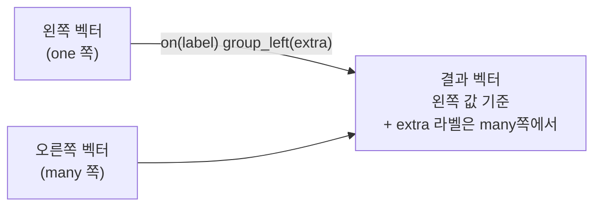
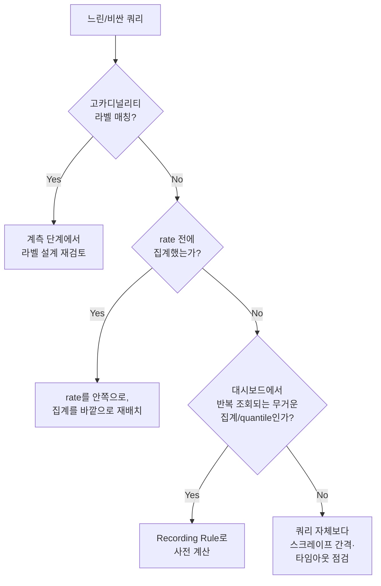

# PromQL 심화

::: info 학습 목표
- 라벨 집합이 다른 두 메트릭을 `on`/`ignoring`과 `group_left`/`group_right`로 정확히 조인한다.
- 서브쿼리로 range vector 함수의 결과를 다시 range로 감싸는 패턴을 익힌다.
- classic histogram의 `le` 버킷 집계 순서 함정과 native histogram 쿼리의 차이를 이해한다.
- `offset`과 `@` modifier로 과거 시점을 참조하는 쿼리를 작성한다.
- 고카디널리티 쿼리·`rate` 이전 집계 같은 성능 안티패턴을 피한다.
:::

## 1. 벡터 매칭 — on/ignoring, group_left/group_right

두 instant vector 사이에 이항 연산(산술·비교)을 하려면 Prometheus가 어떤 시계열끼리 짝을 지을지 알아야 한다. 기본 규칙은 <strong>양쪽 라벨 집합이 완전히 같은 시계열끼리</strong> 매칭하는 것(one-to-one)이다. 라벨 스키마가 다른 메트릭끼리는 대부분 이 기본 규칙으로 매칭되지 않는다.

```promql
# 기본 매칭: 두 메트릭의 라벨 집합이 동일해야 매치된다
# method, path, status_code가 양쪽에 다 있어야 성공
http_requests_total{status_code="500"} / http_requests_total{status_code=~".*"}
```

<strong>`on(labels...)`</strong>은 지정한 라벨만 기준으로 매칭한다. <strong>`ignoring(labels...)`</strong>은 반대로 지정한 라벨을 제외한 나머지 전부를 기준으로 매칭한다.

```promql
# instance 라벨만 기준으로 매칭 (나머지 라벨 차이는 무시)
node_memory_MemAvailable_bytes
  / on(instance) node_memory_MemTotal_bytes
```

한쪽 시계열 하나에 다른 쪽 시계열 여러 개가 매칭되는 many-to-one 상황(예: Deployment 정보 하나에 Pod 여러 개)에서는 `on`/`ignoring`만으로 부족하다. Prometheus가 "어느 쪽이 many인가"를 명시하라고 에러를 낸다. 이때 <strong>`group_left(extra_labels...)`</strong> 또는 <strong>`group_right(extra_labels...)`</strong>를 붙인다. `group_left`는 왼쪽이 "one", 오른쪽이 "many"라는 뜻이고, `group_right`는 그 반대다. 괄호 안에는 many 쪽에서 결과에 끌어오고 싶은 추가 라벨을 나열한다.

```promql
# kube_pod_info(many: pod마다 1개, node 라벨 보유)와
# cAdvisor 메모리 사용량(마찬가지로 pod 단위)을 조인해
# node 라벨을 결과에 끌어오는 예 — pod 기준 one-to-one이므로 group 불필요
container_memory_working_set_bytes
  * on(pod) group_left(node) kube_pod_info

# Deployment 단위 replica 부족 여부(one: deployment당 1개)에
# 해당 deployment 소속 Pod들의 CPU 사용량(many: pod마다 여러 개)을 곱해
# "replica 부족한 deployment의 pod cpu"를 남기는 예
kube_deployment_status_replicas_available
  / on(deployment) group_right()
  sum(rate(container_cpu_usage_seconds_total[5m])) by (deployment)
```



가장 흔한 실무 패턴은 `kube_pod_info`, `kube_pod_labels`처럼 <strong>정보성(info) 메트릭</strong>을 `group_left`로 끌어와 사용량 메트릭에 라벨을 덧붙이는 것이다. info 메트릭은 값 자체는 항상 `1`이고 라벨에만 의미가 있다.

```promql
# 팀 라벨을 실제 사용량에 붙여서 팀별로 집계
sum(
  rate(container_cpu_usage_seconds_total[5m])
  * on(namespace) group_left(team) kube_namespace_labels{label_team!=""}
) by (team)
```

::: warning many-to-many는 group_left/group_right로도 못 푼다
양쪽 다 매칭 키에 여러 시계열이 걸리는 many-to-many 상황은 애초에 벡터 매칭으로 표현할 수 없는 연산이다. 먼저 `sum by (...)` 등으로 한쪽을 one으로 만든 뒤에 조인해야 한다.
:::

## 2. 서브쿼리

서브쿼리는 range vector 함수의 <strong>결과</strong>를 다시 range로 감싸서 또 다른 range 함수에 넘기는 문법이다. `expr[range:resolution]` 형태로 쓰며, `resolution`을 생략하면 Prometheus가 전역 evaluation interval을 기본값으로 쓴다.

```promql
# 지난 1시간 동안, 1분 해상도로 계산한 rate의 최댓값
max_over_time(
  rate(http_requests_total[5m])[1h:1m]
)

# 지난 6시간 동안 5분 rate가 임계값을 넘은 비율
avg_over_time(
  (rate(http_requests_total{status_code=~"5.."}[5m]) > bool 0.05)[6h:1m]
)
```

서브쿼리는 "이미 range 함수를 한 번 거친 결과를 또 range로 다뤄야 할 때"만 필요하다. 단순히 `rate(v[1h])` 한 번으로 되는 걸 굳이 서브쿼리로 만들면 안 된다. 서브쿼리는 내부적으로 지정한 resolution마다 쿼리를 재평가하기 때문에 계산 비용이 크다 — 특히 짧은 resolution·긴 range 조합은 Prometheus 서버에 상당한 부하를 준다. Recording Rule로 미리 계산해두는 편이 나을 때가 많다([Recording·Alerting Rule](/study/observability/11-recording-alerting-rules) 참고).

## 3. 히스토그램 쿼리 심화

classic histogram은 `_bucket{le="..."}` (누적 카운트), `_sum`, `_count` 세 종류의 시계열로 구성된다. `histogram_quantile(φ, b)`는 `le` 라벨을 가진 버킷 시계열 집합을 받아 선형 보간으로 분위수를 추정한다.

```promql
# p95 레이턴시 — le별로 sum한 뒤에 quantile을 계산해야 한다
histogram_quantile(
  0.95,
  sum(rate(http_request_duration_seconds_bucket[5m])) by (le, job)
)
```

::: warning aggregation 순서가 결과를 바꾼다
`sum by (le, job)`처럼 <strong>`le`를 반드시 group-by 라벨에 포함</strong>해야 한다. `le`를 빼고 집계하면 서로 다른 버킷 경계의 카운트가 하나로 뭉개져 `histogram_quantile`이 엉뚱한 값을 낸다. 그리고 `rate()`는 반드시 `histogram_quantile` <strong>안쪽</strong>, `sum by`보다 <strong>먼저</strong> 적용해야 한다 — counter인 버킷 값을 먼저 합산한 뒤 rate를 걸면 개별 인스턴스의 리셋 보정이 깨지는 것은 일반 counter와 동일한 함정이다. 올바른 순서는 `histogram_quantile(φ, sum by (le, ...) (rate(..._bucket[5m])))`다.
:::

버킷 경계(`le` 값)는 클라이언트 라이브러리에서 미리 정의하므로, 버킷 사이 구간에서는 균등 분포를 가정한 <strong>선형 보간</strong>일 뿐 정확한 값이 아니다. 버킷 경계가 성기면 오차가 커진다. p99처럼 꼬리 분위수를 정확히 봐야 한다면 버킷 경계를 촘촘히 설계하거나 native histogram으로 전환하는 게 낫다.

## 4. Native Histogram 쿼리

<strong>Native histogram</strong>은 버킷 각각을 별도 시계열로 노출하던 classic 방식과 달리, 하나의 시계열 안에 지수 간격 버킷 전체를 구조화된 값으로 담는다. 클라이언트가 native histogram으로 계측하면 `_bucket`/`_sum`/`_count` 시계열 폭발 없이 훨씬 높은 해상도의 버킷을 저비용으로 유지할 수 있다.

```promql
# native histogram은 le로 sum by 할 필요가 없다 — 시계열 자체가 히스토그램 값이다
histogram_quantile(0.95, sum(rate(http_request_duration_seconds[5m])) by (job))

# 히스토그램 시계열에서 평균값을 직접 추출
histogram_avg(rate(http_request_duration_seconds[5m]))

# 총 관측 횟수 / 총 합
histogram_count(rate(http_request_duration_seconds[5m]))
histogram_sum(rate(http_request_duration_seconds[5m]))

# 특정 구간에 속하는 비율 (lower, upper]
histogram_fraction(0.1, 0.5, rate(http_request_duration_seconds[5m]))
```

`histogram_quantile`은 native histogram 시계열을 그대로 받아도 동작하도록 확장되어 있어, classic histogram과 같은 함수를 쓰지만 <strong>`le` group-by가 필요 없다</strong>는 점이 가장 큰 차이다. `histogram_avg`, `histogram_count`, `histogram_sum`, `histogram_fraction`은 native histogram 전용 함수로 classic histogram에는 쓸 수 없다.

::: warning native histogram은 활성화와 버전 확인이 먼저다
native histogram은 클라이언트 라이브러리가 네이티브 포맷으로 노출해야 하고, Prometheus 서버에서도 수신·저장 기능이 최신 버전 기준으로 안정화된 기능이다. 스크레이프 설정에서 native histogram 수신이 켜져 있는지, 클라이언트 계측 라이브러리가 이를 지원하는 버전인지 먼저 확인해야 한다.
:::

## 5. offset과 @ modifier — 시간 이동

<strong>`offset`</strong>은 쿼리 평가 시각을 과거로 밀어서 그 시점 기준 데이터를 가져온다.

```promql
# 24시간 전 같은 시각의 요청률과 비교
rate(http_requests_total[5m])
  / rate(http_requests_total[5m] offset 1d)
```

<strong>`@` modifier</strong>는 쿼리 평가 시각을 특정 Unix timestamp로 고정한다. `offset`이 상대 이동이라면 `@`는 절대 고정이다. 둘은 함께 쓸 수도 있다.

```promql
# 특정 시각(유닉스 타임스탬프) 기준으로 고정 평가
http_requests_total @ 1700000000

# 쿼리 range의 시작/끝 시각에 고정 (대시보드 변수와 조합 시 유용)
rate(http_requests_total[5m] @ end())
```

`@`는 대시보드에서 "항상 특정 배포 시점 기준으로 비교"하는 패널이나, 알림 룰에서 특정 사건 시점을 고정 기준점으로 잡는 용도에 쓴다. 일반적인 상대 비교는 `offset` 하나로 충분하다.

## 6. 안티패턴과 성능

<strong>고카디널리티 쿼리.</strong> 라벨 조합이 매우 많은 메트릭(요청 ID, 사용자 ID처럼 값이 사실상 무한한 라벨)에 와일드카드 매처를 걸면 쿼리가 수백만 개 시계열을 훑는다. 원인은 대개 계측 단계에서부터 고카디널리티 라벨을 붙인 것이므로, 쿼리를 최적화하기 전에 [카디널리티 관리](/study/observability/34-cardinality-cost)에서 라벨 설계 자체를 점검해야 한다.

<strong>`rate` 이전 집계 금지.</strong> [PromQL 기초](/study/observability/09-promql-basics)에서 다룬 것과 동일한 함정이 심화 쿼리에서도 반복된다. `sum(x[5m])`처럼 range vector를 바로 합산하는 문법 자체가 없으므로 실수하기 쉽지 않지만, `rate(sum_over_time(x[5m]))`류의 조합도 counter reset 보정을 깨뜨리므로 피한다.

<strong>불필요한 정규식 매처.</strong> `job=~"api"`처럼 `=`로 충분한 곳에 `=~`를 쓰면 정규식 엔진 오버헤드가 매 쿼리마다 붙는다. 값이 고정된 매칭은 항상 `=`/`!=`를 우선한다.

<strong>넓은 range의 즉석 집계 반복.</strong> `histogram_quantile`이나 `topk` 같은 무거운 연산을 긴 range·짧은 step으로 대시보드에서 반복 실행하면 매 새로고침마다 Prometheus에 부하가 걸린다. 자주 조회되는 무거운 쿼리는 Recording Rule로 미리 계산해두는 것이 정석이다.



::: tip 핵심 정리
- 벡터 매칭은 기본적으로 라벨 전체 일치이며, `on`/`ignoring`으로 매칭 기준을, `group_left`/`group_right`로 many 쪽 방향을 명시한다.
- 서브쿼리(`[range:resolution]`)는 range 함수 결과를 다시 range로 감쌀 때만 쓰고, 비용이 크므로 남용하지 않는다.
- classic histogram은 `le`를 group-by에 포함하고 rate를 먼저 적용해야 `histogram_quantile`이 정확하다.
- native histogram은 `le` group-by 없이 `histogram_quantile`을 쓸 수 있고, `histogram_avg`/`histogram_count`/`histogram_sum`/`histogram_fraction` 전용 함수를 제공한다.
- `offset`은 상대 시간 이동, `@`는 절대 시점 고정이며 함께 쓸 수 있다.
- 고카디널리티 매칭, rate 전 집계, 불필요한 정규식, 반복되는 무거운 쿼리는 대표적인 성능 안티패턴이다.
:::

## 다음 챕터

쿼리를 매번 즉석에서 계산하는 대신 미리 계산해두고, 조건을 만족하면 자동으로 알림을 발화하는 장치가 필요하다. [Recording·Alerting Rule](/study/observability/11-recording-alerting-rules)에서는 사전 계산 명명 규칙, `for`를 이용한 pending/firing 상태 전이, 룰 그룹 평가 비용, `promtool test rules`를 이용한 룰 테스트까지 다룬다.
