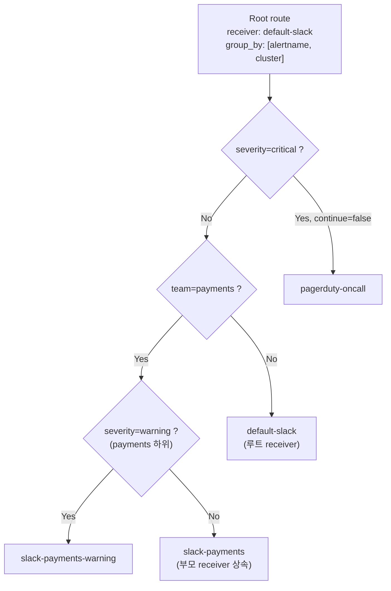
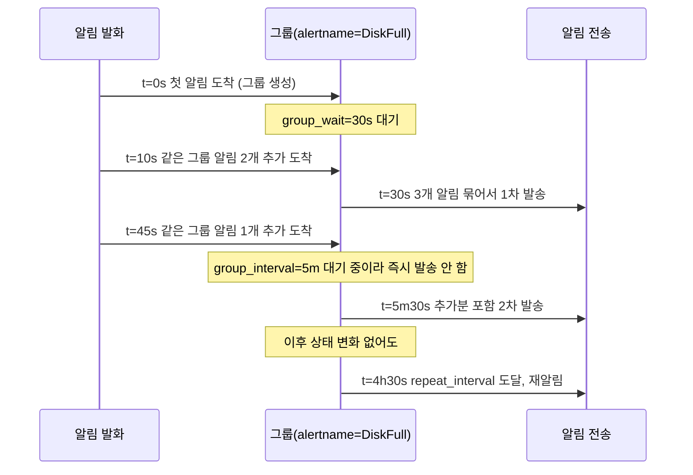
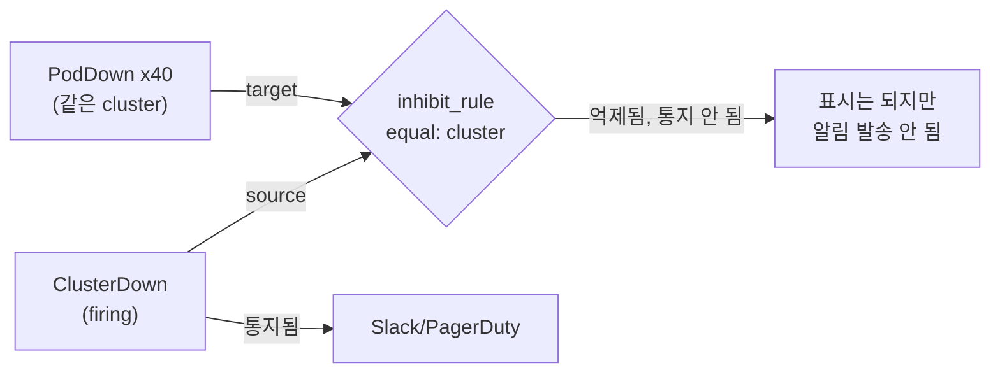
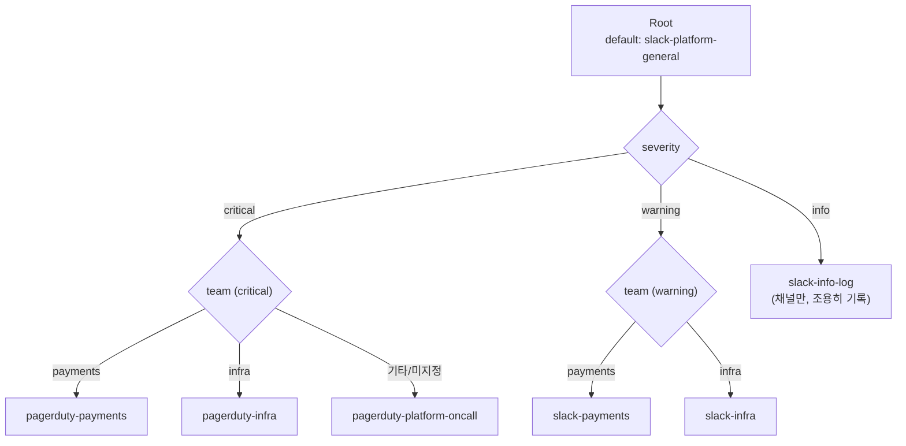

# 라우팅·그룹핑·억제

::: info 학습 목표
- route 트리가 matcher와 `continue`로 어떻게 알림을 분기하는지, 상속 규칙을 포함해 이해한다.
- `group_by`/`group_wait`/`group_interval`/`repeat_interval`이 알림 발송 타이밍에 미치는 영향을 익힌다.
- inhibition 규칙과 silence의 차이를 구분하고 각각을 언제 쓸지 판단한다.
- severity·team 기반의 실전 라우팅 트리를 설계할 수 있다.
:::

## 1. route 트리

Alertmanager의 라우팅은 트리 구조다. 루트 route가 기본 설정(기본 receiver, 기본 grouping)을 정의하고, 하위 route들이 matcher 조건으로 갈라진다. 알림이 도착하면 루트에서 시작해 트리를 깊이 우선으로 탐색하며, matcher가 일치하는 하위 route로 계속 내려간다.

```yaml
route:
  receiver: 'default-slack'
  group_by: ['alertname', 'cluster']
  group_wait: 30s
  group_interval: 5m
  repeat_interval: 4h

  routes:
  - matchers:
    - severity="critical"
    receiver: 'pagerduty-oncall'
    continue: false

  - matchers:
    - team="payments"
    receiver: 'slack-payments'
    routes:
    - matchers:
      - severity="warning"
      receiver: 'slack-payments-warning'
```

- <strong>matchers</strong>: `label="value"`, `label=~"regex"`, `label!="value"` 형태로 라벨을 매칭한다. 구버전 `match`/`match_re` 문법도 동작하지만 최신 Alertmanager 기준 `matchers` 문법이 표준이다.
- <strong>continue</strong>: 기본값은 `false`다. 매칭된 하위 route에서 처리를 마치면 형제 route는 더 이상 평가하지 않는다. `continue: true`로 설정하면 매칭 후에도 다음 형제 route를 계속 평가해, 하나의 알림이 여러 receiver로 동시에 전달되게 할 수 있다.
- <strong>상속</strong>: 하위 route에 `group_by`/`group_wait`/`receiver` 등을 명시하지 않으면 부모 route의 값을 그대로 물려받는다. 이 덕분에 루트에 공통 기본값을 두고, 하위 route는 달라지는 부분만 오버라이드하면 된다.



가장 중요한 원칙은 <strong>가장 구체적인 route가 마지막에 이긴다</strong>는 것이다. 트리를 설계할 때는 넓은 조건을 앞에, 좁은 조건을 뒤에 두는 흔한 실수를 피해야 한다. Alertmanager는 형제 route를 순서대로 평가하므로, 먼저 매칭되는 route가 우선한다.

## 2. Grouping

그룹핑은 같은 원인으로 발생한 여러 알림을 하나의 알림 메시지로 묶어 전달하는 메커니즘이다. 네 개의 시간 파라미터가 그룹의 발송 타이밍을 결정한다.

| 파라미터 | 의미 | 전형적인 값 |
|---|---|---|
| `group_by` | 그룹을 나누는 기준 라벨 집합 | `[alertname, cluster, severity]` |
| `group_wait` | 그룹 생성 후 첫 알림을 보내기까지 대기 시간(짧은 시간 내 추가로 묶일 알림을 기다림) | `30s` |
| `group_interval` | 같은 그룹에 새 알림이 추가됐을 때 다음 발송까지 최소 간격 | `5m` |
| `repeat_interval` | 그룹 상태가 그대로(firing 유지)여도 재알림을 보내는 주기 | `4h` |



`group_wait`을 너무 짧게 두면 동시다발 알림이 그룹핑되지 못하고 낱개로 나간다. 너무 길게 두면 정말 급한 첫 알림이 지연된다. `repeat_interval`은 `resolve`되지 않은 장애를 잊지 않도록 주기적으로 리마인드하는 용도이며, 너무 짧으면 피로도를 높이고 너무 길면 대응 담당자가 이미 조치 중인 알림을 놓쳤다고 착각할 수 있다.

## 3. Inhibition

<strong>억제(inhibition)</strong>는 더 심각한 알림이 활성 상태일 때 그로부터 파생됐을 가능성이 높은 하위 알림을 자동으로 숨기는 규칙이다. `inhibit_rules`는 `source_match`(억제를 유발하는 알림 조건)와 `target_match`(억제당하는 알림 조건), 그리고 `equal`(두 알림이 같은 값을 가져야 하는 라벨)로 구성한다.

```yaml
inhibit_rules:
- source_matchers:
  - severity="critical"
  target_matchers:
  - severity="warning"
  equal: ['cluster', 'alertname']

- source_matchers:
  - alertname="ClusterDown"
  target_matchers:
  - alertname=~"PodDown|NodeDown|ServiceDown"
  equal: ['cluster']
```

첫 번째 규칙은 같은 `cluster`·`alertname`에서 `critical` 알림이 firing 중이면 동일 조건의 `warning` 알림을 억제한다. 두 번째 규칙은 클러스터 전체가 죽었을 때(`ClusterDown`) 그 여파로 발생하는 개별 Pod/Node/Service 다운 알림을 억제해, 온콜 담당자가 근본 원인 하나에만 집중하게 한다.



억제된 알림은 사라지는 게 아니라 Alertmanager UI/API 상에서는 여전히 `firing`으로 보이지만, notification pipeline에서 실제 발송만 막힌다는 점이 중요하다.

## 4. Silence

<strong>silence</strong>는 inhibition과 목적이 다르다. inhibition은 알림 간 인과관계를 코드로 정의해두는 반영구적 규칙인 반면, silence는 운영자가 <strong>특정 기간 동안 수동으로</strong> 등록하는 임시 음소거다. 배포 창구, 계획된 점검, 알려진 이슈 대응 중에 노이즈를 끄는 용도로 쓴다.

```bash
# amtool로 silence 생성 (2시간 동안 유지)
amtool silence add \
  alertname="HighLatency" cluster="prod-eu" \
  --duration="2h" \
  --comment="배포 중 일시적 지연 예상 (JIRA-1234)"

# 현재 활성 silence 목록 확인
amtool silence query

# silence 만료 전 해제
amtool silence expire <silence-id>
```

silence도 matcher 문법을 그대로 쓴다. `alertname="HighLatency"`처럼 정확히 일치시킬 수도 있고, `cluster=~"prod-.*"`처럼 정규식으로 넓게 잡을 수도 있다. 범위를 너무 넓게 잡으면 의도치 않은 알림까지 묻히므로, 가능한 한 좁은 matcher와 명확한 `comment`(누가, 왜, 언제까지)를 남기는 것이 운영 규율이다.

::: warning silence는 자동 만료된다
`duration`이 지나면 silence는 자동으로 사라지고 알림이 다시 흐른다. 배포가 예정보다 길어지면 silence가 먼저 만료돼 알림 폭탄을 맞을 수 있으니, CI/CD 파이프라인에서 배포 시작·종료 시점에 맞춰 amtool로 silence를 생성·해제하는 자동화가 바람직하다.
:::

## 5. Receiver 설정과 템플릿

receiver는 route가 최종적으로 알림을 넘기는 대상이다. 각 receiver는 Go 템플릿으로 알림 메시지를 커스터마이징할 수 있다.

::: tabs

@tab Slack
```yaml
receivers:
- name: 'slack-payments'
  slack_configs:
  - api_url: 'https://hooks.slack.com/services/XXX/YYY/ZZZ'
    channel: '#alerts-payments'
    send_resolved: true
    title: '[{{ .Status | toUpper }}] {{ .CommonLabels.alertname }}'
    text: >-
      {{ range .Alerts }}
      *{{ .Labels.severity }}* - {{ .Annotations.summary }}
      {{ .Annotations.description }}
      {{ end }}
```

@tab PagerDuty
```yaml
receivers:
- name: 'pagerduty-oncall'
  pagerduty_configs:
  - routing_key: '<Events API v2 integration key>'
    severity: '{{ .CommonLabels.severity }}'
    description: '{{ .CommonLabels.alertname }}: {{ .CommonAnnotations.summary }}'
    details:
      cluster: '{{ .CommonLabels.cluster }}'
      runbook: '{{ .CommonAnnotations.runbook_url }}'
```

:::

`send_resolved: true`를 켜두면 알림이 resolved 상태로 전환될 때도 통지가 가서, 담당자가 "아직도 진행 중인가"를 재확인할 필요가 없어진다. `.CommonLabels`/`.CommonAnnotations`는 그룹 내 모든 알림이 공통으로 가진 라벨/애노테이션만 담기고, `{{ range .Alerts }}`로 그룹에 속한 개별 알림을 순회할 수 있다.

## 6. 라우팅 설계 실전 — severity/team 기반

실무에서 가장 널리 쓰는 패턴은 <strong>severity로 채널 긴급도를 정하고, team으로 수신 대상을 정하는</strong> 2축 구조다.



```yaml
route:
  receiver: 'slack-platform-general'
  group_by: ['alertname', 'cluster', 'team']
  group_wait: 30s
  group_interval: 5m
  repeat_interval: 4h
  routes:
  - matchers: ['severity="critical"']
    routes:
    - matchers: ['team="payments"']
      receiver: 'pagerduty-payments'
    - matchers: ['team="infra"']
      receiver: 'pagerduty-infra'
    - receiver: 'pagerduty-platform-oncall'   # team 미지정 critical의 fallback
  - matchers: ['severity="warning"']
    routes:
    - matchers: ['team="payments"']
      receiver: 'slack-payments'
    - matchers: ['team="infra"']
      receiver: 'slack-infra'
  - matchers: ['severity="info"']
    receiver: 'slack-info-log'
```

설계 원칙은 세 가지로 정리된다. 첫째, <strong>모든 알림 규칙에 `severity`와 `team` 라벨을 강제</strong>한다. 라벨이 빠진 알림은 fallback receiver(위 예의 `pagerduty-platform-oncall`, `slack-platform-general`)로 흘러가게 트리를 짜서, 라벨 누락이 "알림 유실"로 이어지지 않게 방어한다. 둘째, <strong>critical은 사람을 깨우는 채널(PagerDuty)로, warning은 확인만 하면 되는 채널(Slack)로</strong> 분리한다. 셋째, `group_by`에 `team`을 포함시켜 팀 간 알림이 한 그룹으로 섞이지 않게 한다.

::: tip 핵심 정리
- route 트리는 matcher로 분기하고, `continue: false`(기본값)면 첫 매칭에서 종료, 명시하지 않은 설정은 부모에서 상속된다.
- `group_wait`은 초기 묶음 대기, `group_interval`은 그룹 갱신 최소 간격, `repeat_interval`은 미해결 알림 리마인드 주기로 역할이 다르다.
- inhibition은 알림 간 인과관계를 코드로 반영구 정의하고, silence는 운영자가 등록하는 시간 제한 임시 음소거다.
- receiver는 Go 템플릿(`.CommonLabels`, `.Alerts` range)으로 채널별 메시지 포맷을 커스터마이징한다.
- severity(긴급도) × team(수신자) 2축 라우팅에 라벨 누락을 대비한 fallback receiver를 반드시 둔다.
:::

## 다음 챕터

라우팅이 "알림을 누구에게 보낼지" 정하는 문제라면, 다음 문제는 "애초에 어떤 조건일 때 알림을 발화시킬 것인가"다. 다음 챕터 [SLO/SLI와 알림 설계](/study/observability/15-slo-sli-alerting)에서는 SLI/SLO/SLA 정의와 에러 버짓 개념, Google SRE 방식의 multi-window multi-burn-rate 알림, 증상 기반 알림과의 차이를 다룬다.
