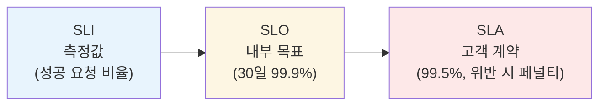
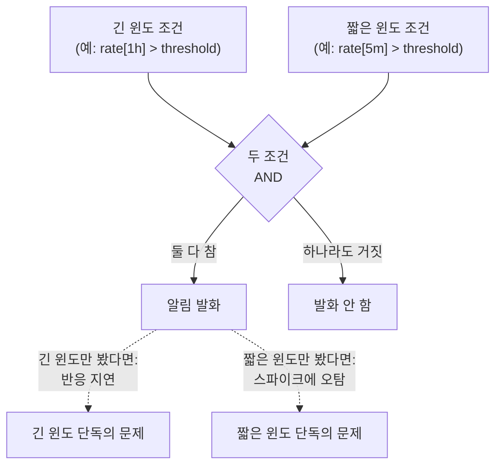

# SLO/SLI와 알림 설계

::: info 학습 목표
- SLI/SLO/SLA의 정의와 관계, 그리고 에러 버짓 개념을 이해한다.
- Google SRE 방식의 multi-window multi-burn-rate 알림을 PromQL로 구현할 수 있다.
- SLO 기반 알림과 증상(symptom) 기반 알림의 차이와 각각의 쓰임을 구분한다.
- actionable하고 노이즈가 적은 알림을 설계하는 원칙을 익힌다.
- Sloth·Pyrra 같은 SLO 도구가 무엇을 자동화해주는지 파악한다.
:::

## 1. SLI/SLO/SLA 정의

세 용어는 자주 섞여 쓰이지만 층위가 다르다.

- <strong>SLI(Service Level Indicator)</strong>: 서비스 상태를 정량적으로 나타내는 측정값이다. "성공 요청 비율", "P99 레이턴시" 같은 실제 숫자다. PromQL로 표현하면 SLI는 하나의 비율(ratio) 쿼리다.
- <strong>SLO(Service Level Objective)</strong>: SLI가 만족해야 하는 목표 수준이다. "30일 롤링 윈도 기준 가용성 99.9% 이상" 같은 형태다. SLO는 조직 내부의 목표이며, 이를 어겨도 즉시 계약 위반은 아니다.
- <strong>SLA(Service Level Agreement)</strong>: 고객과 맺은 계약이며, 위반 시 환불·페널티 같은 비즈니스적 결과가 따른다. SLA는 보통 SLO보다 느슨하게 잡는다. 내부 SLO(99.9%)를 어겼다고 바로 SLA(99.5%) 위반이 되지 않도록 여유를 둔다.



SLI를 PromQL로 표현하면 대부분 "좋은 이벤트 수 / 전체 이벤트 수" 형태의 비율이다.

```promql
# 가용성 SLI: 5xx가 아닌 응답 비율
sum(rate(http_requests_total{code!~"5.."}[5m]))
/
sum(rate(http_requests_total[5m]))
```

## 2. 에러 버짓

SLO가 99.9%라면, 나머지 0.1%는 <strong>실패해도 되는 여유분</strong>이다. 이를 <strong>에러 버짓(error budget)</strong>이라 부른다. 30일 윈도에서 99.9% SLO는 약 43.2분의 다운타임(또는 그에 상응하는 실패 요청 비율)을 허용한다는 뜻이다.

에러 버짓의 핵심은 "알림을 언제 울릴 것인가"의 기준을 바꾼다는 데 있다. 단순히 "에러율이 1%를 넘으면 알림"이 아니라, <strong>"현재 속도로 실패가 계속되면 에러 버짓이 언제 소진되는가"</strong>를 기준으로 판단한다. 버짓 소진 속도를 <strong>burn rate</strong>라 하며, 다음과 같이 정의한다.

```
burn rate = 실제 에러율 / (1 - SLO)
```

burn rate가 1이면 에러 버짓을 정확히 SLO 윈도(예: 30일) 동안 다 쓰는 속도다. burn rate가 14.4라면 같은 버짓을 30일이 아니라 30일/14.4 ≈ 2일에 소진한다는 뜻이므로, 훨씬 긴급하게 대응해야 한다.

```promql
# 99.9% SLO, 1시간 윈도 기준 burn rate
(
  sum(rate(http_requests_total{code=~"5.."}[1h]))
  /
  sum(rate(http_requests_total[1h]))
) / (1 - 0.999)
```

## 3. Burn rate 알림 — multi-window multi-burn-rate

burn rate를 단일 윈도로만 감시하면 딜레마에 빠진다. 짧은 윈도(5분)만 보면 순간적인 스파이크에도 알림이 울려 노이즈가 심하고, 긴 윈도(6시간)만 보면 실제 장애가 터진 뒤 반응이 너무 늦다. [Google SRE Workbook](https://sre.google/workbook/alerting-on-slos/)이 제시한 해법이 <strong>multi-window multi-burn-rate 알림</strong>이다. 짧은 윈도와 긴 윈도를 <strong>AND 조건</strong>으로 함께 요구해서, 긴 윈도로 지속성을 확인하고 짧은 윈도로 "지금도 여전히 나쁜 상태인지"를 재확인한다.

대표적으로 4단계 알림을 둔다. 아래는 99.9% SLO(30일 윈도, 에러 버짓 0.1%) 기준 예시다.

| 심각도 | burn rate | 긴 윈도 | 짧은 윈도 | 30일 버짓 소진량 |
|---|---|---|---|---|
| page (즉시 대응) | 14.4 | 1h | 5m | 1시간에 2% 소진 |
| page (즉시 대응) | 6 | 6h | 30m | 6시간에 5% 소진 |
| ticket (업무 시간 대응) | 3 | 24h | 2h | 1일에 10% 소진 |
| ticket (업무 시간 대응) | 1 | 3d | 6h | 3일에 10% 소진 |

```yaml
groups:
- name: slo-burn-rate
  rules:
  - alert: ErrorBudgetBurnRateCritical
    expr: |
      (
        sum(rate(http_requests_total{code=~"5..", service="checkout"}[1h]))
        /
        sum(rate(http_requests_total{service="checkout"}[1h]))
      ) > (14.4 * 0.001)
      and
      (
        sum(rate(http_requests_total{code=~"5..", service="checkout"}[5m]))
        /
        sum(rate(http_requests_total{service="checkout"}[5m]))
      ) > (14.4 * 0.001)
    labels:
      severity: critical
      team: checkout
    annotations:
      summary: "checkout 서비스 에러 버짓 14.4배 소진 속도 (1h/5m 동시 초과)"
      runbook_url: "https://runbooks.example.com/checkout-error-budget"

  - alert: ErrorBudgetBurnRateWarning
    expr: |
      (
        sum(rate(http_requests_total{code=~"5..", service="checkout"}[24h]))
        /
        sum(rate(http_requests_total{service="checkout"}[24h]))
      ) > (3 * 0.001)
      and
      (
        sum(rate(http_requests_total{code=~"5..", service="checkout"}[2h]))
        /
        sum(rate(http_requests_total{service="checkout"}[2h]))
      ) > (3 * 0.001)
    labels:
      severity: warning
      team: checkout
    annotations:
      summary: "checkout 서비스 에러 버짓 3배 소진 속도 (24h/2h 동시 초과)"
```



긴 윈도는 "이게 일시적 튐이 아니라 진짜 추세"임을 보장하고, 짧은 윈도는 "그 추세가 지금도 계속되고 있다"는 것, 즉 이미 상황이 종료됐는데 뒤늦게 알림이 울리는 것을 막는다. `severity=critical`은 PagerDuty로, `severity=warning`은 Slack으로 라우팅하는 식으로 [라우팅 설계](/study/observability/14-routing-grouping-silence)와 자연스럽게 연결된다.

## 4. SLO 기반 vs 증상 기반 알림

전통적인 알림은 <strong>원인 기반(cause-based)</strong> 또는 <strong>리소스 기반</strong>으로 설계되곤 한다. "CPU 사용률 90% 초과", "디스크 여유공간 10% 미만" 같은 조건이다. 이 방식의 문제는 리소스 임계치 초과가 <strong>반드시 사용자 영향으로 이어지지는 않는다</strong>는 데 있다. CPU가 90%여도 응답이 정상이면 굳이 사람을 깨울 이유가 없다.

<strong>증상 기반(symptom-based) 알림</strong>은 사용자가 실제로 겪는 증상(느린 응답, 실패한 요청)을 직접 관측한다. <strong>SLO 기반 알림</strong>은 증상 기반 알림의 한 형태로, 사용자 영향을 SLI라는 단일 지표로 정규화하고 에러 버짓 소진 속도로 우선순위를 매긴다는 점에서 한 단계 더 나아간 방식이다.

| | 원인/리소스 기반 | 증상 기반 (SLO 포함) |
|---|---|---|
| 감시 대상 | CPU, 메모리, 디스크, 큐 길이 | 사용자 체감 성공률·레이턴시 |
| 알림 발화 근거 | 임의로 정한 정적 임계치 | SLO 대비 버짓 소진 속도 |
| 오탐 가능성 | 높음(리소스는 튀어도 영향 없을 수 있음) | 낮음(사용자 영향이 실제로 있을 때만) |
| 용도 | 용량 계획, 사전 경고(warning 수준) | 온콜 호출의 1차 근거 |

실전에서는 두 방식을 계층적으로 쓴다. <strong>온콜을 깨우는 page 알림은 SLO 기반</strong>으로만 구성하고, <strong>원인/리소스 기반 알림은 severity를 낮춰 대시보드·티켓 수준</strong>으로 남겨 사후 원인 분석과 용량 계획에 활용한다.

## 5. 좋은 알림의 원칙

알림 설계에서 가장 흔한 실패는 "일단 다 알림으로 만들자"는 태도다. 알림이 늘어날수록 대응자는 무뎌지고, 결국 진짜 위급한 알림도 무시하게 된다. 몇 가지 원칙을 지켜야 한다.

- <strong>Actionable</strong>: 알림을 받은 사람이 지금 당장 할 수 있는 조치가 있어야 한다. 조치할 게 없는 알림(예: "정보성 로그 발생")은 알림이 아니라 대시보드나 로그로 남겨야 한다.
- <strong>사용자 영향 우선</strong>: 리소스 임계치보다 사용자가 실제로 겪는 증상을 우선 감시한다.
- <strong>노이즈 최소화</strong>: 동일 원인의 알림은 [grouping](/study/observability/14-routing-grouping-silence)으로 묶고, 파생 알림은 inhibition으로 억제한다.
- <strong>severity 정직하게 매기기</strong>: 모든 알림을 critical로 만들면 severity가 무의미해진다. 실제로 사람을 깨워야 하는 것만 critical로 표시한다.
- <strong>runbook 링크 필수</strong>: 알림 애노테이션에 대응 절차 문서 링크를 넣어, 새벽에 깬 담당자가 맥락을 다시 찾지 않게 한다.
- <strong>주기적 알림 감사</strong>: 최근 N개월간 발화했지만 아무 조치도 없었던 알림은 삭제하거나 severity를 낮춘다. "알림 피로도(alert fatigue)"는 알림 시스템 전체의 신뢰를 갉아먹는다.

::: warning 100% SLO는 목표가 아니다
SLO를 100%로 잡으면 에러 버짓이 0이 되어 배포·실험 자체가 불가능해진다. 적절한 에러 버짓은 오히려 "이번 달에 얼마나 위험을 감수하고 새 기능을 낼 수 있는가"를 정하는 협상 도구다. SLO는 완벽함이 아니라 신뢰할 수 있는 수준의 합의라는 점을 팀 전체가 공유해야 한다.
:::

## 6. SLO 도구 — Sloth, Pyrra

SLO 기반 알림은 수식이 단순하지 않고(4단계 burn rate × 여러 서비스), Recording Rule과 Alerting Rule을 손으로 매번 작성하면 실수가 잦다. 이를 자동 생성해주는 오픈소스 도구가 여럿 있다.

- [Sloth](https://sloth.dev/): SLO를 선언적 YAML(`sli`, `objective` 등)로 정의하면 Prometheus Recording Rule과 multi-window multi-burn-rate Alerting Rule 세트를 자동 생성한다. Kubernetes Operator 형태(`PrometheusServiceLevel` CRD)로도 배포 가능하다.
- [Pyrra](https://github.com/pyrra-dev/pyrra): 마찬가지로 SLO를 CRD/YAML로 정의하고 룰을 생성하며, 자체 웹 UI로 현재 에러 버짓 소진 상태와 burn rate 그래프를 시각화해준다.

```yaml
# Sloth SLO 정의 예시 (개념적 형태)
apiVersion: sloth.slok.dev/v1
kind: PrometheusServiceLevel
metadata:
  name: checkout-availability
spec:
  service: "checkout"
  labels:
    team: "checkout"
  slos:
  - name: "requests-availability"
    objective: 99.9
    sli:
      events:
        errorQuery: sum(rate(http_requests_total{service="checkout", code=~"5.."}[{{.window}}]))
        totalQuery: sum(rate(http_requests_total{service="checkout"}[{{.window}}]))
    alerting:
      name: CheckoutHighErrorRate
      pageAlert:
        labels:
          severity: critical
      ticketAlert:
        labels:
          severity: warning
```

이런 도구를 쓰면 앞서 손으로 작성한 4단계 burn rate 룰(1h/5m, 6h/30m, 24h/2h, 3d/6h)을 서비스마다 반복 작성할 필요 없이, SLO 목표치 하나만 선언해 일관된 룰 세트를 뽑아낼 수 있다. 결과물은 결국 표준 Prometheus Recording/Alerting Rule이므로, [Recording·Alerting Rule](/study/observability/11-recording-alerting-rules) 챕터에서 다룬 룰 평가·성능 원칙이 그대로 적용된다.

::: tip 핵심 정리
- SLI는 측정값, SLO는 내부 목표, SLA는 고객과의 계약이며 SLA는 SLO보다 느슨하게 잡는다.
- 에러 버짓은 "허용된 실패량"이고, burn rate는 그 버짓을 소진하는 속도다.
- multi-window multi-burn-rate 알림은 긴 윈도(지속성)와 짧은 윈도(현재성)를 AND로 묶어 오탐과 지연을 동시에 줄인다.
- page 알림은 SLO/증상 기반으로, 리소스 임계치 알림은 낮은 severity로 계층을 나눈다.
- 좋은 알림은 actionable하고, 노이즈를 grouping·inhibition으로 억제하며, runbook 링크를 포함한다.
- Sloth·Pyrra는 SLO 선언 하나로 Recording/Alerting Rule 세트를 자동 생성해 반복 작업을 줄여준다.
:::

## 다음 챕터

메트릭과 알림으로 "무엇이 얼마나 잘못됐는가"는 알 수 있지만, "정확히 어떤 요청에서, 어떤 로그가 찍혔는가"는 로그가 답한다. 다음 챕터 [Loki 아키텍처와 라벨 철학](/study/observability/16-loki-architecture)에서는 로그 전용 신호로 넘어가, Loki가 왜 전체 텍스트가 아닌 라벨만 인덱싱하는 설계를 택했는지부터 다룬다.
