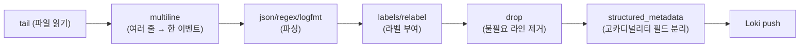
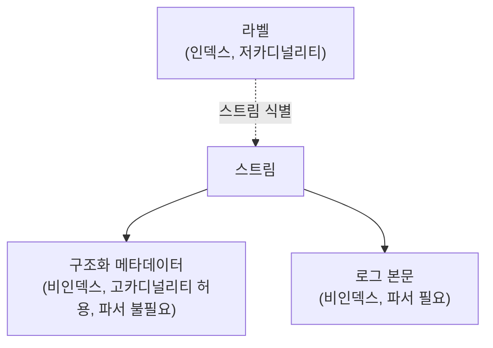

# 로그 파이프라인과 스토리지

::: info 학습 목표
- Alloy/Promtail이 로그 파일을 tail하며 positions을 관리하고 Loki로 push하는 흐름을 이해한다.
- relabel, drop, multiline 같은 pipeline stage로 수집 단계에서 로그를 가공하는 방법을 익힌다.
- structured metadata로 고카디널리티 필드를 라벨 밖에 두면서도 쿼리 가능하게 만드는 전략을 이해한다.
- 라벨 설계 시 카디널리티 함정을 피하는 원칙과 오브젝트 스토리지·멀티테넌시 운영 포인트를 안다.
:::

## 1. 수집 에이전트 — Alloy/Promtail과 positions

Loki로 로그를 밀어넣는 표준 경로는 [Grafana Alloy](https://grafana.com/docs/alloy/latest/)의 `loki.source.file` 컴포넌트나, 그 전신인 [Promtail](https://grafana.com/docs/loki/latest/send-data/promtail/)이다. 둘 다 동작 원리는 같다. 로그 파일을 tail하며 새 라인이 생기면 파이프라인을 거쳐 Loki distributor로 push한다.

파일을 어디까지 읽었는지는 <strong>positions 파일</strong>에 기록한다. 에이전트가 재시작해도 마지막으로 읽은 오프셋부터 이어서 읽어 중복 전송이나 누락을 최소화한다.

```yaml
# Promtail 예시
positions:
  filename: /var/lib/promtail/positions.yaml

scrape_configs:
  - job_name: containers
    static_configs:
      - targets: [localhost]
        labels:
          job: containerlogs
          __path__: /var/log/containers/*.log
```

Alloy는 River 구문(현재는 Alloy 구문)으로 컴포넌트를 그래프로 연결한다. 동일한 파일 tail을 Alloy로 구성하면 다음과 같다.

```river
loki.source.file "containers" {
  targets = [
    {__path__ = "/var/log/containers/*.log", job = "containerlogs"},
  ]
  forward_to = [loki.process.pipeline.receiver]
}

loki.write "default" {
  endpoint {
    url = "http://loki-write:3100/loki/api/v1/push"
  }
}
```

Alloy 컴포넌트 모델과 파이프라인 작성법은 [Alloy 파이프라인 구성](/study/observability/29-alloy-pipelines)에서 더 깊게 다룬다. 여기서는 로그 파이프라인의 관점에서 stage 구성과 스토리지 연동에 집중한다.

## 2. Pipeline Stages — relabel, drop, multiline

수집 에이전트는 로그를 Loki로 보내기 전에 <strong>pipeline stage</strong>로 라벨을 붙이거나 불필요한 라인을 걸러내거나 여러 줄로 나뉜 로그를 하나로 합친다.



<strong>multiline</strong> stage는 스택 트레이스처럼 여러 줄이 논리적으로 한 로그 이벤트인 경우, 정규식으로 시작 라인을 식별해 다음 시작 라인이 나올 때까지를 하나로 합친다.

```yaml
pipeline_stages:
  - multiline:
      firstline: '^\d{4}-\d{2}-\d{2}'
      max_wait_time: 3s
```

<strong>relabel</strong> stage는 Kubernetes 메타데이터(`__meta_kubernetes_*`) 등 소스 라벨을 실제 스트림 라벨로 승격하거나 버린다. Prometheus의 relabel_config와 문법이 동일하다.

```yaml
pipeline_stages:
  - relabel:
      source_labels: [__meta_kubernetes_pod_label_app]
      target_label: app
  - relabel:
      source_labels: [__meta_kubernetes_namespace]
      target_label: namespace
```

<strong>drop</strong> stage는 헬스체크 로그, 디버그 로그처럼 저장할 가치가 없는 라인을 인제스트 전에 걸러낸다. 스토리지 비용과 인제스트 부하를 수집 단계에서 줄이는 가장 효과적인 방법이다.

```yaml
pipeline_stages:
  - match:
      selector: '{job="containerlogs"}'
      stages:
        - drop:
            expression: '.*/healthz.*'
        - drop:
            source: level
            value: "debug"
```

## 3. Structured Metadata — 고카디널리티를 라벨 밖으로

Loki는 라벨(인덱스 대상), 로그 본문(비인덱스 콘텐츠)에 더해 <strong>구조화 메타데이터(structured metadata)</strong>라는 세 번째 계층을 지원한다. `trace_id`, `span_id`, `user_id`, `request_id`처럼 값 종류가 무한에 가까운 필드를 라벨로 넣으면 [스트림 폭증](/study/observability/16-loki-architecture)을 부르지만, 그렇다고 로그 본문에만 묻어두면 쿼리 시 매번 파싱해야 한다. 구조화 메타데이터는 이 사이의 절충안이다 — 인덱스에는 들어가지 않아 스트림을 늘리지 않지만, 청크 안에 라인과 별도로 key-value로 저장돼 파서 없이도 필터링할 수 있다.



수집 단계에서 `structured_metadata` stage로 필드를 지정한다.

```yaml
pipeline_stages:
  - json:
      expressions:
        trace_id: trace_id
        level: level
  - structured_metadata:
      trace_id:
  - labels:
      level:
```

쿼리에서는 라벨과 동일하게 필터링할 수 있다.

```logql
{app="checkout"} | trace_id="4bf92f3577b34da6a3ce929d0e0e4736"
```

<strong>라벨 vs 구조화 메타데이터 구분 기준</strong>은 명확하다. 값의 종류가 적고 쿼리에서 스트림을 좁히는 용도로 쓰인다면 라벨(예: `app`, `env`, `level`), 값의 종류가 사실상 무한하고 개별 이벤트를 특정하는 용도라면 구조화 메타데이터(예: `trace_id`, `user_id`)다. 트레이스 ID를 구조화 메타데이터로 넣어두면 로그와 트레이스를 상관관계로 엮을 때(트레이스 상세에서 관련 로그 한 번에 조회) 파서 없이 바로 필터링할 수 있다는 실전 이점도 있다. 이 흐름은 [분산 트레이싱 기초](/study/observability/20-distributed-tracing-basics)에서 다룰 로그-트레이스 상관관계로 이어진다.

## 4. 라벨 설계 — Loki 라벨 카디널리티 함정

라벨 설계는 Loki 운영에서 가장 많이 실수하는 지점이다. 원칙을 정리하면 다음과 같다.

- <strong>낮은 카디널리티 값만 라벨로.</strong> `app`, `env`, `namespace`, `cluster`, `level`처럼 값의 종류가 수십~수백 개 수준인 필드만 라벨로 쓴다.
- <strong>동적으로 생성되는 값은 라벨 금지.</strong> Pod 이름은 배포마다 새로 생기므로 `pod` 라벨을 그대로 쓰면 배포할 때마다 새 스트림이 생긴다. 가능하면 `deployment`나 `app` 같은 안정적인 상위 개념을 라벨로 쓰고, Pod 이름이 필요하면 구조화 메타데이터로 내린다.
- <strong>라벨 조합 수를 곱셈으로 생각한다.</strong> 라벨이 `app`(20개 값) × `env`(3개 값) × `pod`(수백 개, 계속 증가)라면 스트림 수는 세 값의 곱이 된다. 라벨 하나를 잘못 고르면 전체 조합이 폭발한다.
- <strong>`max_streams_per_user`로 안전판을 둔다.</strong> 실수로 고카디널리티 라벨을 배포해도 클러스터 전체가 죽지 않도록 테넌트별 스트림 수 상한을 설정해둔다.

```yaml
limits_config:
  max_streams_per_user: 10000
  max_label_names_per_series: 15
  max_label_value_length: 2048
```

## 5. 오브젝트 스토리지 백엔드 — S3/GCS, Retention, Compaction

Loki 청크와 인덱스는 오브젝트 스토리지에 쌓인다. 프로덕션에서는 S3나 GCS를 쓰고, 로컬 개발에서는 filesystem 스토어를 쓴다.

```yaml
storage_config:
  aws:
    s3: s3://ap-northeast-2/loki-prod-bucket
    dynamodb: null

limits_config:
  retention_period: 720h  # 30일

compactor:
  retention_enabled: true
  retention_delete_delay: 2h
  delete_request_store: s3
  compaction_interval: 10m
```

<strong>retention</strong>은 테넌트 전역 설정(`limits_config.retention_period`)뿐 아니라 테넌트별 오버라이드나 스트림 셀렉터 기반 세부 정책(`retention_stream`)으로도 지정할 수 있다. 예를 들어 `level="debug"` 로그는 7일만, 나머지는 30일 보관하는 식이다.

```yaml
limits_config:
  retention_stream:
    - selector: '{level="debug"}'
      priority: 1
      period: 168h
```

<strong>compaction</strong>은 앞서 [읽기/쓰기 경로](/study/observability/17-loki-read-write-path)에서 다룬 compactor가 담당한다. 작은 인덱스 파일을 주기적으로 병합해 쿼리 시 열어야 할 파일 수를 줄이고, retention 기한이 지난 청크·인덱스를 실제로 삭제한다. compactor는 반드시 단일 인스턴스로만 돌아야 한다 — 여러 인스턴스가 동시에 같은 인덱스를 압축하면 경쟁 상태가 생긴다.

## 6. 멀티테넌시·rate limit 운영

Loki는 `X-Scope-OrgID` 헤더로 테넌트를 구분하는 <strong>네이티브 멀티테넌시</strong>를 지원한다. 모든 쓰기·읽기 요청에 테넌트 ID가 붙고, 인덱스·청크·rate limit이 테넌트별로 완전히 격리된다.

```yaml
auth_enabled: true

limits_config:
  ingestion_rate_mb: 16
  ingestion_burst_size_mb: 32
  max_query_series: 10000
  max_query_parallelism: 32

# 테넌트별 오버라이드
overrides:
  "tenant-a":
    ingestion_rate_mb: 64
```

단일 클러스터를 여러 팀·서비스가 공유할 때는 테넌트별 rate limit이 노이지 네이버(noisy neighbor) 문제를 막는 핵심 장치다. 한 테넌트가 로그 폭주(에러 루프 등)를 일으켜도 `ingestion_rate_mb` 한도에 걸려 `429`로 거부되고, 다른 테넌트의 인제스트 경로는 영향받지 않는다. 쿼리 쪽도 `max_query_series`, `max_query_parallelism`으로 한 테넌트가 querier 자원을 독점하지 못하게 제한한다.

::: tip 핵심 정리
- Alloy/Promtail은 파일을 tail하며 positions로 오프셋을 관리하고 pipeline stage를 거쳐 Loki로 push한다.
- multiline·relabel·drop stage는 각각 여러 줄 병합, 라벨 승격, 불필요 라인 사전 제거를 담당한다.
- 구조화 메타데이터는 라벨(인덱스)과 로그 본문(파서 필요) 사이의 절충안으로, 고카디널리티 필드를 스트림 폭증 없이 쿼리 가능하게 만든다.
- 라벨은 낮은 카디널리티 값만, Pod 이름 같은 동적 값은 구조화 메타데이터로 내리는 것이 원칙이다.
- 오브젝트 스토리지 기반 retention·compaction으로 저장 비용과 쿼리 성능을 관리한다.
- `X-Scope-OrgID` 기반 멀티테넌시와 테넌트별 rate limit이 공유 클러스터에서 노이지 네이버를 막는다.
:::

## 다음 챕터

로그는 "무엇이 일어났는가"를 보여주지만, 요청이 여러 서비스를 거치며 어디서 시간이 걸렸는지는 로그만으로 재구성하기 어렵다. 다음 챕터 [분산 트레이싱 기초](/study/observability/20-distributed-tracing-basics)에서는 span, trace context propagation, 샘플링 개념을 다루며 트레이스 신호로 넘어간다.
