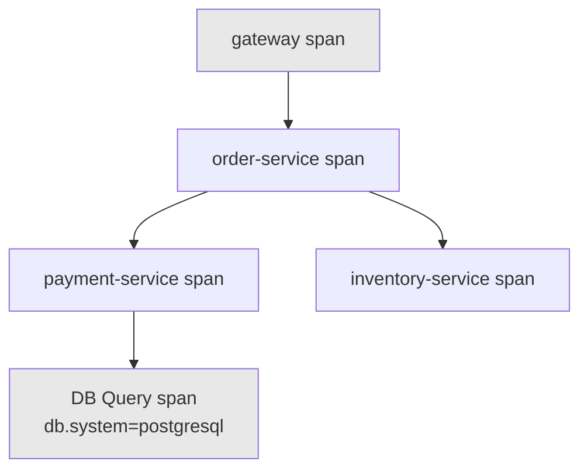
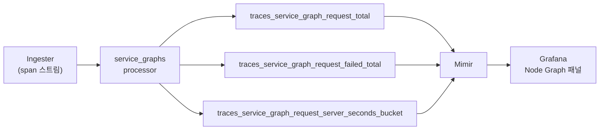

# TraceQL과 span metrics

::: info 학습 목표
- TraceQL의 span 셀렉터와 속성 필터 문법으로 원하는 span을 찾아낼 수 있다.
- 구조적 연산자로 span 간 parent/child, descendant 관계를 조건으로 표현할 수 있다.
- TraceQL 집계 함수로 spanset 단위 count·avg 조건을 작성할 수 있다.
- metrics-generator가 파생시키는 span metrics·service graph metrics의 구조와 exemplar 연계를 이해한다.
:::

## 1. TraceQL 기초 — span 셀렉터, 속성 필터

<strong>TraceQL</strong>은 Tempo의 트레이스 질의 언어로, PromQL이 시계열을 다루듯 span 집합(spanset)을 다룬다. 가장 단순한 형태는 중괄호 안에 조건을 넣는 span 셀렉터다.

```traceql
{ }
```

이는 모든 span에 매치되는 빈 셀렉터다. 실전에서는 속성 조건을 넣어 필터링한다. 속성은 스코프에 따라 접두사가 다르다 — span 자체의 속성은 `span.`, 리소스(서비스) 속성은 `resource.`, 스코프를 명시하지 않으면 둘 다 검색하는 `.` 단축 표기를 쓴다.

```traceql
# span 속성으로 필터
{ span.http.status_code = 500 }

# 리소스 속성(서비스 메타데이터)으로 필터
{ resource.service.name = "payment-service" }

# 스코프 생략 — span·resource 양쪽에서 찾는다
{ .http.status_code = 500 }

# 내장 속성: duration, status, kind
{ duration > 200ms }
{ status = error }
{ kind = server }
```

비교 연산자는 `=`, `!=`, `>`, `>=`, `<`, `<=`, 정규식 매치 `=~`/`!~`를 지원한다. 여러 조건을 같은 span 안에서 동시에 만족시키려면 하나의 중괄호 안에 `&&`로 묶는다.

```traceql
# 같은 span에서 상태 코드 500 이상이면서 특정 서비스인 경우
{ span.http.status_code >= 500 && resource.service.name = "payment-service" }
```

## 2. 구조 필터 — 구조적 연산자, descendant

TraceQL의 강력함은 서로 다른 span 사이의 <strong>구조적 관계</strong>를 조건으로 표현할 수 있다는 데 있다. 두 개의 span 셀렉터를 구조적 연산자로 묶으면, 각 셀렉터가 매치하는 span들 사이의 위치 관계까지 필터링한다.

| 연산자 | 의미 |
|---|---|
| `>>` | descendant — 왼쪽 span의 자손(모든 하위 깊이) |
| `>` | child — 왼쪽 span의 직계 자식 |
| `<<` | ancestor — 왼쪽 span의 조상 |
| `<` | parent — 왼쪽 span의 직계 부모 |
| `~` | sibling — 같은 부모를 가진 형제 span |
| `&&` | 두 spanset이 같은 trace 안에서 모두 매치 |
| `\|\|` | 두 spanset 중 하나라도 매치 |

```traceql
# gateway span의 자손(하위 어느 깊이든) 중 DB 쿼리 span이 있는 trace
{ resource.service.name = "gateway" } >> { span.db.system = "postgresql" }

# order-service span의 직계 자식으로 payment-service 호출이 있는 경우
{ resource.service.name = "order-service" } > { resource.service.name = "payment-service" }
```



위 트리에서 `{ resource.service.name = "gateway" } >> { span.db.system = "postgresql" }`는 A와 E가 같은 trace 안에서 descendant 관계이므로 매치된다. 반면 `{ resource.service.name = "gateway" } > { span.db.system = "postgresql" }`(직계 자식 연산자)는 A와 E 사이에 B, C가 끼어 있으므로 매치되지 않는다.

## 3. 집계 — count/avg over spans

TraceQL은 spanset을 필터링하는 것을 넘어, spanset에 대한 <strong>집계 함수</strong>로 trace 단위 조건을 걸 수 있다. 파이프(`|`) 뒤에 집계 함수를 붙인다.

```traceql
# 500 에러 span이 10개를 초과하는 trace만
{ span.http.status_code = 500 } | count() > 10

# payment-service span들의 평균 지속시간이 100ms를 넘는 trace만
{ resource.service.name = "payment-service" } | avg(duration) > 100ms

# DB 쿼리 span 중 가장 느린 것이 1초를 넘는 trace만
{ span.db.system = "postgresql" } | max(duration) > 1s
```

`count()`, `avg()`, `min()`, `max()`, `sum()`을 지원하며, 대상 spanset에 속한 span들만 놓고 계산한다. 이 집계 조건은 "특정 span 하나"가 아니라 "trace 전체에서 이 패턴이 몇 번, 얼마나 반복됐는가"를 물을 때 유용하다 — 예를 들어 N+1 쿼리 패턴 탐지는 `{ span.db.system = "postgresql" } | count() > 20` 같은 조건으로 바로 잡아낼 수 있다.

## 4. span metrics — metrics-generator로 RED 메트릭 파생

앞 챕터에서 소개한 <strong>metrics-generator</strong>의 span-metrics processor는 계측 코드를 건드리지 않고도 trace 데이터에서 RED 메트릭(Rate, Errors, Duration)을 실시간으로 만들어낸다.

```yaml
# Tempo 설정 — metrics-generator span-metrics 활성화
metrics_generator:
  registry:
    external_labels:
      cluster: prod
  storage:
    path: /var/tempo/generator/wal
    remote_write:
      - url: http://mimir:9009/api/v1/push
  processor:
    span_metrics:
      dimensions:
        - http.method
        - http.status_code
```

생성되는 메트릭은 `service.name`, span 이름, span kind, status 등을 라벨로 갖는다.

```promql
# 초당 호출 수 (Rate)
sum(rate(traces_spanmetrics_calls_total{service="payment-service"}[5m])) by (span_name)

# 에러율 (Errors)
sum(rate(traces_spanmetrics_calls_total{service="payment-service", status_code="STATUS_CODE_ERROR"}[5m]))
  / sum(rate(traces_spanmetrics_calls_total{service="payment-service"}[5m]))

# p99 지연 (Duration)
histogram_quantile(0.99,
  sum(rate(traces_spanmetrics_latency_bucket{service="payment-service"}[5m])) by (le, span_name)
)
```

`dimensions`에 추가한 속성(`http.method`, `http.status_code` 등)은 메트릭의 추가 라벨이 된다. 다만 카디널리티가 큰 속성(user_id 같은)을 dimensions에 넣으면 시계열이 폭발하므로, [카디널리티 관리](/study/observability/34-cardinality-cost) 챕터에서 다루는 원칙이 여기에도 그대로 적용된다.

## 5. service graph metrics

span-metrics가 서비스 개별 지표를 만든다면, <strong>service graph</strong> processor는 span의 `CLIENT`/`SERVER` kind와 parent/child 관계를 분석해 서비스 <strong>간</strong> 호출 관계를 메트릭으로 만든다.



생성되는 메트릭은 `client`, `server` 라벨로 호출 방향(엣지)을 표현한다.

```promql
# order-service → payment-service 호출의 초당 요청 수
sum(rate(traces_service_graph_request_total{client="order-service", server="payment-service"}[5m]))

# 해당 엣지의 실패율
sum(rate(traces_service_graph_request_failed_total{client="order-service", server="payment-service"}[5m]))
  / sum(rate(traces_service_graph_request_total{client="order-service", server="payment-service"}[5m]))
```

Grafana의 <strong>Node Graph</strong> 패널은 이 메트릭을 그대로 읽어 서비스 의존 관계를 노드-엣지 그래프로 자동 시각화한다. 별도의 서비스 맵 구축 도구 없이, 트레이스 계측만으로 실시간 아키텍처 다이어그램을 얻는 셈이다.

## 6. exemplar 연계 — 메트릭에서 트레이스로 점프

span metrics·service graph metrics는 히스토그램이므로, 특정 버킷에 있는 값이 <strong>구체적으로 어느 요청 때문에 발생했는지</strong>는 메트릭만으로 알 수 없다. 이 간극을 메우는 것이 <strong>exemplar</strong>다. metrics-generator는 히스토그램 샘플을 기록할 때, 그 순간을 만들어낸 실제 trace_id를 exemplar로 함께 남긴다.

```promql
# p99 레이턴시 쿼리 — 결과에 exemplar(trace_id)가 딸려온다
histogram_quantile(0.99,
  sum(rate(traces_spanmetrics_latency_bucket{service="payment-service"}[5m])) by (le)
)
```

Grafana 대시보드에서 이 쿼리 결과를 그래프로 그리면 exemplar가 점으로 표시되고, 점을 클릭하면 해당 trace_id로 Tempo의 trace 뷰로 바로 이동한다. "지연이 튄 시점의 평균값"이 아니라 "그 순간의 실제 요청 하나"를 즉시 파고들 수 있다는 뜻이다. exemplar와 derived field를 이용한 신호 간 점프 설정은 [시그널 상관관계](/study/observability/32-signal-correlation) 챕터에서 Grafana 데이터소스 설정까지 포함해 자세히 다룬다.

::: tip 핵심 정리
- TraceQL은 `{ }` span 셀렉터에 `span.`/`resource.` 접두사 속성 조건을 넣어 원하는 span을 찾는다.
- 구조적 연산자(`>>` descendant, `>` child, `~` sibling)로 서로 다른 span 사이의 위치 관계를 조건화할 수 있다.
- `count()`/`avg()`/`min()`/`max()`/`sum()` 집계로 spanset 단위 trace 필터를 작성한다.
- span-metrics processor는 trace 데이터에서 RED 메트릭(호출 수, 에러율, 지연 히스토그램)을 계측 없이 파생시킨다.
- service graph processor는 span kind와 parent/child 관계로 서비스 간 호출 관계를 메트릭화해 Node Graph 패널로 시각화한다.
- exemplar는 히스토그램 샘플에 실제 trace_id를 붙여, 메트릭 그래프에서 원인이 된 개별 trace로 바로 점프할 수 있게 한다.
:::

## 다음 챕터

지금까지 메트릭·로그·트레이스 세 신호를 다뤘다. [연속 프로파일링 기초](/study/observability/24-continuous-profiling-basics)에서는 네 번째 신호인 프로파일로 넘어간다. CPU·메모리 사용의 "어느 함수가 원인인가"까지 파고드는 연속 프로파일링이 왜 필요한지, 그리고 트레이스와 어떻게 이어지는지를 다룬다.
