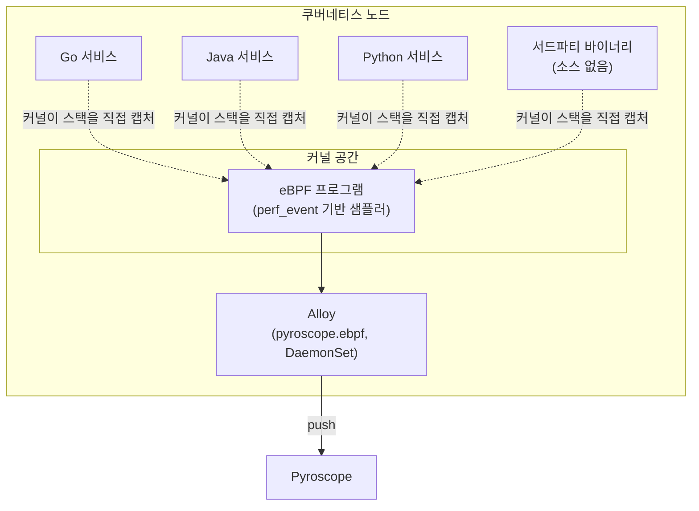
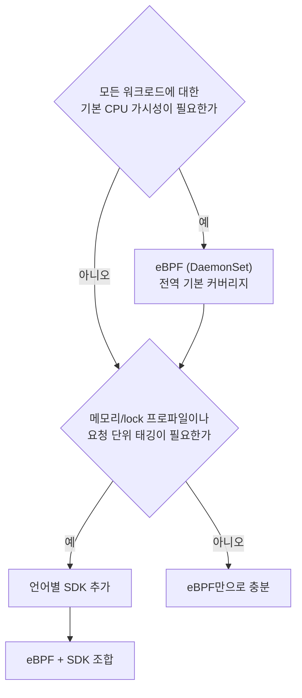

# 프로파일 타입과 eBPF

::: info 학습 목표
- CPU, alloc/inuse 메모리, goroutine, mutex/block, wall 프로파일 타입이 각각 어떤 질문에 답하는지 구분한다.
- Go·Java·Python 등 언어별로 SDK 계측 방식이 어떻게 다른지 안다.
- eBPF 기반 무계측 프로파일링이 언어 무관하게 시스템 전체를 프로파일링할 수 있는 원리를 이해한다.
- eBPF의 심볼라이제이션 한계와 커널 요구사항, SDK와 eBPF 중 무엇을 선택할지 기준을 세운다.
:::

## 1. 프로파일 타입

프로파일러 하나가 여러 종류의 값을 측정할 수 있다. 무엇을 측정하느냐에 따라 답할 수 있는 질문이 달라진다.

| 프로파일 타입 | 측정 값 | 답하는 질문 |
|---|---|---|
| CPU (`process_cpu`) | CPU 시간 소비 | 어느 함수가 CPU를 가장 많이 쓰는가 |
| alloc (`memory:alloc_space`/`alloc_objects`) | 누적 메모리 할당량 | 어디서 메모리를 가장 많이 할당했는가(할당 후 즉시 해제돼도 카운트) |
| inuse (`memory:inuse_space`/`inuse_objects`) | 현재 보유 중인 메모리 | 지금 무엇이 메모리를 물고 있어서 못 해제되는가(누수 진단) |
| goroutine / thread | 활성 고루틴·스레드 수와 각각의 스택 | 어디서 고루틴이 쌓여 leak되고 있는가 |
| mutex/block | 락 대기·블로킹 시간 | 어느 락에서 경합(contention)이 발생하는가 |
| wall (off-CPU 포함) | 실제 경과 시간(CPU 대기·I/O 대기 포함) | CPU를 쓰지 않고 blocked된 시간까지 포함해 어디서 지연이 발생했는가 |

<strong>alloc과 inuse의 차이</strong>가 특히 자주 헷갈린다. alloc은 "누적 할당량"이라 짧게 살고 죽는 객체도 계속 카운트가 늘어난다(GC 압박 진단에 유용). inuse는 "현재 시점의 스냅샷"이라 지금 살아있는 객체만 보여준다(메모리 누수의 원인 추적에 유용). 두 값이 동시에 큰 함수는 GC 부담과 누수 가능성을 모두 의심해야 한다.

CPU 프로파일은 기본적으로 on-CPU 샘플링이라 스레드가 스케줄러에 의해 실제로 CPU를 점유한 순간만 잡는다. I/O 대기나 락 대기로 블록된 시간은 CPU 프로파일에 잡히지 않으므로, 이런 지연까지 보려면 wall-clock 계열 프로파일이나 mutex/block 프로파일을 별도로 봐야 한다.

## 2. 언어별 계측

언어마다 런타임이 프로파일링 훅을 제공하는 방식이 다르다.

<strong>Go</strong>는 표준 라이브러리 `runtime/pprof`가 내장돼 있어 별도 에이전트 없이 CPU·힙·goroutine·mutex 프로파일을 바로 뽑을 수 있다. Pyroscope의 `pyroscope-go` SDK는 이를 감싸 주기적으로 push하는 역할만 추가한다.

<strong>Java</strong>는 [async-profiler](https://github.com/async-profiler/async-profiler)를 엔진으로 쓴다. async-profiler는 JVM Signal 기반 샘플링과 `AsyncGetCallTrace`/perf_events를 활용해 safepoint bias 없이 정확한 스택을 뽑는다. Pyroscope Java 에이전트는 async-profiler를 내장해 javaagent로 붙이기만 하면 별도 코드 변경 없이 동작한다.

<strong>Python</strong>은 GIL과 인터프리터 구조상 네이티브 언어보다 샘플링이 까다롭지만, `pyroscope_io` 패키지가 인터프리터 프레임을 주기적으로 샘플링해 push한다.

::: tabs
@tab Go
```go
import "github.com/grafana/pyroscope-go"

func main() {
    pyroscope.Start(pyroscope.Config{
        ApplicationName: "order-service",
        ServerAddress:   "http://pyroscope:4040",
        ProfileTypes: []pyroscope.ProfileType{
            pyroscope.ProfileCPU,
            pyroscope.ProfileAllocObjects,
            pyroscope.ProfileAllocSpace,
            pyroscope.ProfileInuseObjects,
            pyroscope.ProfileInuseSpace,
            pyroscope.ProfileGoroutines,
            pyroscope.ProfileMutexCount,
        },
    })
}
```
@tab Java
```bash
# javaagent로 부착 — 코드 변경 없이 async-profiler 기반 계측
java -javaagent:pyroscope.jar \
     -Dpyroscope.application.name=order-service \
     -Dpyroscope.server.address=http://pyroscope:4040 \
     -Dpyroscope.profiler.event=itimer \
     -jar order-service.jar
```
@tab Python
```python
import pyroscope_io as pyroscope

pyroscope.configure(
    application_name="order-service",
    server_address="http://pyroscope:4040",
    tags={"env": "prod"},
)
```
:::

## 3. eBPF 기반 무계측 프로파일링

SDK 방식은 애플리케이션마다 코드를 붙이고 재배포해야 한다는 진입 장벽이 있다. <strong>eBPF</strong>는 이 장벽을 우회한다. 커널 안에서 안전하게 실행되는 샌드박스 프로그램을 이용해, `perf_event`로 모든 프로세스에 대해 주기적으로 CPU 인터럽트를 걸고 콜 스택을 커널 레벨에서 직접 캡처한다. 이 방식은 <strong>언어 무관(language-agnostic)</strong>하며 <strong>시스템 전체(system-wide)</strong>를 대상으로 한다 — 애플리케이션 코드를 한 줄도 건드리지 않고, 심지어 소스가 없는 서드파티 바이너리까지 프로파일링할 수 있다.

Alloy의 `pyroscope.ebpf` 컴포넌트는 이 방식을 노드 단위 DaemonSet으로 배포해, 호스트에서 실행되는 모든 컨테이너의 프로파일을 한 번에 수집한다.



## 4. eBPF 원리와 한계 — 심볼라이제이션, 커널 요구

eBPF 수집이 만능은 아니다. 두 가지 구조적 제약이 있다.

<strong>심볼라이제이션</strong>이 가장 큰 난관이다. eBPF는 커널 레벨에서 스택의 메모리 주소만 캡처하고, 이를 함수 이름으로 바꾸는 작업(심볼라이제이션)은 별도로 이뤄진다. 프레임 포인터가 보존된 네이티브 바이너리(Go, C/C++를 `-fno-omit-frame-pointer`로 빌드한 경우)는 스택 언와인딩이 안정적이다. 반면 JIT 컴파일 언어(Java, JIT 모드의 Python 등)는 실행 중 코드가 동적으로 생성되므로 정적 심볼 테이블만으로는 함수 이름을 찾을 수 없고, 별도의 JIT 심볼 맵(예: `perf-map-agent` 유사 메커니즘) 없이는 스택 일부가 "unknown"으로 표시된다.

<strong>커널 요구사항</strong>도 있다. eBPF 기반 스택 언와인딩과 CO-RE(Compile Once – Run Everywhere)는 BTF(BPF Type Format)를 지원하는 비교적 최신 커널(5.x 계열)에서 안정적으로 동작한다. 또한 `CAP_BPF`/`CAP_SYS_ADMIN` 수준의 권한이 필요해, 컨테이너 보안 정책(예: 제한된 SecurityContext, gVisor 같은 샌드박스 런타임)에 따라 배포가 막힐 수 있다.

## 5. SDK vs eBPF 선택 기준

| 기준 | SDK | eBPF |
|---|---|---|
| 커버리지 | 계측한 서비스만 | 노드의 모든 프로세스(서드파티 포함) |
| 코드 변경 | 필요(라이브러리 추가, 재배포) | 불필요 |
| 프로파일 타입 | CPU/메모리/goroutine/lock 등 풍부 | 대부분 CPU 중심(제한적) |
| 커스텀 태깅 | 요청 단위 동적 태그 가능 | 제한적(주로 프로세스/컨테이너 라벨) |
| 심볼 정확도 | 언어 런타임이 직접 제공(높음) | 언어에 따라 편차(JIT 언어는 별도 처리 필요) |
| 운영 권한 | 애플리케이션 배포 권한만 | 노드 레벨 권한(DaemonSet, 커널 기능) 필요 |

실무에서는 두 방식을 배타적으로 고르기보다 <strong>계층적으로 조합</strong>하는 경우가 많다. eBPF를 클러스터 전역 DaemonSet으로 깔아 모든 워크로드에 대한 기본 CPU 가시성을 확보하고, 메모리 누수·락 경합처럼 eBPF가 다루기 약한 프로파일 타입이나 요청 단위 세밀한 태깅이 필요한 핵심 서비스에는 SDK를 추가로 붙이는 전략이다.



## 6. 라벨과 태깅

Pyroscope의 프로파일 시리즈도 Prometheus 시계열처럼 라벨로 식별된다. <strong>`service_name`</strong>은 사실상 필수 라벨로, Prometheus의 `job`과 같은 역할을 한다. 여기에 `version`, `env`, `region` 같은 배포 메타데이터를 태그로 붙이면, 배포 버전 간 CPU 사용량을 diff 질의로 비교하거나([27장](/study/observability/27-flamegraph-trace-integration)), 리전별 프로파일을 나눠 볼 수 있다.

Go SDK는 코드 안에서 동적 태깅도 지원한다. 특정 구간에서만 임시로 태그를 붙이면, 그 구간에서 실행된 샘플만 별도로 필터링해 볼 수 있다.

```go
pyroscope.TagWrapper(context.Background(), pyroscope.Labels("request_type", "checkout"), func(ctx context.Context) {
    processCheckout(ctx)
})
```

다만 라벨 카디널리티 관리 원칙은 [25장](/study/observability/25-pyroscope-architecture)에서 다룬 것과 동일하다 — 요청 ID처럼 유일값이 많은 값을 라벨로 붙이면 프로파일 시리즈가 폭발한다. 동적 태그는 값의 종류가 제한적인 카테고리(요청 타입, 기능 플래그 등)에만 쓰는 것이 안전하다.

::: tip 핵심 정리
- CPU·alloc·inuse·goroutine·mutex/block·wall 프로파일은 서로 다른 질문에 답하며, alloc(누적 할당)과 inuse(현재 보유)의 차이를 구분하는 것이 특히 중요하다.
- Go는 `runtime/pprof` 내장, Java는 async-profiler 기반 javaagent, Python은 인터프리터 프레임 샘플링으로 각각 SDK 계측 방식이 다르다.
- eBPF는 커널 레벨 `perf_event` 샘플링으로 언어 무관·시스템 전체 프로파일링을 코드 변경 없이 가능하게 한다.
- eBPF의 한계는 JIT 언어의 심볼라이제이션 취약성과, BTF 지원 커널·상승된 권한이 필요하다는 운영 제약이다.
- eBPF로 전역 기본 커버리지를 확보하고, 세밀한 태깅·메모리/락 프로파일이 필요한 서비스에 SDK를 추가하는 조합이 실무적이다.
- 프로파일 라벨은 Prometheus 시계열과 같은 카디널리티 원칙을 따르며, `service_name`은 사실상 필수, 동적 태그는 값의 종류가 제한적일 때만 안전하다.
:::

## 다음 챕터

프로파일 타입과 수집 방식을 이해했다면, 다음은 그 데이터를 실제로 읽고 트레이스와 엮는 방법을 볼 차례다. [플레임그래프와 트레이스 연계](/study/observability/27-flamegraph-trace-integration)에서는 플레임그래프를 읽는 법, diff view로 회귀를 진단하는 방법, 그리고 span profiles로 트레이스와 프로파일을 연결하는 워크플로우를 다룬다.
