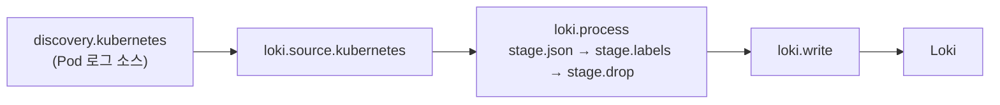
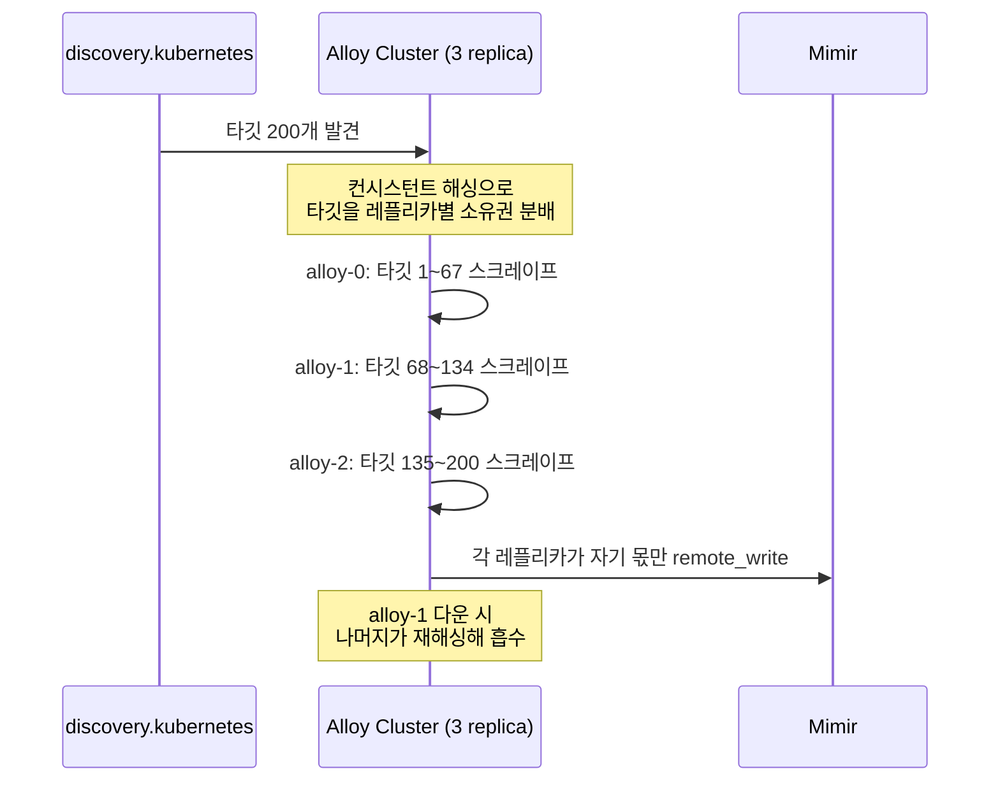

# Alloy 파이프라인 구성

::: info 학습 목표
- `prometheus.scrape` → `prometheus.remote_write` 체인으로 메트릭 파이프라인을 구성한다.
- `loki.source.*` → `loki.process` → `loki.write` 체인으로 로그 파이프라인을 구성하고 파싱 스테이지를 이해한다.
- `otelcol.receiver` → `processor` → `exporter` 체인으로 트레이스 파이프라인을 구성한다.
- `otelcol.processor.tail_sampling`으로 Alloy 안에서 tail-based sampling을 적용하는 방법을 익힌다.
- `pyroscope.scrape`/`pyroscope.ebpf`로 계측·무계측 프로파일 파이프라인을 구성한다.
- clustering이 스크레이프 타깃을 레플리카 간에 어떻게 분배하는지 이해한다.
:::

## 1. 메트릭 파이프라인 — prometheus.scrape → prometheus.remote_write

메트릭 파이프라인의 뼈대는 [Prometheus 스크레이핑](/study/observability/05-prometheus-architecture)의 개념을 그대로 컴포넌트로 옮긴 것이다. `discovery.kubernetes`로 타깃을 찾고, `discovery.relabel`로 라벨을 다듬은 뒤, `prometheus.scrape`가 실제로 긁고, `prometheus.remote_write`가 Mimir로 밀어넣는다.

```alloy
discovery.kubernetes "pods" {
  role = "pod"
}

discovery.relabel "app_pods" {
  targets = discovery.kubernetes.pods.targets

  rule {
    source_labels = ["__meta_kubernetes_pod_annotation_prometheus_io_scrape"]
    action        = "keep"
    regex         = "true"
  }
  rule {
    source_labels = ["__meta_kubernetes_namespace"]
    target_label  = "namespace"
  }
}

prometheus.scrape "app" {
  targets         = discovery.relabel.app_pods.output
  forward_to      = [prometheus.remote_write.mimir.receiver]
  scrape_interval = "30s"
  job_name        = "app-metrics"
}

prometheus.remote_write "mimir" {
  endpoint {
    url = "https://mimir.example.com/api/v1/push"

    queue_config {
      capacity          = 10000
      max_shards        = 50
      max_samples_per_send = 2000
    }
  }
}
```

`prometheus.scrape`는 여러 `forward_to` 대상을 가질 수 있어 하나의 스크레이프 결과를 로컬 Prometheus와 Mimir 양쪽으로 동시에 보낼 수도 있다. `queue_config`는 원본 Prometheus의 remote_write 큐 설정과 동일한 파라미터를 그대로 노출하므로, [TSDB와 remote_write](/study/observability/12-tsdb-remote-write)에서 다룬 백프레셔 튜닝 지식을 그대로 적용할 수 있다.

## 2. 로그 파이프라인 — loki.source.* → loki.process → loki.write

로그는 소스 컴포넌트(`loki.source.file`, `loki.source.kubernetes`, `loki.source.journal` 등)로 원본 라인을 받고, `loki.process`에서 스테이지 체인으로 파싱·라벨링한 뒤, `loki.write`로 내보낸다. 이 흐름은 [LogQL](/study/observability/18-logql) 쿼리가 전제하는 라벨·구조를 파이프라인 단계에서 미리 만들어주는 과정이다.

```alloy
discovery.relabel "pod_logs" {
  targets = discovery.kubernetes.pods.targets

  rule {
    source_labels = ["__meta_kubernetes_namespace"]
    target_label  = "namespace"
  }
  rule {
    source_labels = ["__meta_kubernetes_pod_container_name"]
    target_label  = "container"
  }
}

loki.source.kubernetes "pods" {
  targets    = discovery.relabel.pod_logs.output
  forward_to = [loki.process.parse.receiver]
}

loki.process "parse" {
  stage.json {
    expressions = {
      level   = "level",
      message = "msg",
    }
  }

  stage.labels {
    values = {
      level = "level",
    }
  }

  stage.drop {
    source = "level"
    value  = "debug"
  }

  forward_to = [loki.write.default.receiver]
}

loki.write "default" {
  endpoint {
    url = "https://loki.example.com/loki/api/v1/push"
  }
}
```

`stage.json`으로 JSON 로그를 파싱하고, `stage.labels`로 파싱 결과 중 라벨로 승격할 값만 골라낸다. 라벨은 인덱스 비용을 직접 좌우하므로([Loki 아키텍처](/study/observability/16-loki-architecture) 참고), `message`처럼 카디널리티가 높은 필드는 절대 라벨로 승격하지 않고 로그 본문에 그대로 둔다. `stage.drop`처럼 파이프라인 단계에서 노이즈 로그를 걸러내면 Loki에 도달하는 볼륨 자체를 줄여 저장 비용을 낮출 수 있다.



## 3. 트레이스 파이프라인 — otelcol.receiver → processor → exporter

트레이스는 `otelcol.*` 계열로 구성한다. [OpenTelemetry](/study/observability/21-opentelemetry) SDK가 보낸 OTLP를 `otelcol.receiver.otlp`가 받고, 프로세서 체인을 거쳐 `otelcol.exporter.otlp`가 Tempo로 내보낸다.

```alloy
otelcol.receiver.otlp "default" {
  grpc {
    endpoint = "0.0.0.0:4317"
  }
  http {
    endpoint = "0.0.0.0:4318"
  }

  output {
    traces = [otelcol.processor.batch.default.input]
  }
}

otelcol.processor.batch "default" {
  timeout     = "5s"
  send_batch_size = 1024

  output {
    traces = [otelcol.processor.tail_sampling.default.input]
  }
}

otelcol.exporter.otlp "tempo" {
  client {
    endpoint = "tempo.example.com:4317"
    tls {
      insecure = false
    }
  }
}
```

`otelcol.receiver.otlp`가 gRPC(4317)와 HTTP(4318) 두 프로토콜을 동시에 열어두는 것은 OTel Collector와 동일한 관례다. `output` 블록으로 다음 컴포넌트의 `input`을 직접 참조하는 것이 [1장](/study/observability/28-alloy-overview)에서 본 컴포넌트 그래프 방식이다.

## 4. Alloy에서의 tail sampling — otelcol.processor.tail_sampling

[분산 트레이싱 기초](/study/observability/20-distributed-tracing-basics)와 [OpenTelemetry](/study/observability/21-opentelemetry)에서 다룬 head sampling(SDK 단에서 확률적으로 미리 결정)과 tail sampling(모든 스팬을 모아 트레이스 완성 후 결정)의 구분을 떠올려보면, tail sampling은 반드시 트레이스 전체 스팬을 한 곳에서 모을 수 있는 중앙 집중 지점이 필요하다. Alloy를 게이트웨이 형태로 배치해 이 역할을 맡기는 것이 실무에서 가장 흔한 tail sampling 구성이다.

```alloy
otelcol.processor.tail_sampling "default" {
  decision_wait            = "10s"
  num_traces               = 100000
  expected_new_traces_per_sec = 500

  policy {
    name = "errors"
    type = "status_code"

    status_code {
      status_codes = ["ERROR"]
    }
  }

  policy {
    name = "slow-requests"
    type = "latency"

    latency {
      threshold_ms = 500
    }
  }

  policy {
    name = "baseline-sample"
    type = "probabilistic"

    probabilistic {
      sampling_percentage = 10
    }
  }

  output {
    traces = [otelcol.exporter.otlp.tempo.input]
  }
}
```

`decision_wait`(여기서는 10초) 동안 같은 trace ID를 가진 스팬을 모으고, 그 시간이 지나면 정책 목록을 순서대로 평가해 채택 여부를 결정한다. 정책은 OR로 결합되므로 — 에러거나(errors), 느리거나(slow-requests), 아니면 10% 확률로(baseline-sample) — 셋 중 하나라도 맞으면 트레이스 전체가 채택된다. 이 방식은 정상 트레이스는 대부분 버리면서도 "문제가 있었던" 트레이스는 놓치지 않는 실전 샘플링 전략이다.

::: warning decision_wait와 게이트웨이 레플리카 수의 관계
tail sampling은 트레이스의 모든 스팬이 같은 Alloy 인스턴스에 도달해야 정확히 동작한다. 게이트웨이를 여러 레플리카로 수평 확장하면 로드밸런서가 같은 trace ID의 스팬을 서로 다른 레플리카로 흩뿌릴 수 있고, 그러면 각 레플리카가 불완전한 스팬 집합만 보고 판단해 샘플링이 왜곡된다. 이를 막으려면 트레이스 ID 기준 로드밸런싱(`otelcol.exporter.loadbalancing`)을 앞단에 둬 같은 trace ID가 항상 같은 레플리카로 가도록 고정해야 한다.
:::

## 5. 프로파일 파이프라인 — pyroscope.scrape / pyroscope.ebpf

프로파일은 두 갈래로 나뉜다. 애플리케이션이 [Pyroscope](/study/observability/25-pyroscope-architecture) SDK로 직접 프로파일을 노출하면 `pyroscope.scrape`가 주기적으로 긁어오고, 계측 없이 커널 레벨에서 샘플링하려면 `pyroscope.ebpf`를 쓴다.

```alloy
// 계측 기반: 애플리케이션이 /debug/pprof 류의 엔드포인트를 노출
pyroscope.scrape "app" {
  targets    = discovery.relabel.app_pods.output
  forward_to = [pyroscope.write.default.receiver]

  profiling_config {
    profile.cpu {
      enabled = true
    }
    profile.memory {
      enabled = true
    }
  }
}

// 무계측 기반: eBPF로 전체 노드의 프로세스를 샘플링
pyroscope.ebpf "node" {
  forward_to = [pyroscope.write.default.receiver]

  targets = discovery.relabel.app_pods.output
}

pyroscope.write "default" {
  endpoint {
    url = "https://pyroscope.example.com"
  }
}
```

`pyroscope.scrape`는 애플리케이션 코드에 심볼 정보가 남아 있어 라인 단위까지 정밀하지만 계측이 필요하고, `pyroscope.ebpf`는 계측 없이 노드의 모든 프로세스를 대상으로 CPU 프로파일을 샘플링할 수 있는 대신 심볼 해석 정밀도가 상대적으로 낮다. 이 트레이드오프는 [프로파일 타입과 eBPF](/study/observability/26-profile-types-ebpf)에서 더 깊게 다룬다. `pyroscope.ebpf`는 커널 기능(perf_event_open)에 의존하므로 DaemonSet으로 배치하고 `hostPID: true`, 적절한 capability(`SYS_ADMIN` 또는 `PERFMON`+`BPF`)를 부여해야 동작한다.

## 6. clustering과 타깃 분배

메트릭·로그·프로파일 스크레이프 파이프라인을 모두 StatefulSet 게이트웨이로 운영한다면, 타깃 목록을 레플리카끼리 나눠야 각 인스턴스의 부하가 균등해진다. Alloy clustering을 켜면 `prometheus.scrape`, `pyroscope.scrape` 같은 <strong>타깃 기반(target-based)</strong> 컴포넌트가 자동으로 이 분배에 참여한다.

```alloy
alloy {
  clustering {
    enabled = true
  }
}
```



각 레플리카는 전체 타깃 목록을 동일하게 discovery로 받지만, 클러스터 멤버십을 기준으로 컨시스턴트 해싱을 적용해 "이 타깃은 내 몫이 아니다"라고 판단되면 스킵한다. 그 결과 중복 스크레이프 없이 부하가 나뉘고, 레플리카 하나가 사라지면 나머지가 자동으로 그 몫을 흡수한다. 반대로 DaemonSet으로 배치한 노드 로컬 컴포넌트(`loki.source.file`, `pyroscope.ebpf`)는 애초에 "이 노드는 이 인스턴스가 담당"이라는 배치 자체가 분배 역할을 하므로 clustering이 필요 없다.

::: tip 핵심 정리
- 메트릭은 `discovery.kubernetes` → `discovery.relabel` → `prometheus.scrape` → `prometheus.remote_write` 체인으로 구성한다.
- 로그는 `loki.source.*`로 받아 `loki.process`의 스테이지 체인(`stage.json`, `stage.labels`, `stage.drop`)으로 다듬고 `loki.write`로 내보낸다.
- 트레이스는 `otelcol.receiver.otlp` → `otelcol.processor.batch` → `otelcol.exporter.otlp` 체인이 기본형이다.
- `otelcol.processor.tail_sampling`은 정책을 OR로 결합해 에러·지연·확률 샘플을 함께 채택하며, 완전한 트레이스가 모이려면 trace ID 기준 로드밸런싱이 전제돼야 한다.
- 프로파일은 계측 기반 `pyroscope.scrape`와 무계측 `pyroscope.ebpf` 중 정밀도·운영 부담을 저울질해 고른다.
- clustering은 타깃 기반 스크레이프 컴포넌트에만 적용되며, 컨시스턴트 해싱으로 타깃을 레플리카 간에 자동 재분배한다.
:::

## 다음 챕터

Alloy 파이프라인을 직접 조립할 수 있게 됐다면, 이제 "그럼 순수 OpenTelemetry Collector와 뭐가 다른가"라는 질문에 답할 차례다. [Collector vs Alloy](/study/observability/30-collector-vs-alloy)에서는 두 도구의 관계와 역사, 신호 지원·clustering 기능 비교, 구성 방식 차이, 선택 기준과 마이그레이션 경로를 다룬다.
