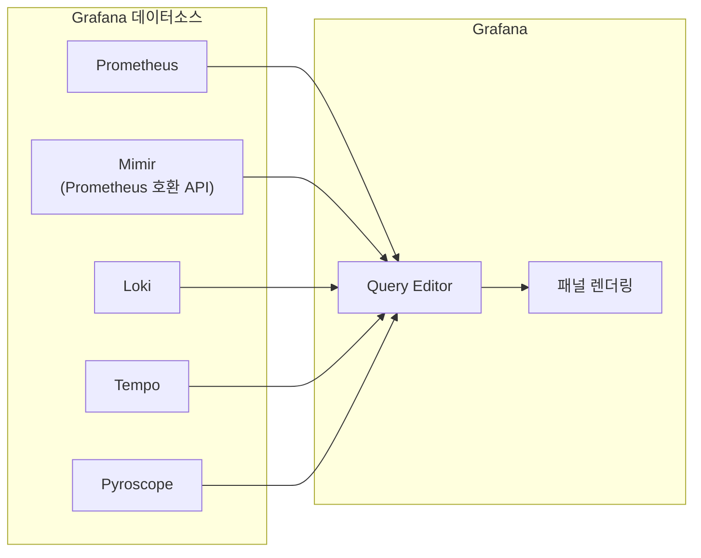
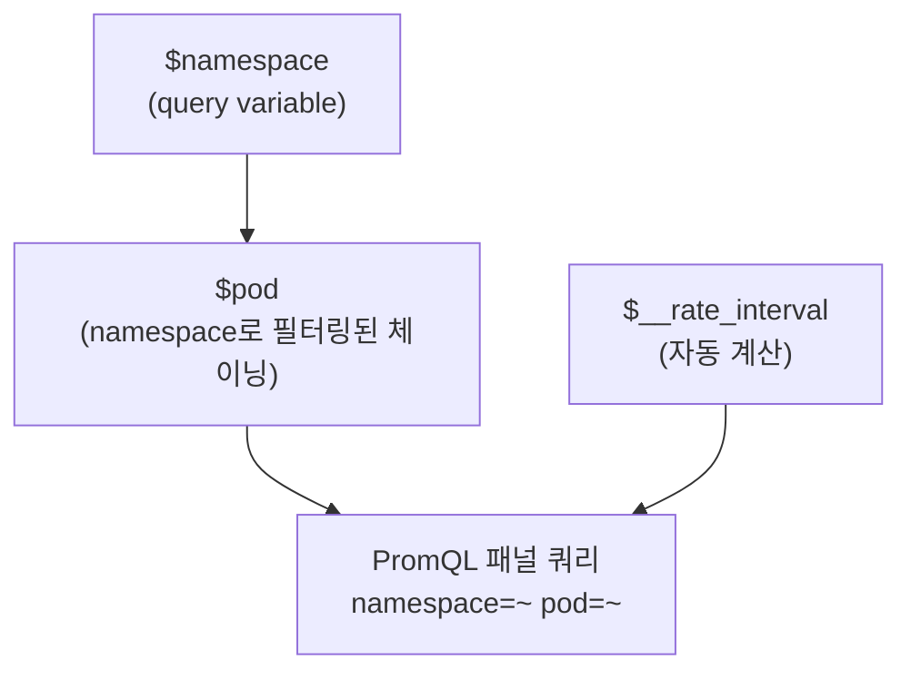
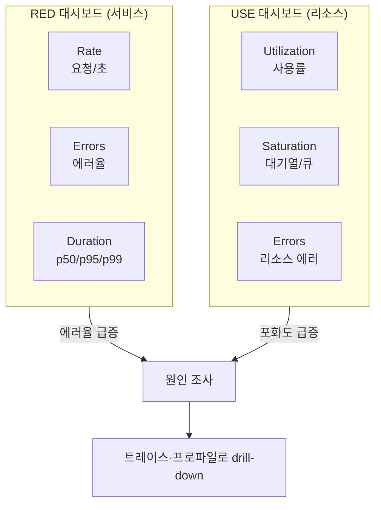

# 데이터소스와 대시보드

::: info 학습 목표
- Prometheus·Loki·Tempo·Pyroscope·Mimir 데이터소스를 Grafana에 연결하는 설정 항목과 각 백엔드의 프로토콜 차이를 이해한다.
- 시계열·로그·트레이스·프로파일 각각에 맞는 패널 타입을 고른다.
- 쿼리 변수(query variable)·multi-value·`$__rate_interval`을 활용해 재사용 가능한 대시보드를 설계한다.
- RED/USE 방법론을 기준으로 대시보드 구조를 잡는 법을 익힌다.
- transformations와 mixed datasource로 여러 백엔드 쿼리를 하나의 패널에 합친다.
- 쿼리 비용과 interval 설정이 대시보드 성능·백엔드 부하에 미치는 영향을 파악한다.
:::

## 1. 데이터소스 연결

Grafana는 데이터소스를 <strong>플러그인</strong> 단위로 추상화한다. 각 신호 백엔드는 프로토콜이 다르지만, Grafana 안에서는 동일한 패널·변수 시스템을 공유한다. UI(Configuration → Data sources)로 등록할 수도 있지만, 운영 환경에서는 [provisioning](/study/observability/33-dashboard-as-code)으로 파일 기반 관리하는 쪽이 표준이다.

```yaml
apiVersion: 1
datasources:
  - name: Prometheus
    type: prometheus
    url: http://prometheus:9090
    isDefault: true
    jsonData:
      httpMethod: POST
      exemplarTraceIdDestinations:
        - name: trace_id
          datasourceUid: tempo-uid
      timeInterval: 15s
  - name: Mimir
    type: prometheus
    url: http://mimir-query-frontend:8080/prometheus
    jsonData:
      httpHeaderName1: X-Scope-OrgID
    secureJsonData:
      httpHeaderValue1: tenant-a
  - name: Loki
    type: loki
    url: http://loki:3100
    jsonData:
      maxLines: 1000
  - name: Tempo
    type: tempo
    url: http://tempo:3200
  - name: Pyroscope
    type: grafana-pyroscope-datasource
    url: http://pyroscope:4040
```

<strong>Prometheus</strong>는 `httpMethod: POST`로 긴 PromQL을 GET URL 길이 제한 없이 보내는 것이 권장이다. <strong>Mimir</strong>는 API가 Prometheus와 호환되므로 데이터소스 타입은 그대로 `prometheus`를 쓰지만, 멀티테넌시 환경이면 `X-Scope-OrgID` 헤더로 테넌트를 지정해야 한다([Mimir 문서](https://grafana.com/docs/mimir/latest/)). <strong>Loki</strong>는 `maxLines`로 로그 패널이 한 번에 끌어오는 라인 수를 제한해 브라우저 부하를 막는다. <strong>Tempo</strong>·<strong>Pyroscope</strong> 연결과 이들 사이의 점프 설정(trace-to-logs, trace-to-profiles)은 [32장 시그널 상관관계](/study/observability/32-signal-correlation)에서 깊게 다룬다.



## 2. 패널·시각화 타입

패널 타입은 신호의 데이터 형태를 그대로 따라간다. 잘못된 타입을 고르면 데이터는 맞아도 읽기 어려운 대시보드가 나온다.

| 신호 | 대표 패널 | 용도 |
|---|---|---|
| 메트릭(시계열) | Time series | 값의 추이(레이턴시, 처리량) |
| 메트릭(단일값) | Stat, Gauge, Bar gauge | 현재값·SLO 잔여치 강조 |
| 메트릭(상태) | State timeline | on/off, 상태 전이 히스토리 |
| 메트릭(분포) | Heatmap | 히스토그램 버킷 분포, 레이턴시 히트맵 |
| 로그 | Logs | 원본 로그 스트림, LogQL 필터 |
| 트레이스 | Traces | 단일 트레이스의 span 트리 |
| 트레이스(집계) | Node graph | 서비스 간 호출 관계 |
| 프로파일 | Flame graph | 함수별 리소스 소비 비중 |
| 범용 | Table | 다차원 값 비교, transformations와 궁합이 좋음 |

Heatmap은 `histogram_quantile` 계열 쿼리보다 원시 버킷 분포를 직접 보여줘서, 특정 백분위수 하나로는 안 보이는 이중 모드(bimodal) 레이턴시 패턴을 잡아낼 때 유용하다. Stat/Gauge는 임계값(threshold) 색상 구간을 SLO 목표치에 맞춰 지정하면 "지금 정상인가"를 3초 안에 답하는 용도로 쓴다.

## 3. 변수와 템플릿

<strong>쿼리 변수(query variable)</strong>는 데이터소스에 직접 질의해 값 목록을 만든다. Prometheus라면 `label_values()` 함수로 라벨 값을 끌어온다.

```
label_values(up{job=~"$job"}, instance)
```

변수 체이닝(chained variable)을 쓰면 상위 변수 선택에 따라 하위 변수 후보가 좁혀진다. 예를 들어 `namespace` 변수를 먼저 고르면, `pod` 변수는 `label_values(kube_pod_info{namespace="$namespace"}, pod)`로 해당 네임스페이스의 Pod만 나열한다.

<strong>Multi-value</strong>와 <strong>Include All option</strong>을 켜면 대시보드 사용자가 여러 값을 동시에 선택할 수 있다. PromQL에서는 정규식 매칭으로 반영된다.

```promql
sum(rate(http_requests_total{namespace=~"$namespace", pod=~"$pod"}[$__rate_interval])) by (pod)
```

`$__rate_interval`은 Grafana가 자동 계산하는 특수 변수로, `rate()`/`increase()`에 넣을 구간을 하드코딩된 `[5m]` 대신 지정할 때 쓴다. 계산식은 대략 `max($__interval + scrape_interval, 4 * scrape_interval)`이며, 패널이 확대·축소되며 `$__interval`(포인트당 시간 간격)이 바뀌어도 항상 최소 4개 스크레이프 샘플을 포함하도록 보장한다. 하드코딩된 `[5m]`을 쓰면 스크레이프 주기가 1분인 타깃에서는 샘플 수가 부족해 `rate()`가 끊기거나 부정확해질 수 있다.



::: warning 정규식 변수의 카디널리티 함정
`pod=~"$pod"`처럼 정규식 매칭을 남발하면, Include All 선택 시 수백 개 값이 하나의 정규식으로 합쳐져 쿼리 비용이 급증한다. 카디널리티가 큰 라벨은 변수 대신 `topk()`나 별도 필터링 패널로 좁히는 편이 안전하다.
:::

## 4. 대시보드 설계 — RED/USE 대시보드 구성

대시보드를 처음부터 패널 나열로 설계하면 일관성이 없어진다. 실무에서는 두 방법론을 골격으로 삼는다.

<strong>RED 방법론</strong>(Rate, Errors, Duration)은 요청을 처리하는 서비스에 적용한다. Rate는 초당 요청 수, Errors는 실패율, Duration은 레이턴시 분포(p50/p95/p99)다. <strong>USE 방법론</strong>(Utilization, Saturation, Errors)은 CPU·메모리·디스크 같은 리소스에 적용한다. Utilization은 사용률, Saturation은 대기열 길이 같은 포화도, Errors는 리소스 레벨 에러다. 두 방법론 모두 애플리케이션이 올바르게 계측돼 있어야 의미 있는 값을 얻는데, 카운터/히스토그램을 어떻게 노출해야 하는지는 [08장 Exporter와 애플리케이션 계측](/study/observability/08-exporters-instrumentation)에서 다룬 인스트루먼테이션 패턴이 전제가 된다.

```promql
# RED - Rate
sum(rate(http_requests_total[$__rate_interval])) by (service)

# RED - Errors
sum(rate(http_requests_total{status=~"5.."}[$__rate_interval])) by (service)
  / sum(rate(http_requests_total[$__rate_interval])) by (service)

# RED - Duration (p99)
histogram_quantile(0.99, sum(rate(http_request_duration_seconds_bucket[$__rate_interval])) by (le, service))

# USE - Utilization (CPU)
avg(rate(node_cpu_seconds_total{mode!="idle"}[$__rate_interval])) by (instance)

# USE - Saturation (run queue)
node_load1 / count(node_cpu_seconds_total{mode="idle"}) by (instance)
```



서비스 대시보드는 RED 패널을 상단에, 해당 서비스가 의존하는 인프라(노드, DB 커넥션 풀)의 USE 패널을 하단에 배치하는 구성이 일반적이다. 이렇게 하면 "요청이 느려졌다(RED 이상)"에서 "왜(USE 이상)"로 한 화면 안에서 시선만 옮겨 좁혀갈 수 있다.

## 5. transformations와 mixed datasource

<strong>Transformations</strong>는 쿼리 결과를 패널에 그리기 전에 가공하는 단계다. 자주 쓰는 것은 다음과 같다.

- <strong>Outer join / Join by field</strong>: 서로 다른 쿼리 결과를 시간 또는 라벨 기준으로 합쳐 하나의 테이블로 만든다.
- <strong>Organize fields</strong>: 컬럼 순서 재배열, 이름 변경, 숨김.
- <strong>Add field from calculation</strong>: 두 시리즈를 사칙연산으로 합성(예: 에러율 = 에러 카운트 / 전체 카운트를 패널 레벨에서 계산).
- <strong>Filter by value / Sort by</strong>: 임계치 이상만 노출하거나 상위 N개만 정렬.

<strong>Mixed datasource</strong>는 하나의 패널 안에서 쿼리마다 다른 데이터소스를 지정하는 기능이다. 데이터소스 드롭다운에서 `-- Mixed --`를 선택하면 각 쿼리 행마다 개별 데이터소스를 고를 수 있다. 예를 들어 쿼리 A는 Prometheus에서 요청률을, 쿼리 B는 Mimir에서 장기 추이를 가져와 같은 테이블에 join하는 식이다. 다만 mixed datasource는 각 백엔드에 독립적으로 요청을 보내는 것이므로, 시간축이 정확히 맞물리지 않으면 join 결과에 빈 셀이 생길 수 있다는 점을 감안해야 한다.

## 6. 대시보드 성능

대시보드가 느려지는 원인은 대부분 패널 개수가 아니라 <strong>쿼리 비용</strong>이다.

- <strong>비싼 정규식·와일드카드 회피</strong>: `{namespace=~".+"}`처럼 사실상 전체 스캔인 매처는 카디널리티를 그대로 백엔드에 넘긴다. 가능하면 구체적인 라벨 값이나 존재하는 값 목록으로 좁힌다.
- <strong>Recording rule 활용</strong>: `histogram_quantile`처럼 무거운 연산을 대시보드 로드 시점마다 반복 계산하지 말고, [11장 Recording·Alerting Rule](/study/observability/11-recording-alerting-rules)에서처럼 미리 계산된 시계열을 대시보드가 읽게 한다.
- <strong>min step / interval 설정</strong>: 패널의 `Min interval`을 스크레이프 주기보다 작게 잡으면 백엔드가 존재하지 않는 해상도의 데이터를 억지로 보간하느라 낭비가 생긴다. 반대로 너무 크게 잡으면 스파이크가 뭉개진다.
- <strong>Auto-refresh 주기</strong>: 대시보드 새로고침 주기가 스크레이프 주기보다 짧으면 매번 같은 데이터를 다시 긁는 것과 다름없다. 스크레이프 주기와 맞추거나 그 이상으로 설정한다.
- <strong>행(row) 접기와 지연 로딩</strong>: Grafana는 접힌 row나 화면 밖 패널의 쿼리를 지연 실행하므로, 패널이 많은 대시보드는 기본적으로 아래쪽 row를 접어두는 편이 초기 로드를 가볍게 한다.
- <strong>쿼리 캐싱</strong>: Mimir의 query-frontend는 결과 캐싱을 지원해 동일 쿼리 반복 요청의 백엔드 부하를 줄인다([Mimir query-frontend 문서](https://grafana.com/docs/mimir/latest/references/architecture/components/query-frontend/)).

::: tip 핵심 정리
- 데이터소스는 provisioning YAML로 관리하는 것이 표준이며, Mimir는 Prometheus 호환 API에 테넌트 헤더만 추가하면 된다.
- 패널 타입은 신호 형태(시계열/로그/트레이스/프로파일/분포)에 맞춰 고른다.
- `$__rate_interval`은 스크레이프 주기와 패널 확대·축소에 맞춰 자동으로 안전한 rate 구간을 계산해준다.
- RED(서비스)와 USE(리소스) 방법론을 골격으로 삼으면 상단-하단 drill-down 구조의 일관된 대시보드를 만들 수 있다.
- Transformations와 mixed datasource로 여러 백엔드 쿼리를 하나의 패널에 합칠 수 있지만 시간축 정합성에 주의한다.
- 대시보드 성능은 패널 개수보다 쿼리 비용(정규식, recording rule 유무, interval 설정)이 좌우한다.
:::

## 다음 챕터

지금까지는 신호별로 데이터소스를 연결하고 대시보드를 그리는 법을 다뤘다. 다음 챕터 [시그널 상관관계](/study/observability/32-signal-correlation)에서는 exemplar·derived field 같은 기능으로 메트릭·로그·트레이스·프로파일을 서로 점프 가능하게 엮는 방법을 다룬다.
