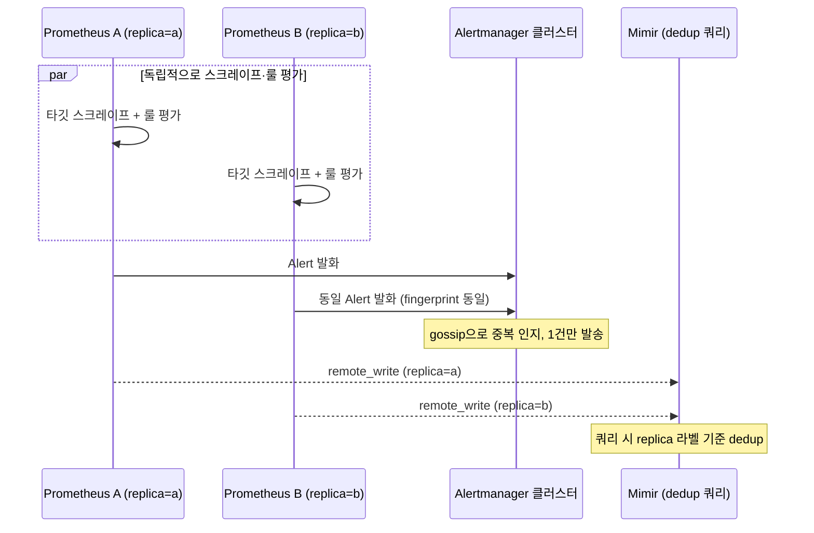
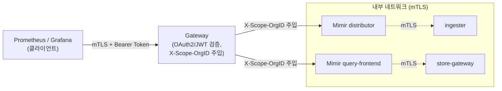

# HA·멀티테넌시·페더레이션

::: info 학습 목표
- Prometheus를 동일한 스크레이프 쌍으로 이중화하는 HA 패턴과, 다운스트림에서 중복을 제거하는 방식을 이해한다.
- `/federate` 엔드포인트를 이용한 계층형(hierarchical) 페더레이션과 교차 서비스(cross-service) 페더레이션의 용도 차이를 구분한다.
- `X-Scope-OrgID` 헤더 기반으로 Mimir/Loki/Tempo가 멀티테넌시를 구현하는 방식을 안다.
- 테넌트별 limit과 격리가 왜 필요한지, noisy neighbor 문제를 어떻게 방지하는지 이해한다.
- 게이트웨이 계층에서 인증·인가를 처리하고 컴포넌트 간 mTLS를 적용하는 보안 패턴을 익힌다.
- 멀티클러스터 환경에서 하나의 대시보드로 전체 시스템을 조망하는 글로벌 뷰 구성 방법을 안다.
:::

## 1. Prometheus HA

단일 Prometheus 서버는 [장기 저장 — Mimir](/study/observability/35-mimir-longterm-storage)로 데이터 유실 문제를 완화할 수 있지만, 그 자체가 죽으면 죽어있는 동안의 스크레이프와 알림 평가가 통째로 비는 <strong>가용성 공백</strong>이 생긴다. Prometheus의 표준 HA 패턴은 <strong>동일한 스크레이프 설정을 가진 Prometheus 두 대(또는 그 이상)를 완전히 독립적으로</strong> 운영하는 것이다. 둘 다 같은 타깃을 같은 주기로 긁고, 같은 알림 규칙을 평가한다.

```yaml
# 두 레플리카를 external_labels로만 구분
global:
  external_labels:
    replica: replica-a   # 다른 레플리카는 replica-b
    cluster: prod-us-east
```

레플리카는 스크레이프 타이밍이 완전히 동기화되지 않으므로 같은 시계열이라도 타임스탬프가 미세하게 어긋난 별개의 데이터로 저장된다. 이 중복을 처리하는 책임은 다운스트림에 있다.

- <strong>Mimir/Thanos 쿼리 계층</strong>은 `replica` 라벨을 기준으로 동일 시계열의 여러 레플리카 데이터를 병합하며 중복 제거한다. Thanos Querier의 `--query.replica-label=replica` 옵션이나 Mimir 쿼리 시 벡터 셀렉터에서 `replica` 라벨을 무시하고 조인하는 방식이 대표적이다.
- <strong>Alertmanager</strong>는 자체 gossip 기반 클러스터링으로 동일한 알림이 여러 Prometheus 레플리카에서 동시에 들어와도 하나로 묶어 한 번만 발송한다. 즉 두 Prometheus가 각각 같은 알림을 Alertmanager로 보내도, Alertmanager 클러스터가 알림의 fingerprint를 공유해 중복 알림을 억제한다.



레플리카는 완전히 독립적이어야 한다는 점이 중요하다 — 같은 랙, 같은 가용영역, 같은 전원 계통에 두면 HA의 의미가 없다. 가능하면 서로 다른 가용영역(AZ)에 배치한다.

## 2. 페더레이션

<strong>페더레이션(federation)</strong>은 한 Prometheus가 다른 Prometheus의 `/federate` HTTP 엔드포인트를 스크레이프해 일부 시계열만 가져오는 기능이다.

```yaml
scrape_configs:
- job_name: 'federate'
  scrape_interval: 30s
  honor_labels: true
  metrics_path: '/federate'
  params:
    'match[]':
      - '{job="checkout-service"}'
      - 'up'
  static_configs:
    - targets:
      - 'prometheus-team-a:9090'
      - 'prometheus-team-b:9090'
```

`honor_labels: true`는 필수에 가깝다 — 이게 없으면 하위 Prometheus가 붙인 `instance`, `job` 라벨이 상위 Prometheus의 스크레이프 라벨로 덮어씌워져 원본 출처를 잃는다.

용도는 크게 두 가지로 나뉜다.

- <strong>계층형 페더레이션(hierarchical)</strong> — 글로벌 Prometheus가 각 클러스터/리전 Prometheus로부터 이미 <strong>집계된</strong> 요약 지표(예: recording rule로 사전 계산한 클러스터별 가용성)만 가져와 전사 대시보드를 구성한다. 원본 고카디널리티 데이터는 하위 레벨에 그대로 두고 요약만 끌어올리는 패턴이다.
- <strong>교차 서비스 페더레이션(cross-service)</strong> — 팀 A의 Prometheus가 팀 B의 특정 서비스 상태(`up`, 에러율 등)만 자기 알림 규칙에서 참조하고 싶을 때 부분적으로 끌어온다.

페더레이션의 근본적 한계는 <strong>스케일하지 않는다</strong>는 것이다. `match[]`로 걸러도 결국 HTTP 풀링이고, 가져오는 시계열이 많아지면 상위 Prometheus가 병목이 된다. 전체 원본 데이터를 중앙에서 질의 가능하게 만드는 목적이라면 페더레이션이 아니라 `remote_write`로 Mimir에 밀어넣는 구조([TSDB와 remote_write](/study/observability/12-tsdb-remote-write))가 정답이다. 페더레이션은 어디까지나 "이미 축약된 소규모 요약 지표를 계층적으로 끌어올리는" 좁은 용도에 최적화돼 있다고 이해하는 게 정확하다.

## 3. 멀티테넌시

여러 팀·고객이 같은 물리 인프라를 공유하면서도 데이터는 완전히 격리해야 하는 경우, Mimir·Loki·Tempo는 공통적으로 <strong>`X-Scope-OrgID`</strong> HTTP 헤더로 테넌트를 식별하는 멀티테넌시 모델을 쓴다.

```bash
# 쓰기: 테넌트 헤더 포함
curl -X POST -H "X-Scope-OrgID: team-checkout" \
  --data-binary @metrics.pb \
  http://mimir/api/v1/push

# 읽기: 동일 헤더로 자기 테넌트 데이터만 조회
curl -H "X-Scope-OrgID: team-checkout" \
  "http://mimir/prometheus/api/v1/query?query=up"
```

각 컴포넌트는 이 헤더 값을 기준으로 오브젝트 스토리지 상의 경로를 분리(`<bucket>/<tenant-id>/...`)하거나, ingester 안에서 테넌트별 in-memory 구조를 나눈다. 즉 물리 클러스터는 공유하되 논리적으로 완전히 분리된 데이터 공간을 갖는다. Prometheus의 `remote_write`에는 `headers` 설정으로 이 헤더를 붙이면 되고, Alloy나 OpenTelemetry Collector도 exporter 설정에서 동일한 헤더를 주입할 수 있다.

## 4. 테넌트 limit·격리

멀티테넌시의 핵심 리스크는 <strong>noisy neighbor</strong>다 — 한 테넌트가 급격히 카디널리티를 늘리거나 쓰기량을 폭증시키면, 같은 클러스터를 쓰는 다른 테넌트의 성능까지 저하될 수 있다. Mimir는 이를 막기 위해 테넌트별 limit을 세밀하게 설정한다.

```yaml
# runtime_config로 테넌트별 오버라이드 (핫 리로드 가능)
overrides:
  team-checkout:
    ingestion_rate: 50000        # 초당 샘플 수
    max_series_per_metric: 100000
    max_global_series_per_user: 5000000
    max_samples_per_query: 50000000
  team-batch-analytics:
    ingestion_rate: 5000
    max_series_per_metric: 10000
```

이 `runtime_config`는 별도 파일로 관리되며 Mimir 프로세스 재시작 없이 핫 리로드된다 — 온콜 중 특정 테넌트가 폭주할 때 즉시 limit을 조여 다른 테넌트를 보호할 수 있다. limit을 넘는 쓰기는 429(Too Many Requests)로 거부되고, 이는 [카디널리티 관리와 비용](/study/observability/34-cardinality-cost)에서 다룬 카디널리티 탐지·통제 절차와 맞물려 운영된다 — limit에 걸린 테넌트는 곧 어딘가에서 라벨 설계가 잘못됐다는 신호다. 쿼리 측면에서도 테넌트별 동시 쿼리 수·쿼리당 최대 조회 시계열 수를 제한해, 한 테넌트의 무거운 쿼리가 querier 전체를 독점하지 못하게 한다.

## 5. 인증·인가·TLS

`X-Scope-OrgID`는 그 자체로는 인증 수단이 아니다 — 헤더 값을 임의로 바꾸면 다른 테넌트인 척할 수 있으므로, 신뢰할 수 없는 클라이언트가 직접 이 헤더를 붙이게 두면 안 된다. 실무에서는 Mimir/Loki/Tempo 앞에 <strong>게이트웨이</strong>(nginx, Mimir 자체 gateway 컴포넌트, 또는 클라우드 로드밸런서 + 인증 미들웨어)를 두고, 게이트웨이가 실제 인증(API 키, OAuth2/JWT, mTLS 클라이언트 인증서)을 수행한 뒤 검증된 신원에 대응하는 `X-Scope-OrgID`를 게이트웨이가 직접 주입한다. 백엔드 컴포넌트는 게이트웨이를 거친 요청만 신뢰하도록 네트워크 정책으로 직접 접근을 차단한다.



컴포넌트 간 통신(distributor↔ingester, querier↔store-gateway 등)에는 <strong>mTLS</strong>를 적용해 내부 네트워크가 뚫려도 트래픽을 가로채거나 위조하지 못하게 한다. Mimir는 각 gRPC 클라이언트/서버 설정에 `tls_cert_path`, `tls_key_path`, `tls_ca_path`를 지정해 컴포넌트 간 상호 인증을 강제할 수 있다.

## 6. 글로벌 뷰

멀티클러스터·멀티리전 환경에서는 각 클러스터의 로컬 상태를 빠르게 보는 것과, 전사 관점에서 전체를 조망하는 것 둘 다 필요하다. 일반적인 패턴은 각 클러스터에 로컬 Prometheus(또는 Alloy)를 두어 그 클러스터의 스크레이프·룰 평가·단기 알림을 자체적으로 처리하게 하고, `cluster` 라벨을 붙여 중앙 Mimir로 `remote_write`하는 것이다.

```yaml
global:
  external_labels:
    cluster: eu-west-1
    replica: replica-a
```

Grafana는 중앙 Mimir 하나만 데이터소스로 연결하면 `cluster` 라벨로 특정 리전을 필터링하거나, `sum by (cluster)`로 전체 리전을 조인한 글로벌 대시보드를 동시에 그릴 수 있다. 멀티테넌시와 결합하면, 테넌트별로 격리하면서도 동일 대시보드 안에서 `cluster` 차원으로 드릴다운하는 구조가 가능해진다. 이 글로벌 뷰는 어디까지나 저장·질의 계층(Mimir)의 수평 확장과 멀티테넌시 격리가 뒷받침돼야 실용적으로 동작하며, 실제로 이 모든 컴포넌트(로컬 Prometheus, Alloy, 게이트웨이, Mimir 마이크로서비스)를 클러스터 안에 배치·운영하는 구체적인 매니페스트는 다음 챕터에서 이어진다.

::: tip 핵심 정리
- Prometheus HA는 동일한 스크레이프 쌍을 완전히 독립적으로 운영하고, `replica` 라벨로 다운스트림(Mimir/Thanos)에서 dedup하며 Alertmanager는 gossip으로 중복 알림을 억제한다.
- `/federate`는 `honor_labels: true`와 함께 계층형(집계 지표 상향) 또는 교차 서비스(부분 참조) 용도로만 쓰고, 전체 원본 데이터 중앙화는 remote_write로 해결한다.
- Mimir/Loki/Tempo는 `X-Scope-OrgID` 헤더로 물리 인프라를 공유하면서 논리적으로 완전히 격리된 테넌트 데이터 공간을 만든다.
- `runtime_config` 기반 테넌트별 limit(ingestion rate, series 수, 쿼리 동시성)이 noisy neighbor를 막는 핵심 장치이며 핫 리로드로 즉시 조정 가능하다.
- `X-Scope-OrgID`는 인증 수단이 아니므로 게이트웨이에서 실제 인증(OAuth2/JWT/mTLS)을 마친 뒤 신뢰된 값으로 주입해야 하고, 컴포넌트 간에는 mTLS를 적용한다.
- 멀티클러스터 글로벌 뷰는 로컬 Prometheus/Alloy가 `cluster` 라벨을 붙여 중앙 Mimir로 원격 저장하고, Grafana 한 곳에서 조인·드릴다운하는 구조로 만든다.
:::

## 다음 챕터

지금까지 다룬 HA·멀티테넌시·페더레이션 패턴은 모두 실제로는 Kubernetes 클러스터 위에 구체적인 워크로드로 배치돼야 동작한다. 다음 챕터 [Kubernetes 배포](/study/observability/37-kubernetes-deployment)에서는 kube-prometheus-stack과 Prometheus Operator, ServiceMonitor/PodMonitor를 이용해 지금까지의 아키텍처를 실제 클러스터에 선언적으로 배포하는 방법을 다룬다.
