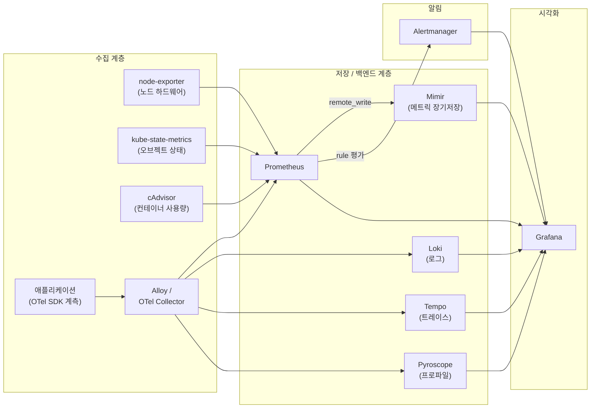
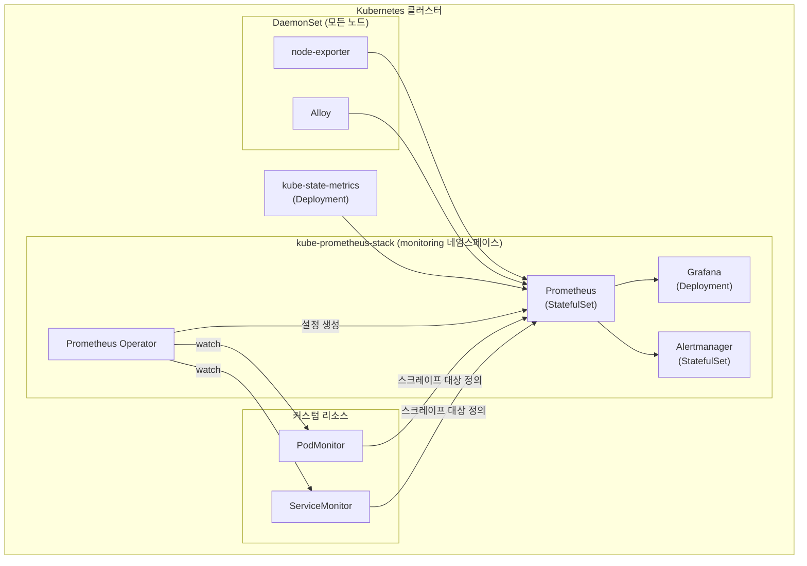
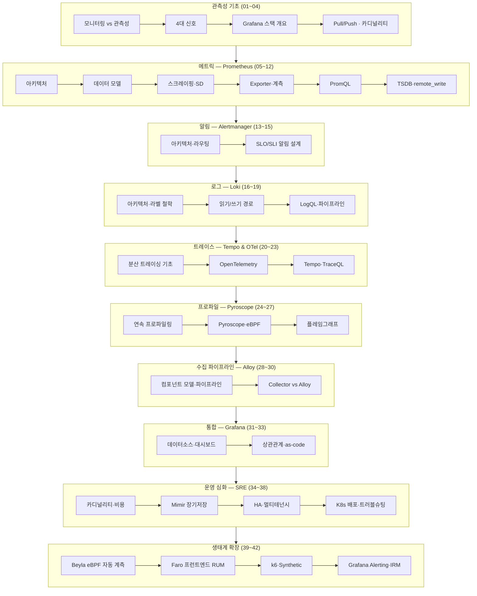

# 관측성 (Observability) — Grafana 스택

<strong>관측성(Observability)</strong>은 시스템 내부 상태를 외부에서 관측 가능한 신호로부터 추론할 수 있는 능력이다. 단순히 "떠 있는지"를 확인하는 모니터링을 넘어, 예상치 못한 장애의 원인을 사전에 정의된 대시보드 없이도 파고들 수 있는 수준까지 나아간다. 이 스터디는 관측성의 4대 신호 — 메트릭(Metrics), 로그(Logs), 트레이스(Traces), 프로파일(Profiles) — 을 Grafana LGTM+ 스택으로 다룬다: 메트릭은 Prometheus로 수집하고 Mimir로 장기 저장하며, 로그는 Loki, 트레이스는 Tempo, 프로파일은 Pyroscope가 맡는다. 수집 계층은 Alloy(구 Grafana Agent)와 OpenTelemetry로 통일한다.

각 장은 [Prometheus](https://prometheus.io/docs/introduction/overview/), [Grafana](https://grafana.com/docs/grafana/latest/), [Loki](https://grafana.com/docs/loki/latest/), [Tempo](https://grafana.com/docs/tempo/latest/), [Pyroscope](https://grafana.com/docs/pyroscope/latest/), [OpenTelemetry](https://opentelemetry.io/docs/) 공식 문서를 기준으로 개념을 설명하고, 실전 설정과 쿼리로 확인한다. 대상은 실무 경험이 있는 백엔드/SRE 개발자이며, 개념 나열보다 "왜 그런가 · 트레이드오프 · 운영 함정 · 실전 설정"에 무게를 둔다.

이 스터디에서 배우는 것:

- **관측성 기초** — 모니터링과 관측성의 차이, 4대 신호의 역할과 관계, pull/push 모델과 카디널리티 문제
- **메트릭** — Prometheus 아키텍처, 데이터 모델, 서비스 디스커버리, PromQL, Recording/Alerting Rule, remote_write
- **알림** — Alertmanager 라우팅·그룹핑·억제, SLO/SLI 기반 알림 설계
- **로그** — Loki의 라벨 중심 인덱싱 철학, 읽기/쓰기 경로, LogQL, 로그 파이프라인
- **트레이스** — 분산 트레이싱 원리, OpenTelemetry 계측, Tempo 아키텍처, TraceQL과 span metrics
- **프로파일** — 연속 프로파일링, Pyroscope 아키텍처, eBPF 기반 프로파일링, 플레임그래프
- **수집 파이프라인** — Alloy 컴포넌트 모델과 파이프라인 구성, OpenTelemetry Collector와의 비교
- **통합·상관관계** — Grafana 데이터소스 연결, 신호 간 상관관계, 대시보드 as-code
- **운영 심화(SRE)** — 카디널리티 관리와 비용, Mimir 장기 저장, HA/멀티테넌시, Kubernetes 배포, 프로덕션 트러블슈팅
- **생태계 확장** — Beyla eBPF 자동 계측, Faro 프런트엔드 관측성(RUM), k6·Synthetic Monitoring, Grafana Alerting·IRM

## 전체 아키텍처

### 신호 수집 → 저장 → 시각화 파이프라인

애플리케이션과 인프라에서 발생한 4대 신호가 각각의 전용 백엔드로 흘러가고, Grafana가 이를 하나의 화면에서 상관관계로 엮는다. 메트릭은 Prometheus가 1차로 스크레이핑한 뒤 `remote_write`로 Mimir에 장기 저장하는 2단 구조를 취한다.

### Kubernetes 배포 토폴로지

클러스터 안에서는 Prometheus Operator가 ServiceMonitor/PodMonitor 같은 커스텀 리소스를 감시해 Prometheus 설정을 자동 생성하는 구조(kube-prometheus-stack)가 사실상 표준이다. 수집 에이전트는 모든 노드에 DaemonSet으로 배치된다.

### 컴포넌트 역할

| 컴포넌트 | 계층/위치 | 역할 |
|---|---|---|
| node-exporter | 수집 / 각 노드 DaemonSet | 노드 하드웨어·OS 메트릭(CPU, 메모리, 디스크, 네트워크) 노출 |
| kube-state-metrics | 수집 / 클러스터 Deployment | 쿠버네티스 오브젝트(Pod, Deployment, Node 등) 상태를 메트릭으로 변환 |
| cAdvisor | 수집 / kubelet 내장 | 컨테이너 단위 리소스 사용량(CPU, 메모리, I/O) 수집 |
| Prometheus | 저장·질의 / 클러스터 또는 VM | 메트릭 스크레이핑, TSDB 저장, PromQL 질의, 룰 평가 |
| Prometheus Operator | 제어 / 클러스터 컨트롤러 | ServiceMonitor/PodMonitor CRD를 감시해 Prometheus 설정을 자동 생성 |
| Alloy | 수집 에이전트 / 노드 DaemonSet 또는 사이드카 | 메트릭·로그·트레이스·프로파일을 수집해 여러 백엔드로 라우팅 |
| Mimir | 저장 / 별도 스토리지 클러스터 | Prometheus remote_write 수신, 메트릭 장기·수평 확장 저장 |
| Loki | 저장·질의 / 별도 클러스터 | 로그 저장(라벨 인덱스만), LogQL 질의 |
| Tempo | 저장·질의 / 별도 클러스터 | 분산 트레이스 저장, TraceQL 질의 |
| Pyroscope | 저장·질의 / 별도 클러스터 | 연속 프로파일 데이터 저장·조회 |
| Alertmanager | 알림 / 클러스터 | Prometheus 룰 평가 결과를 라우팅·그룹핑·억제 후 알림 채널로 전달 |
| Grafana | 시각화 / 클러스터 또는 SaaS | 4대 신호 백엔드를 데이터소스로 연결해 대시보드·상관관계 제공 |
| OpenTelemetry Collector | 수집 에이전트 / 사이드카 또는 게이트웨이 | OTel 프로토콜 기반 텔레메트리 수집·가공·내보내기 (Alloy의 대안/전신 개념) |

## 학습 로드맵

## 전체 목차

### 관측성 기초 (01~04)

| 챕터 | 제목 | 한줄 설명 |
|------|------|-----------|
| 01 | [모니터링에서 관측성으로](/study/observability/01-monitoring-to-observability) | 전통적 모니터링의 한계와 관측성 개념의 등장 |
| 02 | [관측성의 4대 신호](/study/observability/02-four-signals) | 메트릭·로그·트레이스·프로파일의 역할과 관계 |
| 03 | [Grafana 관측성 스택 개요](/study/observability/03-stack-overview) | LGTM+ 스택 구성과 각 컴포넌트의 위치 |
| 04 | [Pull/Push와 카디널리티](/study/observability/04-pull-push-cardinality) | 수집 모델 트레이드오프와 카디널리티 폭발 문제 |

### 메트릭 — Prometheus (05~12)

| 챕터 | 제목 | 한줄 설명 |
|------|------|-----------|
| 05 | [Prometheus 아키텍처](/study/observability/05-prometheus-architecture) | 서버·클라이언트 라이브러리·Exporter 구성 |
| 06 | [데이터 모델과 시계열](/study/observability/06-data-model) | 메트릭 타입, 라벨, 시계열 식별 방식 |
| 07 | [스크레이핑과 서비스 디스커버리](/study/observability/07-scraping-service-discovery) | 스크레이프 설정, SD 메커니즘, relabeling |
| 08 | [Exporter와 애플리케이션 계측](/study/observability/08-exporters-instrumentation) | 공식/커뮤니티 Exporter, 클라이언트 라이브러리 계측 패턴 |
| 09 | [PromQL 기초](/study/observability/09-promql-basics) | 셀렉터, 함수, 집계 연산자 |
| 10 | [PromQL 심화](/study/observability/10-promql-advanced) | 서브쿼리, join 패턴, 히스토그램 쿼리 |
| 11 | [Recording·Alerting Rule](/study/observability/11-recording-alerting-rules) | 룰 설계, 평가 주기, 성능 최적화 |
| 12 | [TSDB와 remote_write](/study/observability/12-tsdb-remote-write) | 로컬 TSDB 내부 구조, remote_write 프로토콜 |

### 알림 — Alertmanager (13~15)

| 챕터 | 제목 | 한줄 설명 |
|------|------|-----------|
| 13 | [Alertmanager 아키텍처](/study/observability/13-alertmanager-architecture) | 클러스터링, gossip 프로토콜, 알림 파이프라인 |
| 14 | [라우팅·그룹핑·억제](/study/observability/14-routing-grouping-silence) | route 트리, grouping, inhibition, silence |
| 15 | [SLO/SLI와 알림 설계](/study/observability/15-slo-sli-alerting) | 에러 버짓 기반 알림, multi-window burn rate |

### 로그 — Loki (16~19)

| 챕터 | 제목 | 한줄 설명 |
|------|------|-----------|
| 16 | [Loki 아키텍처와 라벨 철학](/study/observability/16-loki-architecture) | 라벨 인덱스만 저장하는 설계 배경 |
| 17 | [읽기/쓰기 경로와 구성요소](/study/observability/17-loki-read-write-path) | distributor, ingester, querier, compactor |
| 18 | [LogQL](/study/observability/18-logql) | 로그 스트림 셀렉터, 파서, 메트릭 쿼리 |
| 19 | [로그 파이프라인과 스토리지](/study/observability/19-log-pipeline-storage) | 수집 파이프라인 설계, 오브젝트 스토리지 백엔드 |

### 트레이스 — Tempo & OpenTelemetry (20~23)

| 챕터 | 제목 | 한줄 설명 |
|------|------|-----------|
| 20 | [분산 트레이싱 기초](/study/observability/20-distributed-tracing-basics) | span, trace context propagation, 샘플링 |
| 21 | [OpenTelemetry](/study/observability/21-opentelemetry) | SDK, Collector, 계측 표준화 |
| 22 | [Tempo 아키텍처](/study/observability/22-tempo-architecture) | 트레이스 저장 구조, 오브젝트 스토리지 연동 |
| 23 | [TraceQL과 span metrics](/study/observability/23-traceql-spanmetrics) | 트레이스 쿼리 언어, span metrics로 메트릭 파생 |

### 프로파일 — Pyroscope (24~27)

| 챕터 | 제목 | 한줄 설명 |
|------|------|-----------|
| 24 | [연속 프로파일링 기초](/study/observability/24-continuous-profiling-basics) | 프로파일링 신호가 필요한 이유와 오버헤드 관리 |
| 25 | [Pyroscope 아키텍처](/study/observability/25-pyroscope-architecture) | 수집·저장·질의 구성요소 |
| 26 | [프로파일 타입과 eBPF](/study/observability/26-profile-types-ebpf) | CPU/메모리 프로파일, eBPF 기반 무계측 프로파일링 |
| 27 | [플레임그래프와 트레이스 연계](/study/observability/27-flamegraph-trace-integration) | 플레임그래프 해석, span-to-profile 연계 |

### 수집 파이프라인 — Alloy (28~30)

| 챕터 | 제목 | 한줄 설명 |
|------|------|-----------|
| 28 | [Alloy 개요와 컴포넌트 모델](/study/observability/28-alloy-overview) | Grafana Agent 후속, River→Alloy 구문, 컴포넌트 그래프 |
| 29 | [Alloy 파이프라인 구성](/study/observability/29-alloy-pipelines) | 메트릭·로그·트레이스·프로파일 파이프라인 작성 |
| 30 | [Collector vs Alloy](/study/observability/30-collector-vs-alloy) | OpenTelemetry Collector와의 기능·운영 비교 |

### 통합·상관관계 — Grafana (31~33)

| 챕터 | 제목 | 한줄 설명 |
|------|------|-----------|
| 31 | [데이터소스와 대시보드](/study/observability/31-grafana-datasources-dashboards) | 데이터소스 연결, 패널·변수 설계 |
| 32 | [시그널 상관관계](/study/observability/32-signal-correlation) | exemplar, derived field로 메트릭·로그·트레이스 연결 |
| 33 | [대시보드 as-code](/study/observability/33-dashboard-as-code) | jsonnet/grafonnet, provisioning, GitOps 배포 |

### 운영 심화 (SRE) (34~38)

| 챕터 | 제목 | 한줄 설명 |
|------|------|-----------|
| 34 | [카디널리티 관리와 비용](/study/observability/34-cardinality-cost) | 카디널리티 폭발 탐지·차단, 비용 최적화 |
| 35 | [장기 저장 — Mimir](/study/observability/35-mimir-longterm-storage) | 수평 확장 아키텍처, 블록 스토리지 구조 |
| 36 | [HA·멀티테넌시·페더레이션](/study/observability/36-ha-multitenancy-federation) | 고가용성 구성, 테넌트 격리, 페더레이션 |
| 37 | [Kubernetes 배포](/study/observability/37-kubernetes-deployment) | kube-prometheus-stack, Operator, ServiceMonitor |
| 38 | [프로덕션 운영과 트러블슈팅](/study/observability/38-production-troubleshooting) | 장애 대응, 성능 튜닝, 운영 체크리스트 |

### 생태계 확장 — LGTM 너머 (39~42)

| 챕터 | 제목 | 한줄 설명 |
|------|------|-----------|
| 39 | [Beyla — eBPF 자동 계측](/study/observability/39-beyla-autoinstrumentation) | 코드 수정 없이 트레이스·RED 메트릭을 얻는 제로코드 계측 |
| 40 | [Faro — 프런트엔드 관측성 (RUM)](/study/observability/40-faro-frontend-observability) | 브라우저에서 에러·Web Vitals·트레이스를 수집하는 Real User Monitoring |
| 41 | [k6와 Synthetic Monitoring](/study/observability/41-k6-synthetic-monitoring) | 합성 트래픽으로 사용자보다 먼저 문제를 발견하는 능동적 관측 |
| 42 | [Grafana Alerting과 IRM](/study/observability/42-grafana-alerting-irm) | 통합 알림 시스템과 온콜·에스컬레이션·인시던트 대응 체계 |

### 부록

| | 제목 | 설명 |
|--|------|------|
| | [용어집](/study/observability/appendix-glossary) | 관측성 핵심 용어 정리 |
| | [PromQL/LogQL/TraceQL 치트시트](/study/observability/appendix-cheatsheet) | 자주 쓰는 쿼리 문법 모음 |
| | [참고 자료](/study/observability/appendix-references) | 공식 문서·표준·심화 학습 링크 |

## 대상

실무 백엔드/SRE 개발자를 대상으로 한다. 관측성의 기본 개념은 짚고 넘어가지만, 초보자 대상 설명은 최소화하고 "왜 그런가 · 트레이드오프 · 운영 함정 · 실전 설정"에 집중한다. 프로덕션 환경에서 Prometheus/Grafana 스택을 이미 다뤄본 개발자가 카디널리티 관리, 장기 저장, HA·멀티테넌시 같은 고급 운영 주제까지 확장하려 할 때 참조 자료가 된다.
