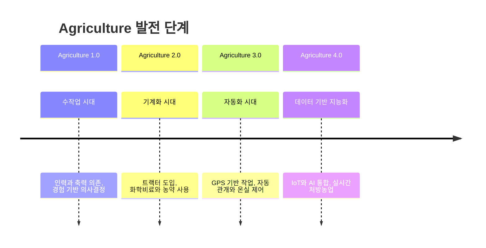
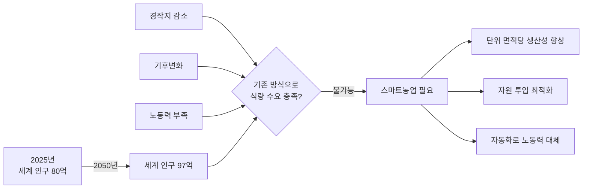
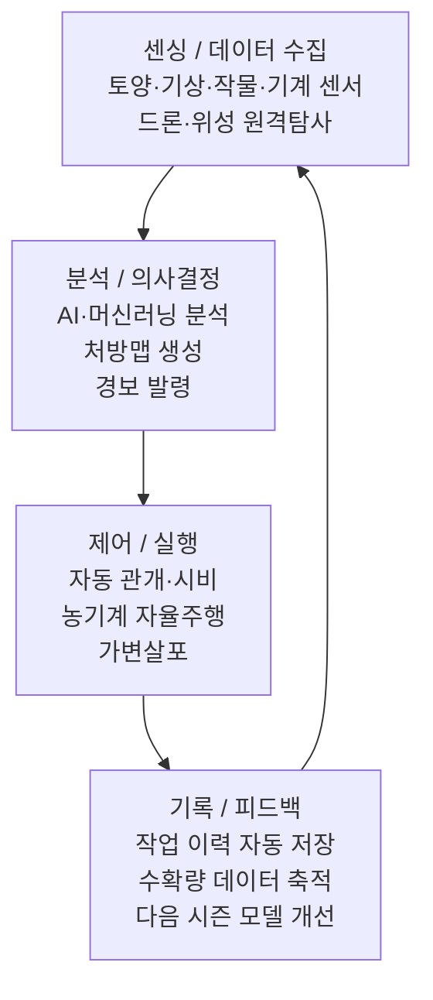

:::info 학습 목표

- 스마트농업의 정의와 Agriculture 1.0~4.0 발전 단계를 설명할 수 있다.
- 스마트농업이 필요한 사회·환경적 배경을 서술할 수 있다.
- 전통농업과 스마트농업의 차이를 핵심 항목별로 비교할 수 있다.
- 스마트농업의 구성 요소와 데이터 사이클을 도식으로 이해한다.

:::

## 스마트농업의 정의

스마트농업(Smart Agriculture)이란 **데이터와 기술을 활용해 농업의 생산성·효율성·지속가능성을 높이는 것**이다. 단순히 첨단 장비를 도입하는 것이 아니라, 데이터 수집 → 분석 → 의사결정 → 실행의 전 과정을 디지털화하고 자동화하는 패러다임 전환을 의미한다.

농업은 역사적으로 네 단계의 발전을 거쳐 왔다.

| 단계 | 시대 | 핵심 기술 | 특징 |
|------|------|-----------|------|
| Agriculture 1.0 | ~1900년대 | 인력, 축력 | 경험 의존, 낮은 생산성 |
| Agriculture 2.0 | 1900~1960년대 | 트랙터, 화학비료 | 기계화, 대량 생산 |
| Agriculture 3.0 | 1960~2000년대 | GPS, 자동화 기계 | 부분적 정밀화 |
| Agriculture 4.0 | 2000년대~ | IoT, AI, 빅데이터 | 데이터 기반 지능 농업 |

## 왜 스마트농업이 필요한가

현재 인류가 직면한 복합적인 위기가 스마트농업의 필요성을 가속하고 있다.

**세계 인구 증가**: UN에 따르면 2050년 세계 인구는 약 97억 명에 달할 것으로 전망된다. 현재 대비 약 20억 명이 더 증가하므로, 그에 상응하는 식량 생산량 증가가 필요하다.

**경작지 감소**: 도시화, 사막화, 토양 열화로 인해 가용 경작지는 오히려 줄어들고 있다. 현재의 농업 생산성을 유지한 채 면적만 늘리는 방식은 한계에 도달했다.

**기후변화**: 기온 상승, 강수 패턴 변화, 극단적 기상 현상의 빈도가 높아지면서 전통적인 농업 달력이 무력화되고 있다. 기후 변동에 적응하는 데이터 기반 의사결정이 필수가 됐다.

**노동력 부족**: 농촌 고령화와 이농 현상으로 농업 노동력이 급감하고 있다. 한국 농업인의 평균 연령은 67세를 넘어섰으며, 이를 기술로 보완하지 않으면 생산 기반 자체가 붕괴될 수 있다.

## 전통농업 vs 스마트농업

두 방식의 차이는 단순히 기술 도입 여부가 아니라, 의사결정 방식과 데이터 활용 수준에서 근본적으로 갈린다.

| 항목 | 전통농업 | 스마트농업 |
|------|----------|------------|
| 의사결정 근거 | 농업인의 경험과 직관 | 센서·데이터 기반 분석 |
| 투입 방식 | 균일 살포(필지 전체 동일) | 가변 투입(구역별 처방량 상이) |
| 모니터링 | 육안 관찰, 현장 직접 확인 | 센서·드론·위성 원격 모니터링 |
| 기록 관리 | 수기 장부, 개인 기억 | 자동 디지털 기록, 클라우드 저장 |
| 작업 시점 결정 | 달력·경험 기반 | 기상 예보·작물 생육 데이터 기반 |
| 이상 감지 | 육안으로 발견 시(지연) | 센서 알림으로 조기 감지 |

## 스마트농업의 구성 요소

스마트농업은 단일 기술이 아니라 여러 구성 요소가 순환하는 시스템이다. 핵심은 데이터가 끊임없이 흐르고 피드백되는 폐루프(closed loop) 구조에 있다.

각 구성 요소의 역할은 다음과 같다.

- **센싱/데이터 수집**: 토양 수분·온도, 기상 정보, 작물 생육 상태, 기계 작동 데이터 등을 IoT 센서와 원격탐사 기술로 수집한다.
- **분석/의사결정**: 수집된 데이터를 AI 모델이 분석해 최적 의사결정을 내린다. 예를 들어 어느 구역에 얼마나 물을 줄지, 병해충이 발생했는지 판단한다.
- **제어/실행**: 분석 결과를 바탕으로 관개 밸브를 열거나, 농기계의 비료 살포량을 조절하거나, 드론이 특정 구역에 농약을 살포하는 등 실제 물리적 행동이 이뤄진다.
- **기록/피드백**: 모든 작업 이력이 자동으로 저장되어 다음 시즌 분석 모델의 학습 데이터가 된다. 시간이 지날수록 시스템의 정확도가 높아진다.

::: tip 핵심 정리

- 스마트농업은 Agriculture 4.0 단계로, 데이터·IoT·AI를 통해 농업의 지능화를 실현한다.
- 인구 증가, 경작지 감소, 기후변화, 노동력 부족이라는 4대 과제가 스마트농업의 필요성을 만든다.
- 전통농업과의 핵심 차이는 의사결정 근거(경험 vs 데이터)와 투입 방식(균일 vs 가변)에 있다.
- 스마트농업은 수집 → 분석 → 실행 → 피드백의 폐루프 사이클로 작동한다.

:::

## 다음 챕터

- 다음 : [스마트농업 기술 지도](/study/smart-agriculture/02-technology-map)
