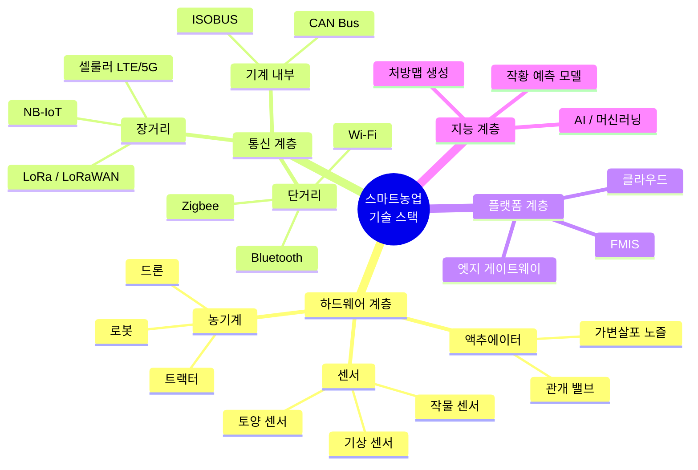
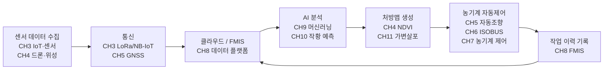

# 스마트농업 기술 지도

:::info 학습 목표

- 스마트농업 기술 스택을 4개 계층(하드웨어·통신·플랫폼·지능)으로 설명할 수 있다.
- 노지농업과 시설농업의 기술적 차이를 비교할 수 있다.
- 센서에서 농기계 자동제어까지 이어지는 데이터 파이프라인을 도식으로 그릴 수 있다.
- 주요국의 스마트농업 현황을 서술할 수 있다.

:::

---

## 1. 기술 스택 조감도

스마트농업을 구성하는 기술은 4개 계층으로 정리할 수 있다. 아래 계층일수록 물리 세계와 맞닿아 있고, 위로 올라갈수록 추상화 수준이 높아진다.

각 계층의 역할을 정리하면 다음과 같다.

| 계층 | 구성 요소 | 역할 |
|------|-----------|------|
| 하드웨어 계층 | 센서, 액추에이터, 농기계 | 물리 세계의 데이터 수집과 실행 |
| 통신 계층 | CAN, ISOBUS, LoRa, 셀룰러 | 데이터 전달 경로 제공 |
| 플랫폼 계층 | FMIS, 클라우드, 엣지 | 데이터 저장·관리·통합 |
| 지능 계층 | AI, 처방맵, 예측 모델 | 데이터 분석과 의사결정 |

---

## 2. 노지농업 vs 시설농업

스마트농업은 적용 환경에 따라 노지농업과 시설농업으로 구분된다. 두 분야는 제어 대상, 사용 기술, 규모 면에서 상당한 차이가 있다.

| 항목 | 노지농업 | 시설농업(스마트팜) |
|------|----------|-------------------|
| 재배 환경 | 노천, 자연 기상 조건 | 온실·비닐하우스, 폐쇄 환경 |
| 주요 기계·장치 | 트랙터, 이앙기, 콤바인 | PLC, 환경제어기, 양액기 |
| 통신 표준 | ISOBUS, CAN Bus | 독자 프로토콜, Modbus, RS-485 |
| 제어 대상 | 비료·농약 살포량(가변살포) | 온도, 습도, CO2, 광량, 양액 농도 |
| 규모 | 수십~수백 ha | 수백~수천 m2 |
| 데이터 수집 주기 | 비교적 느림(분~시간 단위) | 빠름(초~분 단위) |
| 주요 불확실성 | 기상 변동, 지형 차이 | 에너지 비용, 병해충 내부 발생 |

노지농업에서는 **광활한 면적을 효율적으로 관리**하는 것이 핵심 과제이고, 시설농업에서는 **폐쇄 환경의 변수를 정밀하게 제어**하는 것이 핵심이다.

---

## 3. 기술 간 연결 관계

스마트농업의 핵심 파이프라인은 센서 데이터가 생성되는 시점부터 농기계가 실제로 작업을 수행하는 시점까지 이어진다. 이 스터디의 14개 챕터는 이 파이프라인을 따라 구성된다.

각 챕터가 파이프라인의 어느 위치에 해당하는지 파악하면 전체 구조를 이해하는 데 도움이 된다.

---

## 4. 글로벌 트렌드

주요국은 각자의 농업 환경과 정책 목표에 따라 스마트농업을 추진하는 방향이 다르다.

| 국가/지역 | 주요 전략 | 특징적 기술 | 배경 |
|-----------|-----------|-------------|------|
| 미국 | 대규모 정밀농업 | 자율주행 농기계, 가변살포 | 평균 농장 규모 180ha 이상, 효율 극대화 |
| EU | 환경 규제 기반 스마트농업 | 질소 관리, 탄소 발자국 추적 | Farm to Fork 전략, 2030년 농약 50% 감축 목표 |
| 한국 | 스마트팜 혁신밸리 | 시설 원예 스마트팜, 수직농장 | 고령화·소농 구조, 국가 주도 클러스터 조성 |
| 일본 | 초고령화 대응 농업 로봇 | 수확 로봇, 이앙 자율주행 | 농업인 평균 연령 68세, 노동력 대체 긴급 |
| 중국 | 대규모 디지털 농업 | 드론 방제, 위성 모니터링 | 식량 안보 전략, 광대한 농지 관리 |

한국의 스마트팜 혁신밸리는 스마트팜 창업 보육, 기술 실증, 청년 농업인 육성을 한 곳에서 수행하는 집약적 모델이다. 2022년 기준 전남 고흥, 경북 상주, 전북 김제, 경남 밀양 4개 거점이 조성됐다.

::: tip 핵심 정리

- 스마트농업 기술은 하드웨어 → 통신 → 플랫폼 → 지능의 4개 계층으로 구성된다.
- 노지농업은 광대한 면적의 가변 관리가 핵심이고, 시설농업은 폐쇄 환경의 정밀 제어가 핵심이다.
- 데이터 파이프라인은 센서 수집 → 통신 → 클라우드 → AI 분석 → 처방맵 → 농기계 제어의 순서로 흐른다.
- 주요국은 각자의 농업 구조(규모, 고령화, 환경 규제)에 맞춰 다른 방향으로 스마트농업을 추진한다.

:::

## 다음 챕터

- 다음 : [농업 IoT와 센서](/study/smart-agriculture/03-iot-sensors)
