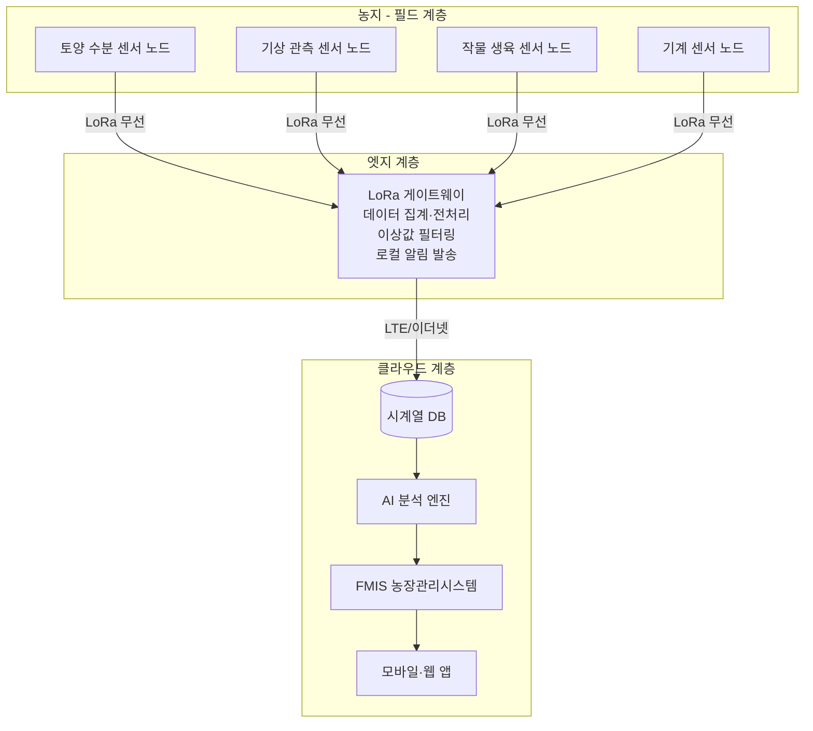
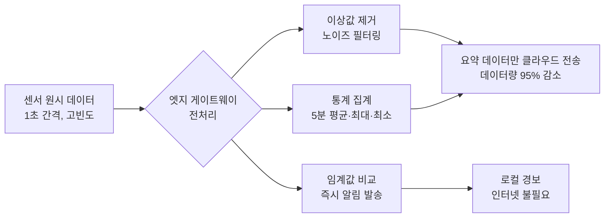

:::info 학습 목표

- 농업에서 사용되는 센서를 토양·기상·작물·기계 4개 범주로 분류하고 설명할 수 있다.
- LoRa, NB-IoT 등 주요 IoT 통신 기술의 특성과 농업 적용 이유를 비교할 수 있다.
- 센서 노드 → 게이트웨이 → 클라우드 3계층 아키텍처를 도식으로 설명할 수 있다.
- 엣지 컴퓨팅의 필요성과 역할을 이해한다.

:::

## 농업 센서의 종류

농업 현장에서는 수많은 물리·화학적 변수를 측정해야 한다. 센서는 측정 대상에 따라 토양, 기상, 작물, 기계의 4개 범주로 나뉜다.

### 토양 센서

| 센서 종류 | 측정 항목 | 활용 목적 |
|-----------|-----------|-----------|
| 수분 센서(TDR/FDR) | 체적 수분 함량(%) | 관개 시점·양 결정 |
| EC 센서 | 전기전도도(mS/cm) | 토양 염류 농도, 비료 잔류량 파악 |
| pH 센서 | 토양 산도(pH) | 석회 시용량 결정 |
| 온도 센서 | 지온(°C) | 파종 시기, 뿌리 생육 모니터링 |
| 질소 센서 | 질산태 질소(mg/kg) | 추비 의사결정 |

### 기상 센서

| 센서 종류 | 측정 항목 | 활용 목적 |
|-----------|-----------|-----------|
| 온도·습도 센서 | 기온(°C), 상대습도(%) | 병해충 발생 예측, 관개 조정 |
| 강수량 센서 | 강수량(mm) | 관개 스케줄 조정 |
| 풍속·풍향 센서 | 풍속(m/s), 풍향 | 드론 비행 가부, 농약 살포 시기 |
| 일사량 센서 | 광합성 유효 방사(PAR, W/m2) | 증산량 추정, 관개량 계산 |
| 이슬점 센서 | 이슬점 온도(°C) | 결로·서리 예측 |

### 작물 센서

| 센서 종류 | 측정 항목 | 활용 목적 |
|-----------|-----------|-----------|
| NDVI 센서 | 정규화 식생 지수 | 생육 상태·수세 파악 |
| 엽면적 지수(LAI) 센서 | 단위 면적당 잎 면적 | 광합성·수량 예측 |
| 엽온 센서(열적외선) | 잎 표면 온도(°C) | 수분 스트레스 감지 |
| 과실 성숙도 센서 | 당도(Brix), 색상 | 수확 적기 판단 |

### 기계 센서

| 센서 종류 | 측정 항목 | 활용 목적 |
|-----------|-----------|-----------|
| 유량 센서 | 농약·비료 살포량(L/min) | 가변살포 정확도 검증 |
| 압력 센서 | 노즐 압력(bar) | 살포 품질 관리 |
| RPM 센서 | 엔진·PTO 회전수(rpm) | 작업 최적화, 연료 효율 |
| 수확량 센서 | 곡물 유량(t/h) | 수확량 맵 생성 |

## IoT 통신 기술

센서가 수집한 데이터는 통신 기술을 통해 게이트웨이 또는 클라우드로 전송된다. 농업 환경은 전파 장애물이 많고 전력 공급이 어려우며 넓은 면적을 커버해야 하므로, 통신 기술 선택이 매우 중요하다.

| 기술 | 전송 거리 | 전력 소비 | 데이터 속도 | 비용 | 농업 적합성 |
|------|-----------|-----------|-------------|------|-------------|
| LoRa/LoRaWAN | 2~15 km | 매우 낮음 | 매우 낮음(~50 kbps) | 낮음 | 매우 높음 - 저전력 장거리 |
| NB-IoT | 1~10 km | 낮음 | 낮음(~250 kbps) | 중간(통신사 요금) | 높음 - 이동통신망 활용 |
| Sigfox | 3~50 km | 매우 낮음 | 매우 낮음(100 bps) | 낮음 | 중간 - 초소량 데이터만 |
| Wi-Fi | 50~100 m | 높음 | 높음(수백 Mbps) | 낮음 | 시설농업 내부 한정 |
| Bluetooth/BLE | 10~100 m | 낮음 | 중간(1~3 Mbps) | 낮음 | 근거리 센서 연결 |
| Zigbee | 10~100 m | 낮음 | 낮음(250 kbps) | 낮음 | 시설농업 메시 네트워크 |
| 셀룰러(LTE/5G) | 수 km | 높음 | 매우 높음 | 높음(요금) | 영상 스트리밍, 드론 |

농업 노지에서는 **LoRaWAN이 사실상 표준**으로 자리잡았다. 배터리로 수년간 운영 가능한 저전력 특성과 수 킬로미터에 달하는 장거리 전송 능력이 농업 환경에 최적화되어 있다.

```mermaid
quadrantChart
    title IoT 통신 기술 비교 (전송 거리 vs 전력 소비)
    x-axis 낮은 전력 소비 --> 높은 전력 소비
    y-axis 짧은 전송 거리 --> 긴 전송 거리
    quadrant-1 장거리·고전력
    quadrant-2 장거리·저전력(농업 최적)
    quadrant-3 단거리·저전력
    quadrant-4 단거리·고전력
    LoRa/LoRaWAN: [0.15, 0.80]
    NB-IoT: [0.30, 0.70]
    Sigfox: [0.10, 0.85]
    셀룰러 LTE: [0.85, 0.75]
    Wi-Fi: [0.70, 0.20]
    Bluetooth: [0.35, 0.15]
    Zigbee: [0.30, 0.20]
```

## 센서 네트워크 아키텍처

농업 IoT 시스템은 3계층 구조로 설계된다. 각 계층은 역할이 명확히 구분된다.



각 계층의 역할은 다음과 같다.

- **필드 계층(센서 노드)**: 실제 물리 데이터를 측정하고 LoRa 등의 무선 통신으로 게이트웨이에 전송한다. 배터리 구동이 일반적이며, 측정 주기는 분~시간 단위로 설정한다.
- **엣지 계층(게이트웨이)**: 수십~수백 개 센서 노드로부터 데이터를 수집하고 1차 전처리를 수행한다. 인터넷이 끊겨도 로컬에서 기본 알림을 발송할 수 있다.
- **클라우드 계층**: 장기 데이터 저장, AI 분석, 사용자 인터페이스 제공을 담당한다. 시계열 데이터베이스(InfluxDB, TimescaleDB 등)를 주로 사용한다.

## 엣지 컴퓨팅

모든 센서 데이터를 클라우드로 직접 전송하면 여러 문제가 발생한다. 엣지 컴퓨팅은 이를 해결하기 위해 클라우드로 보내기 전 현장(엣지)에서 데이터를 처리하는 접근법이다.

**클라우드 직접 전송의 문제점**:

- **지연(Latency)**: 토양 과습 경보처럼 즉각적인 반응이 필요한 상황에서 클라우드 왕복 지연은 치명적이다.
- **통신 비용**: 수백 개 센서가 수초 간격으로 데이터를 전송하면 통신 트래픽과 비용이 급증한다.
- **오프라인 취약성**: 농촌 지역은 통신 인프라가 불안정하다. 클라우드 의존도가 높으면 통신 장애 시 시스템 전체가 마비된다.

**엣지 컴퓨팅의 처리 방식**:



엣지 게이트웨이에서 1초 간격 원시 데이터를 5분 평균으로 집계하면 데이터량이 약 300분의 1로 줄어든다. 이상값 필터링과 국소 알림 처리까지 엣지에서 수행하면 클라우드는 핵심 분석과 장기 저장에만 집중할 수 있다.

::: tip 핵심 정리

- 농업 센서는 토양(수분·EC·pH), 기상(온도·습도·일사량), 작물(NDVI·엽온), 기계(유량·압력·RPM) 4개 범주로 구분된다.
- 노지 농업의 IoT 통신은 저전력·장거리 특성의 LoRaWAN이 사실상 표준이다.
- 센서 네트워크는 필드(노드) → 엣지(게이트웨이) → 클라우드의 3계층 구조로 설계된다.
- 엣지 컴퓨팅은 지연 감소, 통신 비용 절감, 오프라인 대응을 위해 현장에서 데이터를 1차 처리한다.

:::

## 다음 챕터

- 다음 : [항공·위성 센싱](/study/smart-agriculture/04-aerial-satellite)
