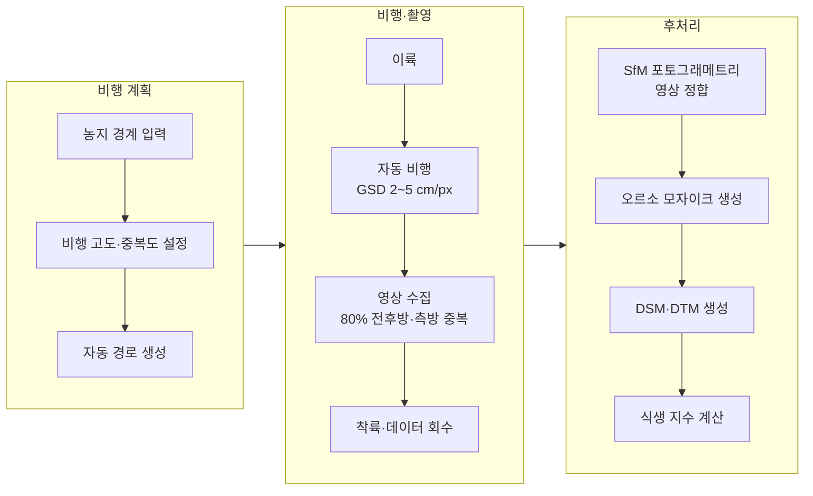
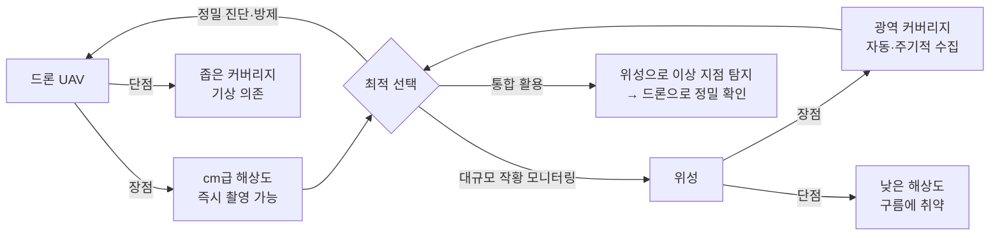
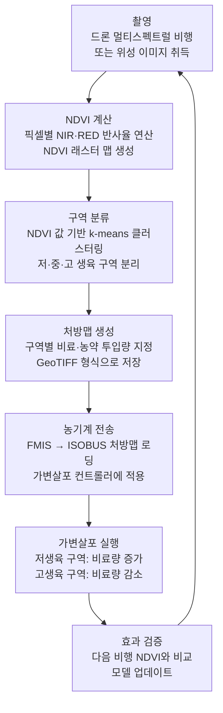

:::info 학습 목표

- 원격탐사의 개념과 광학·열적외선·LiDAR 센서의 차이를 설명할 수 있다.
- 농업용 드론의 종류와 활용 방법을 이해한다.
- 주요 위성 플랫폼(Sentinel-2, Landsat, Planet)의 특성을 비교할 수 있다.
- NDVI의 계산 공식과 값의 의미를 설명하고, 처방맵 생성 파이프라인을 도식으로 그릴 수 있다.

:::

## 원격탐사란

원격탐사(Remote Sensing)란 지표면에 직접 접촉하지 않고 전자기파를 이용해 정보를 수집하는 기술이다. 센서가 물체에서 반사되거나 방출되는 빛(전자기파)을 감지해 이미지 또는 수치 데이터로 변환한다.

농업에서 원격탐사를 활용하면 수백 헥타르의 농지 상태를 수십 분 만에 파악할 수 있다. 육안으로는 절대 발견할 수 없는 스트레스 징후가 특정 파장대에서는 명확하게 드러난다는 것이 핵심 원리다.

| 센서 유형 | 측정 대상 | 파장 영역 | 농업 활용 |
|-----------|-----------|-----------|-----------|
| RGB 카메라 | 가시광선 반사 | 400~700 nm | 작물 피해·잡초 육안 확인 |
| 멀티스펙트럴 | 특정 파장대 반사 | NIR 포함 다중 밴드 | NDVI 등 식생 지수 계산 |
| 하이퍼스펙트럴 | 수백 개 연속 파장 | 400~2500 nm | 병해충·영양 결핍 정밀 진단 |
| 열적외선(TIR) | 지표 방출 열에너지 | 8,000~14,000 nm | 수분 스트레스, 관개 효율 진단 |
| LiDAR | 레이저 거리 측정 | 근적외선 펄스 | 수고 측정, 3D 군락 구조 분석 |

식물은 가시광선(특히 적색광)을 광합성에 사용하므로 흡수하고, 근적외선(NIR)은 세포 구조 특성상 강하게 반사한다. 건강한 식물일수록 NIR 반사가 강하고 적색 반사는 낮다. 이 원리가 NDVI의 기반이다.

## 드론(UAV) 활용

농업용 드론은 크게 촬영·모니터링용과 방제용으로 구분된다.

**촬영·모니터링용 드론**은 멀티스펙트럴 또는 열적외선 카메라를 탑재하고 농지 상공을 자동 비행하며 영상을 수집한다. cm급 해상도의 고해상도 이미지를 얻을 수 있어 개별 식물 수준의 분석도 가능하다.

**방제용 드론**은 약제 탱크와 살포 노즐을 장착하고 GPS 경로를 따라 자동으로 농약·비료를 살포한다. 사람이 들어가기 어려운 지형이나 무논에서 특히 효과적이다.

| 항목 | 드론(UAV) 장점 | 드론(UAV) 단점 |
|------|---------------|---------------|
| 해상도 | cm급 초고해상도 | - |
| 유연성 | 원하는 시점에 즉시 촬영 | - |
| 면적 커버리지 | - | 1회 비행 수십 ha로 제한 |
| 기상 영향 | - | 강풍·우천 시 비행 불가 |
| 운영 비용 | - | 파일럿 필요, 배터리 교체 |
| 법규 | - | 공역 허가, 사전 신고 필요 |

## 위성 원격탐사

위성은 드론과 달리 주기적으로 같은 지역을 자동으로 촬영한다. 광대한 면적을 커버할 수 있어 국가 또는 광역 단위의 작황 모니터링에 적합하다.

| 위성 | 공간 해상도 | 재방문 주기 | 비용 | 밴드 수 |
|------|------------|------------|------|---------|
| Sentinel-2 (ESA) | 10 m (가시·NIR) | 5일 | 무료 | 13개 |
| Landsat 8/9 (NASA) | 30 m | 16일 | 무료 | 11개 |
| Planet Dove | 3~4 m | 매일 | 유료 | 4~8개 |
| WorldView-3 | 0.3 m | 1~3일 | 고가 | 29개 |

**Sentinel-2**는 무료이면서 10 m 해상도와 5일 재방문 주기를 제공해 농업 모니터링에 가장 많이 활용된다. 유럽우주국(ESA)이 운영하며 전 세계 데이터를 공개한다.

## NDVI와 식생 지수

NDVI(Normalized Difference Vegetation Index, 정규화 식생 지수)는 가장 널리 사용되는 식생 지수다.

**NDVI 계산 공식**:

$$NDVI = \frac{NIR - RED}{NIR + RED}$$

- **NIR**: 근적외선 반사율
- **RED**: 적색광 반사율

정규화 처리로 인해 NDVI 값은 항상 -1 ~ +1 범위에 있다.

| NDVI 범위 | 의미 | 대표 지표 |
|-----------|------|-----------|
| -1 ~ 0 | 수면, 나지, 토양 | 물(약 -0.5), 모래(약 0) |
| 0 ~ 0.2 | 토양 또는 고사 식생 | 나지, 건조한 잔류 작물 |
| 0.2 ~ 0.4 | 희박한 식생 | 발아기 작물, 초기 생육 |
| 0.4 ~ 0.6 | 중간 생육 | 정상 생육 중인 작물 |
| 0.6 ~ 0.9 | 건강하고 왕성한 식생 | 최적 생육 상태 작물 |

NDVI 외에도 목적에 따라 다양한 식생 지수가 사용된다.

- **EVI(Enhanced Vegetation Index)**: 고밀도 식생에서 NDVI 포화 문제를 개선
- **NDRE(Normalized Difference Red Edge)**: 질소 결핍에 더 민감, 정밀 시비에 활용
- **NDWI(Normalized Difference Water Index)**: 작물 수분 스트레스 감지

**처방맵 생성 파이프라인**:

처방맵의 핵심 아이디어는 필지 전체에 균일하게 투입하는 대신, 생육 상태가 좋지 않은 구역에는 더 많이, 이미 왕성한 구역에는 적게 투입해 자원을 최적 배분하는 것이다. 이 방식으로 동일한 비용으로 더 균일하고 높은 수확량을 달성할 수 있다.

::: tip 핵심 정리

- 원격탐사는 전자기파로 지표 정보를 비접촉 수집하는 기술이며, 농업에서는 RGB·멀티스펙트럴·열적외선·LiDAR 센서가 사용된다.
- 드론은 cm급 해상도와 유연성이 장점이고, 위성은 광역 커버리지와 자동 반복 수집이 장점이다. 두 가지를 상호 보완적으로 활용한다.
- NDVI = (NIR - RED) / (NIR + RED) 로 계산하며, 0.6~0.9는 건강한 식생, 0.2 미만은 희박한 식생 또는 토양을 의미한다.
- 처방맵 파이프라인은 촬영 → NDVI 계산 → 구역 분류 → 처방맵 생성 → 농기계 가변살포 실행 → 효과 검증의 순서로 진행된다.

:::

## 다음 챕터

- 다음 : [측위와 자동조향](/study/smart-agriculture/05-gnss-autosteer)
