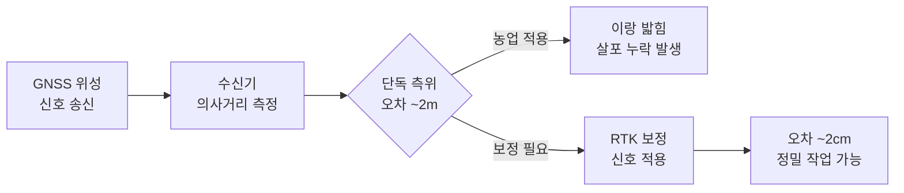
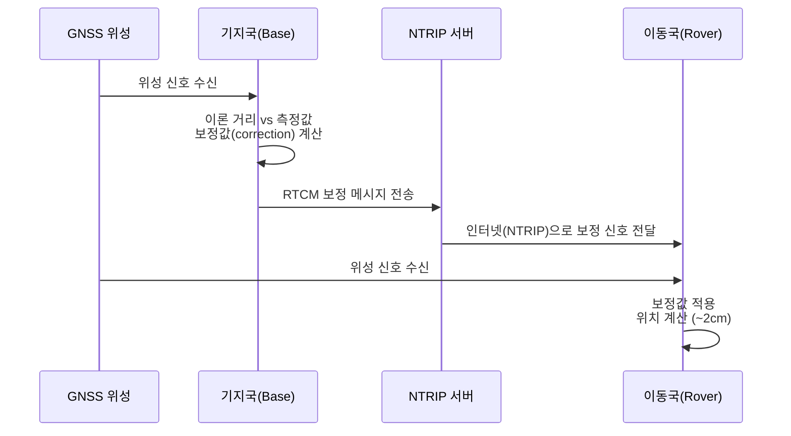
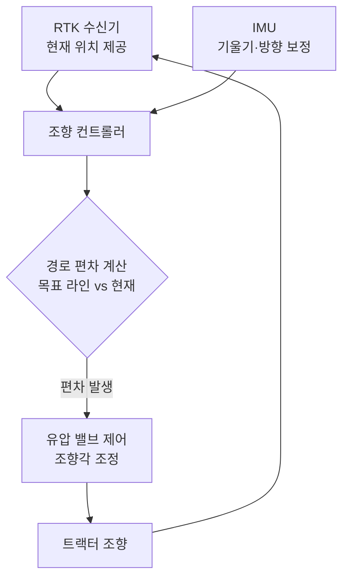

# 측위와 자동조향

::: info 학습 목표

- GPS·GLONASS·Galileo·BeiDou의 차이와 단독 측위의 한계를 설명할 수 있다.
- RTK-GPS의 기지국/이동국 구성과 반송파 위상 보정 원리를 이해한다.
- 자동조향 시스템의 구성 요소와 AB 라인 주행 방식을 설명할 수 있다.
- SBAS·DGPS·RTK·PPP의 정확도와 비용을 비교할 수 있다.

:::

---

## 1. GNSS 위성 측위

GNSS(Global Navigation Satellite System)는 위성 신호를 이용해 지구상 위치를 결정하는 시스템의 총칭이다. 각 국가·지역이 독자적인 시스템을 운영하고 있으며, 농기계에는 여러 위성 시스템을 동시에 수신하는 멀티-GNSS 수신기가 사용된다.

| 시스템 | 운영 주체 | 위성 수(기준) | 주파수 |
|--------|-----------|---------------|--------|
| GPS | 미국 | 31기 | L1, L2, L5 |
| GLONASS | 러시아 | 24기 | L1, L2 |
| Galileo | EU | 28기 | E1, E5a, E5b |
| BeiDou | 중국 | 45기 | B1, B2, B3 |

위성 측위의 원리는 위성에서 수신기까지 신호가 도달하는 데 걸리는 시간(의사거리)을 측정하여 삼변 측량으로 위치를 계산하는 것이다. 최소 4개 위성이 필요하며(3차원 위치 + 시계 오차), 더 많은 위성을 수신할수록 정확도가 높아진다.

단독 측위(Single Point Positioning)의 한계는 다음과 같다.

- 대기 지연(전리층·대류권)이 신호 경로를 왜곡한다.
- 위성 궤도 오차와 위성 시계 오차가 누적된다.
- 결과적으로 단독 측위 정확도는 약 2m 수준에 머문다.

농업에서 트랙터가 2m 오차로 주행하면 작물 이랑을 밟거나, 살포 경계가 중복·누락되는 문제가 발생한다. 특히 행간 30cm 이내의 정밀 파종·제초 작업에서는 단독 측위로는 전혀 대응할 수 없다.

---

## 2. RTK-GPS

RTK(Real-Time Kinematic)는 정확한 위치를 아는 기지국(Base Station)이 이동국(Rover)에 보정 신호를 실시간으로 전송하여 오차를 제거하는 기법이다. 반송파 위상(carrier phase)을 이용해 단순 코드 측위보다 훨씬 높은 정확도를 달성한다.

반송파 위상 보정의 핵심 원리는 다음과 같다.

- 위성 신호의 반송파 파장(GPS L1 기준 약 19cm)은 매우 짧아, 위상을 측정하면 밀리미터 수준의 거리 계산이 가능하다.
- 기지국은 자신의 정확한 위치를 알고 있으므로, 관측되는 위성까지의 이론 거리와 실제 측정값의 차이(보정값)를 계산한다.
- 이동국은 이 보정값을 적용해 자신의 위치를 2cm 이내의 정확도로 결정한다.

NTRIP(Networked Transport of RTCM via Internet Protocol)은 기지국 보정 신호를 인터넷을 통해 이동국에 전달하는 표준 프로토콜이다. 농가에서 직접 기지국을 설치하지 않아도, 이동통신망(LTE)으로 공공 또는 상용 NTRIP 서버에 접속하면 RTK 정확도를 활용할 수 있다.

---

## 3. 자동조향 시스템

자동조향(Auto-Steer) 시스템은 RTK 수신기에서 계산된 위치 정보를 이용해 트랙터의 조향을 자동으로 제어하는 시스템이다. 농업인이 페달과 스로틀만 조작하면 직진·선회 등의 조향이 자동으로 이뤄진다.

구성 요소는 다음과 같다.

- **RTK 수신기**: 2cm 이내의 정확도로 현재 위치를 실시간 제공한다.
- **IMU(관성 측정 장치)**: 트랙터의 기울기·롤·피치를 측정해 경사지에서의 보정에 활용한다.
- **조향 컨트롤러**: 목표 경로와 현재 위치의 편차를 계산하고 조향 명령을 생성한다.
- **유압 밸브(전동 조향 액추에이터)**: 컨트롤러의 명령을 받아 핸들(조향 유압)을 실제로 움직인다.

주행 패턴의 종류는 다음과 같다.

- **AB 라인**: 필지의 시작점(A)과 끝점(B)을 설정하면 두 점을 잇는 직선을 기준으로 평행한 주행 경로가 자동 생성된다. 가장 기본적인 방식이다.
- **곡선 주행 패턴(Curved Path)**: AB 라인 대신 실제 주행 경로를 기록해 곡선 필지에서도 평행 경로를 생성한다.
- **오버랩/스킵 방지**: 작업 폭(작업기 너비)을 사전에 입력하면 다음 패스의 간격을 자동 계산해 중복 살포(오버랩)나 미살포 구간(스킵) 없이 작업한다.

---

## 4. 정밀도 등급

GNSS 보정 방법에 따라 달성 가능한 정확도와 필요 인프라가 다르다.

| 등급 | 정확도 | 기지국 필요 | 비용 | 주요 용도 |
|------|--------|------------|------|-----------|
| 단독 측위 | ~2m | 불필요 | 최저 | 차량 내비게이션 |
| SBAS | ~30cm | 불필요(위성 보정) | 저 | 기본 보조 조향 |
| DGPS | ~10cm | 필요(코드 보정) | 중 | 일반 농기계 작업 |
| RTK | ~2cm | 필요(반송파 보정) | 고 | 정밀 파종·자동조향 |
| PPP | ~5cm | 불필요(위성 정밀 궤도) | 중~고 | 광역 정밀 측위 |

- **SBAS**: 정지위성을 이용해 광역 보정 신호를 제공한다. 기지국 없이 활용 가능하나 정확도가 30cm 수준으로 제한된다.
- **DGPS**: 기지국에서 코드 보정값을 전송한다. 10cm 수준으로 일반 농작업에 활용된다.
- **RTK**: 반송파 위상 보정으로 2cm 수준을 달성한다. 자동조향 및 정밀 파종의 표준이다.
- **PPP(Precise Point Positioning)**: 위성 궤도·시계 오차 정밀 보정 데이터를 위성에서 직접 수신한다. 기지국 없이 전 세계에서 5cm 수준을 달성하나, 수렴 시간(초기화 시간)이 길다는 단점이 있다.

::: tip 핵심 정리

- GNSS 단독 측위는 약 2m 오차로 정밀 농작업에 부족하다. 기압 교란, 대기 지연 등이 주요 원인이다.
- RTK는 기지국 보정 신호를 이용해 2cm 수준의 정확도를 실시간으로 달성한다.
- NTRIP 프로토콜로 인터넷을 통해 RTK 보정 신호를 수신할 수 있어 기지국 직접 설치 부담이 줄었다.
- 자동조향 시스템은 RTK 수신기 + IMU + 조향 컨트롤러 + 유압 밸브로 구성되며, AB 라인 방식이 가장 일반적이다.
- 정확도 요구 수준과 예산에 따라 SBAS → DGPS → RTK → PPP 중 적합한 등급을 선택한다.

:::

## 다음 챕터

- 다음 : [농기계 통신](/study/smart-agriculture/06-machine-communication)
