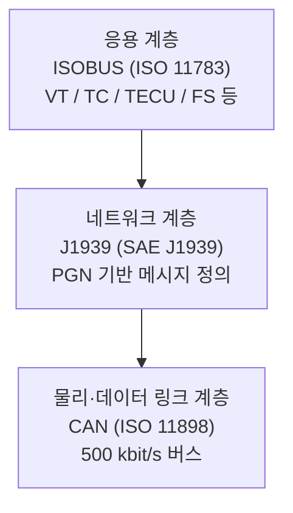
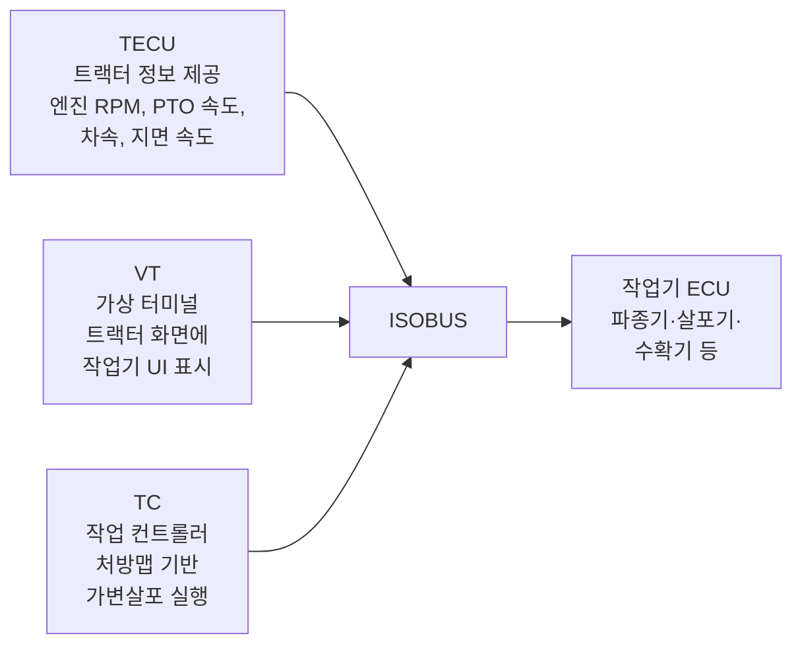
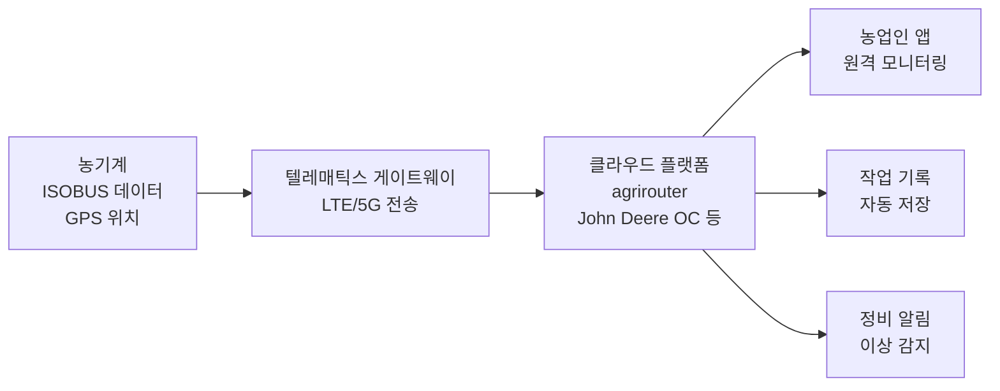

::: info 학습 목표

- 농기계 통신이 필요한 이유와 ISOBUS 도입 이전·이후의 차이를 설명할 수 있다.
- CAN → J1939 → ISOBUS의 계층적 프로토콜 구조를 이해한다.
- ISOBUS의 핵심 구성 요소(VT, TC, TECU)와 역할을 설명할 수 있다.
- 텔레매틱스를 통해 농기계 데이터가 클라우드로 전달되는 흐름을 이해한다.

:::

## 왜 농기계에 통신이 필요한가

현대 농기계는 트랙터 단독으로 작동하지 않는다. 파종기·비료 살포기·방제기·수확기 등 다양한 작업기(implement)를 교체하며 사용한다. 각 작업기에는 살포량·센서 값·오류 상태를 제어하는 <strong>ECU(전자제어장치)</strong>가 내장되어 있다.

ISOBUS가 도입되기 전에는 다음과 같은 문제가 있었다.

- 제조사마다 고유한 커넥터와 통신 방식을 사용했다.
- A사 트랙터에 B사 파종기를 연결하면 화면 표시·자동 제어가 전혀 작동하지 않았다.
- 농업인은 작업기마다 별도의 조작 패널을 조종석에 따로 설치해야 했다.

ISOBUS 도입 이후는 다음과 같이 달라졌다.

- 국제 표준(ISO 11783)에 따라 트랙터와 작업기 간 통신이 표준화됐다.
- 어느 제조사의 트랙터에 어느 제조사의 작업기를 연결해도 트랙터 화면 하나로 제어할 수 있다.
- 작업기의 ECU 정보가 자동으로 트랙터에 전달되어 플러그-앤-플레이(plug-and-play) 방식으로 동작한다.

| 항목 | ISOBUS 이전 | ISOBUS 이후 |
|------|-------------|-------------|
| 커넥터 | 제조사별 상이 | ISO 11783 표준 9핀 |
| 화면 제어 | 작업기별 별도 패널 | 트랙터 VT 하나로 통합 |
| 제조사 호환성 | 불가 | 가능 |
| 가변살포 자동화 | 불가(별도 배선 필요) | TC 표준으로 자동 처리 |

## 프로토콜 스택 개요

농기계 통신은 세 개의 프로토콜이 계층적으로 쌓인 구조로 이뤄진다.

각 계층의 역할은 다음과 같다.

- **CAN(Controller Area Network)**: 물리 전기 신호 규격과 프레임 충돌 제어(CSMA/CD)를 정의한다. 농기계에서는 500 kbit/s 속도를 사용하며, 단일 버스에 여러 노드가 연결된다.
- **J1939**: 트럭·건설기계·농기계 공통의 CAN 기반 네트워크 프로토콜이다. PGN(Parameter Group Number)으로 메시지 종류를 정의하고, 주소 클레임 절차로 노드 주소를 자동 할당한다.
- **ISOBUS(ISO 11783)**: J1939를 농기계 전용으로 확장한 응용 계층 표준이다. VT·TC·TECU 등 농업 작업에 특화된 서비스를 정의한다.

## ISOBUS 핵심 기능

ISOBUS의 세 가지 핵심 구성 요소는 다음과 같다.

**VT(Virtual Terminal, 가상 터미널)**

- 작업기 ECU가 자신의 UI(버튼·수치·경고등)를 오브젝트 풀(Object Pool) 형식으로 전송한다.
- 트랙터의 VT 디스플레이가 이를 수신해 화면에 렌더링한다.
- 농업인은 트랙터 화면 하나로 작업기를 완전히 조작할 수 있다.

**TC(Task Controller, 작업 컨트롤러)**

- 처방맵(Prescription Map)을 ISOXML 형식으로 수신하고, GPS 위치와 대조해 실시간 살포량 명령을 작업기 ECU에 전달한다.
- 작업 이력(실제 살포량, 위치, 시각)을 자동으로 기록한다.

**TECU(Tractor ECU)**

- 엔진 RPM, PTO 회전수, 차량 속도, 지면 속도 등 트랙터의 상태 정보를 버스에 주기적으로 송출한다.
- 작업기 ECU가 이 정보를 받아 속도 연동 살포량 조절 등에 활용한다.

구체적인 시나리오를 예로 들면, 농업인이 ISOBUS 호환 파종기를 트랙터에 연결하면 다음 과정이 자동으로 진행된다.

1. 파종기 ECU가 버스에 참가하여 주소를 획득한다.
2. 파종기 ECU가 VT에 자신의 UI(파종 속도, 오류 상태, 씨앗 잔량 등)를 전송한다.
3. VT가 트랙터 화면에 파종기 UI를 자동으로 표시한다.
4. 농업인이 별도 설정 없이 즉시 파종 작업을 시작할 수 있다.

::: info ISOBUS 심화
농기계 통신의 상세한 내용은 [ISOBUS 스터디](/study/isobus/)에서 22개 챕터로 다룬다.
:::

## 텔레매틱스

텔레매틱스(Telematics)는 농기계의 상태·작업 데이터를 이동통신망(LTE/5G)을 통해 클라우드 플랫폼으로 전송하는 기술이다.

대표적인 플랫폼과 특징은 다음과 같다.

- **agrirouter**: 복수 제조사의 농기계 데이터를 단일 플랫폼에서 중계한다. 제조사 중립적이며, 데이터를 농업 관리 소프트웨어(FMIS)로 라우팅하는 허브 역할을 한다.
- **John Deere Operations Center**: John Deere 농기계의 GPS 위치, 연료 소비량, 작업 이력을 실시간으로 확인한다. 기계 간 협업 작업(편대 주행) 관리에도 활용된다.

텔레매틱스를 통해 달성할 수 있는 주요 기능은 다음과 같다.

- **원격 모니터링**: 농업인이 사무실이나 스마트폰에서 작업 진행 상황을 실시간으로 파악한다.
- **작업 기록 자동 전송**: ISOXML 기반 작업 이력이 클라우드에 자동 저장되어 보조금 신청, 인증, 이력 추적에 활용된다.
- **예방 정비**: 기계 이상 데이터를 분석해 고장 예측 알림을 제공한다.
- **연료·효율 분석**: 구역별 연료 소비량, 작업 속도 등을 분석해 작업 효율을 개선한다.

::: tip 핵심 정리

- ISOBUS(ISO 11783)는 CAN → J1939 → ISOBUS의 3계층 구조로 농기계 통신을 표준화한다.
- VT는 작업기 UI를 트랙터 화면에 통합하고, TC는 처방맵 기반 가변살포를 실행하며, TECU는 트랙터 상태 정보를 공유한다.
- ISOBUS 덕분에 제조사가 달라도 트랙터와 작업기 간 플러그-앤-플레이 연동이 가능하다.
- 텔레매틱스는 농기계 데이터를 클라우드로 전송하여 원격 모니터링·작업 기록·예방 정비를 가능하게 한다.

:::

## 다음 챕터

- 다음 : [정밀농업](/study/smart-agriculture/07-precision-agriculture)
