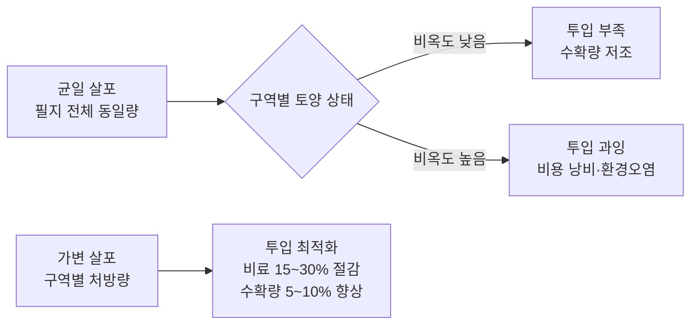
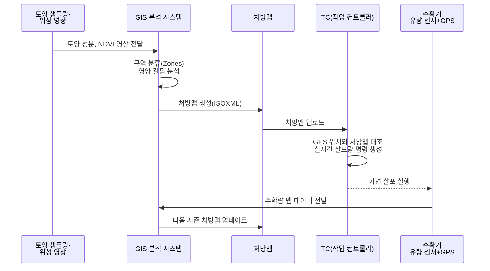
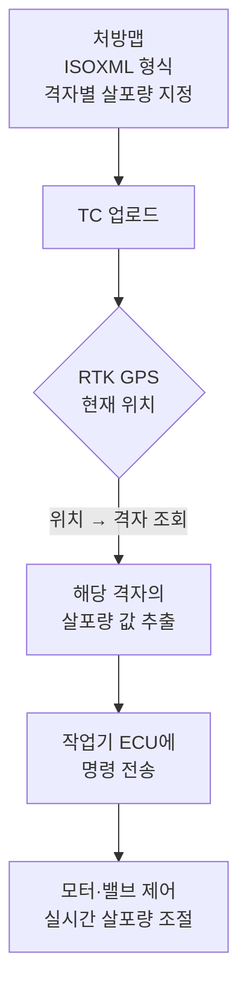

# 정밀농업

::: info 학습 목표

- 정밀농업의 "적시, 적소, 적량" 원칙과 경제적 효과를 설명할 수 있다.
- 데이터 수집 → 분석 → 실행 → 평가의 사이클 전 과정을 이해한다.
- 처방맵의 구조와 TC가 이를 실시간으로 활용하는 방식을 설명할 수 있다.
- 수확량 매핑이 다음 시즌 처방맵과 어떻게 연결되는지 이해한다.

:::

---

## 1. 정밀농업이란

정밀농업(Precision Agriculture)은 <strong>적시(Right Time), 적소(Right Place), 적량(Right Amount)</strong>의 세 원칙에 따라 농업 자원을 투입하는 방식이다. 필지 전체에 동일한 양을 살포하는 균일 살포 방식과 달리, 구역별로 실제 필요한 양만 정확히 투입한다.

균일 살포 방식의 문제점은 다음과 같다.

- 토양 비옥도가 낮은 구역에는 비료가 부족해 수확량이 저조하다.
- 토양 비옥도가 높은 구역에는 비료가 과잉 투입되어 비용이 낭비되고 환경을 오염시킨다.
- 전체 필지를 최대 투입량 기준으로 관리하면 필연적으로 일부 구역에서 과잉이 발생한다.

가변 살포로 전환 시 얻을 수 있는 경제적 효과는 다음과 같다.

| 항목 | 효과 |
|------|------|
| 비료 절감 | 15~30% |
| 농약 절감 | 10~20% |
| 수확량 향상 | 5~10% |
| 환경 부담(질소 유출) | 20~40% 감소 |

---

## 2. 데이터 수집 → 분석 → 실행 사이클

정밀농업은 단발성 기술이 아니라 매 시즌 반복되는 데이터 사이클이다.

각 단계의 구체적인 내용은 다음과 같다.

**1단계 - 데이터 수집**

- 토양 샘플링: 격자(Grid) 또는 구역(Zone) 단위로 토양을 채취해 pH, 질소·인산·칼륨 농도를 분석한다.
- 위성·드론 영상: NDVI(정규화 식생 지수)로 작물의 생육 균일성과 스트레스 구역을 파악한다.
- 수확량 기록: 이전 시즌 수확량 맵이 토양 데이터와 함께 기본 입력 데이터가 된다.

**2단계 - GIS 분석·구역 분류**

- 수집된 데이터를 GIS(지리 정보 시스템) 도구로 레이어별 분석한다.
- k-means 클러스터링 등으로 필지를 비옥도·수분·pH 기준 관리 구역(Management Zone)으로 분류한다.

**3단계 - 처방맵 생성 및 실행**

- 구역별 최적 투입량을 담은 처방맵을 ISOXML 형식으로 생성한다.
- TC가 GPS 위치와 처방맵을 실시간 대조하여 작업기에 살포량 명령을 전달한다.

**4단계 - 수확량 매핑으로 결과 평가**

- 수확기에 장착된 유량 센서와 GPS로 구역별 수확량을 기록한다.
- 수확량 맵이 다음 시즌 처방맵 생성의 핵심 입력 데이터가 된다.

---

## 3. 처방맵(Prescription Map)

처방맵은 필지를 격자(Grid) 또는 관리 구역으로 나누고, 각 구역에 적용할 살포량(비료·농약·씨앗)을 지정한 데이터 파일이다.

처방맵의 핵심 특성은 다음과 같다.

- **형식**: ISOXML(ISO 11783-10 기반). TC가 직접 읽을 수 있는 농업 표준 형식이다.
- **좌표 정보**: 각 격자 셀에 지오레퍼런스(경위도 또는 UTM 좌표)가 포함된다.
- **작업 변수**: 셀마다 비료 투입량, 씨앗 파종 간격, 농약 살포율 등이 지정된다.

TC(작업 컨트롤러)가 처방맵을 실행하는 방식은 다음과 같다.

1. 트랙터의 RTK GPS가 현재 위치를 TC에 제공한다.
2. TC는 처방맵에서 현재 위치에 해당하는 셀의 살포량을 조회한다.
3. 해당 살포량 값을 작업기 ECU에 명령으로 전송한다.
4. 작업기 ECU가 모터·밸브를 제어해 지정된 양을 정확히 살포한다.

---

## 4. 수확량 매핑(Yield Mapping)

수확량 매핑은 수확기 작업 중 유량 센서와 GPS를 결합해 필지의 위치별 수확량을 실시간으로 기록하는 기술이다.

수확량 매핑의 구성 요소는 다음과 같다.

- **질량 유량 센서**: 콤바인의 곡물 엘리베이터에 장착되어 단위 시간당 수확량을 측정한다.
- **수분 센서**: 곡물 수분 함량을 측정해 표준 수분(14%)으로 보정한 수확량을 계산한다.
- **RTK GPS**: 수확 지점의 정확한 위치를 기록한다.
- **데이터 로거**: 유량·수분·위치·시각 데이터를 초 단위로 통합 저장한다.

수확량 매핑의 결과물이 중요한 이유는 다음과 같다.

- 균일해 보이는 필지에도 수확량 편차가 20~40%에 달하는 구역이 숨겨져 있다.
- 수확량 맵과 토양 분석 데이터를 중첩하면 수확량이 낮은 원인을 파악할 수 있다.
- 이 분석 결과가 다음 시즌의 처방맵 생성에 직접 반영되는 피드백 루프가 형성된다.

::: tip 핵심 정리

- 정밀농업의 핵심은 "적시·적소·적량" 원칙으로, 가변 살포를 통해 비료 15~30%를 절감하고 수확량을 5~10% 향상시킬 수 있다.
- 데이터 수집 → GIS 분석·구역 분류 → 처방맵 생성 → TC 기반 가변 살포 → 수확량 매핑의 5단계 사이클이 매 시즌 반복된다.
- 처방맵은 ISOXML 형식으로 저장되며, TC가 RTK GPS 위치와 대조해 실시간으로 살포량을 조절한다.
- 수확량 매핑 데이터는 다음 시즌 처방맵의 핵심 입력값이 되어 시스템이 시즌마다 개선되는 피드백 루프를 형성한다.

:::

## 다음 챕터

- 다음 : [스마트 관개](/study/smart-agriculture/08-smart-irrigation)
