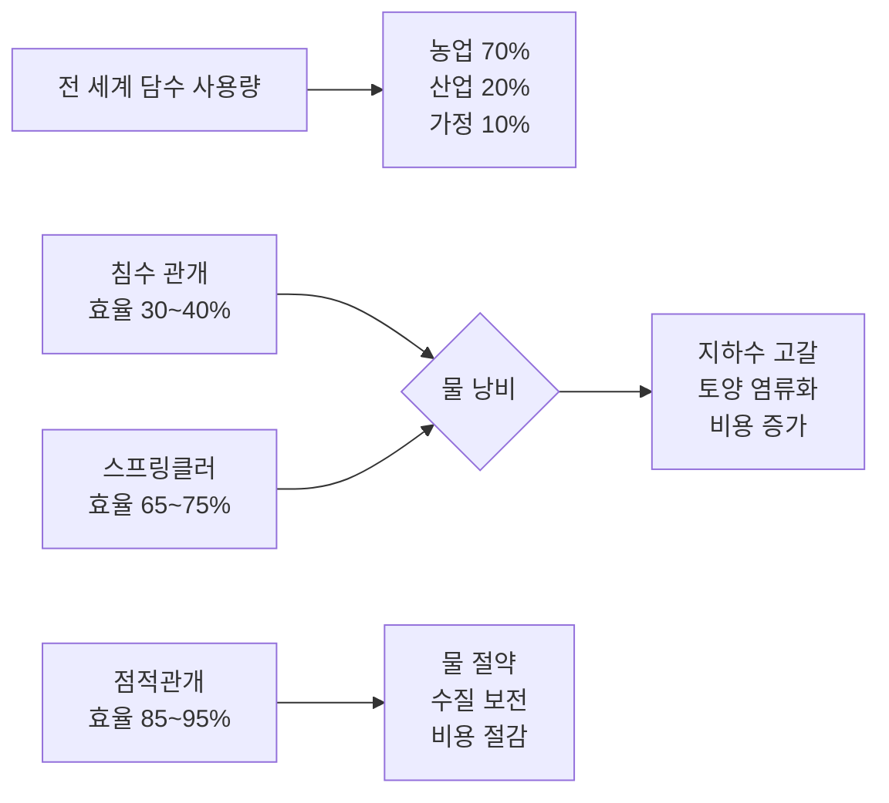
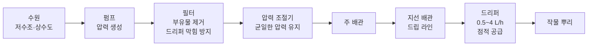
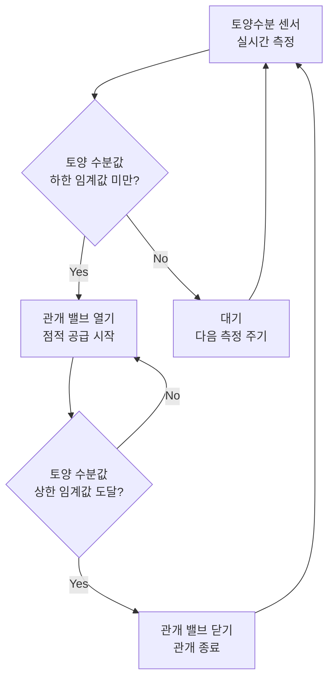
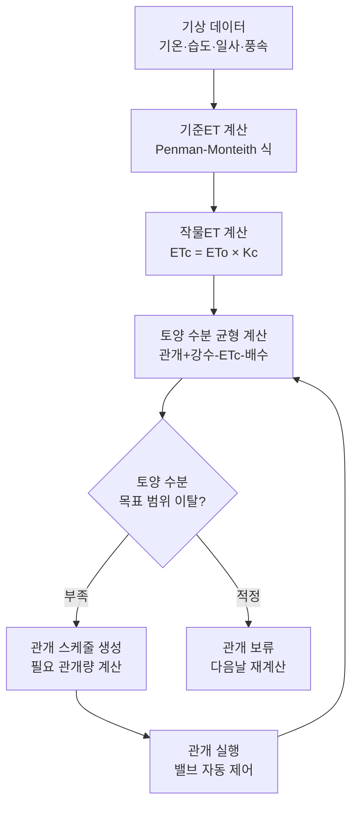

::: info 학습 목표

- 전 세계 담수 사용에서 농업이 차지하는 비중과 기존 관개 방식의 비효율을 설명할 수 있다.
- 점적관개의 원리와 구성 요소를 이해한다.
- 토양수분 센서 기반 자동 관개의 제어 논리를 설명할 수 있다.
- ET 기반 관개 스케줄링의 수분 균형 모델을 이해한다.

:::

## 물과 농업

물은 식량 생산의 핵심 자원이다. 전 세계 담수 사용량의 약 70%가 농업에 소비된다. 인구 증가와 기후변화로 물 수요는 늘고 있지만, 이용 가능한 담수 자원은 점점 줄어들고 있다.

기존 관개 방식의 비효율은 다음과 같다.

- **침수 관개(Flood Irrigation)**: 논처럼 물을 필지 전체에 범람시킨다. 구조가 단순하지만 증발·침투 손실이 커서 실제 작물이 흡수하는 물은 30~40%에 불과하다.
- **스프링클러 관개**: 회전 노즐로 물을 공중에 분사한다. 침수보다 균일하지만 바람에 의한 편류(drift)와 잎 표면 증발 손실이 발생한다.

물 부족 문제가 심각한 지역에서 기존 방식을 유지하면 다음과 같은 결과가 초래된다.

- 지하수 과잉 취수로 대수층(aquifer)이 고갈된다.
- 과잉 관개로 토양 염류화(salinization)가 진행되어 경작지가 황폐화된다.
- 물값 상승으로 농업 경영비가 증가한다.

## 점적관개(Drip Irrigation)

점적관개는 배관을 통해 물을 작물 뿌리 근처에 소량씩 직접 공급하는 방식이다. 잎과 토양 표면을 적시지 않으므로 증발 손실이 최소화된다.

점적관개의 주요 장점은 다음과 같다.

- 물 사용량 30~50% 절감(스프링클러 대비)
- 잎이 젖지 않아 곰팡이병·세균병 발생 감소
- 비료를 물에 녹여 공급하는 수비(페티게이션, fertigation) 병행 가능
- 잡초 구역(이랑 사이)에는 물이 공급되지 않아 잡초 억제 효과

구성 요소는 다음과 같다.

드리퍼(Dripper)는 배관 내 압력에 무관하게 일정한 유량을 공급하는 압력 보상형 드리퍼가 표준으로 사용된다. 작물 종류와 토양에 따라 드리퍼 간격과 유량을 설계한다.

## 센서 기반 자동 관개

센서 기반 자동 관개는 토양 수분 상태를 실시간으로 측정하여 관개 밸브를 자동으로 제어하는 방식이다.

주요 토양수분 센서의 종류는 다음과 같다.

| 센서 종류 | 측정 원리 | 특징 |
|-----------|-----------|------|
| TDR(시간 영역 반사) | 전자기파 전파 속도 측정 | 정확도 높음, 고가 |
| 커패시턴스 센서 | 유전율 측정 | 저가, 설치 용이, 보정 필요 |
| 텐시오미터 | 토양 흡수력(수분 장력) 직접 측정 | 직관적, 주기적 관리 필요 |

제어 논리는 다음과 같이 동작한다.

ET(증발산량) 연동을 추가하면 정밀도가 높아진다.

- **ET(Evapotranspiration, 증발산량)**: 토양 표면 증발량과 작물 증산량의 합이다.
- **기준 ET(ETo)**: 잔디를 기준 작물로 기상 데이터(기온, 습도, 일사량, 풍속)로 계산한다.
- **작물 ET(ETc)**: 실제 작물의 증발산량 = ETo × 작물계수(Kc)

작물계수(Kc)는 작물 종류와 생육 단계에 따라 달라진다. 예를 들어 옥수수의 Kc는 초기(0.3) → 생장기(1.2) → 성숙기(0.5~0.6)로 변화한다. 기상 데이터 연동 관개 시스템은 전날 ETc를 계산하여 다음 날 관개량의 기준으로 삼는다.

## 관개 스케줄링

관개 스케줄링은 과관개와 부족 관개 사이에서 최적 관개 시점과 양을 결정하는 의사결정 과정이다.

토양 수분 균형 모델(Soil Water Balance)은 다음 수식으로 표현된다.

> <strong>토양 수분 변화 = 관개량 + 강수량 - 증발산량(ETc) - 심층 배수량</strong>

이 모델을 활용하면 다음 관개 전까지 토양 수분이 얼마나 소모될지 예측할 수 있다.

과관개(Over-irrigation)와 부족관개(Deficit Irrigation)는 각각 다른 문제를 유발한다.

| 항목 | 과관개 | 부족관개 |
|------|--------|----------|
| 토양 산소 | 부족 → 뿌리 질식 | 정상 |
| 양분 | 질소·칼륨 용탈·유실 | 정상 |
| 작물 반응 | 뿌리 부패, 병해 증가 | 수분 스트레스, 수확량 감소 |
| 수질 영향 | 지하수 질소 오염 | 없음 |
| 에너지 비용 | 과다 | 적정 |

최적 관개는 토양 수분을 포장 용수량(Field Capacity)과 영구 위조점(Permanent Wilting Point) 사이의 목표 범위(Available Water)에서 관리하는 것이다. 일반적으로 포장 용수량의 50~80% 수준이 될 때 관개를 시작한다.

::: tip 핵심 정리

- 농업은 전 세계 담수 사용량의 70%를 소비하며, 점적관개로 물 사용량을 30~50% 절감할 수 있다.
- 점적관개는 펌프 → 필터 → 배관 → 드리퍼 구조로 구성되며, 작물 뿌리에 직접 소량씩 공급하여 증발 손실을 최소화한다.
- 토양수분 센서(TDR, 커패시턴스)로 임계값을 기준으로 밸브를 자동 제어하고, ETc = ETo × Kc 공식으로 기상 데이터를 관개에 연동한다.
- 토양 수분 균형 모델(관개 + 강수 - ETc - 배수 = 수분 변화)이 관개 스케줄링의 기반이며, 과관개와 부족관개 모두 작물 피해를 유발하므로 목표 범위 내 관리가 핵심이다.

:::

## 다음 챕터

- 다음 : [자율주행 농기계](/study/smart-agriculture/09-autonomous-machinery)
