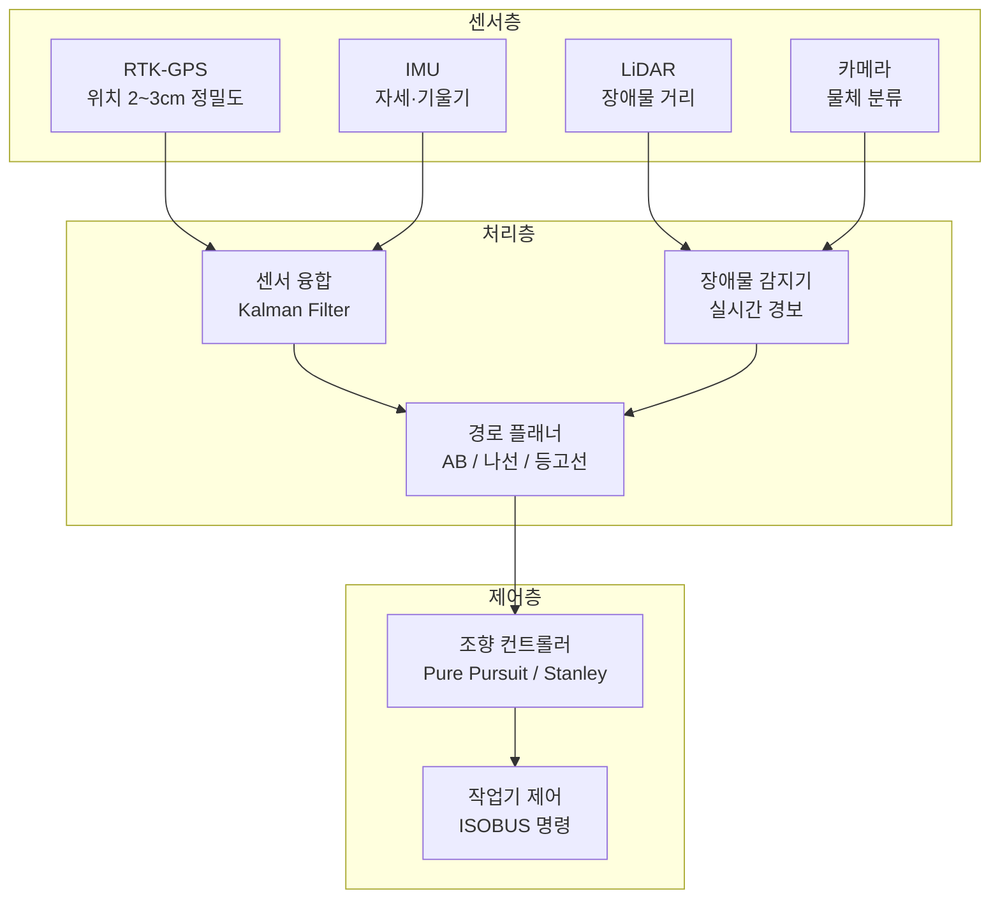
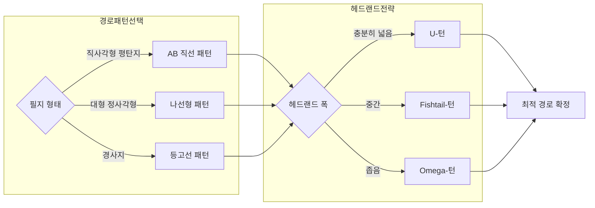

:::info 학습 목표

- 자동차 자율주행과 농기계 자율주행의 차이점을 설명할 수 있다.
- SAE J3016 자율주행 레벨(0~5)을 농기계 맥락에 적용할 수 있다.
- 농기계 자율주행의 핵심 기술 구성 요소를 열거하고 역할을 설명할 수 있다.
- AB 직선·나선형·등고선 경로 패턴의 특성과 적용 상황을 비교할 수 있다.
- ISO 18497 안전 표준의 주요 요구사항을 설명할 수 있다.

:::

## 농기계 자율주행 개요

자율주행이라 하면 도심 도로를 달리는 로보택시를 먼저 떠올리기 쉽다. 그러나 농기계 자율주행은 자동차 자율주행과 근본적으로 다른 환경에서 작동한다.

**통제된 환경**: 농지는 폐쇄된 공간이다. 신호등, 횡단보도, 일반 차량이 없으며 예측 불가능한 돌발 상황이 도로에 비해 현저히 적다. 이는 자율주행 구현 난도를 낮추는 요인이다.

**정형화된 작업 패턴**: 경운, 파종, 방제, 수확 등 농기계 작업은 반복적인 직선 경로나 정해진 패턴으로 수행된다. 경로의 예측 가능성이 높아 경로 계획이 상대적으로 단순하다.

**저속 대형 장비**: 트랙터나 콤바인의 작업 속도는 일반적으로 시속 5~15km 수준이다. 저속이지만 장비 자체의 중량과 부피가 크기 때문에 충돌 시 피해가 심각하다. 또한 구동 관성이 커서 제동 거리가 길다.

이러한 특성 덕분에 농기계 자율주행은 자동차 자율주행보다 먼저 실용화 단계에 진입했다.

### SAE J3016 레벨을 농기계에 적용

SAE J3016은 자율주행 레벨을 0~5의 6단계로 정의한다. 농기계 분야에서는 이 레벨이 실제 제품으로 어떻게 구현되는지 살펴본다.

| 레벨 | 명칭 | 인간의 역할 | 농기계 적용 사례 |
|------|------|-------------|-----------------|
| 0 | 자동화 없음 | 전체 운전 담당 | 재래식 트랙터 |
| 1 | 운전자 보조 | 대부분 직접 운전 | 자동 조향 보조(핸들 교정) |
| 2 | 부분 자동화 | 상시 감시 필요 | RTK-GPS 직선 자동 주행 |
| 3 | 조건부 자동화 | 필요시 개입 대기 | 특정 필지 내 완전 자동 작업 |
| 4 | 고도 자동화 | 지정 구역 내 불필요 | 울타리 구역 내 무인 트랙터 |
| 5 | 완전 자동화 | 전혀 불필요 | (상용화 미도달) |

현재 상용 제품 대부분은 레벨 2~3 수준이다. John Deere의 AutoTrac, Kubota의 KSAS 등이 레벨 2에 해당하며, 일부 시범 사업 제품이 레벨 4에 근접해 있다.

## 핵심 기술 요소

농기계 자율주행은 위치 파악, 자세 측정, 장애물 감지, 경로 계획, 조향 제어의 5개 기술 모듈이 유기적으로 연동되어 작동한다.

**RTK-GPS (위치 측위)**: Real-Time Kinematic GPS는 기준국 보정 신호를 활용해 2~3cm 수준의 고정밀 위치 정보를 제공한다. 일반 GPS의 오차가 수 미터인 것과 대조적이다. 트랙터가 이전 패스와 정확히 일치하는 경로로 주행하려면 이 수준의 정밀도가 필수다.

**IMU (자세 측정)**: Inertial Measurement Unit은 가속도계와 자이로스코프로 농기계의 기울기(경사지)와 방위각을 측정한다. 경사지에서 GPS 위치만으로는 실제 트랙터 자세를 알 수 없으므로, IMU가 RTK-GPS를 보완한다.

**LiDAR / 카메라 (장애물 감지)**: 전방 LiDAR는 포인트 클라우드로 장애물 유무와 거리를 실시간 탐지한다. 카메라는 사람, 동물, 농기구 등 물체를 분류하는 데 활용된다. 두 센서를 융합하면 감지 신뢰성이 높아진다.

**경로 플래너**: 작업 필지 형상, 작업 폭, 헤드랜드 여백 등을 입력받아 최적 주행 경로를 사전 계산한다. 실시간으로 장애물 회피 경로를 재계산하기도 한다.

**조향 컨트롤러**: 계산된 경로와 현재 위치 오차를 입력으로 받아 조향각을 제어한다. Pure Pursuit, Stanley Method 등의 기하학적 제어 알고리즘이 널리 쓰인다.

## 경로 계획

경로 계획은 농기계 자율주행의 핵심 소프트웨어 모듈이다. 어떤 경로를 선택하느냐에 따라 작업 효율, 연료 소모, 토양 압밀 등이 달라진다.

### AB 직선 패턴

가장 기본적인 경로 패턴이다. 작업자가 시작점 A와 방향 B를 지정하면, 시스템이 작업 폭 간격으로 평행한 직선 경로를 자동 생성한다. 평탄하고 규칙적인 직사각형 필지에 최적이다.

### 나선형(Spiral) 패턴

필지 외곽에서 안쪽으로 나선형으로 수렴하는 경로다. 헤드랜드 턴 횟수를 줄일 수 있어 대형 정사각형 필지에서 효율적이다. 다만 나선이 좁아질수록 곡률이 커져 조향 정밀도 요구가 높아진다.

### 등고선(Contour) 패턴

경사지에서 등고선을 따라 주행하는 패턴이다. 경사면을 횡으로 가로질러 작업하면 토양 침식을 줄이고 작업기가 일정한 깊이를 유지하기 쉽다. 지형 DEM(수치고도모델) 데이터가 필요하다.

### 헤드랜드(두렁) 턴 전략

필지 끝에서 방향을 전환하는 구역을 헤드랜드라 한다. 턴 방식에는 U-턴(단순하지만 넓은 공간 필요), Fishtail-턴(좁은 헤드랜드에 적합), 오메가(Ω)-턴(3점 방향 전환) 등이 있다. 헤드랜드 폭과 기계 회전반경에 따라 최적 턴 방식을 자동 선택한다.

경로 최적화의 목표는 단순히 최단 거리가 아니다. 중복 작업 면적 최소화, 헤드랜드 주행 거리 최소화, 연료 효율 최대화, 토양 압밀 분산을 종합적으로 고려한 다목적 최적화 문제다.

## 안전 표준

자율주행 농기계는 무인 또는 부분 무인으로 작동하므로, 사람·동물과의 충돌 방지가 가장 중요한 설계 요구사항이다.

### ISO 18497

ISO 18497은 농림용 기계의 부분 자동화 안전 요구사항을 규정하는 국제 표준이다. 주요 내용은 다음과 같다.

- **위험 구역 정의**: 기계 주변에 즉각 정지가 필요한 위험 구역(경보 구역, 정지 구역)을 설정한다.
- **감지 시스템 요건**: 사람·동물을 지정된 거리 내에서 신뢰성 있게 감지해야 한다.
- **비상 정지**: 감지 신호 수신 후 규정 시간 내에 안전 상태(정지)에 도달해야 한다.
- **원격 모니터링**: 작업자가 언제든지 기계 상태를 확인하고 개입할 수 있어야 한다.

### 비상 정지 프로토콜

비상 정지는 계층적으로 설계된다.

1. **소프트웨어 정지**: 센서가 장애물을 감지하면 제어 소프트웨어가 엔진 출력을 줄이고 브레이크를 작동한다.
2. **하드웨어 정지**: 소프트웨어 경로와 독립적인 하드웨어 회로가 전자 신호로 직접 브레이크를 잠근다.
3. **기계적 정지**: 모든 전자 시스템이 고장나도 기계적 브레이크가 작동하도록 설계한다.

### 통신 두절 시 대응

RTK 보정 신호나 원격 모니터링 통신이 두절되면 자동으로 안전 모드에 진입한다.

| 상황 | 대응 |
|------|------|
| RTK 신호 손실 | 작업 정지, 현 위치에서 대기 |
| 원격 모니터링 두절 | 경보 발령 후 N초 내 작업 정지 |
| 센서 오작동 감지 | 즉시 안전 정지 |
| 배터리/전원 이상 | 제어된 감속 후 정지 |

::: tip 핵심 정리

- 농기계 자율주행은 통제된 환경, 정형화된 패턴, 저속 대형 장비라는 특성 덕분에 도로 자율주행보다 먼저 실용화됐다.
- 현재 상용 농기계는 SAE 레벨 2~3 수준이며, 레벨 4 시범 사업이 진행 중이다.
- RTK-GPS(위치), IMU(자세), LiDAR/카메라(장애물)의 센서 융합이 정밀 자율주행의 핵심이다.
- 경로 패턴은 필지 형태와 지형에 따라 AB 직선, 나선형, 등고선 중 선택하며 헤드랜드 턴 전략과 연계한다.
- ISO 18497은 농기계 자율주행 안전의 국제 표준으로, 계층적 비상 정지와 통신 두절 대응을 요구한다.

:::

## 다음 챕터

- 다음 : [농업 로보틱스](/study/smart-agriculture/10-agri-robotics)
