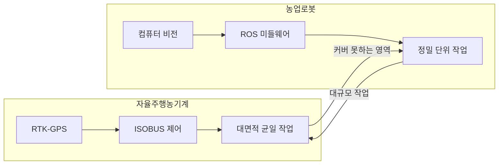
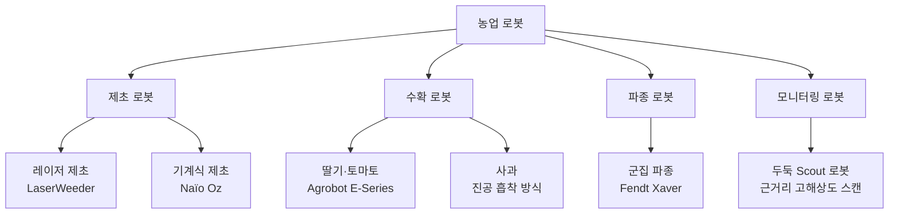
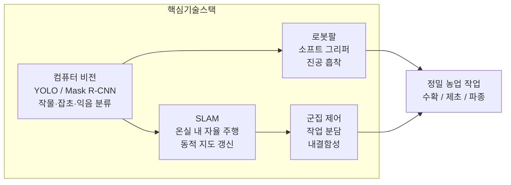

:::info 학습 목표

- 자율주행 농기계와 특수목적 농업 로봇의 기술 스택 차이를 설명할 수 있다.
- 제초·수확·파종·모니터링 로봇의 핵심 기술과 대표 사례를 열거할 수 있다.
- 컴퓨터 비전, 로봇팔, SLAM, 군집 로봇의 역할을 농업 맥락에서 설명할 수 있다.
- 농업 로봇의 현재 한계와 군집 로봇 기반 미래 전망을 논술할 수 있다.

:::

## 농업 로봇 vs 자율주행 농기계

자율주행 트랙터와 농업 로봇은 둘 다 "자동화된 농업 기계"지만 기술 철학과 스택이 근본적으로 다르다.

**자율주행 농기계**는 기존의 대형 농기계에 자율주행 기능을 추가한 형태다. 수십~수백 마력의 강력한 엔진으로 넓은 필지를 빠르게 처리하는 데 특화되어 있다. 차량 제어를 위한 ISOBUS(ISO 11783) 표준 통신과 고정밀 RTK-GPS 위치 측위가 핵심이다.

**특수목적 농업 로봇**은 트랙터가 하기 어려운 세밀한 작업을 수행하는 소형 기계다. 온실 내 딸기 수확, 밭 두둑 사이 제초, 무인기 편대 파종처럼 정밀하고 반복적인 단위 작업을 담당한다. 로봇 운영 체제인 ROS(Robot Operating System)와 컴퓨터 비전이 기술 스택의 중심이다.

| 구분 | 자율주행 농기계 | 특수목적 농업 로봇 |
|------|----------------|-------------------|
| 크기 | 대형(트랙터, 콤바인) | 소형~중형 |
| 작업 범위 | 넓은 노지 필지 | 온실, 두둑, 국소 구역 |
| 핵심 통신 | ISOBUS (ISO 11783) | ROS 미들웨어 |
| 위치 측위 | RTK-GPS 중심 | 컴퓨터 비전 + SLAM |
| 작업 정밀도 | cm 단위 경로 | mm 단위 조작 |
| 상용화 수준 | 레벨 2~3 보급 중 | 특정 작물 시범 단계 |

## 농업 로봇의 종류

### 제초 로봇

잡초 제거는 노동 집약적이고 반복적인 작업이다. 제초 로봇은 크게 두 가지 방식을 사용한다.

**레이저 제초**: Carbon Robotics의 LaserWeeder는 고출력 레이저로 잡초 세포를 소각한다. 카메라로 작물과 잡초를 실시간 구분하여 작물에는 조사하지 않는다. 제초제 사용량을 획기적으로 줄일 수 있어 유기농 농가에서 주목받는다.

**기계식 제초**: Naïo Technologies의 Oz 로봇은 두둑 사이를 자율 주행하며 기계식 호미로 흙을 긁어 잡초 뿌리를 절단한다. 소형이라 채소 재배 두둑 사이를 안전하게 주행할 수 있다.

### 수확 로봇

수확은 농업 로봇 분야에서 가장 어려운 과제 중 하나다. 작물마다 크기·색·위치가 다르고, 손상 없이 집어 올리는 파지(Grasping) 기술이 핵심이다.

**딸기 수확**: Agrobot의 E-Series는 최대 24개의 로봇팔을 탑재하고 온실 레일 위를 주행하며 딸기를 수확한다. 카메라로 익은 딸기를 감지하고, 소프트 그리퍼(soft gripper)로 과일을 손상 없이 집는다.

**토마토 수확**: 일본 Panasonic의 토마토 수확 로봇은 형광등 조명과 스테레오 카메라로 토마토 위치를 3D로 파악하여 로봇팔을 정밀 제어한다.

**사과 수확**: Abundant Robotics(현재 해산)의 로봇은 진공 흡착 방식으로 사과를 수확했다. 흡착 시 과일 표면 손상이 없다는 장점이 있다.

### 파종 로봇

**Fendt Xaver**: 군집 파종 로봇의 대표 사례다. 손가방 크기의 소형 로봇 여러 대가 필지에 동시 투입되어 각자 구역을 나눠 파종한다. 개별 로봇이 고장나도 나머지가 작업을 이어가므로 단일 장애점(Single Point of Failure)이 없다. 대형 트랙터보다 토양 압밀이 적다는 부가 이점도 있다.

### 모니터링 로봇

**Scout 로봇**: 두둑 사이를 저속으로 주행하며 카메라와 센서로 작물 생육 상태, 해충 발생, 병징을 스캔한다. 드론이 넓은 영역을 빠르게 훑는다면, Scout 로봇은 근거리에서 고해상도 데이터를 수집한다. 두 방식은 상호 보완적으로 운용된다.

## 핵심 기술

### 컴퓨터 비전: 작물과 잡초 구분

딥러닝 기반 객체 탐지 모델(YOLO, Mask R-CNN 등)이 카메라 영상에서 작물과 잡초를 픽셀 단위로 구분한다. 조명 변화, 흙 오염, 작물 생육 단계에 따른 외형 변화가 정확도에 영향을 미치므로, 다양한 환경에서 수집한 대규모 학습 데이터가 필수다.

수확 로봇에서는 익음 정도 분류가 추가된다. RGB 색상뿐 아니라 근적외선(NIR) 채널을 포함한 멀티스펙트럼 이미징으로 당도·경도와 상관관계 있는 스펙트럼 특성을 감지한다.

### 로봇팔(매니퓰레이터)

농업용 로봇팔은 산업용과 달리 연성(soft) 소재를 활용한 그리퍼를 사용하는 경우가 많다. 과일과 채소는 단단한 금속 그리퍼로 잡으면 손상되기 때문이다. 공압식 소프트 그리퍼나 진공 흡착 패드가 대표적이다.

작업 속도 또한 중요한 설계 변수다. 딸기 수확 로봇의 경우 1개당 수확 시간이 7~10초 수준이며, 이를 줄이는 것이 상업화 가능성의 관건이다.

### 자율 주행: SLAM

농업 로봇은 GPS 신호가 약하거나 없는 온실 내부에서도 작동해야 한다. 이때 SLAM(Simultaneous Localization and Mapping)이 사용된다. LiDAR 또는 카메라로 주변 환경 지도를 동시에 작성하면서 자신의 위치를 추정한다.

온실의 규칙적인 구조(행간 간격, 지지대)는 SLAM에 유리한 환경이다. 다만 작물이 자라면서 지도가 변하므로 동적 환경에 강한 SLAM 알고리즘이 필요하다.

### 군집 로봇(Swarm Robotics)

여러 소형 로봇이 통신하며 협력하는 군집 방식은 농업에서 매력적인 접근이다. 단일 대형 기계 대신 여러 소형 로봇이 작업을 분담하면 고장에 강하고(내결함성), 토양 압밀이 적으며, 배터리 소진 로봇만 교체하면 되는 유연성이 생긴다.

## 과제와 전망

### 현재의 한계

**비용**: 고성능 카메라, 로봇팔, 컴퓨팅 하드웨어 비용이 높아 소규모 농가가 도입하기 어렵다. 딸기 수확 로봇 한 대의 가격은 수억 원대다.

**작업 속도**: 숙련 작업자의 수확 속도를 현재의 농업 로봇이 따라가지 못하는 작물이 여전히 많다. 특히 불규칙한 형태의 작물(오이, 가지 등)은 탐지와 파지 모두 어렵다.

**다양한 환경 대응**: 학습 데이터가 수집된 환경 외의 조건(다른 품종, 다른 조명, 다른 재배 방식)에서는 성능이 급격히 저하되는 도메인 편향(domain bias) 문제가 있다.

### 미래 전망

**군집 로봇이 대형 트랙터를 대체할 것인가?** 완전한 대체는 어렵겠지만, 특정 작업(파종, 제초, 모니터링)에서는 군집 소형 로봇이 대형 트랙터보다 경제적으로 유리해지는 시점이 올 것이다. 반도체와 배터리 가격 하락이 그 속도를 결정한다.

**로봇 + AI 융합**: 로봇이 수집한 고밀도 현장 데이터가 AI 모델을 학습시키고, 더 정확한 AI가 로봇의 작업 판단을 개선하는 선순환이 가속된다. 미래의 농업 로봇은 단순 자동화 기계가 아니라 데이터 수집과 실행을 동시에 수행하는 지능형 에이전트가 될 것이다.

::: tip 핵심 정리

- 자율주행 농기계(ISOBUS + RTK-GPS)와 농업 로봇(ROS + 컴퓨터 비전)은 기술 스택과 적용 범위가 다르며 상호 보완적이다.
- 제초 로봇(레이저/기계식), 수확 로봇(소프트 그리퍼), 파종 로봇(군집), 모니터링 로봇(Scout)이 대표 유형이다.
- 컴퓨터 비전, 소프트 로봇팔, SLAM, 군집 제어가 농업 로봇의 4대 핵심 기술이다.
- 현재 한계는 비용·속도·도메인 편향이며, 반도체·배터리 가격 하락과 AI 융합으로 극복이 기대된다.

:::

## 다음 챕터

- 다음 : [AI와 농업](/study/smart-agriculture/11-ai-agriculture)
