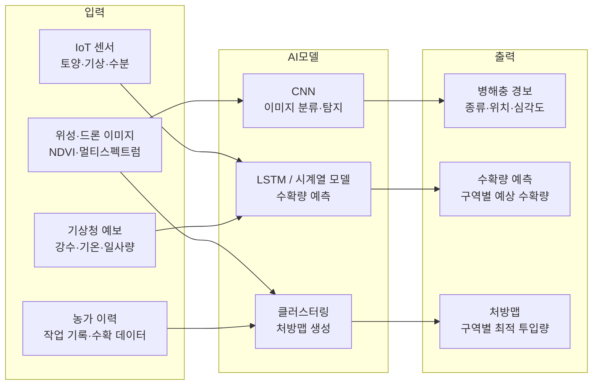
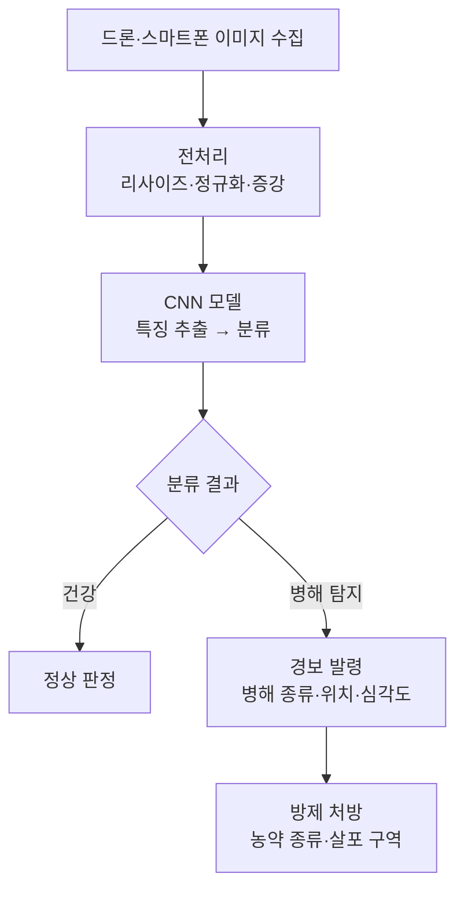
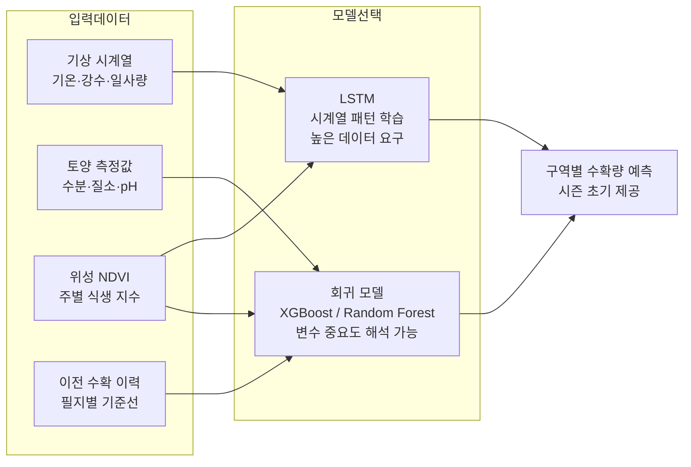
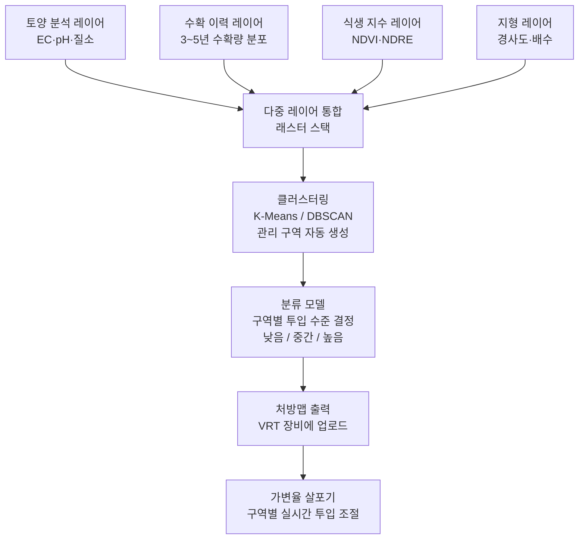

# AI와 농업

:::info 학습 목표

- 규칙 기반 시스템과 AI 기반 시스템의 의사결정 방식 차이를 설명할 수 있다.
- CNN을 활용한 병해충 탐지 파이프라인을 단계별로 설명할 수 있다.
- 수확량 예측에 사용되는 입력 데이터와 모델 유형(회귀, LSTM)을 구분할 수 있다.
- 처방맵 자동 생성 과정에서 클러스터링과 분류 알고리즘의 역할을 설명할 수 있다.

:::

---

## 1. 농업 AI 개요

스마트농업의 이전 단계까지는 데이터를 수집하고 규칙으로 제어하는 시스템이 중심이었다. 예를 들어 "토양 수분이 60% 이하로 내려가면 관개 밸브를 연다"는 if-then 규칙이 자동화의 대부분을 담당했다. 이 방식은 단순하고 설명 가능하지만, 복수의 변수가 복잡하게 얽힌 상황에서는 최적 결정을 내리기 어렵다.

농업 AI는 이 한계를 넘어선다. 수십 개의 입력 변수를 동시에 고려하고, 변수 간 비선형 상호작용을 학습하여 사람이 규칙으로 표현하기 어려운 패턴을 발견한다.

| 항목 | 규칙 기반 시스템 | AI 기반 시스템 |
|------|----------------|----------------|
| 의사결정 방식 | 전문가가 작성한 if-then 규칙 | 데이터에서 학습한 패턴 |
| 변수 처리 | 소수의 명시적 변수 | 수십~수백 개 변수 동시 처리 |
| 환경 적응 | 수동으로 규칙 수정 필요 | 새 데이터로 자동 재학습 |
| 설명 가능성 | 높음 | 낮음(블랙박스 문제) |
| 예외 상황 대응 | 규칙 외 상황에 취약 | 유사 패턴으로 일반화 |

농업 AI의 데이터 흐름은 다음과 같이 정리할 수 있다.

---

## 2. 병해충 탐지

### 문제의 중요성

병해충은 전 세계 농작물의 20~40%를 손실시키는 주요 원인이다. 조기에 발견할수록 방제 비용이 낮고 피해가 적다. 그러나 전통적으로는 육안 관찰에 의존했기 때문에 광범위한 필지에서 초기 병징을 놓치는 경우가 많았다.

스마트폰 카메라나 드론 이미지에 AI를 결합하면 대면적을 신속하게 스캔하여 초기 병징을 포착할 수 있다.

### CNN 기반 탐지 파이프라인

CNN(Convolutional Neural Network)은 이미지에서 국소 패턴(잎 반점, 변색, 형태 이상)을 계층적으로 추출하여 병해충 종류를 분류한다.

### PlantVillage 데이터셋

PlantVillage는 Penn State University가 공개한 54,000장 이상의 작물 잎 이미지 데이터셋이다. 14개 작물, 26개 병해, 건강 상태를 포함한다. 이 데이터셋을 전이 학습(Transfer Learning)의 기반으로 활용하면 소규모 농가 데이터만으로도 높은 정확도의 모델을 만들 수 있다.

PlantVillage 기반 모델은 실험실 조건에서 99%에 가까운 정확도를 달성했다. 그러나 실제 필지 조건(다양한 조명, 배경 복잡도, 증상 초기 단계)에서는 80~90%대로 낮아진다. 이 간극을 줄이는 것이 현재 연구의 주요 과제다.

### 조기 발견의 경제적 효과

병해충을 1주 일찍 발견하면 방제 비용을 30~50% 절감할 수 있다는 연구 결과가 있다. 특히 포도 노균병, 토마토 역병처럼 확산 속도가 빠른 병해는 조기 탐지가 수확량 보존에 결정적이다.

---

## 3. 수확량 예측

### 왜 예측이 중요한가

시즌 초기에 수확량을 예측할 수 있으면 여러 이점이 생긴다. 농가 차원에서는 수확 인력·장비 사전 수배, 저장 공간 확보, 선도 계약 판매가 가능해진다. 국가 차원에서는 식량 수급 계획 수립, 수출입 물량 조절, 식량 안보 리스크 관리에 활용된다.

### 입력 데이터

수확량 예측 모델에 투입되는 주요 데이터는 다음과 같다.

- **기상 데이터**: 기온, 강수량, 일사량, 습도의 일별·주별 시계열. 꽃피는 시기의 기온이 결실에 특히 중요하다.
- **토양 데이터**: 토양 수분, 질소·인·칼리 농도, pH. 생육 기간 내 변화를 추적한다.
- **위성 NDVI**: 정규화 식생지수(NDVI)는 작물의 엽록소 밀도와 생육 활력을 반영한다. 파종 후 주기적으로 측정하면 작물 생육 궤적을 수치화할 수 있다.
- **이전 수확 이력**: 같은 필지에서 수년간 축적된 수확 데이터는 토양 특성과 미기후가 반영된 필지 고유의 기준선을 제공한다.

### 모델 유형

**회귀 모델**: 입력 변수와 수확량 사이의 관계를 학습한다. Random Forest, XGBoost 같은 앙상블 모델이 농업 분야에서 널리 쓰인다. 입력 변수의 중요도를 해석할 수 있어 농업인에게 설명하기 용이하다.

**LSTM (Long Short-Term Memory)**: 기상과 식생지수 같은 시계열 데이터의 시간적 패턴을 학습하는 순환 신경망이다. 과거 N주의 NDVI 변화 추세가 최종 수확량에 미치는 영향을 모델링하는 데 적합하다. 회귀 모델보다 데이터량이 많이 필요하지만 시계열 패턴 포착 능력이 뛰어나다.

수확량 예측 모델이 제공하는 구역별 예측값은 다음 챕터의 처방맵 자동 생성과 연결된다. 수확량이 낮은 구역은 투입 자원을 늘리거나 재배 전략을 조정하는 근거가 된다.

---

## 4. 처방맵 자동 생성

### 처방맵이란

처방맵(Prescription Map, 가변투입맵)은 필지를 구역으로 나누어 각 구역에 최적화된 투입량(비료, 농약, 씨앗)을 지정한 지도다. CH7 정밀농업 챕터에서 다룬 VRT(Variable Rate Technology)의 입력 데이터가 바로 처방맵이다.

과거에는 토양 분석 전문가가 수동으로 처방맵을 작성했다. AI는 이 과정을 자동화하고 고려하는 데이터 레이어를 대폭 늘린다.

### 데이터 레이어 통합

처방맵 생성에 투입되는 다중 데이터 레이어는 다음과 같다.

- **토양 분석**: EC(전기전도도), 유기물 함량, pH, 질소·인·칼리 분포도
- **수확 이력 지도**: 직전 3~5년의 수확량 분포. 지속적으로 낮은 구역은 구조적 문제가 있을 가능성이 높다.
- **식생 지수**: 위성 NDVI, NDRE(적색 경계 정규화 식생지수)로 현재 생육 활력 파악
- **지형**: 경사도, 배수 방향. 낮은 곳은 과습 위험이 있고 높은 곳은 건조 위험이 있다.

### AI 적용: 클러스터링과 분류

**클러스터링(비지도 학습)**: K-Means나 DBSCAN으로 유사한 특성을 가진 픽셀/셀을 자동으로 묶어 관리 구역(Management Zone)을 생성한다. 비슷한 토양·수확 특성을 가진 구역에는 동일한 처방을 적용한다.

**분류(지도 학습)**: 과거 수확 결과가 좋았던 구역의 입력 데이터 패턴을 학습하여, 새 시즌의 투입량 카테고리(낮음/중간/높음)를 예측한다.

클러스터링은 구역 경계를 결정하고, 분류는 각 구역의 투입 수준을 결정하는 식으로 두 방법을 함께 쓰는 것이 일반적이다.

### CH7 정밀농업과의 연결

CH7에서 다룬 정밀농업 사이클(수집 → 분석 → 처방 → 실행)에서 AI는 "분석 → 처방" 단계를 자동화한다. 즉, 농업 AI는 정밀농업의 완성도를 높이는 핵심 엔진이다. 데이터 레이어가 많아질수록, 그리고 수확 이력이 쌓일수록 처방맵의 정확도가 향상되는 학습 효과가 발생한다.

::: tip 핵심 정리

- 농업 AI는 수십 개 변수의 비선형 패턴을 학습하여 규칙 기반 시스템이 다루기 어려운 복잡한 의사결정을 자동화한다.
- CNN은 작물 이미지에서 병해충을 90%+ 정확도로 분류하며, 조기 발견 시 방제 비용을 30~50% 절감한다.
- 수확량 예측에는 기상·토양·NDVI를 입력으로 하는 XGBoost(회귀)와 LSTM(시계열)이 주로 활용된다.
- 처방맵 자동 생성은 클러스터링(구역 분할)과 분류(투입 수준 결정)를 결합하며, CH7 정밀농업 VRT와 직접 연결된다.

:::

## 다음 챕터

- 다음 : [농업 데이터와 플랫폼](/study/smart-agriculture/12-agri-data)
