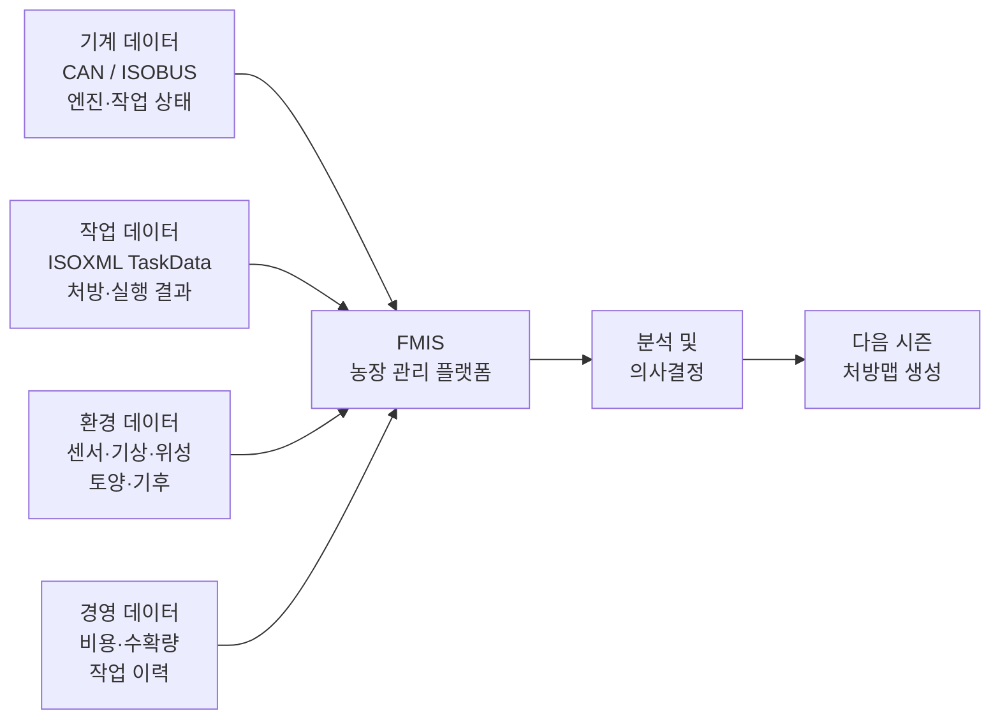
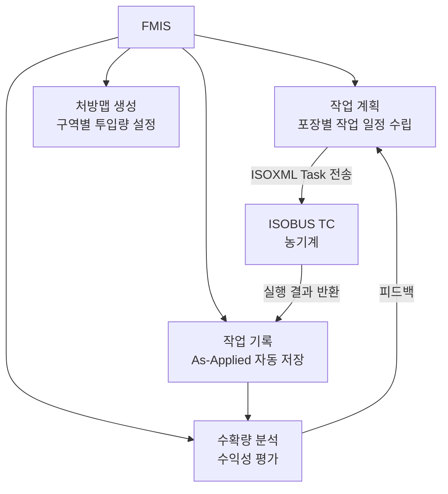
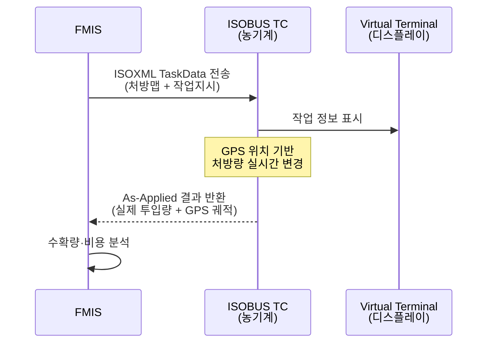
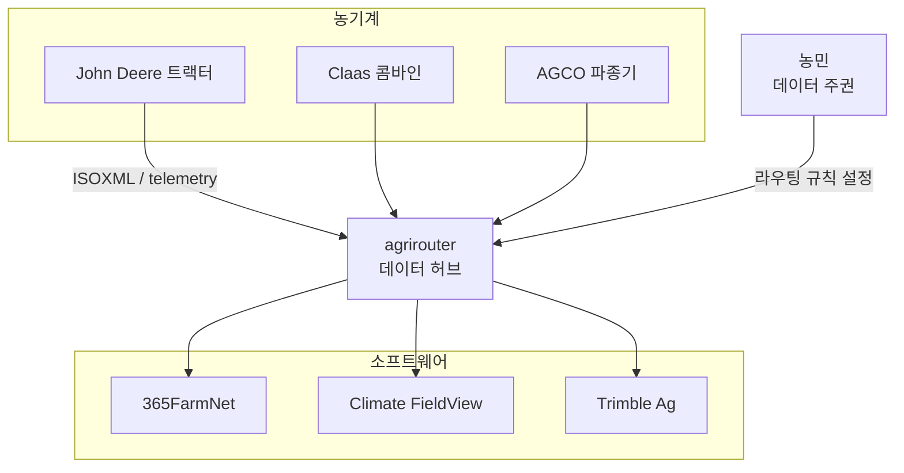

::: info 학습 목표

- 농업 데이터의 종류와 각 데이터가 생성되는 출처를 구분할 수 있다.
- FMIS의 기능과 대표 제품을 설명할 수 있다.
- ISOXML TaskData 구조와 데이터 흐름을 도식으로 이해한다.
- agrirouter가 해결하는 문제와 데이터 주권 개념을 설명할 수 있다.

:::

## 농업 데이터의 종류

현대 농업에서 생성되는 데이터는 성격과 출처에 따라 크게 네 가지로 분류된다. 각 데이터는 서로 독립적으로 존재하는 것이 아니라, 통합·분석될 때 비로소 의사결정 가치를 가진다.

**기계 데이터**: CAN 버스와 ISOBUS를 통해 농기계에서 실시간으로 생성되는 데이터이다. 엔진 RPM, 연료 소모량, 작업 깊이, 주행 속도 등 기계 상태 정보가 포함된다.

**작업 데이터**: 실제 포장에서 수행한 작업의 결과 데이터이다. ISOXML TaskData 형식으로 저장되며, 비료 살포량, 종자 파종량, 수확량 등 가변 처방 결과가 포함된다.

**환경 데이터**: 기상 관측소, 토양 센서, 위성·드론 원격탐사로 수집되는 데이터이다. 온도, 강수량, 토양 수분, NDVI(식생 지수) 등이 여기에 속한다.

**경영 데이터**: 농장 운영의 재무·행정 정보이다. 투입 비용(종자·농약·연료), 수확량별 단가, 작업 인건비 등이 포함되며 FMIS에서 주로 관리된다.



## FMIS(Farm Management Information System)

FMIS는 농장 경영에 필요한 모든 데이터를 통합 관리하는 소프트웨어 시스템이다. 단순한 기록 도구가 아니라 작업 계획부터 결과 분석까지 농장 운영 전 사이클을 지원한다.

### 주요 기능

**작업 계획(Task Planning)**: 어느 포장에서 언제, 어떤 작업을 수행할지 계획을 수립한다. ISOBUS TC(Task Controller)와 연동하면 계획이 자동으로 기계에 전송된다.

**처방맵 생성(Prescription Map)**: 토양 분석 결과와 작황 데이터를 바탕으로 구역별 최적 투입량을 담은 처방맵(shapefile 또는 ISOXML 형식)을 생성한다.

**작업 기록(As-Applied Logging)**: 실제 수행된 작업 결과를 자동으로 기록한다. GPS 궤적, 실제 투입량, 작업 시간 등이 포함된다.

**수확량 분석(Yield Analysis)**: 수확기에 기록된 수확량 데이터를 지도 위에 시각화하고, 투입 비용 대비 수익성을 분석한다.

### 대표 제품

| 제품 | 제조사 | 특징 |
|------|--------|------|
| 365FarmNet | 365FarmNet GmbH | 유럽 중심, ISOBUS 완전 연동, agrirouter 지원 |
| Trimble Ag Software | Trimble | GPS·측위 기술 기반, 정밀 처방농업 특화 |
| Climate FieldView | Bayer | 클라우드 분석 특화, AI 기반 수확량 예측 |
| John Deere Operations Center | John Deere | JD 기계 생태계에 최적화, MyJohnDeere 연동 |



## ISOXML / TaskData

ISOXML은 ISOBUS Task Controller(TC)가 사용하는 국제 표준 데이터 교환 포맷이다. ISO 11783-10 표준에 정의되어 있으며, FMIS와 농기계 간 작업 지시 및 결과 데이터를 교환하는 데 사용된다.

### 데이터 흐름

1. **Task(작업지시)**: FMIS가 생성한 처방맵과 작업 지시가 ISOXML 형식으로 농기계 TC에 전달된다.
2. **TC 실행**: 농기계의 TC가 작업지시를 수신하고, GPS 위치에 따라 처방량을 실시간으로 변경하며 작업을 수행한다.
3. **As-Applied(실행 결과)**: 작업이 완료되면 실제 투입량, GPS 궤적, 시간 기록이 ISOXML 형식으로 TC에 저장된다.
4. **FMIS 업로드**: 저장된 결과 데이터가 FMIS로 전송되어 분석에 활용된다.



### XML 구조 예시

ISOXML TaskData의 핵심 구조는 다음과 같다.

```xml
<ISO11783_TaskData>
  <!-- 포장(Farm/Client/Field) 정보 -->
  <FRM A="FRM1" B="홍길동 농장"/>
  <PFD A="PFD1" B="1번 포장" C="홍길동 농장" E="12345.6"/>

  <!-- 제품(비료/농약) 정보 -->
  <PDT A="PDT1" B="질소비료" C="kg"/>

  <!-- 작업지시 -->
  <TSK A="TSK1" B="2026-04-15 시비 작업"
       E="PFD1" G="1">
    <!-- 처방맵: 구역별 투입량 -->
    <TZN A="100" B="150" C="200"/>
  </TSK>
</ISO11783_TaskData>
```

파일 확장자는 `.xml`이며, 포장 경계(shapefile)와 함께 묶여 USB 메모리나 무선 통신으로 기계에 전달된다.

## 데이터 연동 플랫폼

농기계 제조사와 소프트웨어 업체가 각기 다른 데이터 형식과 플랫폼을 운영하면, 농민은 브랜드를 혼용할 때 데이터 연동 문제에 부딪힌다. 이를 해결하기 위해 제조사 중립적인 데이터 허브가 등장했다.

### agrirouter

agrirouter는 DKE Data GmbH(독일)가 운영하는 농업용 데이터 교환 플랫폼이다. AGCO, CNH Industrial, Claas, Fendt, John Deere 등 주요 제조사가 공동 출자하여 설립했다.

**핵심 개념: 데이터 주권(Data Sovereignty)**: agrirouter의 철학은 농민이 자신의 데이터를 소유한다는 것이다. 농민이 명시적으로 허가한 상대방에게만 데이터가 공유되며, 플랫폼 운영사는 데이터 내용에 접근하지 않는다.

**작동 방식**: 각 농기계와 FMIS가 agrirouter에 연결되면, 농민이 설정한 라우팅 규칙에 따라 데이터가 자동으로 전달된다. 예를 들어, CNH 콤바인의 수확량 데이터를 Climate FieldView로 자동 전송하도록 설정할 수 있다.



agrirouter 외에도 John Deere Operations Center, CNH AFS Connect처럼 제조사 자체 클라우드 플랫폼이 존재하지만, 이들은 자사 기계 생태계 안에서만 작동한다는 한계가 있다. agrirouter는 이 생태계들을 브리지하는 역할을 한다.

::: tip 핵심 정리

- 농업 데이터는 기계·작업·환경·경영 데이터로 분류되며, 통합 분석할 때 가치가 극대화된다.
- FMIS는 작업 계획, 처방맵 생성, 작업 기록, 수확량 분석을 통합 관리하는 농장 운영 소프트웨어이다.
- ISOXML은 ISOBUS TC와 FMIS 간 데이터 교환 표준 포맷으로, Task(지시) → 실행 → As-Applied(결과) 흐름을 따른다.
- agrirouter는 제조사 중립 데이터 허브로, 데이터 주권을 농민에게 귀속시키면서 이기종 시스템 간 연동을 가능하게 한다.

:::

## 다음 챕터

- 다음 : [스마트팜 개요](/study/smart-agriculture/13-smart-farm)
