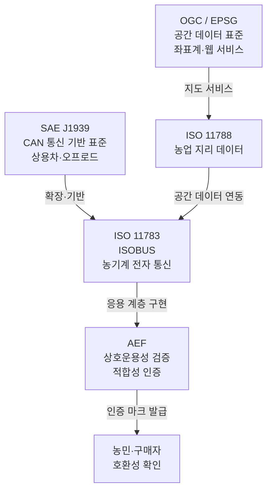
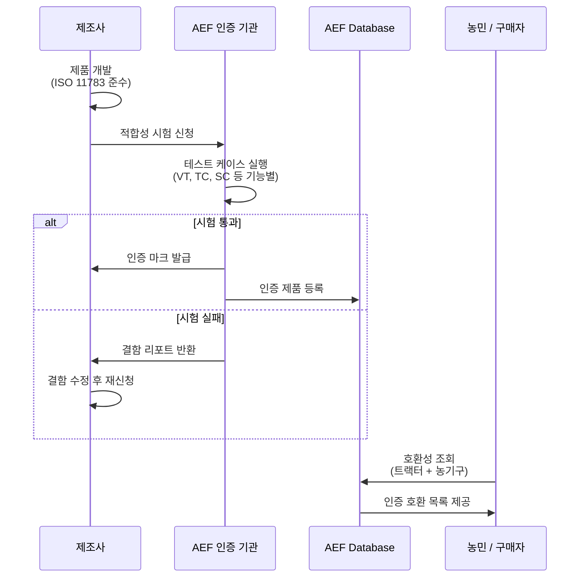
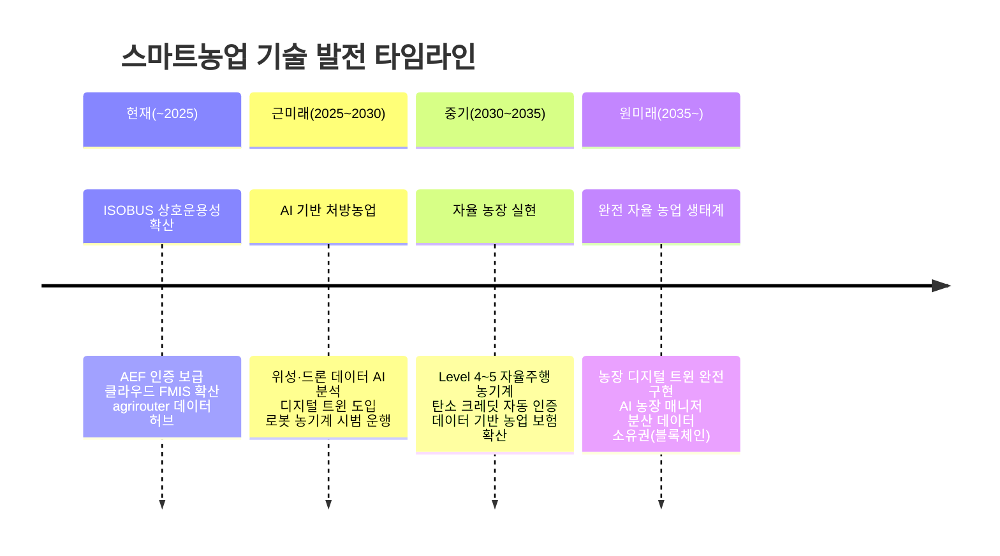

::: info 학습 목표

- 농업 분야에서 표준화가 필요한 이유를 데이터 사일로와 벤더 종속 관점에서 설명할 수 있다.
- ISO 11783, AEF, SAE J1939 등 핵심 표준의 역할과 상호 관계를 파악할 수 있다.
- AEF 적합성 인증 프로세스를 순서도로 설명할 수 있다.
- 스마트농업의 미래 기술 방향(디지털 트윈, 자율 농장, 탄소 크레딧)을 서술할 수 있다.

:::

## 표준화의 필요성

스마트농업 생태계에서 표준화가 없다면 어떤 일이 생기는지 생각해보자. 트랙터 제조사 A의 기계는 자사 터미널에서만 작동하고, 농약 살포기 제조사 B의 장비는 다른 프로토콜을 사용한다. 토양 센서 업체 C의 데이터는 FMIS 업체 D의 소프트웨어에서 읽히지 않는다.

이것이 데이터 사일로(Data Silo) 문제이다. 각 시스템이 독립적인 섬처럼 존재하면, 데이터는 넘쳐나지만 통합 분석은 불가능해진다.

**벤더 종속(Vendor Lock-in)**: 농민이 특정 제조사 생태계에서 벗어나기 어려워진다. 트랙터를 교체하면 축적된 작업 데이터를 가져갈 수 없거나, 호환되는 농기구를 교체해야 하는 비용이 발생한다.

**표준화가 가져오는 가치**:

- **상호운용성**: 어떤 브랜드의 기계라도 표준 프로토콜로 연동된다.
- **선택의 자유**: 농민이 최적의 제품을 브랜드에 관계없이 선택할 수 있다.
- **혁신 가속**: 스타트업과 소규모 업체도 표준 인터페이스로 생태계에 진입할 수 있어 혁신 주체가 다양해진다.
- **데이터 이동성**: 농민이 서비스를 변경해도 자신의 데이터를 가지고 이동할 수 있다.

## 핵심 표준 기관과 표준

스마트농업 생태계는 여러 표준 기관이 각자의 영역에서 표준을 제정하고, 이들이 계층적으로 연결되는 구조이다.

### 주요 표준

**ISO 11783(ISOBUS)**: 농업용 전자 시스템 표준이다. CAN 버스 기반의 통신 프로토콜(물리·데이터 링크 계층)부터 Task Controller, Virtual Terminal, Section Control 등 응용 계층까지 11개 파트로 구성된다. 사실상 농기계 전자 통신의 국제 표준이다.

**SAE J1939**: 상용차 및 오프로드 차량의 CAN 통신 표준이다. ISO 11783은 J1939을 기반으로 농업 분야에 맞게 확장한 것이다. 엔진·변속기·브레이크 등 차량 계통에서 폭넓게 사용된다.

**ISO 11788**: 농업 분야 지리 정보 데이터 교환 표준이다. 포장 경계, 처방맵, 수확량 지도 등 공간 데이터를 다룬다.

**AEF(Agricultural Industry Electronics Foundation)**: 표준 기관이 아닌 산업 단체이지만, ISOBUS 표준의 실용적 구현과 상호운용성 검증을 담당한다. ISO 표준이 "무엇을"이라면, AEF는 "어떻게"에 해당한다.

**EPSG / OGC**: 공간 데이터 좌표계(EPSG)와 지리 정보 웹 서비스 표준(OGC WMS/WFS)이다. 처방맵과 위성 데이터를 지도 위에 겹쳐 표시할 때 사용된다.

### 표준 적용 레이어

| 레이어 | 표준 | 적용 범위 |
|--------|------|-----------|
| 물리·데이터링크 | SAE J1939 | CAN 버스 전기·프레임 형식 |
| 네트워크·전송 | ISO 11783-2/3 | 농기계 네트워크 토폴로지 |
| 응용(사용자 인터페이스) | ISO 11783-6 VT | Virtual Terminal 화면 표준 |
| 응용(작업 제어) | ISO 11783-10 TC | Task Controller, 처방맵 |
| 데이터 교환 | ISOXML / ISO 11783-10 | TaskData XML 포맷 |
| 공간 데이터 | ISO 11788, OGC | 처방맵, 수확량 지도 |

## AEF와 적합성 인증

AEF(Agricultural Industry Electronics Foundation)는 2008년 AGCO, Claas, CNH, Fendt, John Deere, Krone 등 주요 농기계 제조사가 공동 설립한 비영리 산업 단체이다. ISOBUS 표준의 올바른 구현과 기업 간 상호운용성 확보를 목적으로 한다.

### AEF의 주요 역할

**적합성 시험(Conformance Test)**: AEF가 정의한 테스트 케이스를 통과해야 ISOBUS 인증 마크를 획득할 수 있다. 단순히 ISO 표준 문서를 따르는 것만으로는 부족하고, 실제 상호운용성을 검증해야 한다.

**AEF Database**: 인증된 제품 목록을 공개 데이터베이스로 관리한다. 농민과 딜러가 특정 트랙터와 농기구의 호환 여부를 검색할 수 있다.

**플러그페스트(Plugfest)**: 여러 제조사가 한 자리에 모여 서로의 장비를 실제로 연결 테스트하는 행사이다. 표준 해석의 차이에서 오는 비호환성 문제를 조기에 발견하고 해결한다.

### 인증 프로세스

인증 마크는 기능 단위로 부여된다. 예를 들어 "VT(Virtual Terminal) 인증"과 "TC(Task Controller) 인증"은 별도이다. 농민이 처방농업을 원한다면 트랙터(TC-Machine)와 FMIS(TC-Client) 양쪽이 TC 인증을 받았는지 확인해야 한다.

## 스마트농업의 미래

표준화와 연결성이 성숙해지면서 스마트농업은 단순 자동화를 넘어 새로운 기술·비즈니스 패러다임으로 진화하고 있다.

### 디지털 트윈(Digital Twin)

디지털 트윈은 실제 농장의 모든 요소(토양, 작물, 기계, 기상)를 가상 공간에 동적으로 복제한 모델이다. 시뮬레이션을 통해 "만약 내일 비가 오면 관수를 얼마나 줄여야 하는가" 같은 질문에 사전 답을 구할 수 있다. Wageningen University, John Deere 등이 농장 디지털 트윈 연구를 주도하고 있다.

### 자율 농장(Autonomous Farm)

자율주행 기술이 성숙하면서 사람 없이 운영되는 자율 농장이 실험 단계에 진입했다. Hands Free Hectare(영국 하퍼 애덤스 대학), AgBot(호주) 등이 대표 사례이다. 완전 자율화를 위해서는 기계 자율주행뿐 아니라 작업 계획·이상 감지·수확 판단까지 AI가 담당해야 한다.

### 데이터 기반 보험·금융

축적된 농장 데이터는 보험·금융 서비스의 기반이 된다. 수확량 이력과 기상 데이터를 결합하면 날씨 지수 보험의 정확도가 높아진다. 디지털 증거에 기반한 소액 농업 대출(AgriFintech)도 개발도상국 농민의 금융 접근성을 높이는 방향으로 발전하고 있다.

### 탄소 크레딧 인증

정밀농업 데이터는 탄소 격리량과 배출 감소를 정량적으로 증명하는 데 활용된다. 무경운 농업, 피복작물 재배, 정밀 시비로 줄인 N2O 배출량이 ISOXML As-Applied 데이터로 검증되면, 탄소 크레딧으로 전환해 추가 수익을 창출할 수 있다. Indigo Ag, Regrow Ag 등이 이 시장을 개척하고 있다.

::: tip 핵심 정리

- 표준화 부재는 데이터 사일로와 벤더 종속을 초래하며, 표준화는 상호운용성·선택의 자유·혁신 가속이라는 가치를 제공한다.
- ISO 11783(ISOBUS)은 SAE J1939을 기반으로 농기계 전자 통신을 표준화하며, AEF는 표준의 실용적 구현과 적합성 인증을 담당한다.
- AEF 적합성 인증은 기능 단위(VT, TC, SC 등)로 부여되며, AEF Database를 통해 농민이 호환성을 사전 확인할 수 있다.
- 스마트농업의 미래는 디지털 트윈, 자율 농장, 데이터 기반 보험·금융, 탄소 크레딧으로 확장되며, 데이터 표준화가 이 모든 것의 기반이 된다.

:::
