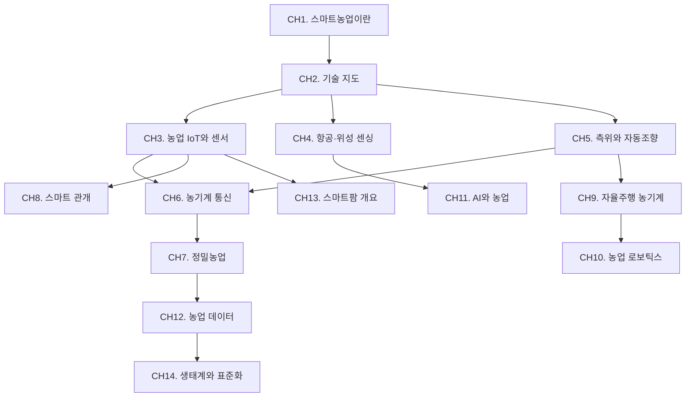

# 스마트농업

전통적인 농업에서 데이터와 기술 기반의 농업으로 전환하는 흐름을 다룬다. 정밀농업, 농기계 통신, IoT, 자율주행, AI까지 스마트농업을 구성하는 핵심 기술 영역을 개론 수준으로 학습한다.

## 학습 로드맵

## 목차

### 스마트농업 개론
1. [스마트농업이란](/study/smart-agriculture/01-what-is-smart-agriculture) — 정의, 배경, 전통농업과의 차이
2. [기술 지도](/study/smart-agriculture/02-technology-map) — 전체 기술 스택 조감도, 노지 vs 시설 구분

### 센싱과 데이터
3. [농업 IoT와 센서](/study/smart-agriculture/03-iot-sensors) — 토양/기상 센서, LoRa, 엣지 컴퓨팅
4. [항공·위성 센싱](/study/smart-agriculture/04-aerial-satellite) — 드론 UAV, 멀티스펙트럴, NDVI
5. [측위와 자동조향](/study/smart-agriculture/05-gnss-autosteer) — GNSS, RTK-GPS, 보정 신호

### 통신과 제어
6. [농기계 통신](/study/smart-agriculture/06-machine-communication) — CAN, ISOBUS, 텔레매틱스
7. [정밀농업](/study/smart-agriculture/07-precision-agriculture) — 가변살포, 처방맵, 수확량 매핑
8. [스마트 관개](/study/smart-agriculture/08-smart-irrigation) — 점적관개, 토양수분 기반 자동 제어

### 자동화와 지능화
9. [자율주행 농기계](/study/smart-agriculture/09-autonomous-machinery) — 레벨 분류, 경로 계획, 안전 표준
10. [농업 로보틱스](/study/smart-agriculture/10-agri-robotics) — 수확·제초·파종 로봇, ROS
11. [AI와 농업](/study/smart-agriculture/11-ai-agriculture) — 작물 분석, 병해충 탐지, 수확량 예측

### 플랫폼과 생태계
12. [농업 데이터와 플랫폼](/study/smart-agriculture/12-agri-data) — FMIS, ISOXML, 클라우드 연동
13. [스마트팜 개요](/study/smart-agriculture/13-smart-farm) — 온실 환경 제어, 식물공장
14. [생태계와 표준화](/study/smart-agriculture/14-ecosystem) — AEF, 표준화, 제조사 간 상호운용성

## 연관 스터디

- [ISOBUS](/study/isobus/) — CH6(농기계 통신)의 심화 과정
